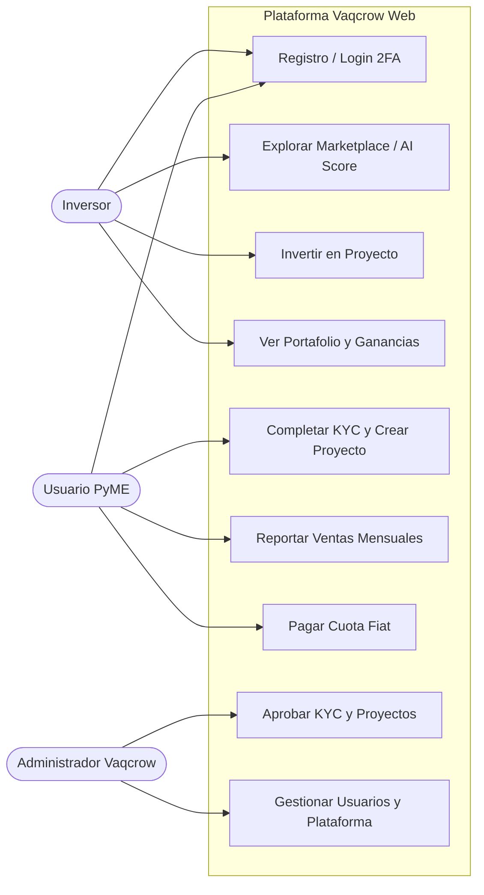
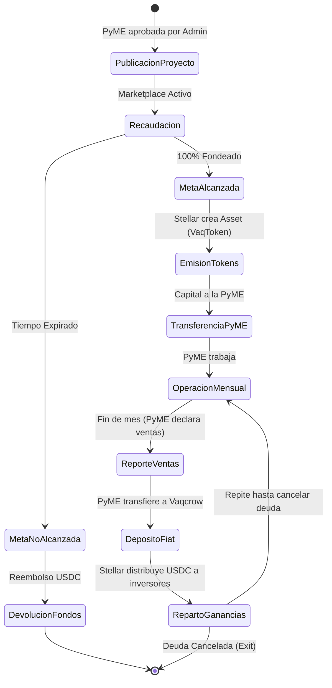
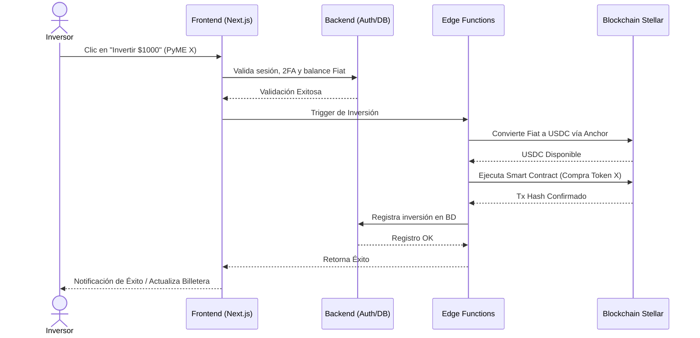
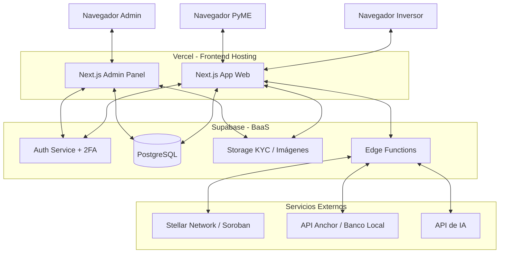

# Vaqcrow 🐮

**Misión:** Democratizar la inversión en Latam conectando pequeños inversores con PyMEs tradicionales mediante *Revenue Share Crowdfunding*, utilizando tecnología blockchain (Stellar) para garantizar transparencia, eficiencia y custodia descentralizada. 
**Lema:** *"Juntos podemos hacernos grandes"*.

---

## 1. Resumen Ejecutivo y Reglas de Negocio
Vaqcrow es una plataforma Fintech web (desarrollada en Next.js) que permite a comercios de barrio y PyMEs financiarse sin los intereses asfixiantes de los bancos. 

* **Modelo de Inversión (Revenue Share):** Los inversores fondean un proyecto a cambio de un porcentaje de las ventas mensuales de la PyME, mitigando el riesgo de quiebra por cuotas fijas (si venden más, pagan más; si venden menos, pagan menos).
* **Modelo de Confianza Híbrido:** Para asegurar el cumplimiento, se combinan dos capas:
  1. *Capa Tecnológica:* Reporte de ventas mensual (manual en V1, automatizado en el futuro) que calcula automáticamente el monto a pagar.
  2. *Capa Legal/Penalización:* Contrato de financiamiento participativo firmado. En caso de no reportar o quebrar injustificadamente, se activa un bloqueo de reputación (Score) y sanciones sobre garantías prendarias previas.
* **Flujo de Capital:** Inversión en pesos (Fiat) ➔ Conversión vía Anchor a `USDC` ➔ Bloqueo en contrato inteligente (Stellar) ➔ Liberación a PyME ➔ Repago en Fiat ➔ Distribución automática de `USDC` a inversores.
* **Monetización:** 
  * *Success Fee:* Comisión (3% al 5%) cobrada a la PyME sobre el capital total levantado al cumplir la meta.
  * *Spread de Cash-out:* Pequeño margen en la rampa de conversión de cripto a fiat.

---

## 2. Stack Tecnológico
* **Frontend:** Next.js (Web-first, Mobile-responsive), Tailwind CSS, componentes unificados para futura app React Native.
* **Backend & Base de Datos:** Supabase (PostgreSQL, Auth, Storage para documentos).
* **Lógica Serverless:** Supabase Edge Functions (para orquestación y firmas seguras).
* **Infraestructura Blockchain:** Stellar Network SDK (Cuentas multifirma, Assets personalizados, Path Payments).
* **Inteligencia Artificial:** Modelo de recomendación de IA (AI Score) para clasificar el riesgo de cada PyME.

---

## 3. Identidad Visual y UI/UX (Estilo Nubank)
* **Concepto:** Minimalista, tipografías Sans-Serif audaces, uso estratégico de espacios en blanco y bordes redondeados.
* **Colores Core:**
  * **Brand/Accent:** Morado Vibrante (`#8A05BE`) para botones, CTAs y barras de progreso.
  * **Light Mode:** Fondo Blanco Nieve (`#FFFFFF`), Cards Gris Suave (`#F5F5F5`), Texto Principal Negro Mate (`#111111`), Texto Secundario Gris (`#666666`).
  * **Dark Mode:** Fondo Negro (`#111111`), Cards Carbón (`#1F1F1F` / `#272727`), Texto Principal Blanco (`#FFFFFF`), Texto Secundario Gris Claro (`#A0A0A0`).

---

## 4. Módulos y Sub-sistemas (Monorepo)

1. **SignIn y SignUp:** Login unificado permitiendo registro con Google Account o Email/Password. Seguridad obligatoria con 2FA para validación y operaciones.
2. **Hero Page (Landing):** Motor de marketing. Explicación del sistema dual (Inversor/Emprendedor), los beneficios del Revenue Share, la transparencia de Stellar, y el CTA principal para registrarse. 
3. **Onboarding y Tokenización:** Flujo de KYC. El emprendedor carga sus datos, documentos legales y la ficha de su proyecto. Se emite el token representante en la red Stellar.
4. **Marketplace (Explorar):** Buscador principal y grilla de PyMEs. Incluye filtros y ordenamiento basado en el **AI Score** de riesgo. Tarjetas con fotos, meta de recaudación y retorno estimado.
5. **Detalle de PyME:** Pantalla de conversión. Toda la historia, justificación de los fondos, proyecciones y el botón primario de "Invertir".
6. **Billetera de Inversores (Dashboard):** Visualización del portafolio, saldo en Fiat/USDC, tokens adquiridos, gráficos de rendimiento, notificaciones y carga/retiro de saldo.
7. **Panel de Administración (Backoffice):** Pantalla exclusiva para dueños de Vaqcrow. Gestión de KYC manual, auditoría de reportes de ventas, configuración de la Landing Page y visualización de métricas de la plataforma.

---

## 5. Modelo de Datos (Esquema SQL en Supabase)

```sql
-- TABLA USUARIOS (Gestionado en gran parte por auth.users de Supabase)
CREATE TABLE perfiles (
  id UUID REFERENCES auth.users NOT NULL PRIMARY KEY,
  email TEXT NOT NULL,
  rol TEXT CHECK (rol IN ('INVERSOR', 'PYME', 'ADMIN')),
  stellar_wallet_id TEXT,
  es_2fa_activo BOOLEAN DEFAULT FALSE,
  created_at TIMESTAMP WITH TIME ZONE DEFAULT NOW()
);

-- TABLA PERFIL PYME
CREATE TABLE perfiles_pyme (
  id UUID PRIMARY KEY DEFAULT uuid_generate_v4(),
  usuario_id UUID REFERENCES perfiles(id),
  nombre_comercio TEXT NOT NULL,
  descripcion TEXT,
  estado_kyc TEXT CHECK (estado_kyc IN ('PENDIENTE', 'APROBADO', 'RECHAZADO')),
  ai_score_riesgo INTEGER
);

-- TABLA PROYECTOS
CREATE TABLE proyectos (
  id UUID PRIMARY KEY DEFAULT uuid_generate_v4(),
  pyme_id UUID REFERENCES perfiles_pyme(id),
  titulo TEXT NOT NULL,
  meta_recaudacion DECIMAL NOT NULL,
  porcentaje_retorno_ventas DECIMAL NOT NULL,
  stellar_asset_code TEXT UNIQUE,
  estado TEXT CHECK (estado IN ('RECAUDANDO', 'ACTIVO', 'FINALIZADO'))
);

-- TABLA INVERSIONES
CREATE TABLE inversiones (
  id UUID PRIMARY KEY DEFAULT uuid_generate_v4(),
  usuario_id UUID REFERENCES perfiles(id),
  proyecto_id UUID REFERENCES proyectos(id),
  monto_invertido DECIMAL NOT NULL,
  tx_hash_stellar TEXT,
  fecha TIMESTAMP WITH TIME ZONE DEFAULT NOW()
);

-- TABLA REPORTES DE VENTA (MVP)
CREATE TABLE reportes_venta (
  id UUID PRIMARY KEY DEFAULT uuid_generate_v4(),
  proyecto_id UUID REFERENCES proyectos(id),
  monto_declarado DECIMAL NOT NULL,
  monto_a_pagar DECIMAL NOT NULL,
  comprobante_url TEXT,
  estado_pago TEXT CHECK (estado_pago IN ('PENDIENTE', 'PAGADO')),
  mes_reportado TIMESTAMP WITH TIME ZONE
);
```

---

## 6. Diagramas UML de Arquitectura

### A. Diagrama de Casos de Uso


### B. Diagrama de Procesos (Flujo de Vida del Proyecto)


### C. Diagrama de Secuencia (Flujo de Inversión)


### D. Diagrama de Componentes (Arquitectura General)

