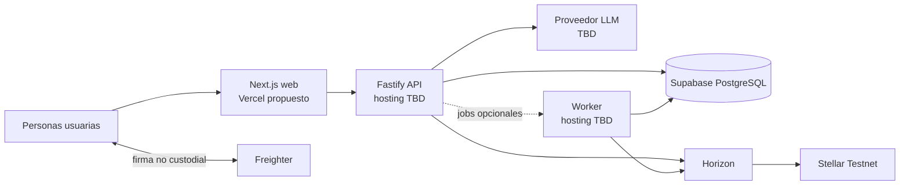

# Vaqcrow

**Financiamiento flexible para PyMEs argentinas mediante revenue share, con evaluación asistida por IA, control humano y liquidación verificable en Stellar.**

Vaqcrow busca que comercios de barrio y PyMEs puedan financiarse sin depender de cuotas fijas e intereses asfixiantes: quienes aportan capital reciben una participación contractual en las ventas, de modo que la obligación acompaña el desempeño del negocio.

**Misión de largo plazo:** democratizar la inversión en Latinoamérica conectando pequeños inversores con PyMEs tradicionales mediante financiamiento colectivo por revenue share, con Stellar para aportar transparencia, eficiencia y autocustodia. El producto y el PoC actuales se acotan exclusivamente a Argentina.  
**Lema:** _«Juntos podemos hacernos grandes»._

> **Estado actual:** repositorio en etapa de documentación y planificación de un **PoC**. La implementación prevista usa **Stellar Testnet**; los datos y varios servicios son total o parcialmente simulados, y no existe operación con dinero real.

## Aviso de confianza

> **Vaqcrow no es hoy una oferta, recomendación ni producto de inversión.** El KYC/KYB, las ventas y el corredor ARS/activo Stellar están **SIMULADOS**. La IA es consultiva y requiere aprobación humana. Freighter se usa de forma no custodial: cada persona conserva sus claves y Vaqcrow nunca recibe su seed. Los activos y transacciones de Stellar Testnet no tienen valor económico. El PoC no acredita autorización regulatoria, legalidad, rentabilidad, solvencia ni disponibilidad en producción.

## Qué demuestra la demo

La historia vertical prevista sigue un único caso sintético —**Panadería Horizonte SRL**, una PyME argentina— de punta a punta:

1. La PyME presenta identidad, KYC/KYB, historial de ventas y comprobantes simulados.
2. Una IA real analiza solo la evidencia suministrada, detecta anomalías y datos faltantes, expresa incertidumbre y entrega una recomendación estructurada y trazable.
3. Un operador revisa esa evidencia y registra la aprobación humana; la IA no autoriza el financiamiento.
4. Un inversor conecta Freighter, revisa la intención y firma el fondeo de forma no custodial en Stellar Testnet.
5. La API verifica el XDR y lo envía; la interfaz muestra primero `submitted` y espera la confirmación asíncrona de Horizon antes de informar `confirmed` o `failed`.
6. El sistema incorpora el período siguiente de ventas simuladas y calcula la obligación de revenue share con reglas determinísticas, versionadas y unidades monetarias mínimas.
7. La PyME revisa y firma con Freighter la distribución en Testnet.
8. El panel final muestra decisiones, estados, montos, hashes y enlaces al explorador como evidencia del fondeo y de la distribución.

El objetivo es completar este recorrido en 5–7 minutos sin ocultar qué es real, qué está simulado y qué decisiones continúan abiertas para una operación argentina.

## Real versus simulado

| Capacidad | PoC previsto |
|---|---|
| Empresa, identidad y perfiles | Datos sintéticos, rotulados `SIMULADO` |
| KYC/KYB | Simulado detrás de un adaptador reemplazable |
| Historial y feed mensual de ventas | Simulados, reproducibles y con una anomalía/faltante intencionales |
| Evaluación de riesgo por IA | Real, estructurada, validada y respaldada por evidencia |
| Decisión de financiamiento | Real y humana sobre el caso sintético |
| Entrada/cotización ARS | Simulada; el corredor de producción continúa sin resolver |
| Wallet y firma | Reales con Freighter, de forma no custodial |
| Fondeo y distribución | Transacciones reales en Stellar Testnet, sin valor económico |
| Confirmación | Real y asíncrona mediante Horizon |
| Cálculo de revenue share | Real, determinístico y ajeno al LLM |

## IA: función y límites

La IA normaliza y organiza evidencia, cita sus fuentes, identifica anomalías y datos faltantes, expresa incertidumbre y propone preguntas para revisión. Su salida debe cumplir un esquema estricto y quedar asociada a versión de modelo/prompt, timestamp y aprobación o rechazo humano.

Guardrails obligatorios:

- no inventar datos ni completar faltantes;
- no presentar inferencias como hechos;
- no aprobar casos ni sustituir la decisión humana;
- no calcular montos, porcentajes, redondeos u obligaciones financieras;
- no construir decisiones finales, firmar ni transferir fondos;
- ante timeout o salida inválida, derivar el caso a revisión manual.

## Stack recomendado para el PoC

| Tecnología | Responsabilidad prevista |
|---|---|
| Next.js | Aplicación web y BFF solo para necesidades de presentación |
| Node.js + Fastify | API de larga ejecución, dominio, verificación XDR y coordinación de IA |
| Worker opcional | Confirmaciones asíncronas y jobs acotados si no caben con seguridad en la API |
| GitHub Actions | Gates de pull requests y flujo de preview/demo |
| Vitest | Pruebas unitarias, de dominio y funcionales de API |
| Testing Library | Pruebas de comportamiento visible de componentes |
| Playwright | Smoke tests y E2E del recorrido crítico |
| Supabase | PostgreSQL gestionado, Auth opcional y Storage acotado |
| PostgreSQL | Estados, decisiones, intenciones, trazabilidad e idempotencia |
| Stellar SDK, Freighter, Horizon y Testnet | XDR, firma no custodial, envío, consulta y liquidación de prueba |
| Proveedor LLM — TBD | Evaluación estructurada detrás de un adaptador reemplazable |

## Arquitectura de despliegue propuesta

**Vercel es el destino recomendado, todavía no desplegado, para el frontend Next.js.** La API Fastify debe ejecutarse como un servicio Node.js de larga duración, separado del frontend y con proveedor de hosting **TBD y reemplazable**. Supabase aportaría sus servicios gestionados. El worker solo se desplegaría si las confirmaciones o jobs requieren un proceso independiente.



## Estructura objetivo del monorepo

Esta estructura está **planificada**; el repositorio todavía no contiene estas aplicaciones ni paquetes:

```text
apps/
  web/                 # Next.js
  api/                 # Node.js + Fastify
  worker/              # Opcional
packages/
  domain/              # Estados y cálculos determinísticos
  stellar/             # Freighter, XDR y Horizon
  ai/                  # Esquemas, evidencia y adaptador LLM
  simulators/          # KYC, ventas y corredor ARS
  db/                  # PostgreSQL, migraciones e idempotencia
  ui/                  # Componentes realmente compartidos
  testing/             # Fixtures y contratos de prueba
```

## Alcance de interfaz

El PoC propone seis pantallas reutilizables para un solo recorrido, no un marketplace completo:

1. oportunidad y límites del PoC;
2. solicitud y evidencia de la PyME;
3. evaluación de IA y decisión humana;
4. fondeo, Freighter y revisión de transacción;
5. procesamiento y estado asíncrono;
6. panel, cálculo y distribución.

La especificación completa de flujos, estados, accesibilidad, componentes y prompts está en [Diseño UI/UX y runbook de Google Stitch](./docs/design/poc-ui.md). Las pantallas de Stitch **todavía no fueron generadas**.

## Desarrollo y calidad

- GitHub Actions debe exigir en cada pull request instalación con lockfile congelado, lint, typecheck, Vitest, Testing Library, build y contratos con dobles locales.
- La CI debe ser determinística: no depender de Testnet, Horizon ni del proveedor LLM.
- Las comprobaciones externas de Testnet/LLM deben ejecutarse por separado y de forma acotada en preview/demo o antes del ensayo.
- Playwright debe proteger el recorrido crítico y sus fallbacks esenciales.
- El frontend y la API deben tener artefactos y despliegues independientes; una preview/demo solo se promueve después de superar los gates.
- Los secretos deben inyectarse desde el entorno. No se deben confirmar seeds, claves privadas, tokens, PII ni credenciales en Git o logs.

## Hoja de ruta de dos semanas

| Hito | Resultado verificable |
|---|---|
| Alcance y shell de demo | Historia única, dataset sintético congelado, navegación y rótulos real/simulado |
| Dominio e IA | Estados, persistencia mínima, cálculo monetario y evaluación estructurada con revisión humana |
| Camino Stellar | Freighter, XDR verificado, pago Testnet y confirmación asíncrona con Horizon |
| Revenue share | Feed mensual simulado, cálculo determinístico y distribución firmada en Testnet |
| Integración y resiliencia | Recorrido completo, fallbacks de IA/red, telemetría y paquete de evidencia |
| Ensayo y Demo Day | Tres ejecuciones estables de hasta siete minutos, freeze, video y hashes de respaldo |

El detalle diario, la línea de corte, los criterios de aceptación y el guion viven en el plan del hackathon.

## Estado del repositorio

Actualmente este repositorio contiene documentación de producto, planificación del PoC y especificación de diseño. **Todavía no hay implementación, aplicaciones arrancables, pruebas automatizadas, despliegues, capturas ni pantallas generadas.** Por eso este README no publica comandos de instalación o ejecución.

## Documentación

- [Plan del hackathon](./docs/planning/hackathon.md) — fuente de verdad del PoC de dos semanas, su arquitectura, pruebas, demo y límites.
- [Plan del producto real](./docs/planning/product.md) — validación para Argentina, riesgos regulatorios y ruta hacia producción.
- [Diseño UI/UX y runbook de Google Stitch](./docs/design/poc-ui.md) — seis pantallas, sistema visual, estados y ejecución pendiente de Stitch.

## Próximo paso

Después de una **autorización explícita**, el siguiente paso es bootstrapear únicamente la implementación acotada del hackathon: monorepo mínimo, shell de demo y gates de calidad. No se debe asumir que las pantallas de Stitch existen ni ampliar el alcance hacia operación real.

## Licencia

Este repositorio se distribuye bajo la [licencia MIT](./LICENSE).
