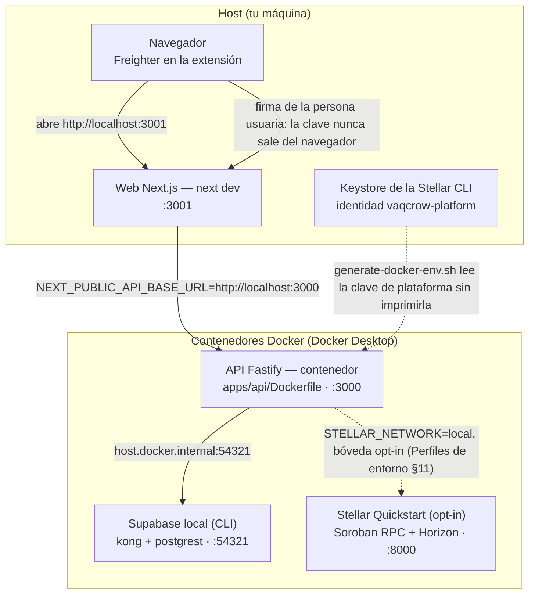
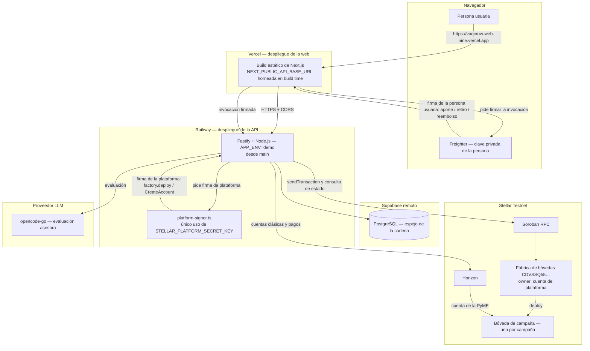

# Vaqcrow

**Financiamiento flexible para PyMEs argentinas mediante revenue share, con evaluación asistida por IA, control humano y liquidación verificable en Stellar.**

Vaqcrow busca que comercios de barrio y PyMEs puedan financiarse sin depender de cuotas fijas e intereses asfixiantes: quienes aportan capital reciben una participación contractual en las ventas, de modo que la obligación acompaña el desempeño del negocio.

**Misión de largo plazo:** democratizar la inversión en Latinoamérica conectando pequeños inversores con PyMEs tradicionales mediante financiamiento colectivo por revenue share, con Stellar para aportar transparencia, eficiencia y autocustodia. El producto y la demo actuales se acotan exclusivamente a Argentina.

**Lema:** _«Juntos podemos hacernos grandes»._

## Estado actual

- **Repositorio:** monorepo funcional con Fastify API, Next.js 16 web, contratos compartidos, dominio aplicado, `packages/ai`, el workspace Rust `contracts/` (`campaign-vault` y `campaign-factory`) y migraciones Supabase para evaluación, decisiones humanas y persistencia de campañas.
- **Evaluación y aprobación humana:** implementadas en `main`: contratos, transición de dominio, RPC atómica, API, pantallas web, auditoría inmutable e idempotencia. La integración credential-gated contra Supabase registró 15/15 tests pasando el 19/09/2026.
- **IA real:** la evaluación usa el proveedor `opencode-go` detrás de un adaptador reemplazable en `packages/ai`; sigue siendo asesora y no aprueba ni calcula obligaciones.
- **Stellar y custodia:** Freighter y Stellar Testnet están implementados, y el fondeo se custodia en un contrato Soroban (una bóveda por campaña, liquidación atómica al alcanzar el objetivo y reembolso permissionless al vencer). La plataforma firma `factory.deploy()` y el `CreateAccount` de la PyME; la persona usuaria firma aportes, retiros y reembolsos con Freighter.
- **Pruebas:** 125 archivos de test unitarios y de componentes seleccionados por `pnpm run test` (Vitest + Testing Library), además de las suites separadas de integración con Supabase, boundaries y E2E con Playwright.
- **Límites actuales:** no hay autenticación y `apps/api` todavía no expone el endpoint de solicitudes SME; el cálculo de la obligación de revenue share, la distribución en Testnet y la integración vertical del journey (Días 9–14 del plan) siguen pendientes.
- **Stitch:** el proyecto `VaqcrowWebApp` tiene 18 flujos de pantalla de escritorio, cada uno con variantes Light y Dark ya generadas. El inventario documentado —36 variantes de escritorio— está en [Diseño UI/UX y runbook de Google Stitch](./docs/design/demo-ui.md). Stitch es referencia visual y de prototipado, no una implementación autoritativa.
- **Pendiente en diseño:** generar las variantes móviles, resolver algunas correcciones de pantallas y ampliar las fichas detalladas de los flujos que todavía no tienen especificación equivalente.

## Aviso de confianza

> **Vaqcrow no es hoy una oferta, recomendación ni producto de inversión.** El KYC/KYB, las ventas y el corredor ARS/activo Stellar están **SIMULADOS**. La IA es consultiva y requiere aprobación humana. Freighter se usa de forma no custodial: cada persona conserva sus claves y Vaqcrow nunca recibe su seed. Los activos y transacciones de Stellar Testnet no tienen valor económico. La demo no acredita autorización regulatoria, legalidad, rentabilidad, solvencia ni disponibilidad en producción.

## Qué demuestra la demo

La historia vertical prevista sigue un único caso sintético —**Panadería Horizonte SRL**, una PyME argentina— de punta a punta:

1. La PyME presenta identidad, KYC/KYB, historial de ventas y comprobantes simulados.
2. Una IA real analiza la evidencia suministrada, detecta anomalías y datos faltantes, expresa incertidumbre y entrega una recomendación estructurada y trazable.
3. Un operador revisa la evidencia y registra la decisión humana; la IA no autoriza el financiamiento.
4. Un inversor conecta Freighter y firma, de forma no custodial, la invocación del contrato que alimenta la bóveda de la campaña en Stellar Testnet.
5. La bóveda custodia los aportes: el contrato liquida de forma atómica a la PyME al alcanzar el objetivo y habilita el reembolso permissionless si vence el plazo; la API envía la invocación firmada al Soroban RPC y refleja el estado observado en la cadena.
6. El sistema calcula la obligación de revenue share con reglas determinísticas y muestra la distribución, que sigue el camino clásico de pagos en Testnet, con sus estados y hashes.

El objetivo es completar este recorrido en 5–7 minutos sin ocultar qué es real, qué está simulado y qué decisiones continúan abiertas para una operación argentina.

## Real versus simulado

| Capacidad | Demo prevista |
|---|---|
| Empresa, identidad y perfiles | Datos sintéticos, rotulados `SIMULADO` |
| KYC/KYB | Simulado detrás de un adaptador reemplazable |
| Historial y feed mensual de ventas | Simulados, reproducibles y con una anomalía/faltante intencionales |
| Evaluación de riesgo por IA | Real con el proveedor `opencode-go` detrás de un adaptador reemplazable |
| Decisión de financiamiento | Real y humana sobre el caso sintético |
| Entrada/cotización ARS | Simulada; el corredor de producción continúa sin resolver |
| Wallet y firma | Reales con Freighter, de forma no custodial |
| Fondeo y distribución | Transacciones reales en Stellar Testnet, sin valor económico |
| Confirmación | Real y asíncrona: Soroban RPC para la bóveda y Horizon para cuentas, pagos y distribución |
| Cálculo de revenue share | Real, determinístico y ajeno al LLM |

## IA: función y límites

La IA normaliza y organiza evidencia, cita sus fuentes, identifica anomalías y datos faltantes, expresa incertidumbre y propone preguntas para revisión. Su salida debe cumplir un esquema estricto y quedar asociada a versión de modelo/prompt, timestamp y aprobación o rechazo humano.

Guardrails obligatorios:

- no inventar datos ni completar faltantes;
- no presentar inferencias como hechos;
- no aprobar casos ni sustituir la decisión humana;
- no calcular montos, porcentajes, redondeos u obligaciones financieras;
- no construir decisiones finales, firmar ni transferir fondos;
- ante timeout o salida inválida, derivar el caso a revisión manual.

## Decisión de arquitectura

Vaqcrow debe continuar como **monorepo**. Un monorepo es una estrategia de organización del código, no un monolito de despliegue: `web`, `api` y `worker` pueden compilarse, desplegarse y revertirse por separado. La decisión responde al dominio compartido, los contratos y fixtures comunes, los paquetes reutilizables, el journey vertical, la CI coordinada y el tamaño actual del equipo y del proyecto.

Los límites para evitar un monorepo caótico son explícitos: dependencias dirigidas, dominio independiente de frameworks, ninguna importación de internals entre aplicaciones, un paquete por capacidad cohesionada y despliegues separados. La estructura completa y sus reglas están en [Arquitectura del monorepo](./docs/architecture/monorepo.md).

Estructura actual:

```text
apps/web · apps/api                          ← implementados y funcionales
packages/domain · contracts · ai             ← implementados con tests
contracts/                                   ← workspace Rust: campaign-vault · campaign-factory
supabase/                                    ← config.toml + migraciones
```

Paquetes previstos para etapas futuras:

```text
apps/worker (opcional)
packages/stellar · simulators · db · config · testing · ui
```

## Arquitecturas de la demo

Dos vistas de **despliegue**: qué corre en la máquina de desarrollo con el perfil docker y qué corre en la nube. El flujo de una request y quién firma cada transacción —el detalle fino— está en [Arquitectura de la demo en la nube](./docs/architecture/cloud-demo-architecture.md): acá sólo se ubica cada pieza.

### Arquitectura local (perfil docker)



`pnpm env:docker:up` levanta Supabase, la API y (si hace falta) el Quickstart; `next dev` corre en el host, no en un contenedor. El recorrido de la bóveda contra el Quickstart es opt-in y su identidad de plataforma es sólo para la red local: no sirve para Testnet.

### Arquitectura de producción (nube)



La persona usuaria firma con Freighter en su navegador; la plataforma firma `factory.deploy()` y el `CreateAccount` de la PyME con `STELLAR_PLATFORM_SECRET_KEY`, cuyo único punto de uso es `platform-signer.ts`. La cadena es la fuente de verdad del dinero y Supabase es su espejo. Es una demo en **Testnet**: identidad, KYC/KYB y ventas son simulados y los activos no tienen valor económico.

## Stack previsto para la demo

| Capa | Tecnología y responsabilidad |
|---|---|
| Web | Next.js + React para la interfaz y un BFF limitado a necesidades de presentación |
| API | Node.js + TypeScript + Fastify para comandos, dominio, verificación XDR y coordinación |
| Persistencia | PostgreSQL gestionado mediante Supabase; Auth y Storage solo si el alcance de la demo lo requiere |
| Stellar | Stellar SDK, Freighter, Horizon y Testnet para firma no custodial, envío y confirmación; **contratos de Stellar (Rust) para la custodia del fondeo** |
| IA | Proveedor LLM `opencode-go`, detrás de un adaptador reemplazable y con salida estructurada |
| Pruebas | Vitest y Testing Library para unidad, dominio y UI; Playwright para el journey crítico en navegador |
| Workspace y CI | pnpm, Turborepo; GitHub Actions con lockfile congelado y gates de pull request |

El **fondeo se custodia en un contrato de Stellar** (Rust + `soroban-sdk`): cada campaña abre su propia bóveda, el contrato liquida a la PyME apenas se alcanza el objetivo y reembolsa a los inversores si vence la fecha sin alcanzarlo. Se evaluó **Claimable Balance (CAP-23)** como alternativa sin contrato y **se descartó**, porque no puede expresar "objetivo alcanzado" on-chain. Detalle en `docs/planning/stellar-blockchain-requirements.md`.

## Despliegue propuesto

- `apps/web` y `apps/api` tienen artefactos y despliegues independientes: la web en **Vercel** y la API en **Railway**, ambas desplegadas desde `main`. `NEXT_PUBLIC_API_BASE_URL` se incorpora al bundle de la web en tiempo de build.
- `apps/worker` no existe todavía: las confirmaciones asíncronas viven en la API. Solo se agregará como proceso independiente si esos jobs no caben de forma segura en ella.
- Supabase aporta servicios gestionados, sin convertir al cliente web en dueño de la autorización ni de los estados críticos.

Estos despliegues son la **demo en Stellar Testnet**, no una operación productiva real: la identidad, KYC/KYB y ventas siguen simulados y los activos no tienen valor económico.

## Cómo ejecutar el proyecto

El proyecto tiene dos perfiles de entorno, cada uno en su propio archivo en la raíz del repositorio. Ninguno se versiona; las plantillas `.env.docker.example` y `.env.cloud.example` sí.

| Perfil | Archivo | Supabase | API | Stellar | Uso |
|---|---|---|---|---|---|
| **docker** | `.env.docker` | Stack local en Docker (`:54321`) | Contenedor en Docker Desktop (`:3000`) | Quickstart local (`:8000`) para contratos | Pruebas locales |
| **cloud** | `.env.cloud` | Proyecto remoto | Proceso local contra servicios remotos (Railway en la demo) | Testnet | Exclusivo para la demo |

> [!important]
> Los nombres no son `.env.development` / `.env.local` a propósito: Next.js y Vite cargan esos archivos en capas, no como alternativas. Cada perfil se elige explícitamente con su comando. Detalle completo en [Perfiles de entorno](./docs/architecture/environments.md).

### Requisitos

- Node `>=24 <25` y pnpm `11.27.0` (`corepack enable`), luego `pnpm install --frozen-lockfile`.
- Docker Desktop en ejecución y Supabase CLI (sólo para el perfil docker).
- Un `.env.cloud` completo: el perfil docker reutiliza sus variables `LLM_*`, porque no hay un LLM local.

### Ambiente local (perfil docker)

```bash
cp .env.cloud.example .env.cloud     # una sola vez; completar con las credenciales reales
pnpm env:docker:up                   # Supabase local + Stellar Quickstart + API en contenedor
pnpm dev:web:docker                  # web en http://localhost:3001 → usa la API del contenedor (:3000)
```

- `pnpm env:docker:up` levanta Supabase local (kong, rest, auth, db), reutiliza Quickstart si ya está sano, genera `.env.docker` la primera vez sin imprimir secretos y construye la imagen de la API desde `apps/api/Dockerfile`. Termina cuando `http://localhost:3000/health` responde.
- `pnpm env:docker:status` muestra el estado de cada pieza sin mostrar claves; `pnpm env:docker:down` detiene la API y Supabase conservando los datos (`pnpm env:docker:down -- --all` también detiene Quickstart).
- Pruebas contra el stack local: `pnpm run test:db` (pgTAP de esquema, RLS y grants) y `pnpm --filter @vaqcrow/api test:integration` (usa el perfil docker por defecto).
- Para regenerar `.env.docker` (por ejemplo, tras cambiar `.env.cloud`): `./scripts/env/generate-docker-env.sh --force`.

> [!tip]
> El primer `pnpm env:docker:up` construye la imagen de la API y puede tardar varios minutos; los siguientes reutilizan las capas en caché.

### Ambiente cloud (perfil cloud)

```bash
pnpm dev:api:cloud                   # API local en http://localhost:3000 contra el Supabase remoto
pnpm dev:web:cloud                   # web en http://localhost:3001 contra NEXT_PUBLIC_API_BASE_URL de .env.cloud
```

- `.env.cloud` debe tener `APP_ENV=demo` y `NEXT_PUBLIC_API_BASE_URL` apuntando a la API que se quiere usar: `http://localhost:3000` con `pnpm dev:api:cloud`, o la URL pública de Railway una vez desplegada.
- La suite de integración contra el proyecto remoto es opt-in: `pnpm --filter @vaqcrow/api test:integration:cloud`.

> [!warning]
> El perfil cloud escribe en la base de datos de la demo. Usalo para preparar o ensayar la demo, no para pruebas; las migraciones se prueban primero en el perfil docker y luego se aplican al proyecto remoto en la misma unidad de trabajo.

> [!info]
> Ambos perfiles publican la API en el puerto `3000` y la web en el `3001`: detené el contenedor (`pnpm env:docker:down`) antes de usar `pnpm dev:api:cloud`.

> [!info] CORS
> La API habilita CORS vía `CORS_ALLOWED_ORIGINS` (lista de orígenes exactos separados por coma). Sin configurar, el perfil docker (`APP_ENV=local`) permite `http://localhost:3001`/`http://127.0.0.1:3001` por default; el perfil cloud (`APP_ENV=demo`) no permite ningún origen hasta declarar explícitamente el de Vercel. Ver [Perfiles de entorno §8](./docs/architecture/environments.md).

## Desarrollo y calidad

- **Setup local:** ver [Cómo ejecutar el proyecto](#cómo-ejecutar-el-proyecto) y [Perfiles de entorno](./docs/architecture/environments.md) — cubre `.env.cloud`/`.env.docker`, `pnpm env:docker:up` y el flujo de migraciones.
- **Estado actual:** `pnpm verify` ejecuta lint, typecheck, pruebas, build y verificación de boundaries entre workspaces. Las pruebas usan fixtures y dobles locales, sin depender de Testnet, Horizon ni del proveedor LLM.
- **CI:** [`.github/workflows/ci.yml`](./.github/workflows/ci.yml) corre en cada pull request con `pnpm install --frozen-lockfile`: un job ejecuta `pnpm verify` y otro el journey de Playwright. Ningún job usa servicios externos vivos ni requiere secretos del repositorio.
- **Playwright:** cubre el journey crítico de la demo —shell guiado de seis pasos y decisión humana— contra un doble local en `apps/web/e2e/`, con navegador Chromium, un solo worker y sin reintentos. Comandos: `pnpm run test:e2e:install` (instala Chromium, una vez) y `pnpm run test:e2e`.
- **Gates verificados por tests:** `tests/testing-and-ci-gates.test.ts` comprueba de forma determinística el workflow de CI (instalación congelada, sin secretos ni endpoints externos), la determinación de Playwright y el doble local, y ejercita el rechazo del guard de hosts externos.
- **Comprobaciones externas:** Testnet y LLM se ejecutan por separado y de forma acotada en preview/demo o antes del ensayo.
- **Secretos:** se inyectan desde el entorno. No se deben confirmar seeds, claves privadas, tokens, PII ni credenciales en Git o logs.

## Planificación y gestión del desarrollo

La fuente de alcance para implementar la demo es el [plan de la demo](./docs/planning/DEMO.md). La planificación y la implementación se mantienen deliberadamente separadas: el plan define el resultado esperado y el backlog de GitHub organiza el trabajo ejecutable.

El backlog previsto se gestionará en un GitHub Project Kanban llamado **Vaqcrow-TFM**. El flujo de trabajo debe permitir distinguir el estado de cada unidad sin confundir planificación con entrega:

```text
docs/planning/DEMO.md
          │
          ▼
       OpenCode
          │
          ▼
   GitHub Project: Vaqcrow-TFM
          │
          ├── Epic
          │    ├── Feature
          │    │    ├── Task
          │    │    └── Task
          │    └── Feature
          │
          ├── Epic
          │    └── ...
          │
          └── Technical/Foundation work
               ├── Frontend setup
               ├── Backend setup
               ├── Database
               ├── Testing
               ├── CI/CD
               └── Deployment
```

El tablero debe contemplar, como mínimo, estados equivalentes a **Backlog**, **Ready**, **In Progress**, **Testing**, **Review**, **Blocked** y **Done**. La taxonomía final de estados, labels y campos se decidirá al analizar el plan completo, evitando crear categorías que no respondan a una necesidad real del proyecto.

Cada Feature o Task de implementación debe incluir contexto, objetivo, requisitos funcionales y técnicos, criterios de aceptación verificables, dependencias, estrategia de pruebas TDD y Definition of Done. El backlog debe cubrir tanto funcionalidades visibles como trabajo fundacional: monorepo, frontend, API, Supabase/PostgreSQL, contratos, IA, Stellar, datos sintéticos, testing, seguridad, CI/CD, despliegue, observabilidad y preparación de la demo.

La creación y organización del Project, sus issues, labels, campos y dependencias será una actividad de planificación independiente. No se deben marcar issues como completados sin evidencia en el repositorio, y la implementación solo comenzará después de seleccionar una unidad de trabajo con sus dependencias satisfechas.

## Documentación

- [Arquitectura del monorepo](./docs/architecture/monorepo.md) — decisión, árbol propuesto, dependencias, despliegue, testing y límites de crecimiento.
- [Plan de la demo](./docs/planning/DEMO.md) — historia de dos semanas, arquitectura, pruebas, demo y límites.
- [Plan del producto real](./docs/planning/product.md) — validación para Argentina, riesgos regulatorios y ruta hacia producción.
- [Diseño UI/UX y runbook de Google Stitch](./docs/design/demo-ui.md) — inventario visual, flujos, estados, accesibilidad y pendientes de diseño.

## Próximo paso

El monorepo, el shell de demo, la IA real, la persistencia, el slice de evaluación/aprobación humana, la bóveda de campaña en Testnet y los gates de CI ya están implementados. El grueso pendiente son los Días 9–14 del [plan de la demo](./docs/planning/DEMO.md): ventas y cálculo determinístico de la obligación, distribución en Testnet, integración vertical del journey, resiliencia y evidencias, ensayo con público interno, y freeze y presentación final. El avance por unidad se sigue en el tablero **Vaqcrow-TFM**, que es la fuente de verdad del estado.

## Licencia

Este repositorio se distribuye bajo la [licencia MIT](./LICENSE).
