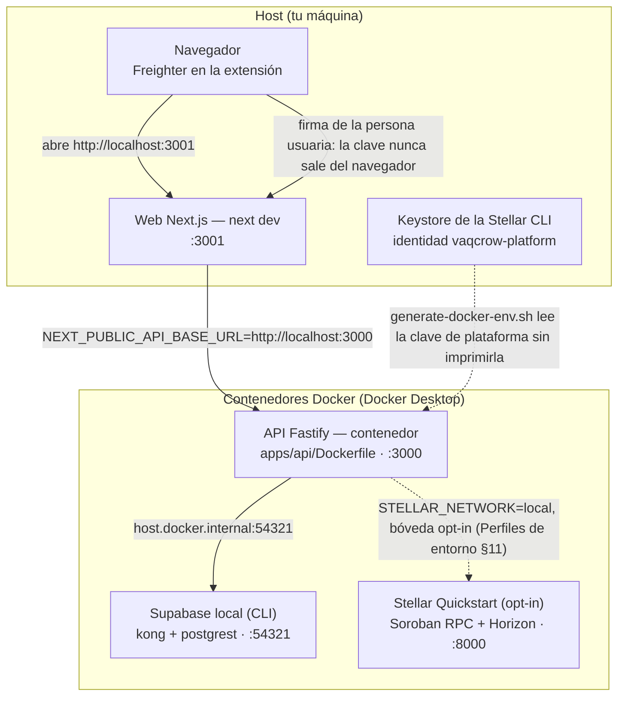
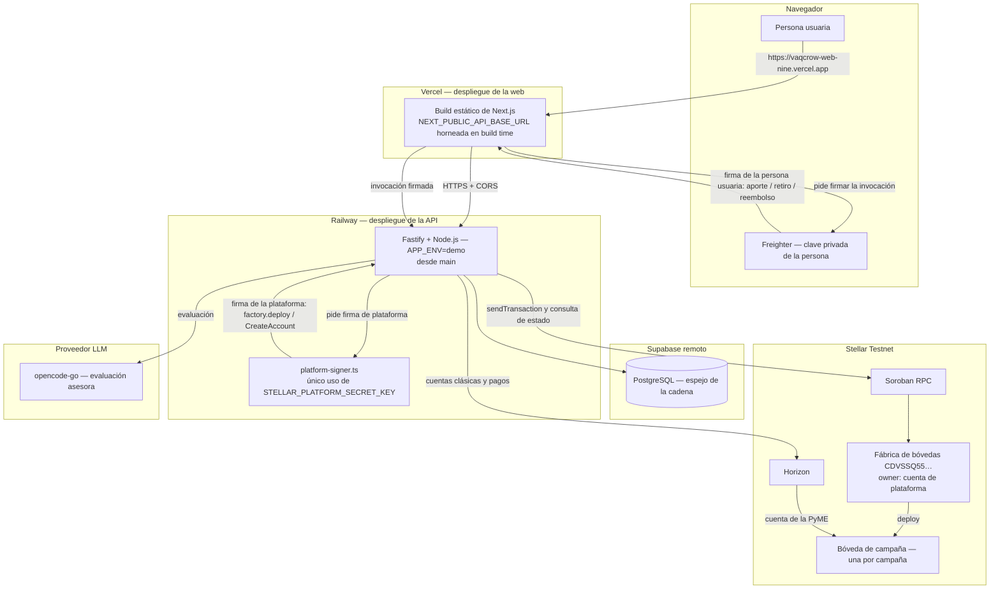
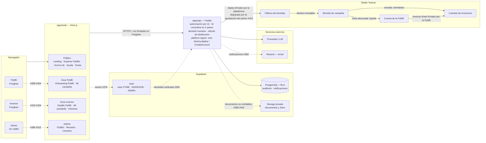

# Vaqcrow

**Financiamiento flexible para PyMEs argentinas mediante revenue share, con evaluación asistida por IA, control humano y liquidación verificable en Stellar.**

Vaqcrow busca que comercios de barrio y PyMEs puedan financiarse sin depender de cuotas fijas e intereses asfixiantes: quienes aportan capital reciben una participación contractual en las ventas, de modo que la obligación acompaña el desempeño del negocio.

**Misión de largo plazo:** democratizar la inversión en Latinoamérica conectando pequeños inversores con PyMEs tradicionales mediante financiamiento colectivo por revenue share, con Stellar para aportar transparencia, eficiencia y autocustodia. El producto y la demo actuales se acotan exclusivamente a Argentina.

**Lema:** _«Juntos podemos hacernos grandes»._

## Estado actual

- **Repositorio:** monorepo funcional con Fastify API, Next.js 16 web, contratos compartidos, dominio aplicado, `packages/ai`, el workspace Rust `contracts/` (`campaign-vault` y `campaign-factory`) y migraciones Supabase para solicitud de PyME, evaluación, decisiones humanas, distribución de revenue share y persistencia de campañas.
- **Evaluación y aprobación humana:** implementadas en `main`: contratos, transición de dominio, RPC atómica, API, pantallas web, auditoría inmutable e idempotencia. La suite de integración contra Supabase corre por separado, con credenciales, y no forma parte de `pnpm run test`.
- **Recorrido vertical completo:** implementado y probado en `main`. La solicitud de PyME (`POST /sme-requests`), la evaluación ligada a la solicitud, la decisión humana, el fondeo no custodial en la bóveda de campaña, la confirmación asíncrona, las ventas mensuales, el cálculo determinístico de la obligación `RS-2026-01` y la distribución en Testnet quedan encadenados por los identificadores que cada paso produce; la Feature #30 se cerró el 01/10/2026. En `main` ese motor todavía se recorre por las seis rutas guiadas (`/request` … `/evidence`) y su walk en navegador es `apps/web/e2e/full-journey.spec.ts`; la rama apilada de [#438](https://github.com/reyduar/Vaqcrow/issues/438) retira esas rutas, su engine y ese spec, y el mismo motor queda servido por las áreas de cada rol (ver [Hoja de ruta](#hoja-de-ruta-producto-por-roles-alineado-al-template)).
- **IA real:** la evaluación usa el proveedor `opencode-go` detrás de un adaptador reemplazable en `packages/ai`; sigue siendo asesora y no aprueba ni calcula obligaciones.
- **Stellar y custodia:** Freighter y Stellar Testnet están implementados, y el fondeo se custodia en un contrato Soroban (una bóveda por campaña, liquidación atómica al alcanzar el objetivo y reembolso permissionless al vencer). La plataforma firma `factory.deploy()` y el `CreateAccount` de la PyME; la persona usuaria firma aportes, retiros y reembolsos con Freighter.
- **Pruebas:** 190 archivos de test unitarios y de componentes seleccionados por `pnpm run test` (Vitest + Testing Library), además de las suites separadas de integración con Supabase, boundaries y E2E con Playwright.
- **Límites actuales:** en `main` todavía no hay autenticación real: el recorrido de seis pasos corre sobre una sesión de demostración. Las cuentas reales ya están implementadas en dos ramas apiladas que **todavía no llegaron a `main`**: la de la Feature [#369](https://github.com/reyduar/Vaqcrow/issues/369) (Supabase Auth, roles `PYME` / `INVERSOR` / `ADMIN`, RLS y autorización de la API) y la de la Feature [#378](https://github.com/reyduar/Vaqcrow/issues/378) (alta e ingreso reales en `/signup` y `/login`, header según el rol, cierre de sesión y `/portfolio` y `/company` protegidas por sesión y rol). Las dos se mergean juntas con el retiro del recorrido ([#438](https://github.com/reyduar/Vaqcrow/issues/438), que en su rama ya borró las seis rutas); ver [Hoja de ruta: producto por roles](#hoja-de-ruta-producto-por-roles-alineado-al-template). La latencia del proveedor de IA en la ruta hosteada es alta e impredecible —93,79 s en la medición del 01/10/2026— y el recorrido completo nunca se cronometró de punta a punta (ver [Qué demuestra la demo](#qué-demuestra-la-demo)).
- **Diseño (fuente de verdad):** el template de **Claude Design** en `docs/design/template/` —14 pantallas `.dc.html`, cada una con los dos temas en el mismo archivo— reemplazó al proyecto de Google Stitch el 01/10/2026. Se comparte en <https://claude.ai/design/p/d16823bf-de57-404f-a94b-6a3ad638a770?file=Vaqcrow+Landing.html&via=share>. El directorio está fuera del repositorio a propósito (`.gitignore`) y su HTML generado nunca es implementación autoritativa de producción; el detalle está en [Diseño UI/UX y fuente de verdad visual](./docs/design/demo-ui.md). La adaptación del MVP al template se entregó en cinco slices implementados y mergeados en `main`: copy en español neutral, Geist y Geist Mono vía `next/font/google`, el vocabulario de tokens, las escalas, el espaciado y la elevación en `apps/web/src/app/globals.css`, el acento de HeroUI resolviendo al morado de marca con un único override de `--accent`, las primitivas, el shell y las siete rutas. No se agregó, quitó ni renombró ninguna ruta: en `main`, `/` sigue redirigiendo a `/request`. En la rama de #378, `/` pasa a ser el esqueleto de la landing y las rutas nuevas son en inglés (`/signup`, `/login`, `/portfolio`, `/company`). En la rama de #438 las seis rutas del recorrido (`/request`, `/ai-assessment`, `/approval`, `/funding`, `/distribution`, `/evidence`) dejan de existir y responden 404, sin redirección.
- **Handoff del template:** el handoff de diseño vive en `docs/design/design_handoff_vaqcrow/` (`README.md`, `brief/`, `screens/`) y es la fuente visual y de comportamiento del producto por roles planificado: lo que el template no diseña se registra como pregunta abierta en su issue y no se inventa.
- **Pendiente en diseño:** las pantallas del template que la app no tiene como ruta —landing, billetera, marketplace, área de PyME e inversor y consola de administración— dejaron de ser una decisión abierta: el owner decidió el 2026-10-01 construirlas y los Epics [#368](https://github.com/reyduar/Vaqcrow/issues/368)–[#377](https://github.com/reyduar/Vaqcrow/issues/377) las planifican; el **isotipo** ya está versionado en `apps/web/public/vaqcrow-isotipo.png` en la rama de #378 (copiado del template exportado por el owner) y lo usan las pantallas de alta e ingreso, pero el header todavía muestra solo la marca tipográfica; y faltan las **variantes móviles** por ruta.

## Hoja de ruta: producto por roles alineado al template

Decisión del owner (2026-10-01): la app deja de ser un único recorrido guiado y pasa a ser un **producto por roles con la forma exacta del template de Claude Design** (handoff en `docs/design/design_handoff_vaqcrow/`). Lo que existe hoy en `main` es el recorrido de seis pasos y el motor que lo sostiene. Las Features por rol se implementan en ramas apiladas todavía sin mergear, que llegan a `main` juntas con [#438](https://github.com/reyduar/Vaqcrow/issues/438); el estado de cada una está en [la hoja de ruta ejecutable](./docs/planning/demo-tasks-list.md#^roadmap-template):

| Epic | Alcance planificado |
|---|---|
| [#368 Identidad y acceso](https://github.com/reyduar/Vaqcrow/issues/368) | Supabase Auth (email y contraseña), roles `PYME` / `INVERSOR` / `ADMIN`, RLS por rol y autorización de la API; reemplaza el Auth.js v5 planificado en #134. #369 (API y base) y #378 (alta, ingreso y shell por rol en la web) implementadas en ramas apiladas, fuera de `main` |
| [#373 Sitio público](https://github.com/reyduar/Vaqcrow/issues/373) | Landing, Acerca de, Guía de inversión, Guía para emprendedores y Ayuda (asistente RAG «Próximamente») |
| [#374 Alta de PyMEs y campaña](https://github.com/reyduar/Vaqcrow/issues/374) | Registro de la PyME, KYC simulado, carga real de documentos y fotos a Supabase Storage, IA en dos pasos (completitud y riesgo), envío a revisión por la propia PyME con su wallet Freighter conectada (obligatoria: su clave pública es el destino de la bóveda) y «Mi campaña» |
| [#375 Consola de administración](https://github.com/reyduar/Vaqcrow/issues/375) | `/admin` sin alta pública, cola de PyMEs, revisión con aprobación humana que dispara el despliegue de la bóveda, usuarios, invitaciones y auditoría |
| [#376 Marketplace y área del inversor](https://github.com/reyduar/Vaqcrow/issues/376) | Explorar PyMEs, detalle y aporte, Mi portafolio e Informes |
| [#377 Notificaciones](https://github.com/reyduar/Vaqcrow/issues/377) | Campana in-app para los tres roles y email por Resend detrás de un puerto |

La Feature [#438](https://github.com/reyduar/Vaqcrow/issues/438) retira las seis rutas del recorrido guiado (404, sin redirección) una vez que cada dato que mostraban tiene reemplazo por rol: la evidencia Testnet queda repartida entre el inversor, la PyME y el detalle de campaña (hashes y links al explorador), y el admin ve la cadena completa por solicitud en `/admin/pymes/[applicationId]/evidence`. Está implementada en su rama apilada, todavía fuera de `main`. Siempre **no custodial**: Vaqcrow nunca custodia claves ni recibe o mueve dinero de terceros; el KYC del inversor es simulado y se aprueba solo en el primer aporte. El orden y las dependencias están en [la hoja de ruta ejecutable](./docs/planning/demo-tasks-list.md#^roadmap-template).

## Aviso de confianza

> **Vaqcrow no es hoy una oferta, recomendación ni producto de inversión.** El KYC/KYB, las ventas y el corredor ARS/activo Stellar están **SIMULADOS**. La IA es consultiva y requiere aprobación humana. Freighter se usa de forma no custodial: cada persona conserva sus claves y Vaqcrow nunca recibe su seed. Los activos y transacciones de Stellar Testnet no tienen valor económico. La demo no acredita autorización regulatoria, legalidad, rentabilidad, solvencia ni disponibilidad en producción.

## Qué demuestra la demo

La historia vertical implementada hoy (que el producto por roles reutilizará como motor) sigue un único caso sintético —**Panadería Horizonte SRL**, una PyME argentina— de punta a punta:

1. La PyME presenta verificación de identidad, KYC/KYB, historial de ventas y comprobantes simulados.
2. Una IA real analiza la evidencia suministrada, detecta anomalías y datos faltantes, expresa incertidumbre y entrega una recomendación estructurada y trazable.
3. Un operador revisa la evidencia y registra la decisión humana; la IA no autoriza el financiamiento.
4. Un inversor conecta Freighter y firma, de forma no custodial, la invocación del contrato que alimenta la bóveda de la campaña en Stellar Testnet.
5. La bóveda custodia los aportes: el contrato liquida de forma atómica a la PyME al alcanzar el objetivo y habilita el reembolso permissionless si vence el plazo; la API envía la invocación firmada al Soroban RPC y refleja el estado observado en la cadena.
6. El sistema calcula la obligación de revenue share con reglas determinísticas y muestra la distribución, que sigue el camino clásico de pagos en Testnet, con sus estados y hashes.

El objetivo de la demo es mostrar este recorrido sin ocultar qué es real, qué está simulado y qué decisiones continúan abiertas para una operación argentina. No hay un objetivo de duración. **Latencia medida el 01/10/2026:** en la ruta hosteada, una evaluación real del proveedor de IA —el segundo de los seis pasos— tardó **93,79 s**, y dos sondas agotaron el timeout a los **30,69 s** y **120,56 s**: la latencia es alta e impredecible. La integración está entregada y probada de forma determinística, pero el recorrido completo **nunca se cronometró de punta a punta**.

## Real versus simulado

| Capacidad | Demo prevista |
|---|---|
| Empresa y perfiles | Datos sintéticos, rotulados `SIMULADO`; cuentas y roles reales con Supabase Auth, implementados en las ramas de #369 y #378 (todavía fuera de `main`) |
| Documentos y fotos de la PyME | Carga real a un bucket privado de Supabase Storage, planificada (#398); contenido no confiable |
| KYC/KYB (PyME e inversor) | Simulado detrás de un adaptador reemplazable; el del inversor se aprueba solo en el primer aporte |
| Historial y feed mensual de ventas | Simulados, reproducibles y con una anomalía/faltante intencionales |
| Evaluación de riesgo por IA | Real con el proveedor `opencode-go` detrás de un adaptador reemplazable |
| Decisión de financiamiento | Real y humana sobre el caso sintético |
| Entrada/cotización ARS | Simulada; el corredor de producción continúa sin resolver |
| Wallet y firma | Reales con Freighter, de forma no custodial (PyME e inversor) |
| Notificaciones | Campana in-app y email por Resend, planificados (#382); las pruebas usan un doble |
| Fondeo y distribución | Transacciones reales en Stellar Testnet, sin valor económico |
| Confirmación | Real y asíncrona: Soroban RPC para la bóveda y Horizon para cuentas, pagos y distribución |
| Cálculo de revenue share | Real, determinístico y ajeno al LLM |

## IA: función y límites

La IA normaliza y organiza evidencia, cita sus fuentes, identifica anomalías y datos faltantes, expresa incertidumbre y propone preguntas para revisión. Su salida debe cumplir un esquema estricto y quedar asociada a versión de modelo/prompt, timestamp y aprobación o rechazo humano.

Guardrails obligatorios:

- no inventar datos ni completar faltantes;
- no presentar inferencias como hechos;
- no aprobar casos ni sustituir la decisión humana;
- no calcular montos, porcentajes, redondeos u obligaciones financieras;
- no construir decisiones finales, firmar ni transferir fondos;
- ante timeout o salida inválida, derivar el caso a revisión manual.

## Decisión de arquitectura

Vaqcrow debe continuar como **monorepo**. Un monorepo es una estrategia de organización del código, no un monolito de despliegue: `web`, `api` y `worker` pueden compilarse, desplegarse y revertirse por separado. La decisión responde al dominio compartido, los contratos y fixtures comunes, los paquetes reutilizables, el journey vertical, la CI coordinada y el tamaño actual del equipo y del proyecto.

Los límites para evitar un monorepo caótico son explícitos: dependencias dirigidas, dominio independiente de frameworks, ninguna importación de internals entre aplicaciones, un paquete por capacidad cohesionada y despliegues separados. La estructura completa y sus reglas están en [Arquitectura del monorepo](./docs/architecture/monorepo.md).

Estructura actual:

```text
apps/web · apps/api                          ← implementados y funcionales
packages/domain · contracts · ai             ← implementados con tests
contracts/                                   ← workspace Rust: campaign-vault · campaign-factory
supabase/                                    ← config.toml + migraciones
```

Paquetes previstos para etapas futuras:

```text
apps/worker (opcional)
packages/stellar · simulators · db · config · testing · ui
```

## Arquitecturas de la demo

Dos vistas de **despliegue**: qué corre en la máquina de desarrollo con el perfil docker y qué corre en la nube. El flujo de una request y quién firma cada transacción —el detalle fino— está en [Arquitectura de la demo en la nube](./docs/architecture/cloud-demo-architecture.md): acá sólo se ubica cada pieza.

### Arquitectura local (perfil docker)


```mermaid
graph TB
    subgraph "Host (tu máquina)"
        BROWSER["Navegador<br/>Freighter en la extensión"]
        WEB["Web Next.js — next dev<br/>:3001"]
        KEYSTORE["Keystore de la Stellar CLI<br/>identidad vaqcrow-platform"]
    end

    subgraph "Contenedores Docker (Docker Desktop)"
        API["API Fastify — contenedor<br/>apps/api/Dockerfile · :3000"]
        SUPABASE["Supabase local (CLI)<br/>kong + postgrest · :54321"]
        QUICKSTART["Stellar Quickstart (opt-in)<br/>Soroban RPC + Horizon · :8000"]
    end

    BROWSER -->|"abre http://localhost:3001"| WEB
    BROWSER -->|"firma de la persona usuaria: la clave nunca sale del navegador"| WEB
    WEB -->|"NEXT_PUBLIC_API_BASE_URL=http://localhost:3000"| API
    API -->|"host.docker.internal:54321"| SUPABASE
    API -.->|"STELLAR_NETWORK=local, bóveda opt-in (Perfiles de entorno §11)"| QUICKSTART
    KEYSTORE -.->|"generate-docker-env.sh lee la clave de plataforma sin imprimirla"| API
```

`pnpm env:docker:up` levanta Supabase, la API y (si hace falta) el Quickstart; `next dev` corre en el host, no en un contenedor. El recorrido de la bóveda contra el Quickstart es opt-in y su identidad de plataforma es sólo para la red local: no sirve para Testnet.

### Arquitectura de producción (nube)


```mermaid
graph TB
    subgraph "Navegador"
        USER["Persona usuaria"]
        FREIGHTER["Freighter — clave privada de la persona"]
    end

    subgraph "Vercel — despliegue de la web"
        WEB["Build estático de Next.js<br/>NEXT_PUBLIC_API_BASE_URL horneada en build time"]
    end

    subgraph "Railway — despliegue de la API"
        API["Fastify + Node.js — APP_ENV=demo<br/>desde main"]
        SIGNER["platform-signer.ts<br/>único uso de STELLAR_PLATFORM_SECRET_KEY"]
    end

    subgraph "Supabase remoto"
        DB[("PostgreSQL — espejo de la cadena")]
    end

    subgraph "Stellar Testnet"
        RPC["Soroban RPC"]
        HORIZON["Horizon"]
        FACTORY["Fábrica de bóvedas CDVSSQ55…<br/>owner: cuenta de plataforma"]
        VAULT["Bóveda de campaña — una por campaña"]
    end

    subgraph "Proveedor LLM"
        LLM["opencode-go — evaluación asesora"]
    end

    USER -->|"https://vaqcrow-web-nine.vercel.app"| WEB
    WEB -->|"HTTPS + CORS"| API
    WEB -->|"pide firmar la invocación"| FREIGHTER
    FREIGHTER -->|"firma de la persona usuaria: aporte / retiro / reembolso"| WEB
    WEB -->|"invocación firmada"| API
    API --> DB
    API -->|"sendTransaction y consulta de estado"| RPC
    API -->|"cuentas clásicas y pagos"| HORIZON
    API -->|"evaluación"| LLM
    API -->|"pide firma de plataforma"| SIGNER
    SIGNER -->|"firma de la plataforma: factory.deploy / CreateAccount"| API
    RPC --> FACTORY
    FACTORY -->|"deploy"| VAULT
    HORIZON -->|"cuenta de la PyME"| VAULT
```

La persona usuaria firma con Freighter en su navegador; la plataforma firma `factory.deploy()` y el `CreateAccount` de la PyME con `STELLAR_PLATFORM_SECRET_KEY`, cuyo único punto de uso es `platform-signer.ts`. La cadena es la fuente de verdad del dinero y Supabase es su espejo. Es una demo en **Testnet**: hoy la identidad, KYC/KYB y ventas son simulados y los activos no tienen valor económico.

### Arquitectura objetivo por roles (planificada)

Hacia dónde va el producto con la forma del template ([Hoja de ruta](#hoja-de-ruta-producto-por-roles-alineado-al-template)). Las flechas continuas ya existen en `main`; las punteadas son planificadas e indican el issue que las entrega.


```mermaid
graph LR
    subgraph NAV["Navegador"]
        PYME["PyME<br/>Freighter"]
        INV["Inversor<br/>Freighter"]
        ADMIN["Admin<br/>sin wallet"]
    end

    subgraph WEB["apps/web — Next.js"]
        PUBLIC["Público<br/>Landing · Explorar PyMEs · Acerca de · Ayuda · Guías"]
        PYMEAREA["Área PyME<br/>Onboarding PyME · Mi campaña"]
        INVAREA["Área inversor<br/>Detalle PyME · Mi portafolio · Informes"]
        ADMINAREA["/admin<br/>PyMEs · Revisión · Usuarios"]
    end

    subgraph SB["Supabase"]
        AUTH["Auth<br/>roles PYME · INVERSOR · ADMIN"]
        DB[("PostgreSQL + RLS<br/>auditoría · notificaciones")]
        STORAGE["Storage privado<br/>documentos y fotos"]
    end

    API["apps/api — Fastify<br/>autorización por rol · IA consultiva en 2 pasos<br/>decisión humana · cálculo de distribución<br/>platform-signer: solo factory.deploy / CreateAccount"]

    subgraph EXT["Servicios externos"]
        LLM["Proveedor LLM"]
        RESEND["Resend — email"]
    end

    subgraph ST["Stellar Testnet"]
        FACTORY["Fábrica de bóvedas"]
        VAULT["Bóveda de campaña"]
        PYMEACC["Cuenta de la PyME"]
        INVACC["Cuentas de inversores"]
    end

    NAV --> PUBLIC
    PYME -.->|"#398 #434"| PYMEAREA
    INV -.->|"#422 #426"| INVAREA
    ADMIN -.->|"#386 #410"| ADMINAREA
    WEB -.->|"sesión #378"| AUTH
    WEB -->|"HTTPS + txs firmadas en Freighter"| API
    AUTH -.->|"identidad verificada #369"| API
    API --> DB
    API -.->|"documentos no confiables #398 #402"| STORAGE
    API --> LLM
    API -.->|"notificaciones #382"| RESEND
    API -->|"deploy firmado por la plataforma<br/>disparado por la aprobación del admin #410"| FACTORY
    FACTORY -->|"destino inmutable"| VAULT
    VAULT -->|"meta alcanzada: liquida"| PYMEACC
    VAULT -->|"vencida: reembolso"| INVACC
    PYMEACC -->|"revenue share firmado por la PyME"| INVACC
```

Vaqcrow **nunca** custodia claves ni recibe o mueve dinero de terceros: la clave de plataforma solo despliega la bóveda (y crea la cuenta de la PyME en Testnet) cuando un admin aprueba; los aportes los custodia el contrato y cada pago lo firma su dueño en Freighter. La conversión ARS ↔ activo sigue simulada.

## Stack previsto para la demo

| Capa | Tecnología y responsabilidad |
|---|---|
| Web | Next.js + React para la interfaz y un BFF limitado a necesidades de presentación; en la rama de #378, sesión de Supabase en cookies (`@supabase/ssr`) y protección de rutas en el servidor (`apps/web/src/proxy.ts`) |
| API | Node.js + TypeScript + Fastify para comandos, dominio, verificación XDR y coordinación |
| Persistencia | PostgreSQL gestionado mediante Supabase; Auth (email y contraseña, roles y RLS), implementado en las ramas de #369 y #378 (sin mergear), y Storage privado para documentos y fotos de la PyME, planificado (#398) |
| Notificaciones | Resend detrás de un puerto y adaptador, planificado (#382) |
| Stellar | Stellar SDK, Freighter, Horizon y Testnet para firma no custodial, envío y confirmación; **contratos de Stellar (Rust) para la custodia del fondeo** |
| IA | Proveedor LLM `opencode-go`, detrás de un adaptador reemplazable y con salida estructurada |
| Pruebas | Vitest y Testing Library para unidad, dominio y UI; Playwright para el recorrido crítico en navegador |
| Workspace y CI | pnpm, Turborepo; GitHub Actions con lockfile congelado y gates de pull request |

El **fondeo se custodia en un contrato de Stellar** (Rust + `soroban-sdk`): cada campaña abre su propia bóveda, el contrato liquida a la PyME apenas se alcanza el objetivo y reembolsa a los inversores si vence la fecha sin alcanzarlo. Se evaluó **Claimable Balance (CAP-23)** como alternativa sin contrato y **se descartó**, porque no puede expresar "objetivo alcanzado" on-chain. Detalle en `docs/planning/stellar-blockchain-requirements.md`.

## Despliegue propuesto

- `apps/web` y `apps/api` tienen artefactos y despliegues independientes: la web en **Vercel** y la API en **Railway**, ambas desplegadas desde `main`. `NEXT_PUBLIC_API_BASE_URL` se incorpora al bundle de la web en tiempo de build.
- `apps/worker` no existe todavía: las confirmaciones asíncronas viven en la API. Solo se agregará como proceso independiente si esos jobs no caben de forma segura en ella.
- Supabase aporta servicios gestionados, sin convertir al cliente web en dueño de la autorización ni de los estados críticos.

Estos despliegues son la **demo en Stellar Testnet**, no una operación productiva real: la verificación de identidad, KYC/KYB y ventas siguen simulados y los activos no tienen valor económico.

## Cómo ejecutar el proyecto

El proyecto tiene dos perfiles de entorno, cada uno en su propio archivo en la raíz del repositorio. Ninguno se versiona; las plantillas `.env.docker.example` y `.env.cloud.example` sí.

| Perfil | Archivo | Supabase | API | Stellar | Uso |
|---|---|---|---|---|---|
| **docker** | `.env.docker` | Stack local en Docker (`:54321`) | Contenedor en Docker Desktop (`:3000`) | Quickstart local (`:8000`) para contratos | Pruebas locales |
| **cloud** | `.env.cloud` | Proyecto remoto | Proceso local contra servicios remotos (Railway en la demo) | Testnet | Exclusivo para la demo |

> [!important]
> Los nombres no son `.env.development` / `.env.local` a propósito: Next.js y Vite cargan esos archivos en capas, no como alternativas. Cada perfil se elige explícitamente con su comando. Detalle completo en [Perfiles de entorno](./docs/architecture/environments.md).

### Requisitos

- Node `>=24 <25` y pnpm `11.27.0` (`corepack enable`), luego `pnpm install --frozen-lockfile`.
- Docker Desktop en ejecución y Supabase CLI (sólo para el perfil docker).
- Un `.env.cloud` completo: el perfil docker reutiliza sus variables `LLM_*`, porque no hay un LLM local.

### Ambiente local (perfil docker)

```bash
cp .env.cloud.example .env.cloud     # una sola vez; completar con las credenciales reales
pnpm env:docker:up                   # Supabase local + Stellar Quickstart + API en contenedor
pnpm dev:web:docker                  # web en http://localhost:3001 → usa la API del contenedor (:3000)
```

- `pnpm env:docker:up` levanta Supabase local (kong, rest, auth, db), reutiliza Quickstart si ya está sano, genera `.env.docker` la primera vez sin imprimir secretos y construye la imagen de la API desde `apps/api/Dockerfile`. Termina cuando `http://localhost:3000/health` responde.
- `pnpm env:docker:status` muestra el estado de cada pieza sin mostrar claves; `pnpm env:docker:down` detiene la API y Supabase conservando los datos (`pnpm env:docker:down -- --all` también detiene Quickstart).
- Pruebas contra el stack local: `pnpm run test:db` (pgTAP de esquema, RLS y grants) y `pnpm --filter @vaqcrow/api test:integration` (usa el perfil docker por defecto).
- Para regenerar `.env.docker` (por ejemplo, tras cambiar `.env.cloud`): `./scripts/env/generate-docker-env.sh --force`.

> [!tip]
> El primer `pnpm env:docker:up` construye la imagen de la API y puede tardar varios minutos; los siguientes reutilizan las capas en caché.

### Ambiente cloud (perfil cloud)

```bash
pnpm dev:api:cloud                   # API local en http://localhost:3000 contra el Supabase remoto
pnpm dev:web:cloud                   # web en http://localhost:3001 contra NEXT_PUBLIC_API_BASE_URL de .env.cloud
```

- `.env.cloud` debe tener `APP_ENV=demo` y `NEXT_PUBLIC_API_BASE_URL` apuntando a la API que se quiere usar: `http://localhost:3000` con `pnpm dev:api:cloud`, o la URL pública de Railway una vez desplegada.
- La suite de integración contra el proyecto remoto es opt-in: `pnpm --filter @vaqcrow/api test:integration:cloud`.

> [!warning]
> El perfil cloud escribe en la base de datos de la demo. Usalo para preparar o ensayar la demo, no para pruebas; las migraciones se prueban primero en el perfil docker y luego se aplican al proyecto remoto en la misma unidad de trabajo.

> [!info]
> Ambos perfiles publican la API en el puerto `3000` y la web en el `3001`: detené el contenedor (`pnpm env:docker:down`) antes de usar `pnpm dev:api:cloud`.

> [!info] CORS
> La API habilita CORS vía `CORS_ALLOWED_ORIGINS` (lista de orígenes exactos separados por coma). Sin configurar, el perfil docker (`APP_ENV=local`) permite `http://localhost:3001`/`http://127.0.0.1:3001` por default; el perfil cloud (`APP_ENV=demo`) no permite ningún origen hasta declarar explícitamente el de Vercel. Ver [Perfiles de entorno §8](./docs/architecture/environments.md).

## Desarrollo y calidad

- **Setup local:** ver [Cómo ejecutar el proyecto](#cómo-ejecutar-el-proyecto) y [Perfiles de entorno](./docs/architecture/environments.md) — cubre `.env.cloud`/`.env.docker`, `pnpm env:docker:up` y el flujo de migraciones.
- **Estado actual:** `pnpm verify` ejecuta lint, typecheck, pruebas, build y verificación de boundaries entre workspaces. Las pruebas usan fixtures y dobles locales, sin depender de Testnet, Horizon ni del proveedor LLM.
- **CI:** [`.github/workflows/ci.yml`](./.github/workflows/ci.yml) corre en cada pull request con `pnpm install --frozen-lockfile`: un job ejecuta `pnpm verify`, otro el journey de Playwright y un tercero compila, prueba y despliega los contratos Rust en una red local. Ningún job usa servicios externos vivos ni requiere secretos del repositorio.
- **Playwright:** cubre el recorrido crítico de la demo contra un doble local en `apps/web/e2e/`, con navegador Chromium, un solo worker y sin reintentos. En `main` cubre el recorrido de seis pasos (`full-journey.spec.ts`, de la solicitud de la PyME a la evidencia). En la rama de #438, que retira ese recorrido, los specs son por rol: `auth-roles.spec.ts`, `app-header.spec.ts`, `pyme-onboarding.spec.ts` y `admin-review.spec.ts` (cola → evidencia → revisión). Comandos: `pnpm run test:e2e:install` (instala Chromium, una vez) y `pnpm run test:e2e`.
- **Gates verificados por tests:** `tests/testing-and-ci-gates.test.ts` comprueba de forma determinística el workflow de CI (instalación congelada, sin secretos ni endpoints externos), la determinación de Playwright y el doble local, y ejercita el rechazo del guard de hosts externos.
- **Comprobaciones externas:** Testnet y LLM se ejecutan por separado y de forma acotada en preview/demo o antes del ensayo.
- **Secretos:** se inyectan desde el entorno. No se deben confirmar seeds, claves privadas, tokens, PII ni credenciales en Git o logs.

## Storybook (taller de componentes)

El taller de componentes vive en `apps/web/.storybook/` y renderiza las primitivas reales con los tokens reales, en claro y en oscuro. No es una maqueta paralela: usa los mismos componentes y el mismo CSS que la app. La guía completa —requisitos, temas, qué está cubierto y problemas frecuentes— está en [Storybook y los dos temas](./docs/guides/storybook.md).

```bash
pnpm --filter @vaqcrow/web storybook          # taller en http://localhost:6006
pnpm --filter @vaqcrow/web build-storybook    # build estático en apps/web/storybook-static/
python3 -m http.server 6006 --directory apps/web/storybook-static   # servir ese build
```

- `apps/web/storybook-static/` es la salida del build estático y está ignorada por Git.
- Storybook queda **fuera de `pnpm run verify` a propósito**: no se suma al gate documentado ni lo vuelve más lento. El addon de accesibilidad reporta en su panel pero no bloquea, y el taller no involucra backend, wallet ni Testnet: sólo componentes y CSS.

**Versión publicada.** El workflow [`.github/workflows/storybook.yml`](./.github/workflows/storybook.yml) construye esa misma salida y la publica en GitHub Pages: **[reyduar.github.io/Vaqcrow/storybook](https://reyduar.github.io/Vaqcrow/storybook)**. Un pull request sólo construye, sin publicar, así que un Storybook roto falla antes del merge; los push a `main` publican. Es un destino propio: no toca el despliegue de la web ([`vercel.json`](./vercel.json), que sigue construyendo sólo `@vaqcrow/web` con el framework Next.js) ni el de la API.

## Planificación y gestión del desarrollo

La fuente de alcance para implementar la demo es el [plan de la demo](./docs/planning/DEMO.md). La planificación y la implementación se mantienen deliberadamente separadas: el plan define el resultado esperado y el backlog de GitHub organiza el trabajo ejecutable.

El backlog previsto se gestionará en un GitHub Project Kanban llamado **Vaqcrow-TFM**. El flujo de trabajo debe permitir distinguir el estado de cada unidad sin confundir planificación con entrega:

```text
docs/planning/DEMO.md
          │
          ▼
       OpenCode
          │
          ▼
   GitHub Project: Vaqcrow-TFM
          │
          ├── Epic
          │    ├── Feature
          │    │    ├── Task
          │    │    └── Task
          │    └── Feature
          │
          ├── Epic
          │    └── ...
          │
          └── Technical/Foundation work
               ├── Frontend setup
               ├── Backend setup
               ├── Database
               ├── Testing
               ├── CI/CD
               └── Deployment
```

El tablero debe contemplar, como mínimo, estados equivalentes a **Backlog**, **Ready**, **In Progress**, **Testing**, **Review**, **Blocked** y **Done**. La taxonomía final de estados, labels y campos se decidirá al analizar el plan completo, evitando crear categorías que no respondan a una necesidad real del proyecto.

Cada Feature o Task de implementación debe incluir contexto, objetivo, requisitos funcionales y técnicos, criterios de aceptación verificables, dependencias, estrategia de pruebas TDD y Definition of Done. El backlog debe cubrir tanto funcionalidades visibles como trabajo fundacional: monorepo, frontend, API, Supabase/PostgreSQL, contratos, IA, Stellar, datos sintéticos, testing, seguridad, CI/CD, despliegue, observabilidad y preparación de la demo.

La creación y organización del Project, sus issues, labels, campos y dependencias será una actividad de planificación independiente. No se deben marcar issues como completados sin evidencia en el repositorio, y la implementación solo comenzará después de seleccionar una unidad de trabajo con sus dependencias satisfechas.

## Documentación

- [Arquitectura del monorepo](./docs/architecture/monorepo.md) — decisión, árbol propuesto, dependencias, despliegue, testing y límites de crecimiento.
- [Plan de la demo](./docs/planning/DEMO.md) — producto por roles, arquitectura, pruebas, guion de presentación y límites.
- [Hoja de ruta ejecutable](./docs/planning/demo-tasks-list.md) — Epics, Features y Tasks, incluida la hoja de ruta alineada al template (#368–#441).
- [Plan del producto real](./docs/planning/product.md) — validación para Argentina, riesgos regulatorios y ruta hacia producción.
- [Evidencia del recorrido vertical completo](./docs/planning/complete-vertical-demo-journey-evidence.md) — criterios de aceptación, verificación y límites de la Feature #30.
- [Diseño UI/UX y fuente de verdad visual](./docs/design/demo-ui.md) — template de Claude Design, flujos, estados, accesibilidad y pendientes de diseño.
- [Storybook y los dos temas](./docs/guides/storybook.md) — taller de componentes, temas claro/oscuro y qué está cubierto.

## Próximo paso

El monorepo, el shell de demo, la IA real, la persistencia, el slice de evaluación/aprobación humana, la bóveda de campaña en Testnet, el recorrido vertical completo y los gates de CI ya están implementados; la Feature #30 se cerró el 01/10/2026. Lo que sigue abierto, según los límites vigentes del [documento de evidencia](./docs/planning/complete-vertical-demo-journey-evidence.md):

- **Corrida cronometrada de punta a punta.** El recorrido completo por navegador contra producción no se ejecutó, así que no hay un tiempo de punta a punta medido; la latencia del proveedor de IA medida es alta e impredecible. No hay un objetivo de duración.
- **Producto por roles.** La autenticación real (#369, #378) está implementada en ramas apiladas y espera su merge a `main` junto con #438; la carga de documentos, la consola de administración, el marketplace, el contenido de las áreas de PyME e inversor y las notificaciones siguen planificados en los Epics #368–#377.
- **Prueba en vivo contra Testnet.** La suite `e2e-live` sigue necesitando credenciales del operador y Testnet, y no se corrió.
- **Reset de Testnet del 16/12/2026.** Invalida las direcciones de contrato: obliga a redesplegar la fábrica y reapuntar `STELLAR_CAMPAIGN_FACTORY_ID`; el procedimiento está documentado y todavía no se ejercitó.
- **Bordes conocidos:** `contributions_incomplete` tras un retiro total, un id de campaña malformado que responde `503`, el feed de ventas en memoria que se pierde al reiniciar la API y `scripts/` fuera de ESLint.
- **Diseño:** construir las pantallas del template que faltan como parte de los Epics #368–#377, cerrar el gate de revisión por pantalla y generar las variantes móviles.

El avance por unidad se sigue en el tablero **Vaqcrow-TFM**, que es la fuente de verdad del estado.

## Licencia

Este repositorio se distribuye bajo la [licencia MIT](./LICENSE).
