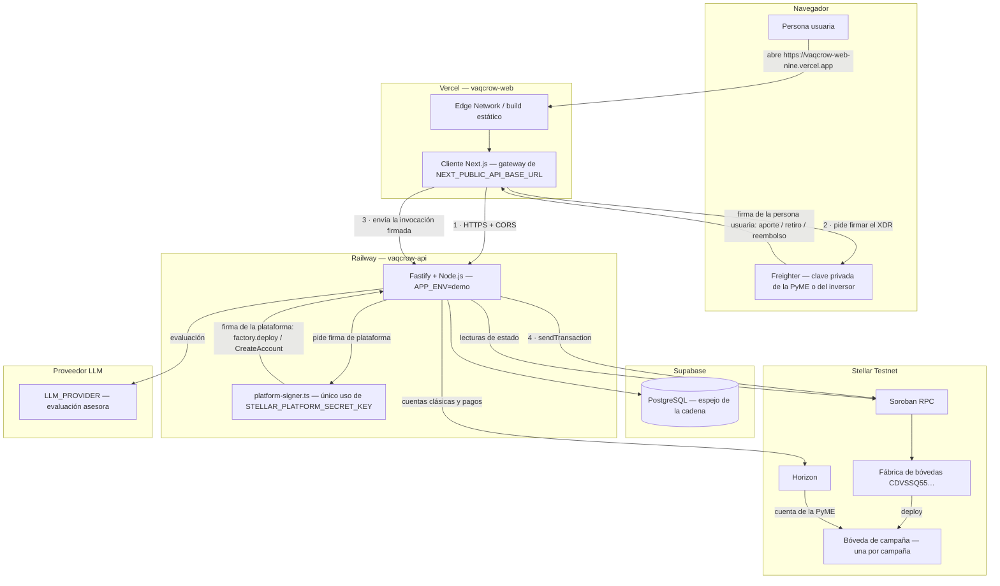

# Vaqcrow — Arquitectura de la demo en la nube

> [!info] Objetivo
> Describir cómo funciona de punta a punta la demo desplegada en la nube: el frontend en Vercel, la API en Railway, el espejo en Supabase y la bóveda de campaña en Stellar Testnet. Explica el recorrido de una request, **quién firma cada transacción y con qué clave**, por qué la cadena es la fuente de verdad y qué límites tiene la demo. La evidencia de lo que se probó para configurar este entorno está en [[docs/planning/cloud-environment-configuration-evidence|Evidencia de la configuración del entorno en la nube]]; este documento explica **cómo funciona**, no **qué se verificó**. Para el detalle de pares de claves y fondeo de cuentas, ver [[docs/architecture/stellar-accounts-and-keys|Cuentas, claves y fondeo en Stellar]].

> [!danger] Alcance no productivo
> Esto es una **demo**. La identidad, el KYC/KYB, el historial de ventas y el broker ARS/activo están **simulados**; Stellar corre en **Testnet** y todo activo carece de valor económico; la evaluación de IA es **asesora** y nunca aprueba, calcula obligaciones ni mueve fondos. Ver [§7](#7-límites-honestos-de-la-demo).

## 1. Diagrama de componentes

> [!important] Cómo leer las dos firmas del diagrama
> Hay **dos firmantes distintos** y no se sustituyen entre sí. La persona usuaria firma con **Freighter** en su navegador (aporte, retiro, reembolso): la clave privada nunca sale de la extensión. La **plataforma** firma con `STELLAR_PLATFORM_SECRET_KEY`, y ese secreto sólo lo convierte en llave firmante `platform-signer.ts`; se usa para `factory.deploy()` y para el `CreateAccount` de la PyME, nunca para mover fondos de una persona usuaria. La API es el transporte en ambos casos: arma y envía la transacción a Soroban RPC.

## 2. El recorrido de una request

1. **Navegador → Vercel.** El navegador pide `https://vaqcrow-web-nine.vercel.app`. Vercel sirve un **build estático** de Next.js desde su Edge Network, además del código de cliente que se ejecuta en el navegador.
2. **Cliente → API.** El cliente usa el gateway configurado con `NEXT_PUBLIC_API_BASE_URL` para llamar por HTTPS a `https://api-production-c07f.up.railway.app`. El origen de producción de Vercel está en `CORS_ALLOWED_ORIGINS` de la API, así que el preflight y las llamadas se permiten. Si la variable no estuviera configurada, el gateway se construye como `null` y la interfaz informa que no hay backend configurado en lugar de fallar en silencio.
3. **API → servicios.** La API en Railway atiende la request y, según la ruta:
   - escribe y lee su **espejo** en **Supabase** (campañas, aportes, contactos de reembolso);
   - lee y arma transacciones contra el **Soroban RPC** de Testnet (estado de la bóveda) y contra **Horizon** (cuentas clásicas y pagos);
   - pide la **evaluación** al proveedor LLM configurado (`LLM_PROVIDER`), que es asesora.
4. **Firma y cadena.** Para un aporte, retiro o reembolso, el cliente pide el XDR sin firmar, Freighter lo firma en el navegador y la API envía la invocación firmada a Soroban RPC. Para abrir una bóveda, la **plataforma** firma por su cuenta (ver [§3](#3-quién-firma-qué-y-con-qué-clave)).

## 3. Quién firma qué, y con qué clave

| | Firma la persona usuaria | Firma la plataforma |
|---|---|---|
| **Con qué** | La clave privada de su **Freighter**, en el navegador | `STELLAR_PLATFORM_SECRET_KEY`, en el entorno de la API |
| **Qué firma** | Aporte, retiro y reembolso de la bóveda | `factory.deploy()` (abrir la bóveda) y el `CreateAccount` de la cuenta de la PyME |
| **Quién la ejecuta** | El navegador, a pedido de la persona | `platform-signer.ts`, único archivo con permiso de convertir el `Secret` en llave firmante |
| **Qué garantiza** | Que ningún aporte, retiro ni reembolso se mueve sin la voluntad de la persona dueña de los fondos; Vaqcrow nunca ve su clave | Que la plataforma puede cumplir el precontrato de abrir la bóveda y fondear la cuenta de la PyME sin pedirle una firma extra a la persona |
| **Qué no garantiza** | No protege a la PyME de configurar mal su wallet ni de perder su propia clave | No autoriza mover fondos de inversores: el contrato exige la firma del dueño de cada aporte para su retiro o reembolso |

El secreto de plataforma tiene **un solo punto de uso auditado**: `platform-signer.ts`. Un test de no-custodia recorre el AST de `apps/api/src` y `apps/web/src` y falla si cualquier otro archivo convierte un secreto en material de firma. Ampliar ese allowlist es un cambio deliberado y visible, nunca un accidente de refactor.

## 4. La cadena es la fuente de verdad

El **contrato Soroban es autoritativo para el dinero**: quién aportó, cuánto, en qué estado está la bóveda y cuándo se puede liquidar o reembolsar. **Supabase es un espejo** que guarda el último hecho observado de la cadena (estado, total, dirección del contrato, red, token) con `reconciliation_status` (`in_sync` / `diverged`). La reconciliación va **de la cadena hacia el espejo, nunca al revés**:

- el espejo se actualiza con una escritura condicional por `campaign_id`, estado esperado y marca temporal de observación, así que un replay tardío no pisa un hecho más nuevo;
- si lo observado no coincide con el espejo, la fila se marca `diverged` y se conserva `last_diverged_at` como historial;
- el espejo replica límites del contrato (por ejemplo, el total no puede superar el objetivo).

Supabase sirve para leer y para no golpear la cadena en cada pantalla; no es la autoridad de los saldos. El detalle de la reconciliación está en [[docs/planning/campaign-persistence-and-reconciliation-evidence|Evidencia de persistencia y reconciliación]].

## 5. La configuración de la bóveda: un par estricto

La bóveda de campaña se habilita con **cinco variables**, y dos de ellas son un **par estricto**:

| Variable | Obligatoriedad | Nota |
|---|---|---|
| `STELLAR_NETWORK` | Requerida | Sólo `testnet`; `production` se rechaza al arrancar |
| `STELLAR_CAMPAIGN_FACTORY_ID` | **Juntas** | Dirección **pública** de la fábrica de Testnet `CDVSSQ55LBBYHAK5DNQG2UNPIG3PMPJELKJ7LKSNOBAIHAEHPMX75GXJ` |
| `STELLAR_PLATFORM_SECRET_KEY` | **Juntas** | **Secreto**; se setea en el servicio de Railway, nunca en el repositorio |
| `STELLAR_TOKEN_CONTRACT_ID` | Opcional | Sin valor, la API deriva la SAC nativa de XLM |
| `STELLAR_RPC_URL` | Opcional | Sin valor, la API usa el RPC canónico de Testnet |

> [!warning] Una sola clave es peor que ninguna
> `campaign-vault-config.ts` resuelve el slice así: **sin ninguna** de las dos claves del par devuelve `{ enabled: false }` y las rutas `/campaigns` no se registran (el navegador recibe un `404` de Fastify); **con exactamente una** devuelve un error de configuración. Ese error se lanza al cargar el módulo, sin `try/catch`, así que **el proceso no arranca**. Configurar sólo `STELLAR_CAMPAIGN_FACTORY_ID` o sólo `STELLAR_PLATFORM_SECRET_KEY` tumba la API entera en vez de degradarla.

La fábrica de Testnet tiene como `owner` la identidad `vaqcrow-testnet`, con clave pública `GBCOTYYE3KGV745LQ4MELTP4IK2Z2RX2OESRNWP2LY6XLEI73X3PX2ZG` (leída de la red). La correspondencia entre `STELLAR_PLATFORM_SECRET_KEY` y ese `owner` sólo queda probada cuando la API abre efectivamente una campaña (`POST /campaigns`); ver los límites en la evidencia.

## 6. Red local vs Testnet: dos mundos que no se mezclan

| | Red local (Stellar Quickstart) | Stellar Testnet |
|---|---|---|
| **Identidad de plataforma** | `vaqcrow-platform`, en el keystore de la Stellar CLI | `vaqcrow-testnet` |
| **Origen de los valores** | Se generan **por corrida**: cada `bootstrap` redespliega la fábrica con un id nuevo | Valores **fijos**: fábrica `CDVSSQ55…`, owner `GBCOTYY…` |
| **`STELLAR_NETWORK`** | `local`; `STELLAR_HORIZON_URL`/`STELLAR_RPC_URL` apuntan al Quickstart | `testnet`; Horizon y RPC usan las constantes canónicas |
| **Registro del despliegue** | `contracts/.local-deployment.json` (sólo datos públicos, en `.gitignore`) | Direcciones verificadas contra la red y documentadas |
| **Para qué sirve** | Correr el recorrido completo de forma determinística, sin tocar la red pública | La demo presentada; es la red de los despliegues en Vercel/Railway |

> [!warning] La clave de la red local no sirve para Testnet
> `vaqcrow-platform` es sólo para el Quickstart local y **no funciona contra Testnet**: la fábrica de Testnet pertenece a `vaqcrow-testnet`. Para la red pública se usa `vaqcrow-testnet`; para la red local, la clave que `generate-docker-env.sh` lee del keystore. Son dos despliegues con direcciones propias y no intercambiables. Ver [[docs/architecture/environments#11-bóveda-de-campaña-en-la-red-local|§11 de Perfiles de entorno]].

## 7. Límites honestos de la demo

1. **Demo sobre Testnet, sin valor económico.** El XLM de Testnet y los activos de la demo no valen nada. La identidad, el KYC/KYB, el historial de ventas y el broker ARS/activo son simulados.
2. **La IA es asesora.** Propone una evaluación; no aprueba, no calcula obligaciones y no mueve fondos. La aprobación es humana.
3. **Reset de Testnet agendado para el 2026-12-16.** Las direcciones de contrato de Testnet valen hasta ese reset; después hay que redesplegar y reapuntar la configuración.
4. **API y web no se ejercitaron de punta a punta por navegador.** La configuración está desplegada y verificada por partes (bundle servido, `/health`, CORS), pero el recorrido completo en el navegador contra producción no se corrió; la evidencia lo declara como límite.
5. **`POST /campaigns` no se ejercitó contra el despliegue hosteado.** Por eso la correspondencia entre la clave de plataforma y el `owner` de la fábrica todavía no quedó probada en vivo (ver [§5](#5-la-configuración-de-la-bóveda-un-par-estricto)).
6. **Decisiones operativas sin registrar.** El almacenamiento y la rotación del secreto de plataforma, el SSO de los previews de Vercel y el dominio propio siguen abiertos.

> [!tip] Estado del entorno
> El estado de las piezas desplegadas y lo que se pudo y no se pudo verificar se documenta en [[docs/planning/cloud-environment-configuration-evidence|Evidencia de la configuración del entorno en la nube]]. Las piezas de este diagrama son sólo las que existen: no hay worker, cola ni indexador desplegados.
