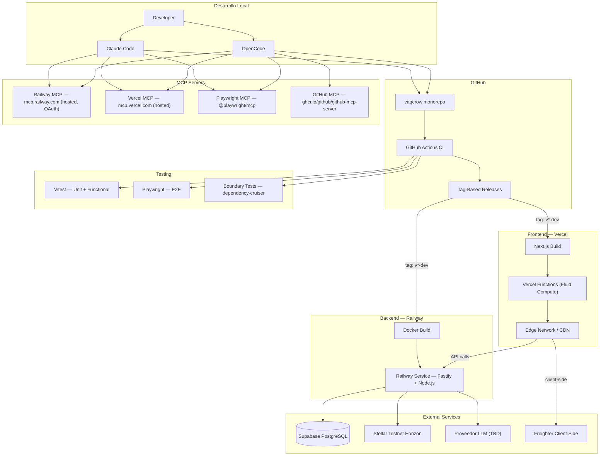
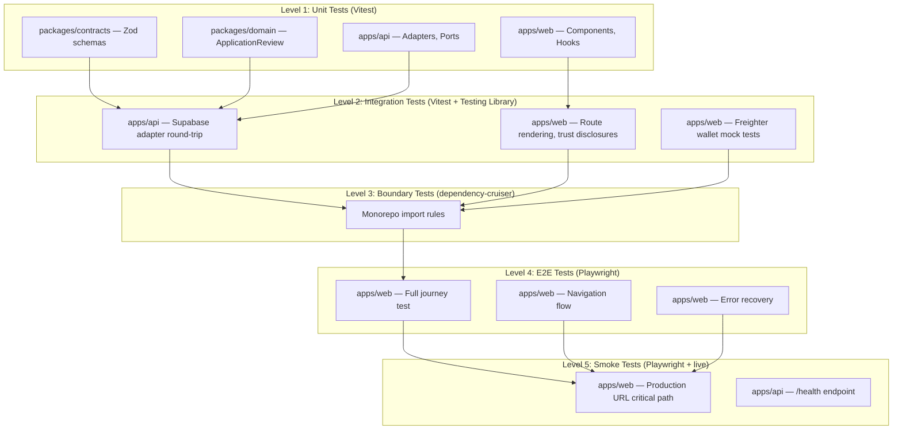
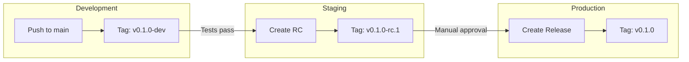

# Vaqcrow — Deploy Planning

> [!info] Objetivo
> Definir la arquitectura de despliegue, CI/CD, testing y herramientas MCP para la demo del TFM.

> [!important] Mapeo a issues del backlog canónico (Project #4)
> Este plan no requiere issues nuevos: su alcance ya está descompuesto en Features existentes. La numeración de fase es la de la sección [8. Checklist de implementación](#8-checklist-de-implementación).
>
> | Fase | Alcance | Issue | Estado (18/09/2026) |
> |---|---|---|---|
> | 1 — Fundación | `Dockerfile`, `railway.json`, `vercel.json`, `.dockerignore`, secretos | [#32](https://github.com/reyduar/Vaqcrow/issues/32) → [#101](https://github.com/reyduar/Vaqcrow/issues/101)/[#102](https://github.com/reyduar/Vaqcrow/issues/102)/[#103](https://github.com/reyduar/Vaqcrow/issues/103) | **API entregada** por [#101](https://github.com/reyduar/Vaqcrow/issues/101): desplegada y verificada en Railway. Restan la web (Vercel) y los workflows |
> | 2 — CI (`ci.yml`: lint/typecheck/test/boundaries/build) | [#15](https://github.com/reyduar/Vaqcrow/issues/15) → [#47](https://github.com/reyduar/Vaqcrow/issues/47)/[#48](https://github.com/reyduar/Vaqcrow/issues/48)/[#49](https://github.com/reyduar/Vaqcrow/issues/49) | **`Ready`** — solo dependía de #11, ya cerrada |
> | 2 — Deploy (`deploy-dev.yml`, `deploy-production.yml`) | [#32](https://github.com/reyduar/Vaqcrow/issues/32) → [#101](https://github.com/reyduar/Vaqcrow/issues/101)/[#102](https://github.com/reyduar/Vaqcrow/issues/102)/[#103](https://github.com/reyduar/Vaqcrow/issues/103) | Igual que Fase 1 |
> | 3 — Testing E2E (Playwright) | [#15](https://github.com/reyduar/Vaqcrow/issues/15) → [#47](https://github.com/reyduar/Vaqcrow/issues/47) | Igual que Fase 2 (mismo Task, su objetivo nombra Playwright explícitamente) |
> | 4 — MCP (Railway/Vercel/Playwright/GitHub para Claude Code y OpenCode) | [#32](https://github.com/reyduar/Vaqcrow/issues/32) → [#101](https://github.com/reyduar/Vaqcrow/issues/101) — **el tooling de agentes pasó a estar dentro del alcance** | Railway MCP y el skill `use-railway` configurados a nivel proyecto |
> | 5 — Demo (ensayo, freeze, presentación) | [#33](https://github.com/reyduar/Vaqcrow/issues/33), [#34](https://github.com/reyduar/Vaqcrow/issues/34) | Bloqueadas, lejos en la cadena |

---

## 1. Arquitectura de despliegue

### Diagrama de componentes



### Decision: Despliegue split (no monolito)

> [!important] Recomendación: DESPLIEGUE SEPARADO
> Vercel para el frontend (`apps/web`), Railway para la API (`apps/api`).

| Criterio | Web (Vercel) | API (Railway) |
|---|---|---|
| Runtime | Serverless / Edge | Docker container |
| Escalado | Auto (Fluid compute) | Auto (réplicas por región) |
| Framework | [[../web/README\|Next.js 16]] | [[../../apps/api/src/index.ts\|Fastify 5]] |
| Dependencias | `@vaqcrow/contracts` | `@vaqcrow/contracts`, `@vaqcrow/domain` |
| Variables de entorno | Solo las del BFF | Todas las del backend |
| Costo | Free tier (Hobby, sin costo) | Plan Hobby, USD 5 de crédito mensual |

> [!warning] Por qué NO un solo deploy
> - Vercel no soporta Fastify como server de larga ejecución
> - La API necesita persistencia de proceso (Horizon polling)
> - Los ciclos de deploy son diferentes: el web cambia por UI, la API por lógica de negocio
> - Rollback independiente: si un deploy de web rompe, la API sigue funcionando

---

## 2. Docker — API Backend

### Dockerfile

> [!note] Ubicación: `apps/api/Dockerfile` — **el archivo del repositorio es la fuente de verdad**; el bloque de abajo lo refleja.

> [!success] Verificado (2026-09-22)
> El build corre localmente y en Railway. La base `node:24-alpine` es **obligatoria, no incidental**: `package.json` fija `engines.node: ">=24.0.0 <25.0.0"` y `.npmrc` activa `engine-strict=true`, así que `pnpm install` aborta con `ERR_PNPM_UNSUPPORTED_ENGINE` en cualquier otra versión mayor.
>
> Tres correcciones se aplicaron sobre la versión originalmente planificada, y las tres salieron de **ejecutar** el build, no de razonarlo:
> 1. La etapa `build` no copiaba los manifests raíz y moría con `ERR_PNPM_NO_PKG_MANIFEST` en el primer comando.
> 2. Ninguna etapa copiaba `.npmrc`, así que la imagen podía construirse sobre un Node que CI rechaza, en silencio.
> 3. El comentario que justificaba copiar `apps/web/package.json` ("pnpm valida contra TODOS los miembros del workspace") era **inexacto**: verificado con un A/B, pnpm tolera un miembro faltante y aun así reporta el lockfile al día.

```dockerfile
# apps/api/Dockerfile
FROM node:24-alpine AS base
RUN corepack enable && corepack prepare pnpm@11.27.0 --activate
WORKDIR /app

# Install dependencies
FROM base AS deps
# .npmrc viaja en ambas etapas: lleva engine-strict=true y
# manage-package-manager-versions=true.
COPY pnpm-workspace.yaml pnpm-lock.yaml package.json .npmrc ./
COPY packages/contracts/package.json ./packages/contracts/
COPY packages/domain/package.json ./packages/domain/
COPY apps/api/package.json ./apps/api/
# apps/web/package.json también se copia aunque esta imagen no lo use: mantiene
# intacta la lista de miembros que declara pnpm-workspace.yaml, de modo que esta
# instalación sea idéntica a la de CI. pnpm tolera un miembro faltante
# (verificado con un A/B), así que es higiene y no un requisito duro.
COPY apps/web/package.json ./apps/web/
RUN pnpm install --frozen-lockfile

# Build packages
FROM base AS build
COPY --from=deps /app/node_modules ./node_modules
COPY --from=deps /app/packages/contracts/node_modules ./packages/contracts/node_modules
COPY --from=deps /app/packages/domain/node_modules ./packages/domain/node_modules
COPY --from=deps /app/apps/api/node_modules ./apps/api/node_modules
# Los manifests raíz también hacen falta en ESTA etapa: pnpm resuelve el
# workspace desde pnpm-workspace.yaml y los targets de --filter contra el
# package.json raíz. Sin ellos el primer comando de build falla con
# ERR_PNPM_NO_PKG_MANIFEST.
COPY pnpm-workspace.yaml pnpm-lock.yaml package.json .npmrc tsconfig.base.json ./
COPY apps/web/package.json ./apps/web/
COPY packages/contracts/ ./packages/contracts/
COPY packages/domain/ ./packages/domain/
COPY apps/api/ ./apps/api/
RUN pnpm --filter @vaqcrow/contracts build
RUN pnpm --filter @vaqcrow/domain build
RUN pnpm --filter @vaqcrow/api build

# Production image
FROM node:24-alpine AS production
RUN corepack enable && corepack prepare pnpm@11.27.0 --activate
WORKDIR /app

COPY --from=build /app/packages/contracts/dist ./packages/contracts/dist
COPY --from=build /app/packages/contracts/package.json ./packages/contracts/
COPY --from=build /app/packages/domain/dist ./packages/domain/dist
COPY --from=build /app/packages/domain/package.json ./packages/domain/
COPY --from=build /app/apps/api/dist ./apps/api/dist
COPY --from=build /app/apps/api/package.json ./apps/api/

# Real production-only install: la etapa `deps` instaló con devDependencies
# (las necesita el build de TypeScript), así que acá se reinstala desde cero
# con --prod en vez de copiar el node_modules de `deps` tal cual.
COPY pnpm-workspace.yaml pnpm-lock.yaml package.json .npmrc ./
RUN pnpm install --frozen-lockfile --prod

EXPOSE 3000
ENV NODE_ENV=production
CMD ["node", "apps/api/dist/index.js"]
```

### railway.json — config-as-code

> [!warning] Ubicación: `railway.json` (raíz del monorepo)
> El `Dockerfile` usa rutas `COPY` relativas a la raíz del monorepo (`packages/contracts/...`, `apps/api/...`), así que el **build context tiene que ser la raíz**. El servicio de Railway deja su *root directory* en la raíz y apunta al Dockerfile con `build.dockerfilePath`, que es una ruta **no estándar**: sin esa clave Railway no lo autodetecta.

```json
{
  "$schema": "https://railway.com/railway.schema.json",
  "build": {
    "builder": "DOCKERFILE",
    "dockerfilePath": "apps/api/Dockerfile",
    "watchPatterns": [
      "/apps/api/**",
      "/packages/**",
      "/package.json",
      "/pnpm-lock.yaml",
      "/pnpm-workspace.yaml",
      "/tsconfig.base.json",
      "/.npmrc",
      "/railway.json"
    ]
  },
  "deploy": {
    "healthcheckPath": "/health",
    "healthcheckTimeout": 30,
    "restartPolicyType": "ON_FAILURE",
    "restartPolicyMaxRetries": 3
  }
}
```

> [!danger] `railway.json` está deprecado
> Railway marcó *Config as Code* (`railway.json` / `railway.toml`) como deprecado en favor de *Infrastructure as Code* (`.railway/railway.ts`). Los archivos existentes **siguen funcionando hasta el 2026-12-01**. Migración: `railway config migrate`. Ojo: `railway config pull` puede arrastrar **valores** de variables al repositorio — revisar el diff antes de commitear.
>
> Alternativa sin config-as-code: mover el Dockerfile a la raíz del repositorio, donde Railway lo autodetecta.

> [!warning] Discrepancia de builder observada (2026-09-22)
> Aunque `railway.json` se respeta, la configuración **del servicio** sigue mostrando `build.builder: "RAILPACK"` (el default de la plataforma). El build usó el Dockerfile igual —los logs muestran sus etapas— pero la discrepancia es una trampa latente: si `railway.json` dejara de aplicarse, el servicio caería al builder Railpack, y Railpack resuelve Node desde `engines.node`/`.nvmrc` con **default 22**, que el gate `engine-strict` rechaza.
>
> Fijar el builder a nivel servicio (dashboard → Settings → Build → Builder → Dockerfile) elimina la dependencia del archivo deprecado para el ajuste más crítico.

> [!note] La región por defecto quedó en `us-west2`
> A diferencia del plan original (que proponía `eze` para latencia argentina), el servicio se creó con la región por defecto de Railway. Si la latencia importa para la demo, se cambia desde el dashboard; Supabase está en otra región de todos modos, así que el efecto real es acotado.

### .dockerignore

> [!note] Ubicación: `.dockerignore` (raíz del monorepo)

```dockerignore
# Docker respeta .dockerignore, NUNCA .gitignore. La imagen de la API necesita
# código, manifests y el lockfile; el resto es peso de contexto o material
# sensible que no debe poder alcanzar un COPY amplio.

# Historia del repositorio y cachés locales
.git
.turbo
.obsidian
.codegraph

# Las dependencias se instalan dentro de la imagen
node_modules
**/node_modules

# Salidas de build y reportes de test: se regeneran dentro de la imagen
**/dist
**/.next
**/playwright-report
**/test-results
**/coverage

# Entorno local y material sensible
.env
.env.*
*.local

# Documentación, estado de agentes y fixtures que no son de runtime
docs
odd
.atl
.claude
.agents
.opencode
tests
.github
```

> [!warning] Por qué no es opcional
> Docker mide el contexto de build con `.dockerignore`, no con `.gitignore`. Medido en este repositorio: `apps/web/.next` pesa **495 MB**, así que sin este archivo cada deploy subiría ~500 MB de build de Next que la imagen de la API nunca usa. Y `.env.cloud`/`.env.docker` están en el árbol de trabajo (ver [perfiles de entorno](./environments.md)): cualquier `COPY` amplio futuro filtraría secretos a la imagen.

---

## 3. Vercel — Frontend

### vercel.json

> [!note] Ubicación: `vercel.json` (raíz del monorepo)
> Éste es el contenido real del archivo versionado; cualquier cambio acá tiene que reflejarse en la raíz.

```json
{
  "$schema": "https://openapi.vercel.sh/vercel.json",
  "buildCommand": "pnpm exec turbo run build --filter=@vaqcrow/web...",
  "outputDirectory": "apps/web/.next",
  "installCommand": "pnpm install --frozen-lockfile",
  "framework": "nextjs",
  "regions": ["iad1"]
}
```

> [!danger] El comando de build prescrito no funcionaba (corregido el 2026-09-24)
> El plan original prescribía `pnpm --filter @vaqcrow/web build`. **No puede funcionar en un checkout limpio.** `@vaqcrow/contracts` publica sólo desde `dist/` (`main` y `exports` apuntan a `./dist/index.js`), y `pnpm --filter` ejecuta únicamente el script del paquete elegido: no construye las dependencias del workspace. Turbo sí lo hace, porque `turbo.json` declara `build.dependsOn: ["^build"]`.
>
> Reproducido localmente eliminando `packages/contracts/dist`: el comando original falla con `ERR_PNPM_RECURSIVE_RUN_FIRST_FAIL` y `module-not-found` en cada import de `@vaqcrow/contracts`; `pnpm exec turbo run build --filter=@vaqcrow/web... --force` construye las cuatro tareas desde cero y termina en verde. El primer intento de commitear `vercel.json` con el comando viejo rompió el deploy de Vercel del PR #288, que es cómo se detectó.

> [!warning] Sin bloque `env`: las variables van en Project Settings
> El plan original agregaba un bloque `env` con la forma `"<VAR>": "^<VAR>"`. Tiene dos defectos: Vercel **no admite interpolación `^VAR`** en `env` (sólo valores literales o referencias `@secret-name`), así que setearía la variable al string literal `^<VAR>`; y ese nombre no es el que lee el código, que lee `NEXT_PUBLIC_API_BASE_URL`. Por eso el archivo omite `env` y la variable se administra en **Project Settings → Environment Variables** (ver §7).

### Configuración de proyecto en Vercel

> [!tip] Setup en Vercel Dashboard
> 1. Crear proyecto nuevo
> 2. Conectar con GitHub repo
> 3. Configurar variables de entorno

| Campo | Valor |
|---|---|
| **Project name** | `vaqcrow-web` |
| **Framework** | Next.js |
| **Root directory** | `/` (monorepo root) |
| **Build command** | `pnpm exec turbo run build --filter=@vaqcrow/web...` |
| **Output directory** | `apps/web/.next` |
| **Node.js version** | 24 |

### Variables de entorno (Vercel)

| Variable | Valor | Descripción |
|---|---|---|
| `NEXT_PUBLIC_API_BASE_URL` | `https://api-production-c07f.up.railway.app` | URL de la API en Railway |

---

## 4. MCP — Configuración para Claude Code y OpenCode

> [!info] ¿Qué son los MCP servers?
> Los Model Context Protocol servers permiten que Claude y OpenCode interactúen directamente con servicios de deployment, testing y gestión de código.

> [!note] Corrección (2026-09-22): Claude Code, no Claude Desktop
> El plan original apuntaba a **Claude Desktop** (`claude_desktop_config.json`). Este repositorio usa **Claude Code**, cuyo archivo de proyecto es `.mcp.json` (raíz del monorepo, clave `mcpServers`). La distinción importa: son productos distintos con archivos distintos, y el nombre equivocado hace que la configuración no se cargue.

### 4.1 Railway MCP Server

**Propósito:** Gestionar la API en Railway desde el IDE (deploy, logs, variables, status).

> [!info] Servidor remoto y alojado
> Railway expone un MCP **remoto** en `https://mcp.railway.com`, autenticado por **OAuth**. Es el camino que usa este repositorio: no requiere instalar nada local ni mantener un token en el config del editor.
>
> La alternativa es el *proxy* por CLI (`railway mcp`), que reutiliza las credenciales de `railway login` en lugar de OAuth. `railway setup agent` configura esa última por defecto.

#### Instalación

```bash
# Una sola vez: instala el CLI y configura agentes (skill + MCP + auth)
curl -fsSL agents.railway.com | sh

# O, con el CLI ya presente:
brew install railway        # requiere >= 5.44.0 para el MCP
railway login               # interactivo, abre el navegador
railway setup agent         # skill use-railway + MCP + verificación de auth
```

#### Configuración a nivel proyecto

> [!important] Alcance de proyecto, no de máquina
> Las entradas viven en el repositorio para que el entorno sea reproducible por cualquier contribuyente. `railway setup agent` escribe por defecto en la configuración **global** del editor.

`.mcp.json` (Claude Code) — mismo patrón que `supabase` y `vercel`:

```json
{
  "mcpServers": {
    "railway": {
      "type": "http",
      "url": "https://mcp.railway.com"
    }
  }
}
```

`opencode.json` (OpenCode):

```json
{
  "mcp": {
    "railway": {
      "type": "remote",
      "url": "https://mcp.railway.com",
      "enabled": true
    }
  }
}
```

> [!warning] `oauth` se omite a propósito
> En el schema de OpenCode, **omitir** `oauth` activa la autodetección OAuth (con registro dinámico de cliente, RFC 7591). Poner `oauth: false` la **deshabilita** — correcto para servidores autenticados por header `Authorization`, incorrecto para Railway.

#### Verificación

```bash
opencode mcp list        # railway -> https://mcp.railway.com, connected
railway --version        # >= 5.44.0
railway whoami
```

#### Herramientas disponibles

El servidor alojado expone un conjunto más acotado que el servidor local; `railway-agent` cubre las operaciones multi-paso.

| Tool | Descripción |
|---|---|
| `list-projects` | Listar proyectos |
| `create-project` | Crear un proyecto |
| `list-services` | Listar servicios |
| `redeploy` | Redesplegar un servicio |
| `accept-deploy` | Confirmar cambios staged y desplegar (destructivo) |
| `whoami` | Identidad autenticada |
| `railway-agent` | Agente de Railway para operaciones multi-paso (logs, debugging, configuración) |

> [!caution] El MCP no acepta project tokens
> Requiere identidad de usuario (billing y audit trail). El deploy desde CI es un asunto **separado**: usa `RAILWAY_TOKEN` como variable de entorno del workflow, no el MCP.

---

### 4.2 Vercel MCP Server

**Propósito:** Gestionar el frontend en Vercel desde el IDE (deploy, preview, logs).

> [!warning] Corrección (2026-09-18)
> Vercel migró a un servidor MCP **remoto y alojado** (`https://mcp.vercel.com`, autenticado por OAuth) — ya no requiere instalar un paquete `@vercel/mcp` local por npx ni pasar un token manual. La entrada de este repo vive en `.mcp.json` (raíz del monorepo) como servidor `type: "http"`, siguiendo el mismo patrón que Supabase.

#### Instalación (Claude Code)

```bash
claude mcp add --transport http vercel https://mcp.vercel.com
# primera conexión: se abre el navegador para autorizar por OAuth
# verificar: claude mcp list
```

#### Claude Code — `.mcp.json`

```json
{
  "mcpServers": {
    "vercel": {
      "url": "https://mcp.vercel.com"
    }
  }
}
```

#### OpenCode — `opencode.json`

```json
{
  "mcp": {
    "vercel": {
      "type": "remote",
      "url": "https://mcp.vercel.com"
    }
  }
}
```

#### Herramientas disponibles

| Tool | Descripción |
|---|---|
| `list_projects` | Listar proyectos Vercel |
| `get_project` | Obtener detalles de un proyecto |
| `list_deployments` | Listar deployments recientes |
| `get_deployment` | Obtener estado de un deployment |
| `create_deployment` | Crear nuevo deployment |
| `rollback` | Rollback a deployment anterior |
| `view_logs` | Ver logs de un deployment |

---

### 4.3 Playwright MCP Server

**Propósito:** Automatizar testing E2E, inspeccionar DOM, generar tests.

#### Claude Code — `.mcp.json`

```json
{
  "mcpServers": {
    "playwright": {
      "command": "npx",
      "args": ["@playwright/mcp@latest"]
    }
  }
}
```

#### OpenCode — `opencode.json`

```json
{
  "mcp": {
    "playwright": {
      "command": "npx",
      "args": ["@playwright/mcp@latest"]
    }
  }
}
```

#### Herramientas disponibles

| Tool | Descripción |
|---|---|
| `browser_navigate` | Navegar a una URL |
| `browser_snapshot` | Obtener accessibility snapshot |
| `browser_click` | Hacer click en un elemento |
| `browser_type` | Escribir en un input |
| `browser_screenshot` | Tomar screenshot |
| `browser_evaluate` | Ejecutar JavaScript en el browser |

---

### 4.4 GitHub MCP Server

**Propósito:** Gestionar issues, PRs, y releases desde el IDE.

#### Claude Code — `.mcp.json`

```json
{
  "mcpServers": {
    "github": {
      "command": "docker",
      "args": [
        "run", "-i", "--rm",
        "-e", "GITHUB_PERSONAL_ACCESS_TOKEN",
        "ghcr.io/github/github-mcp-server"
      ],
      "env": {
        "GITHUB_PERSONAL_ACCESS_TOKEN": "<gh auth token>"
      }
    }
  }
}
```

#### OpenCode — `opencode.json`

```json
{
  "mcp": {
    "github": {
      "command": "docker",
      "args": [
        "run", "-i", "--rm",
        "-e", "GITHUB_PERSONAL_ACCESS_TOKEN",
        "ghcr.io/github/github-mcp-server"
      ],
      "env": {
        "GITHUB_PERSONAL_ACCESS_TOKEN": "<gh auth token>"
      }
    }
  }
}
```

---

### 4.5 Configuración completa — OpenCode (`opencode.json`)

> [!example] Configuración final de MCP para OpenCode
> Este es el bloque `mcp` de `opencode.json` con los servidores configurados. En el repositorio conviven además entradas ajenas a este plan (`codegraph`, `engram`, `context7`), así que la fuente de verdad es el archivo.

```json
{
  "mcp": {
    "railway": {
      "type": "remote",
      "url": "https://mcp.railway.com"
    },
    "vercel": {
      "type": "remote",
      "url": "https://mcp.vercel.com"
    },
    "playwright": {
      "type": "local",
      "command": ["npx", "-y", "@playwright/mcp@latest"]
    },
    "github": {
      "type": "remote",
      "url": "https://api.githubcopilot.com/mcp/",
      "headers": {
        "Authorization": "Bearer {env:GITHUB_PERSONAL_ACCESS_TOKEN}"
      },
      "oauth": false
    }
  }
}
```

> [!note] Corrección de formato respecto del plan original
> En OpenCode un servidor local usa `"type": "local"` y `command` como **array** de strings —la forma `command`/`args` de Claude Desktop no es válida y el config es rechazado al arrancar. GitHub se registra como servidor **remoto** con header `Authorization`, no con `docker run`.

---

## 5. Arquitectura de Testing

### Diagrama de capas de testing



### Comandos de testing

> [!tip] Comandos útiles
> Todos los comandos se ejecutan desde la raíz del monorepo.

```bash
# === Unit + Functional (Vitest) ===
pnpm test                          # Todos los tests del monorepo
pnpm --filter @vaqcrow/contracts test   # Solo contratos
pnpm --filter @vaqcrow/domain test      # Solo dominio
pnpm --filter @vaqcrow/api test         # Solo API
pnpm --filter @vaqcrow/web test         # Solo web

# === Boundary Tests ===
pnpm boundaries                     # Verificar límites de importación
pnpm test:boundaries                # Tests de boundaries con Vitest

# === Verify (todo junto) ===
pnpm verify                         # lint + typecheck + test + build + boundaries

# === E2E (Playwright) ===
# Instalación inicial
pnpm --filter @vaqcrow/web exec playwright install

# Ejecución
pnpm --filter @vaqcrow/web exec playwright test                    # Todos
pnpm --filter @vaqcrow/web exec playwright test --grep "journey"   # Solo journey
pnpm --filter @vaqcrow/web exec playwright test --ui               # UI mode

# === Smoke (post-deploy) ===
pnpm --filter @vaqcrow/web exec playwright test --grep "smoke"     # Smoke tests
```

### Configuración Playwright

> [!note] Ubicación: `apps/web/playwright.config.ts`

```ts
// apps/web/playwright.config.ts
import { defineConfig } from "@playwright/test";

export default defineConfig({
  testDir: "./e2e",
  timeout: 30_000,
  retries: 2,
  use: {
    baseURL: process.env["BASE_URL"] ?? "http://localhost:3000",
    trace: "on-first-retry",
    screenshot: "only-on-failure",
  },
  projects: [
    {
      name: "chromium",
      use: { browserName: "chromium" },
    },
  ],
  webServer: process.env["CI"]
    ? undefined
    : {
        command: "pnpm --filter @vaqcrow/web dev",
        port: 3000,
        reuseExistingServer: true,
      },
});
```

### Tests E2E — Estructura

```
apps/web/e2e/
├── journey.spec.ts          # Journey completo: request → distribution
├── navigation.spec.ts       # Navegación entre pasos
├── error-recovery.spec.ts   # Manejo de errores y fallbacks
├── trust-disclosures.spec.ts # Disclosures de confianza en cada ruta
├── smoke.spec.ts            # Smoke tests para post-deploy
└── fixtures/
    └── panaderia.ts         # Datos de la PyME sintética
```

---

## 6. Tag-Based CI/CD con Environment Promotion

### Estrategia de tags

```bash
v<major>.<minor>.<patch>-<channel>

Canales:
  dev      → Desarrollo automático (push a main)
  rc.1     → Release candidate (opcional)
  (none)   → Producción (release manual)
```

### Ejemplos

| Tag | Acción | Deploy |
|---|---|---|
| `v0.1.0-dev` | CI completo + deploy dev | Web (Vercel preview) + API (Railway) |
| `v0.1.0-rc.1` | CI completo + deploy staging | Web (Vercel preview) + API (Railway) |
| `v0.1.0` | CI completo + deploy production | Web (Vercel prod) + API (Railway) |

### Flujo de promotion



### GitHub Actions — Workflows

> [!note] Ubicación: `.github/workflows/`

#### ci.yml — CI completo

```yaml
name: CI

on:
  push:
    branches: [main]
  pull_request:
    branches: [main]

permissions:
  contents: read

jobs:
  lint:
    name: Lint
    runs-on: ubuntu-latest
    steps:
      - uses: actions/checkout@v4
      - uses: pnpm/action-setup@v4
        with:
          version: 11
      - uses: actions/setup-node@v4
        with:
          node-version: 24
          cache: pnpm
      - run: pnpm install --frozen-lockfile
      - run: pnpm lint

  typecheck:
    name: Typecheck
    runs-on: ubuntu-latest
    steps:
      - uses: actions/checkout@v4
      - uses: pnpm/action-setup@v4
        with:
          version: 11
      - uses: actions/setup-node@v4
        with:
          node-version: 24
          cache: pnpm
      - run: pnpm install --frozen-lockfile
      - run: pnpm build
      - run: pnpm typecheck

  test:
    name: Unit + Functional Tests
    runs-on: ubuntu-latest
    steps:
      - uses: actions/checkout@v4
      - uses: pnpm/action-setup@v4
        with:
          version: 11
      - uses: actions/setup-node@v4
        with:
          node-version: 24
          cache: pnpm
      - run: pnpm install --frozen-lockfile
      - run: pnpm build
      - run: pnpm test

  boundaries:
    name: Boundary Tests
    runs-on: ubuntu-latest
    steps:
      - uses: actions/checkout@v4
      - uses: pnpm/action-setup@v4
        with:
          version: 11
      - uses: actions/setup-node@v4
        with:
          node-version: 24
          cache: pnpm
      - run: pnpm install --frozen-lockfile
      - run: pnpm build
      - run: pnpm boundaries
      - run: pnpm test:boundaries

  build:
    name: Build
    runs-on: ubuntu-latest
    steps:
      - uses: actions/checkout@v4
      - uses: pnpm/action-setup@v4
        with:
          version: 11
      - uses: actions/setup-node@v4
        with:
          node-version: 24
          cache: pnpm
      - run: pnpm install --frozen-lockfile
      - run: pnpm build

  e2e:
    name: E2E Tests
    runs-on: ubuntu-latest
    needs: [build]
    steps:
      - uses: actions/checkout@v4
      - uses: pnpm/action-setup@v4
        with:
          version: 11
      - uses: actions/setup-node@v4
        with:
          node-version: 24
          cache: pnpm
      - run: pnpm install --frozen-lockfile
      - run: pnpm build
      - name: Install Playwright browsers
        run: pnpm --filter @vaqcrow/web exec playwright install --with-deps chromium
      - name: Run E2E tests
        run: pnpm --filter @vaqcrow/web exec playwright test
        env:
          BASE_URL: http://localhost:3000
      - name: Upload Playwright report
        if: always()
        uses: actions/upload-artifact@v4
        with:
          name: playwright-report
          path: apps/web/playwright-report/
          retention-days: 7
```

#### deploy-dev.yml — Deploy automático a dev

```yaml
name: Deploy Dev

on:
  push:
    tags:
      - "v*-dev"

permissions:
  contents: read
  deployments: write

jobs:
  deploy-web:
    name: Deploy Web → Vercel
    runs-on: ubuntu-latest
    steps:
      - uses: actions/checkout@v4
      - uses: pnpm/action-setup@v4
        with:
          version: 11
      - uses: actions/setup-node@v4
        with:
          node-version: 24
          cache: pnpm
      - run: pnpm install --frozen-lockfile
      - name: Deploy to Vercel (preview)
        run: vercel --yes --token "${{ secrets.VERCEL_TOKEN }}"
        env:
          VERCEL_ORG_ID: ${{ secrets.VERCEL_ORG_ID }}
          VERCEL_PROJECT_ID: ${{ secrets.VERCEL_PROJECT_ID }}

  deploy-api:
    name: Deploy API → Railway
    runs-on: ubuntu-latest
    steps:
      - uses: actions/checkout@v4
      - name: Install Railway CLI
        run: npm i -g @railway/cli
      - name: Deploy to Railway
        run: railway up --detach --service api
        env:
          RAILWAY_TOKEN: ${{ secrets.RAILWAY_TOKEN }}

  smoke-tests:
    name: Smoke Tests
    runs-on: ubuntu-latest
    needs: [deploy-web, deploy-api]
    steps:
      - uses: actions/checkout@v4
      - uses: pnpm/action-setup@v4
        with:
          version: 11
      - uses: actions/setup-node@v4
        with:
          node-version: 24
          cache: pnpm
      - run: pnpm install --frozen-lockfile
      - name: Install Playwright
        run: pnpm --filter @vaqcrow/web exec playwright install --with-deps chromium
      - name: Run smoke tests against deployed URLs
        run: pnpm --filter @vaqcrow/web exec playwright test --grep "smoke"
        env:
          BASE_URL: ${{ vars.VERCEL_PREVIEW_URL }}
          API_URL: https://api-production-c07f.up.railway.app
```

#### deploy-production.yml — Deploy a producción

```yaml
name: Deploy Production

on:
  push:
    tags:
      - "v[0-9]+.[0-9]+.[0-9]+"

permissions:
  contents: write
  deployments: write

jobs:
  deploy-web:
    name: Deploy Web → Vercel (production)
    runs-on: ubuntu-latest
    steps:
      - uses: actions/checkout@v4
      - uses: pnpm/action-setup@v4
        with:
          version: 11
      - uses: actions/setup-node@v4
        with:
          node-version: 24
          cache: pnpm
      - run: pnpm install --frozen-lockfile
      - name: Deploy to Vercel (production)
        run: vercel --yes --prod --token "${{ secrets.VERCEL_TOKEN }}"
        env:
          VERCEL_ORG_ID: ${{ secrets.VERCEL_ORG_ID }}
          VERCEL_PROJECT_ID: ${{ secrets.VERCEL_PROJECT_ID }}

  deploy-api:
    name: Deploy API → Railway (production)
    runs-on: ubuntu-latest
    steps:
      - uses: actions/checkout@v4
      - name: Install Railway CLI
        run: npm i -g @railway/cli
      - name: Deploy to Railway
        run: railway up --detach --service api
        env:
          RAILWAY_TOKEN: ${{ secrets.RAILWAY_TOKEN }}

  smoke-tests:
    name: Smoke Tests (production)
    runs-on: ubuntu-latest
    needs: [deploy-web, deploy-api]
    steps:
      - uses: actions/checkout@v4
      - uses: pnpm/action-setup@v4
        with:
          version: 11
      - uses: actions/setup-node@v4
        with:
          node-version: 24
          cache: pnpm
      - run: pnpm install --frozen-lockfile
      - name: Install Playwright
        run: pnpm --filter @vaqcrow/web exec playwright install --with-deps chromium
      - name: Run smoke tests
        run: pnpm --filter @vaqcrow/web exec playwright test --grep "smoke"
        env:
          BASE_URL: ${{ vars.VERCEL_PRODUCTION_URL }}
          API_URL: https://api-production-c07f.up.railway.app

  release:
    name: Create GitHub Release
    runs-on: ubuntu-latest
    needs: [smoke-tests]
    steps:
      - uses: actions/checkout@v4
      - name: Create Release
        uses: softprops/action-gh-release@v2
        with:
          generate_release_notes: true
```

---

## 7. Secretos y Variables de Entorno

> [!info] Desarrollo local vs. variables de plataforma
> Esta sección cubre las variables como las setea la **plataforma** (Railway, Vercel). Para desarrollo local contra el proyecto remoto o contra Supabase en Docker, ver [[docs/architecture/environments|Perfiles de entorno]] (`.env.cloud` / `.env.docker`).

### Railway (API)

> [!warning] Secretos
> Nunca commitear secretos. Se configuran como variables del servicio.

```bash
# Las variables se setean en el servicio, nunca en el repositorio.
# Exportarlas en el shell evita escribirlas en el historial de comandos.
# Opcionales de la bóveda: STELLAR_TOKEN_CONTRACT_ID y STELLAR_RPC_URL; sin
# ellas la API deriva la SAC nativa de XLM y usa el RPC canónico de Testnet.

railway variable set \
  APP_ENV=demo \
  STELLAR_NETWORK=testnet \
  LOG_LEVEL=info \
  PORT=3000 \
  SUPABASE_URL="https://xxx.supabase.co" \
  SUPABASE_SERVICE_ROLE_KEY="..." \
  SUPABASE_PUBLISHABLE_KEY="..." \
  STELLAR_CAMPAIGN_FACTORY_ID=CDVSSQ55LBBYHAK5DNQG2UNPIG3PMPJELKJ7LKSNOBAIHAEHPMX75GXJ \
  STELLAR_PLATFORM_SECRET_KEY="..." \
  --service api --project <PROJECT_ID> --environment <ENVIRONMENT_ID>
```

> [!danger] Corrección del contrato de variables (2026-09-22)
> El plan original listaba `STELLAR_NETWORK_PASSPHRASE`, `STELLAR_HORIZON_URL`, `LLM_PROVIDER` y `LLM_API_KEY`. **Ninguna de esas claves existe en el contrato de configuración de la API.** La passphrase de Testnet y la URL de Horizon son constantes públicas del código (`stellar-config.ts`), no variables.
>
> El contrato real, confirmado por el propio proceso al arrancar sin configuración:
>
> | Variable | Obligatoria | Nota |
> |---|---|---|
> | `APP_ENV` | Sí | `local \| ci \| preview \| demo`. **`production` es rechazado por diseño** |
> | `STELLAR_NETWORK` | Sí | Solo `testnet`; la red pública se rechaza al arrancar |
> | `STELLAR_CAMPAIGN_FACTORY_ID` | Juntas | Habilita la bóveda de campaña; dirección **pública** del contrato de la fábrica |
> | `STELLAR_PLATFORM_SECRET_KEY` | Juntas | Habilita la bóveda de campaña; **secreto**, se setea en el servicio y nunca en el repositorio |
> | `STELLAR_TOKEN_CONTRACT_ID` | No | Opcional; sin valor la API deriva la SAC nativa de XLM |
> | `STELLAR_RPC_URL` | No | Opcional; sin valor la API usa el RPC canónico de Testnet |
> | `SUPABASE_URL` | Sí | Debe ser una URL `http(s)` absoluta |
> | `SUPABASE_SERVICE_ROLE_KEY` | Sí | Nunca se registra ni se devuelve |
> | `PORT` | No | Default `3000` |
> | `LOG_LEVEL` | No | Default `info` |
> | `SUPABASE_PUBLISHABLE_KEY` | No | La API no sirve el navegador |
> | `CORS_ALLOWED_ORIGINS` | No | Lista de orígenes exactos separados por coma; default `[]` salvo `APP_ENV=local`. En Railway hay que declarar explícitamente el origen de Vercel — ver [[docs/architecture/environments#8-cors-cors_allowed_origins\|§8 de Perfiles de entorno]] |
>
> **Las dos claves de la bóveda van juntas** (`STELLAR_CAMPAIGN_FACTORY_ID` + `STELLAR_PLATFORM_SECRET_KEY`): sin ninguna, la bóveda queda deshabilitada y las rutas de campaña no se registran; con una sola, el proceso falla al arrancar.
>
> Correr el contenedor sin configuración falla listando **todas** las claves faltantes de una sola vez, y no imprime ningún valor.

### Vercel (Web)

```bash
# Via Vercel CLI
vercel env add NEXT_PUBLIC_API_BASE_URL preview
# Valor: https://api-production-c07f.up.railway.app

vercel env add NEXT_PUBLIC_API_BASE_URL production
# Valor: https://api-production-c07f.up.railway.app
```

### GitHub Secrets

| Secret | Uso |
|---|---|
| `VERCEL_TOKEN` | Token de Vercel para deploy |
| `VERCEL_ORG_ID` | ID de la organización Vercel |
| `VERCEL_PROJECT_ID` | ID del proyecto Vercel |
| `RAILWAY_TOKEN` | Token **de proyecto** de Railway para deploy desde CI |

> [!caution] `RAILWAY_TOKEN` y el MCP son credenciales distintas
> `RAILWAY_TOKEN` es un token de proyecto: sirve para CI, no para el MCP. El servidor MCP rechaza project tokens por diseño y exige identidad de usuario (billing y audit trail). No intentes reutilizar uno como el otro.

---

## 8. Checklist de implementación

> [!todo] Fase 1: Fundación (Semanas 1-2)
> - [x] Crear `apps/api/Dockerfile` (multi-stage build) — **verificado construyendo y ejecutando la imagen**
> - [x] Crear `railway.json` en la **raíz** del monorepo — ver nota de contexto de build y de deprecación en §2
> - [x] Verificar el endpoint `GET /health` en `apps/api` (lo consumen el health check de `railway.json` y los smoke tests de nivel 5)
> - [x] Probar el build de Docker localmente (`docker build -f apps/api/Dockerfile .` desde la raíz) antes del primer deploy — encontró el defecto de manifests raíz de la etapa `build`
> - [x] Crear `.dockerignore` en la raíz
> - [x] Crear `vercel.json` en la raíz
> - [ ] Configurar proyecto en Vercel (vaqcrow-web)
> - [x] Crear el servicio en Railway, conectar el repo y confirmar el plan Hobby
> - [ ] Configurar GitHub Secrets (`VERCEL_TOKEN`, `RAILWAY_TOKEN`, etc.)
> - [ ] Configurar variables de entorno en Vercel
> - [ ] Fijar el builder a `DOCKERFILE` a nivel servicio (ver §2)

> [!todo] Fase 2: CI/CD (Semanas 2-3)
> - [x] Crear `.github/workflows/ci.yml` (Feature #15)
> - [ ] Crear `.github/workflows/deploy-dev.yml`
> - [ ] Crear `.github/workflows/deploy-production.yml`
> - [x] Probar CI en primer PR (Feature #15)
> - [ ] Probar deploy dev con tag `v0.1.0-dev`

> [!todo] Fase 3: Testing (Semanas 3-4)
> - [ ] Instalar Playwright (`pnpm --filter @vaqcrow/web exec playwright install`)
> - [x] Crear `apps/web/playwright.config.ts`
> - [x] Crear tests E2E en `apps/web/e2e/`
> - [ ] Crear smoke tests para post-deploy
> - [x] Integrar E2E en CI workflow

> [!todo] Fase 4: MCP (Semanas 2-3)
> - [x] Configurar Railway MCP en Claude Code y OpenCode, **a nivel proyecto** (`.mcp.json` y `opencode.json`)
> - [ ] Configurar Vercel MCP en Claude Code y OpenCode
> - [ ] Configurar Playwright MCP en Claude Code y OpenCode
> - [x] Configurar GitHub MCP (remoto, en `opencode.json`)
> - [x] Instalar el skill `use-railway`
> - [x] Probar cada MCP server configurado (`opencode mcp list`)

> [!todo] Fase 5: Demo (Semana 4)
> - [ ] Deploy completo a dev
> - [ ] Ejecutar smoke tests
> - [ ] Ejecutar journey E2E completo
> - [ ] Documentar URLs y credenciales para el tribunal
> - [ ] Preparar runbook de la demo

---

## 9. URLs de referencia

| Servicio | Development | Production |
|---|---|---|
| Web (Vercel) | `vaqcrow-web-<hash>.vercel.app` | `vaqcrow-web.vercel.app` |
| API (Railway) | `api-production-c07f.up.railway.app` | `api-production-c07f.up.railway.app` |
| Supabase | `ppvlnwejajxpsmazvnbj.supabase.co` | `ppvlnwejajxpsmazvnbj.supabase.co` (mismo) |
| Stellar Horizon | `horizon-testnet.stellar.org` | `horizon-testnet.stellar.org` |

> [!note] Hoy hay un solo environment en Railway
> El proyecto expone únicamente `production`, así que la columna *Development* repite la URL productiva. Un environment de staging separado es trabajo pendiente, no una capacidad existente.

---

## 10. Decisiones pendientes

> [!question] Decisiones a tomar
>
> | Decisión | Opciones | Recomendación |
> |---|---|---|
> | Región Railway | `us-west2` (default actual) vs `eze` (Buenos Aires) vs `iad` (Virginia) | El servicio quedó en `us-west2` por el default de la plataforma; cambiar solo si la latencia se vuelve visible en la demo |
> | Migración de IaC | `railway.json` (expira 2026-12-01) vs `.railway/railway.ts` vs Dockerfile en la raíz | Migrar antes de que expire, o mover el Dockerfile a la raíz |
> | Proveedor LLM | OpenAI vs Anthropic vs local | OpenAI para la demo (costo/beneficio) |
> | Supabase plan | Free vs Pro | Free para la demo |
> | Playwright browsers | Solo Chromium vs multi-browser | Solo Chromium para la demo |
