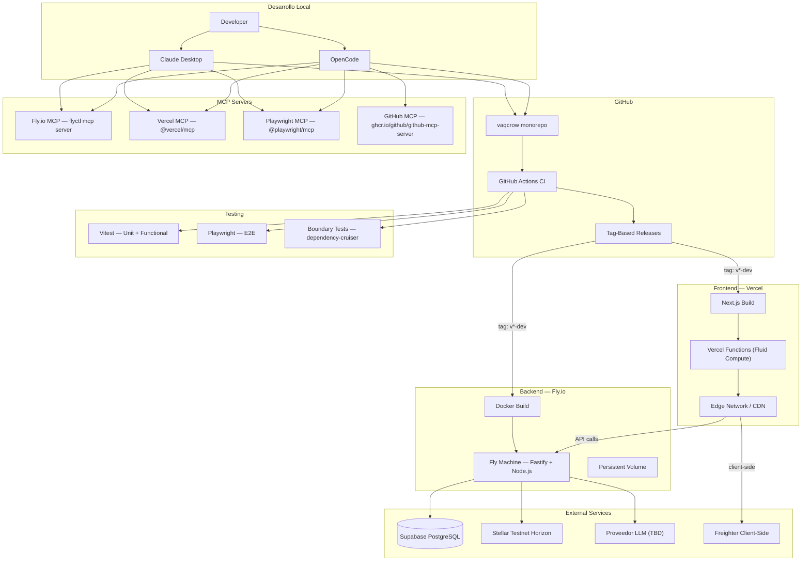
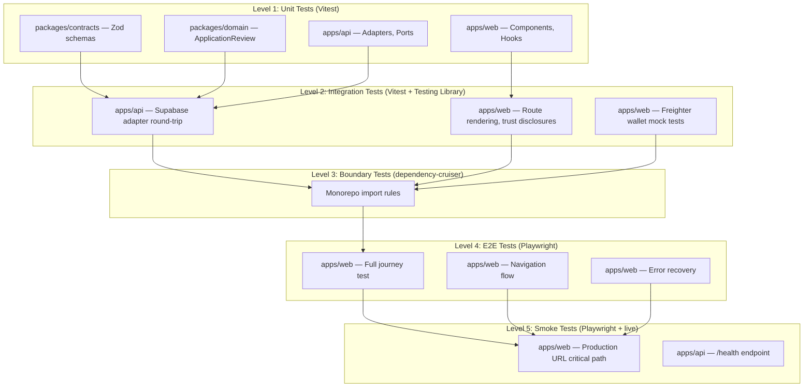
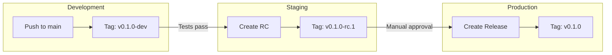

# Vaqcrow — Deploy Planning

> [!info] Objetivo
> Definir la arquitectura de despliegue, CI/CD, testing y herramientas MCP para la demo del TFM.

---

## 1. Arquitectura de despliegue

### Diagrama de componentes



### Decision: Despliegue split (no monolito)

> [!important] Recomendación: DESPLIEGUE SEPARADO
> Vercel para el frontend (`apps/web`), Fly.io para la API (`apps/api`).

| Criterio | Web (Vercel) | API (Fly.io) |
|---|---|---|
| Runtime | Serverless / Edge | Docker container |
| Escalado | Auto (Fluid compute) | Manual / Auto (Machines) |
| Framework | [[../web/README\|Next.js 16]] | [[../../apps/api/src/index.ts\|Fastify 5]] |
| Dependencias | `@vaqcrow/contracts` | `@vaqcrow/contracts`, `@vaqcrow/domain` |
| Variables de entorno | Solo las del BFF | Todas las del backend |
| Costo | Free tier (Hobby, sin costo) | Pay-as-you-go con crédito mensual (Fly.io eliminó el free tier incondicional en 2024) — verificar pricing actual antes de comprometer presupuesto |

> [!warning] Por qué NO un solo deploy
> - Vercel no soporta Fastify como server de larga ejecución
> - La API necesita persistencia de proceso (Horizon polling)
> - Los ciclos de deploy son diferentes: el web cambia por UI, la API por lógica de negocio
> - Rollback independiente: si un deploy de web rompe, la API sigue funcionando

---

## 2. Docker — API Backend

### Dockerfile

> [!note] Ubicación: `apps/api/Dockerfile`

```dockerfile
# apps/api/Dockerfile
FROM node:24-alpine AS base
RUN corepack enable && corepack prepare pnpm@11.27.0 --activate
WORKDIR /app

# Install dependencies
FROM base AS deps
COPY pnpm-workspace.yaml pnpm-lock.yaml package.json ./
COPY packages/contracts/package.json ./packages/contracts/
COPY packages/domain/package.json ./packages/domain/
COPY apps/api/package.json ./apps/api/
# apps/web/package.json también se copia aunque esta imagen no lo use:
# pnpm valida --frozen-lockfile contra TODOS los miembros del workspace
# declarados en pnpm-workspace.yaml, no solo los instalados.
COPY apps/web/package.json ./apps/web/
RUN pnpm install --frozen-lockfile

# Build packages
FROM base AS build
COPY --from=deps /app/node_modules ./node_modules
COPY --from=deps /app/packages/contracts/node_modules ./packages/contracts/node_modules
COPY --from=deps /app/packages/domain/node_modules ./packages/domain/node_modules
COPY --from=deps /app/apps/api/node_modules ./apps/api/node_modules
COPY tsconfig.base.json ./
COPY packages/contracts/ ./packages/contracts/
COPY packages/domain/ ./packages/domain/
COPY apps/api/ ./apps/api/
RUN pnpm --filter @vaqcrow/contracts build
RUN pnpm --filter @vaqcrow/domain build
RUN pnpm --filter @vaqcrow/api build

# Production image
FROM node:24-alpine AS production
RUN corepack enable && corepack prepare pnpm@11.27.0 --activate
WORKDIR /app

COPY --from=build /app/packages/contracts/dist ./packages/contracts/dist
COPY --from=build /app/packages/contracts/package.json ./packages/contracts/
COPY --from=build /app/packages/domain/dist ./packages/domain/dist
COPY --from=build /app/packages/domain/package.json ./packages/domain/
COPY --from=build /app/apps/api/dist ./apps/api/dist
COPY --from=build /app/apps/api/package.json ./apps/api/

# Real production-only install: la etapa `deps` instaló con devDependencies
# (las necesita el build de TypeScript), así que acá se reinstala desde cero
# con --prod en vez de copiar el node_modules de `deps` tal cual.
COPY pnpm-workspace.yaml pnpm-lock.yaml package.json ./
RUN pnpm install --frozen-lockfile --prod

EXPOSE 3000
ENV NODE_ENV=production
CMD ["node", "apps/api/dist/index.js"]
```

### fly.toml

> [!warning] Ubicación: `fly.toml` (raíz del monorepo, **no** `apps/api/fly.toml`)
> El `Dockerfile` usa rutas `COPY` relativas a la raíz del monorepo (`packages/contracts/...`, `apps/api/...`). Fly.io usa por defecto el directorio donde vive `fly.toml` como build context — si `fly.toml` quedara en `apps/api/`, esas rutas no existirían y el build fallaría en el primer deploy. Por eso `fly.toml` va en la raíz y `dockerfile` apunta hacia adentro de `apps/api/`.

```toml
# fly.toml (raíz del monorepo)
app = "vaqcrow-api"
primary_region = "eze"  # Buenos Aires — nearest a usuarios argentinos

[build]
  dockerfile = "apps/api/Dockerfile"
  build-target = "production"

[http_service]
  internal_port = 3000
  force_https = true
  auto_stop_machines = "stop"
  auto_start_machines = true
  min_machines_running = 0

  [http_service.concurrency]
    type = "connections"
    hard_limit = 25
    soft_limit = 20

  [[http_service.checks]]
    interval = "15s"
    timeout = "5s"
    grace_period = "10s"
    method = "GET"
    path = "/health"

[[vm]]
  memory = "512mb"
  cpu_kind = "shared"
  cpus = 1

[env]
  NODE_ENV = "production"
  PORT = "3000"

# Secrets (set via: fly secrets set KEY=VALUE)
# SUPABASE_URL
# SUPABASE_SERVICE_ROLE_KEY
# STELLAR_NETWORK_PASSPHRASE
# STELLAR_HORIZON_URL
# LLM_PROVIDER
# LLM_API_KEY
```

### .dockerignore

> [!note] Ubicación: `.dockerignore` (raíz del monorepo)

```dockerignore
# .dockerignore (raíz del monorepo)
node_modules
.next
.turbo
dist
.git
.github
*.md
!packages/*/README.md
.env*
!.env.example
```

---

## 3. Vercel — Frontend

### vercel.json

> [!note] Ubicación: `vercel.json` (raíz del monorepo)

```json
{
  "$schema": "https://openapi.vercel.sh/vercel.json",
  "buildCommand": "pnpm --filter @vaqcrow/web build",
  "outputDirectory": "apps/web/.next",
  "installCommand": "pnpm install --frozen-lockfile",
  "framework": "nextjs",
  "regions": ["iad1"],
  "env": {
    "NEXT_PUBLIC_API_URL": "^NEXT_PUBLIC_API_URL"
  }
}
```

### Configuración de proyecto en Vercel

> [!tip] Setup en Vercel Dashboard
> 1. Crear proyecto nuevo
> 2. Conectar con GitHub repo
> 3. Configurar variables de entorno

| Campo | Valor |
|---|---|
| **Project name** | `vaqcrow-web` |
| **Framework** | Next.js |
| **Root directory** | `/` (monorepo root) |
| **Build command** | `pnpm --filter @vaqcrow/web build` |
| **Output directory** | `apps/web/.next` |
| **Node.js version** | 24 |

### Variables de entorno (Vercel)

| Variable | Valor | Descripción |
|---|---|---|
| `NEXT_PUBLIC_API_URL` | `https://vaqcrow-api.fly.dev` | URL de la API en Fly.io |

---

## 4. MCP — Configuración para Claude Desktop y OpenCode

> [!info] ¿Qué son los MCP servers?
> Los Model Context Protocol servers permiten que Claude y OpenCode interactúen directamente con servicios de deployment, testing y gestión de código.

### 4.1 Fly.io MCP Server

**Propósito:** Gestionar la API en Fly.io desde el IDE (deploy, logs, secrets, status).

#### Instalación

```bash
# flyctl debe estar instalado
brew install flyctl

# Login
fly auth login

# Agregar MCP server a Claude Desktop
fly mcp server --claude --server flyctl
```

#### Claude Desktop — `claude_desktop_config.json`

```json
{
  "mcpServers": {
    "flyctl": {
      "command": "/opt/homebrew/bin/flyctl",
      "args": ["mcp", "server", "--server", "flyctl"]
    }
  }
}
```

#### OpenCode — `opencode.json`

```json
{
  "mcp": {
    "flyctl": {
      "command": "/opt/homebrew/bin/flyctl",
      "args": ["mcp", "server", "--server", "flyctl"]
    }
  }
}
```

#### Herramientas disponibles

| Tool | Descripción |
|---|---|
| `fly-apps-list` | Listar aplicaciones |
| `fly-apps-create` | Crear nueva app |
| `fly-machines-list` | Listar máquinas de una app |
| `fly-machines-status` | Estado de una máquina |
| `fly-secrets-list` | Listar secretos |
| `fly-secrets-set` | Establecer secretos |
| `fly-logs` | Ver logs de la aplicación |
| `fly-status` | Estado general de la app |

---

### 4.2 Vercel MCP Server

**Propósito:** Gestionar el frontend en Vercel desde el IDE (deploy, preview, logs).

#### Instalación

```bash
# Instalar Vercel CLI
npm i -g vercel

# Login
vercel login
```

#### Claude Desktop — `claude_desktop_config.json`

```json
{
  "mcpServers": {
    "vercel": {
      "command": "npx",
      "args": ["-y", "@vercel/mcp", "--token", "<VERCEL_TOKEN>"]
    }
  }
}
```

#### OpenCode — `opencode.json`

```json
{
  "mcp": {
    "vercel": {
      "command": "npx",
      "args": ["-y", "@vercel/mcp", "--token", "<VERCEL_TOKEN>"]
    }
  }
}
```

#### Herramientas disponibles

| Tool | Descripción |
|---|---|
| `list_projects` | Listar proyectos Vercel |
| `get_project` | Obtener detalles de un proyecto |
| `list_deployments` | Listar deployments recientes |
| `get_deployment` | Obtener estado de un deployment |
| `create_deployment` | Crear nuevo deployment |
| `rollback` | Rollback a deployment anterior |
| `view_logs` | Ver logs de un deployment |

---

### 4.3 Playwright MCP Server

**Propósito:** Automatizar testing E2E, inspeccionar DOM, generar tests.

#### Claude Desktop — `claude_desktop_config.json`

```json
{
  "mcpServers": {
    "playwright": {
      "command": "npx",
      "args": ["@playwright/mcp@latest"]
    }
  }
}
```

#### OpenCode — `opencode.json`

```json
{
  "mcp": {
    "playwright": {
      "command": "npx",
      "args": ["@playwright/mcp@latest"]
    }
  }
}
```

#### Herramientas disponibles

| Tool | Descripción |
|---|---|
| `browser_navigate` | Navegar a una URL |
| `browser_snapshot` | Obtener accessibility snapshot |
| `browser_click` | Hacer click en un elemento |
| `browser_type` | Escribir en un input |
| `browser_screenshot` | Tomar screenshot |
| `browser_evaluate` | Ejecutar JavaScript en el browser |

---

### 4.4 GitHub MCP Server

**Propósito:** Gestionar issues, PRs, y releases desde el IDE.

#### Claude Desktop — `claude_desktop_config.json`

```json
{
  "mcpServers": {
    "github": {
      "command": "docker",
      "args": [
        "run", "-i", "--rm",
        "-e", "GITHUB_PERSONAL_ACCESS_TOKEN",
        "ghcr.io/github/github-mcp-server"
      ],
      "env": {
        "GITHUB_PERSONAL_ACCESS_TOKEN": "<gh auth token>"
      }
    }
  }
}
```

#### OpenCode — `opencode.json`

```json
{
  "mcp": {
    "github": {
      "command": "docker",
      "args": [
        "run", "-i", "--rm",
        "-e", "GITHUB_PERSONAL_ACCESS_TOKEN",
        "ghcr.io/github/github-mcp-server"
      ],
      "env": {
        "GITHUB_PERSONAL_ACCESS_TOKEN": "<gh auth token>"
      }
    }
  }
}
```

---

### 4.5 Configuración completa — OpenCode (`opencode.json`)

> [!example] Configuración final de MCP para OpenCode
> Este es el `opencode.json` completo con los 4 MCP servers configurados.

```json
{
  "mcp": {
    "flyctl": {
      "command": "/opt/homebrew/bin/flyctl",
      "args": ["mcp", "server", "--server", "flyctl"]
    },
    "vercel": {
      "command": "npx",
      "args": ["-y", "@vercel/mcp", "--token", "<VERCEL_TOKEN>"]
    },
    "playwright": {
      "command": "npx",
      "args": ["@playwright/mcp@latest"]
    },
    "github": {
      "command": "docker",
      "args": [
        "run", "-i", "--rm",
        "-e", "GITHUB_PERSONAL_ACCESS_TOKEN",
        "ghcr.io/github/github-mcp-server"
      ],
      "env": {
        "GITHUB_PERSONAL_ACCESS_TOKEN": ""
      }
    }
  }
}
```

---

## 5. Arquitectura de Testing

### Diagrama de capas de testing



### Comandos de testing

> [!tip] Comandos útiles
> Todos los comandos se ejecutan desde la raíz del monorepo.

```bash
# === Unit + Functional (Vitest) ===
pnpm test                          # Todos los tests del monorepo
pnpm --filter @vaqcrow/contracts test   # Solo contratos
pnpm --filter @vaqcrow/domain test      # Solo dominio
pnpm --filter @vaqcrow/api test         # Solo API
pnpm --filter @vaqcrow/web test         # Solo web

# === Boundary Tests ===
pnpm boundaries                     # Verificar límites de importación
pnpm test:boundaries                # Tests de boundaries con Vitest

# === Verify (todo junto) ===
pnpm verify                         # lint + typecheck + test + build + boundaries

# === E2E (Playwright) ===
# Instalación inicial
pnpm --filter @vaqcrow/web exec playwright install

# Ejecución
pnpm --filter @vaqcrow/web exec playwright test                    # Todos
pnpm --filter @vaqcrow/web exec playwright test --grep "journey"   # Solo journey
pnpm --filter @vaqcrow/web exec playwright test --ui               # UI mode

# === Smoke (post-deploy) ===
pnpm --filter @vaqcrow/web exec playwright test --grep "smoke"     # Smoke tests
```

### Configuración Playwright

> [!note] Ubicación: `apps/web/playwright.config.ts`

```ts
// apps/web/playwright.config.ts
import { defineConfig } from "@playwright/test";

export default defineConfig({
  testDir: "./e2e",
  timeout: 30_000,
  retries: 2,
  use: {
    baseURL: process.env["BASE_URL"] ?? "http://localhost:3000",
    trace: "on-first-retry",
    screenshot: "only-on-failure",
  },
  projects: [
    {
      name: "chromium",
      use: { browserName: "chromium" },
    },
  ],
  webServer: process.env["CI"]
    ? undefined
    : {
        command: "pnpm --filter @vaqcrow/web dev",
        port: 3000,
        reuseExistingServer: true,
      },
});
```

### Tests E2E — Estructura

```
apps/web/e2e/
├── journey.spec.ts          # Journey completo: request → distribution
├── navigation.spec.ts       # Navegación entre pasos
├── error-recovery.spec.ts   # Manejo de errores y fallbacks
├── trust-disclosures.spec.ts # Disclosures de confianza en cada ruta
├── smoke.spec.ts            # Smoke tests para post-deploy
└── fixtures/
    └── panaderia.ts         # Datos de la PyME sintética
```

---

## 6. Tag-Based CI/CD con Environment Promotion

### Estrategia de tags

```bash
v<major>.<minor>.<patch>-<channel>

Canales:
  dev      → Desarrollo automático (push a main)
  rc.1     → Release candidate (opcional)
  (none)   → Producción (release manual)
```

### Ejemplos

| Tag | Acción | Deploy |
|---|---|---|
| `v0.1.0-dev` | CI completo + deploy dev | Web (Vercel preview) + API (Fly.io staging) |
| `v0.1.0-rc.1` | CI completo + deploy staging | Web (Vercel preview) + API (Fly.io staging) |
| `v0.1.0` | CI completo + deploy production | Web (Vercel prod) + API (Fly.io prod) |

### Flujo de promotion



### GitHub Actions — Workflows

> [!note] Ubicación: `.github/workflows/`

#### ci.yml — CI completo

```yaml
name: CI

on:
  push:
    branches: [main]
  pull_request:
    branches: [main]

permissions:
  contents: read

jobs:
  lint:
    name: Lint
    runs-on: ubuntu-latest
    steps:
      - uses: actions/checkout@v4
      - uses: pnpm/action-setup@v4
        with:
          version: 11
      - uses: actions/setup-node@v4
        with:
          node-version: 24
          cache: pnpm
      - run: pnpm install --frozen-lockfile
      - run: pnpm lint

  typecheck:
    name: Typecheck
    runs-on: ubuntu-latest
    steps:
      - uses: actions/checkout@v4
      - uses: pnpm/action-setup@v4
        with:
          version: 11
      - uses: actions/setup-node@v4
        with:
          node-version: 24
          cache: pnpm
      - run: pnpm install --frozen-lockfile
      - run: pnpm build
      - run: pnpm typecheck

  test:
    name: Unit + Functional Tests
    runs-on: ubuntu-latest
    steps:
      - uses: actions/checkout@v4
      - uses: pnpm/action-setup@v4
        with:
          version: 11
      - uses: actions/setup-node@v4
        with:
          node-version: 24
          cache: pnpm
      - run: pnpm install --frozen-lockfile
      - run: pnpm build
      - run: pnpm test

  boundaries:
    name: Boundary Tests
    runs-on: ubuntu-latest
    steps:
      - uses: actions/checkout@v4
      - uses: pnpm/action-setup@v4
        with:
          version: 11
      - uses: actions/setup-node@v4
        with:
          node-version: 24
          cache: pnpm
      - run: pnpm install --frozen-lockfile
      - run: pnpm build
      - run: pnpm boundaries
      - run: pnpm test:boundaries

  build:
    name: Build
    runs-on: ubuntu-latest
    steps:
      - uses: actions/checkout@v4
      - uses: pnpm/action-setup@v4
        with:
          version: 11
      - uses: actions/setup-node@v4
        with:
          node-version: 24
          cache: pnpm
      - run: pnpm install --frozen-lockfile
      - run: pnpm build

  e2e:
    name: E2E Tests
    runs-on: ubuntu-latest
    needs: [build]
    steps:
      - uses: actions/checkout@v4
      - uses: pnpm/action-setup@v4
        with:
          version: 11
      - uses: actions/setup-node@v4
        with:
          node-version: 24
          cache: pnpm
      - run: pnpm install --frozen-lockfile
      - run: pnpm build
      - name: Install Playwright browsers
        run: pnpm --filter @vaqcrow/web exec playwright install --with-deps chromium
      - name: Run E2E tests
        run: pnpm --filter @vaqcrow/web exec playwright test
        env:
          BASE_URL: http://localhost:3000
      - name: Upload Playwright report
        if: always()
        uses: actions/upload-artifact@v4
        with:
          name: playwright-report
          path: apps/web/playwright-report/
          retention-days: 7
```

#### deploy-dev.yml — Deploy automático a dev

```yaml
name: Deploy Dev

on:
  push:
    tags:
      - "v*-dev"

permissions:
  contents: read
  deployments: write

jobs:
  deploy-web:
    name: Deploy Web → Vercel
    runs-on: ubuntu-latest
    steps:
      - uses: actions/checkout@v4
      - uses: pnpm/action-setup@v4
        with:
          version: 11
      - uses: actions/setup-node@v4
        with:
          node-version: 24
          cache: pnpm
      - run: pnpm install --frozen-lockfile
      - name: Deploy to Vercel (preview)
        run: vercel --yes --token "${{ secrets.VERCEL_TOKEN }}"
        env:
          VERCEL_ORG_ID: ${{ secrets.VERCEL_ORG_ID }}
          VERCEL_PROJECT_ID: ${{ secrets.VERCEL_PROJECT_ID }}

  deploy-api:
    name: Deploy API → Fly.io
    runs-on: ubuntu-latest
    steps:
      - uses: actions/checkout@v4
      - uses: superfly/flyctl-actions/setup-flyctl@master
      - name: Deploy to Fly.io
        run: flyctl deploy --config fly.toml --app vaqcrow-api-dev
        env:
          FLY_API_TOKEN: ${{ secrets.FLY_API_TOKEN }}

  smoke-tests:
    name: Smoke Tests
    runs-on: ubuntu-latest
    needs: [deploy-web, deploy-api]
    steps:
      - uses: actions/checkout@v4
      - uses: pnpm/action-setup@v4
        with:
          version: 11
      - uses: actions/setup-node@v4
        with:
          node-version: 24
          cache: pnpm
      - run: pnpm install --frozen-lockfile
      - name: Install Playwright
        run: pnpm --filter @vaqcrow/web exec playwright install --with-deps chromium
      - name: Run smoke tests against deployed URLs
        run: pnpm --filter @vaqcrow/web exec playwright test --grep "smoke"
        env:
          BASE_URL: ${{ vars.VERCEL_PREVIEW_URL }}
          API_URL: https://vaqcrow-api-dev.fly.dev
```

#### deploy-production.yml — Deploy a producción

```yaml
name: Deploy Production

on:
  push:
    tags:
      - "v[0-9]+.[0-9]+.[0-9]+"

permissions:
  contents: write
  deployments: write

jobs:
  deploy-web:
    name: Deploy Web → Vercel (production)
    runs-on: ubuntu-latest
    steps:
      - uses: actions/checkout@v4
      - uses: pnpm/action-setup@v4
        with:
          version: 11
      - uses: actions/setup-node@v4
        with:
          node-version: 24
          cache: pnpm
      - run: pnpm install --frozen-lockfile
      - name: Deploy to Vercel (production)
        run: vercel --yes --prod --token "${{ secrets.VERCEL_TOKEN }}"
        env:
          VERCEL_ORG_ID: ${{ secrets.VERCEL_ORG_ID }}
          VERCEL_PROJECT_ID: ${{ secrets.VERCEL_PROJECT_ID }}

  deploy-api:
    name: Deploy API → Fly.io (production)
    runs-on: ubuntu-latest
    steps:
      - uses: actions/checkout@v4
      - uses: superfly/flyctl-actions/setup-flyctl@master
      - name: Deploy to Fly.io
        run: flyctl deploy --config fly.toml --app vaqcrow-api
        env:
          FLY_API_TOKEN: ${{ secrets.FLY_API_TOKEN }}

  smoke-tests:
    name: Smoke Tests (production)
    runs-on: ubuntu-latest
    needs: [deploy-web, deploy-api]
    steps:
      - uses: actions/checkout@v4
      - uses: pnpm/action-setup@v4
        with:
          version: 11
      - uses: actions/setup-node@v4
        with:
          node-version: 24
          cache: pnpm
      - run: pnpm install --frozen-lockfile
      - name: Install Playwright
        run: pnpm --filter @vaqcrow/web exec playwright install --with-deps chromium
      - name: Run smoke tests
        run: pnpm --filter @vaqcrow/web exec playwright test --grep "smoke"
        env:
          BASE_URL: ${{ vars.VERCEL_PRODUCTION_URL }}
          API_URL: https://vaqcrow-api.fly.dev

  release:
    name: Create GitHub Release
    runs-on: ubuntu-latest
    needs: [smoke-tests]
    steps:
      - uses: actions/checkout@v4
      - name: Create Release
        uses: softprops/action-gh-release@v2
        with:
          generate_release_notes: true
```

---

## 7. Secretos y Variables de Entorno

### Fly.io (API)

> [!warning] Secretos
> Nunca commitear secretos. Usar `fly secrets set` para configurarlos.

```bash
# Development
fly secrets set --app vaqcrow-api-dev \
  SUPABASE_URL="https://xxx.supabase.co" \
  SUPABASE_SERVICE_ROLE_KEY="eyJ..." \
  STELLAR_NETWORK_PASSPHRASE="Test SDF Network ; September 2015" \
  STELLAR_HORIZON_URL="https://horizon-testnet.stellar.org" \
  LLM_PROVIDER="openai" \
  LLM_API_KEY="sk-..."

# Production
fly secrets set --app vaqcrow-api \
  SUPABASE_URL="https://xxx.supabase.co" \
  SUPABASE_SERVICE_ROLE_KEY="eyJ..." \
  STELLAR_NETWORK_PASSPHRASE="Test SDF Network ; September 2015" \
  STELLAR_HORIZON_URL="https://horizon-testnet.stellar.org" \
  LLM_PROVIDER="openai" \
  LLM_API_KEY="sk-..."
```

### Vercel (Web)

```bash
# Via Vercel CLI
vercel env add NEXT_PUBLIC_API_URL preview
# Valor: https://vaqcrow-api-dev.fly.dev

vercel env add NEXT_PUBLIC_API_URL production
# Valor: https://vaqcrow-api.fly.dev
```

### GitHub Secrets

| Secret | Uso |
|---|---|
| `VERCEL_TOKEN` | Token de Vercel para deploy |
| `VERCEL_ORG_ID` | ID de la organización Vercel |
| `VERCEL_PROJECT_ID` | ID del proyecto Vercel |
| `FLY_API_TOKEN` | Token de Fly.io para deploy |

---

## 8. Checklist de implementación

> [!todo] Fase 1: Fundación (Semanas 1-2)
> - [ ] Crear `apps/api/Dockerfile` (multi-stage build)
> - [ ] Crear `fly.toml` en la **raíz** del monorepo (no en `apps/api/`) — ver nota de contexto de build en §2
> - [ ] Implementar endpoint `GET /health` en `apps/api` (lo requieren el health check de `fly.toml` y los smoke tests de nivel 5)
> - [ ] Probar el build de Docker localmente (`docker build -f apps/api/Dockerfile .` desde la raíz) antes del primer `fly deploy`, para confirmar que `pnpm install --frozen-lockfile` no falla por miembros del workspace faltantes
> - [ ] Crear `.dockerignore` en la raíz
> - [ ] Crear `vercel.json` en la raíz
> - [ ] Configurar proyecto en Vercel (vaqcrow-web)
> - [ ] Crear app en Fly.io (`fly launch --no-deploy`) y confirmar el pricing/plan actual antes de comprometer presupuesto
> - [ ] Configurar GitHub Secrets (VERCEL_TOKEN, FLY_API_TOKEN, etc.)
> - [ ] Configurar variables de entorno en Vercel

> [!todo] Fase 2: CI/CD (Semanas 2-3)
> - [ ] Crear `.github/workflows/ci.yml`
> - [ ] Crear `.github/workflows/deploy-dev.yml`
> - [ ] Crear `.github/workflows/deploy-production.yml`
> - [ ] Probar CI en primer PR
> - [ ] Probar deploy dev con tag `v0.1.0-dev`

> [!todo] Fase 3: Testing (Semanas 3-4)
> - [ ] Instalar Playwright (`pnpm --filter @vaqcrow/web exec playwright install`)
> - [ ] Crear `apps/web/playwright.config.ts`
> - [ ] Crear tests E2E en `apps/web/e2e/`
> - [ ] Crear smoke tests para post-deploy
> - [ ] Integrar E2E en CI workflow

> [!todo] Fase 4: MCP (Semanas 2-3)
> - [ ] Configurar Fly.io MCP en Claude Desktop y OpenCode
> - [ ] Configurar Vercel MCP en Claude Desktop y OpenCode
> - [ ] Configurar Playwright MCP en Claude Desktop y OpenCode
> - [ ] Configurar GitHub MCP en Claude Desktop y OpenCode
> - [ ] Probar cada MCP server

> [!todo] Fase 5: Demo (Semana 4)
> - [ ] Deploy completo a dev
> - [ ] Ejecutar smoke tests
> - [ ] Ejecutar journey E2E completo
> - [ ] Documentar URLs y credenciales para el tribunal
> - [ ] Preparar runbook de la demo

---

## 9. URLs de referencia

| Servicio | Development | Production |
|---|---|---|
| Web (Vercel) | `vaqcrow-web-<hash>.vercel.app` | `vaqcrow-web.vercel.app` |
| API (Fly.io) | `vaqcrow-api-dev.fly.dev` | `vaqcrow-api.fly.dev` |
| Supabase | `xxx.supabase.co` | `xxx.supabase.co` (mismo) |
| Stellar Horizon | `horizon-testnet.stellar.org` | `horizon-testnet.stellar.org` |

---

## 10. Decisiones pendientes

> [!question] Decisiones a tomar
>
> | Decisión | Opciones | Recomendación |
> |---|---|---|
> | Región Fly.io | `eze` (Buenos Aires) vs `iad` (Virginia) | `eze` — más cercano a usuarios argentinos |
> | Proveedor LLM | OpenAI vs Anthropic vs local | OpenAI para la demo (costo/beneficio) |
> | Supabase plan | Free vs Pro | Free para la demo |
> | Playwright browsers | Solo Chromium vs multi-browser | Solo Chromium para la demo |
