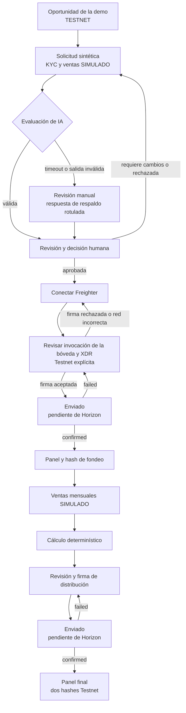
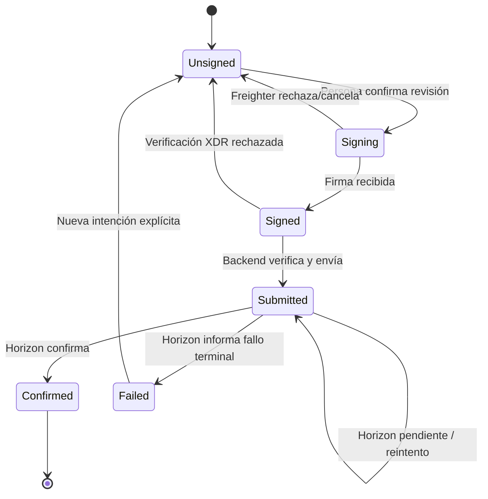

# Vaqcrow — Diseño de experiencia para la demo en Stellar Testnet

Este documento convierte el plan de la demo en un sistema visual y de interacción ejecutable para una única demostración de 5–7 minutos. Prioriza comprensión, trazabilidad y confianza: cada persona debe distinguir en todo momento qué es simulado, qué ocurre realmente en Stellar Testnet y qué decisión conserva control humano.

> **Fuente de alcance:** [Plan de la demo](../planning/DEMO.md). Esta especificación desarrolla su historia vertical, sus límites de confianza y su sistema visual; el alcance de superficie de producto ya no se limita a seis pantallas (ver sección 1 y sección 4).

> **Estado de Google Stitch MCP — conectado.** Stitch está configurado como servidor MCP con alcance de proyecto en `.mcp.json` (Claude Code), autenticado mediante `X-Goog-Api-Key` interpolado desde `STITCH_API_KEY`. El proyecto real `VaqcrowWebApp` (ID `5439082704079758723`) ya existe en Stitch y tiene un ledger canónico de 19 flujos de producto completos en escritorio, cada uno con variante Light y Dark (38 pantallas canónicas), más 6 generaciones de marca/logo. Para el flujo 19 están visibles las dos pantallas canónicas —Light `9184aabe0b3a4262b51893198c3c045e` y Dark `3d81c0bf51d64d90be76c9c82deff6fa`— y una pantalla Light duplicada adicional (`1c94354c1625445988a50ecc2a77b4b3`), excluida del ledger y pendiente de ocultarse, eliminarse o reconciliarse. Las dos instancias históricas ocultas ajenas a Vaqcrow también se excluyen, por separado, de ese conteo. Este documento ya no describe una configuración pendiente: describe el inventario canónico, verificado mediante `mcp__stitch__list_screens`, y el trabajo pendiente sobre el estado visible del proyecto (ver sección 11.9).

> **Identidad aprobada, archivo fuente pendiente.** La marca usa un isotipo geométrico/angular de cabeza de toro. La referencia visual provista está aprobada, pero este documento no afirma que exista un SVG o PNG versionado en el repositorio. Debe incorporarse un archivo fuente autorizado antes de implementarlo y antes de generar en Stitch si la herramienta exige un asset.

## Ruta rápida de uso

1. Confirmar únicamente los TBD operativos reales de la sección 15; tema e identidad visual ya están decididos.
2. Incorporar el SVG/PNG fuente autorizado del isotipo si la generación requiere un archivo y siempre antes de implementación.
3. Partir del inventario real ya existente en el proyecto Stitch `VaqcrowWebApp` (sección 11.6): 19 flujos × Light/Dark en escritorio, ya generados.
4. Generar las variantes MOBILE faltantes para los 19 flujos (0 de las 38 pantallas canónicas tienen hoy contraparte móvil) y resolver las anomalías señaladas en la sección 11.9 (pantallas "Identical", pantalla "Updated", duplicado Light visible del flujo 19 y dos instancias históricas ocultas ajenas al proyecto).
5. Mapear cada flujo aprobado a una ruta Next.js (sección 4) y aplicar el gate de la sección 11.5 antes de dar por cerrada una pantalla.
6. Mantener el ledger de la sección 11.6 como fuente de verdad de IDs reales; no reintroducir marcadores `<PLACEHOLDER>`.
7. Extender las especificaciones detalladas de la sección 8 —hoy limitadas a la narrativa original de 6 pantallas— a las áreas nuevas (marketplace, admin, billetera, etc.) y validar el recorrido ampliado con accesibilidad, estados reales y evidencia Playwright.

## Resumen de decisiones

El stack siguiente está confirmado como dirección de implementación; su presencia aquí no afirma que cada dependencia ya esté instalada o configurada.

| Tema | Decisión |
|---|---|
| Alcance | Producto completo: marketplace con múltiples PyMEs, registro y tokenización de PyME, portafolio, billetera, informes, notificaciones, centro de ayuda, guías, panel de administración, página Acerca de Vaqcrow y la historia vertical original de una PyME sintética. El inventario real ya cubre 19 flujos de producto en Stitch (`VaqcrowWebApp`). |
| Idioma de interfaz | Español neutral, apropiado para personas usuarias de Argentina y sin coloquialismos. |
| Estilo | Fintech moderna y confiable: data-forward, precisa, sobria, con superficies limpias, jerarquía fuerte, densidad controlada y microinteracciones discretas. |
| Color | Morado `#8A05BE` como acento intencional; paletas clara y oscura exactas, sin reemplazos. |
| Temas | Claro y oscuro son entregables obligatorios en diseño, generación, aprobación, implementación y QA; `Sistema` sigue la preferencia del dispositivo. |
| Identidad | Isotipo aprobado de cabeza de toro geométrica/angular; morado sobre claro y blanco sobre oscuro o morado. El archivo fuente aún debe incorporarse al repositorio. |
| Confianza | Estado `TESTNET` persistente, `SIMULADO` junto a cada dato sintético, IA consultiva y confirmación asíncrona explícita. |
| Wallet | Freighter conecta y firma de forma no custodial; Vaqcrow nunca solicita ni almacena seeds. |
| Diseño responsivo | Por cada ruta se aprueba el par claro/oscuro de escritorio y luego el par claro/oscuro móvil, sin recortar contenido ni reglas de confianza. |
| Componentes y estilo | [HeroUI](https://www.heroui.com/) aporta primitivas accesibles; [Tailwind CSS](https://tailwindcss.com/) centraliza tema y tokens, sin constantes visuales locales por feature; [React Icons](https://react-icons.github.io/react-icons/icons/io5/) `io5` es el set de iconos elegido y nunca comunica significado crítico sin texto y semántica accesible. |
| Datos y formularios | [Axios](https://www.axios.com/) es transporte HTTP detrás de puertos/adaptadores; [SWR](https://swr.vercel.app/) orquesta estado de servidor y revalidación mediante fetchers de aplicación/adaptador; [React Hook Form](https://react-hook-form.com/) gestiona estado de formulario en navegador, sin decidir reglas de negocio. |
| Estado y pruebas | [Zustand](https://zustand.docs.pmnd.rs/learn/getting-started/introduction) conserva solo estado de workflow cliente entre rutas, sin duplicar SWR ni estado autoritativo del backend; [Playwright](https://playwright.dev/) cubre smoke/E2E determinísticos con fixtures o dobles locales. |
| Stitch | [`VaqcrowWebApp`](https://stitch.withgoogle.com/projects/5439082704079758723) (ID `5439082704079758723`) es la referencia visual y de sistema de diseño; el HTML generado nunca es implementación autoritativa de producción. |
| Autenticación | La demo mantiene identidad sintética. [Auth.js v5](https://authjs.dev/) queda planificado en [#134](https://github.com/reyduar/Vaqcrow/issues/134) como límite futuro de autenticación/sesión, dependiente de #14 y fuera del camino crítico acotado. |

---

## 1. Objetivo de diseño y promesa de la demo

### Objetivo

Servir a un tribunal evaluador (TFM del Máster en Desarrollo con IA), potenciales inversores y al equipo operador con una experiencia que demuestre, sin ambigüedad, la plataforma Vaqcrow completa: un marketplace de financiamiento de revenue share para múltiples PyMEs argentinas sintéticas, con onboarding, KYC, registro y tokenización de PyME, evaluación explicable, aprobación humana, firma no custodial, fondeo Testnet, cálculo determinístico, distribución Testnet, portafolio, billetera, informes, panel de administración y evidencia final. La historia vertical de una sola PyME (Panadería Horizonte SRL, sección 8) sigue siendo el recorrido guiado de referencia dentro de ese producto más amplio, no el límite del producto.

### Comprensión obligatoria en 30 segundos

Al abrir la experiencia, una persona debe entender:

1. Vaqcrow presenta una **demo**, no una oferta financiera habilitada.
2. La empresa, el KYC/KYB, las ventas y la conversión ARS/activo Stellar son **datos simulados**.
3. La evaluación de IA es real y explicable, pero **no aprueba ni mueve fondos**.
4. Las firmas se realizan con Freighter de forma **no custodial**.
5. Los movimientos visibles usan activos sin valor económico en **Stellar Testnet**.
6. Durante la campaña, los aportes los **custodia el contrato** de la bóveda: ninguna persona, ni Vaqcrow ni la PyME, tiene una clave para moverlos.

### Promesa observable

> Una sola historia demuestra cómo evidencia sintética puede convertirse en una recomendación auditable, una decisión humana y dos transacciones reales en Testnet —fondeo y distribución— con estados asíncronos, hashes y enlaces al explorador.

### Fuera de alcance

- Operación con dinero real o Stellar Public Network.
- Afirmaciones regulatorias, legales, de solvencia o rentabilidad.
- Aprobación autónoma por IA.
- Autenticación y perfiles de producción (login real, recuperación de contraseña y sesión persistente): la demo conserva identidad sintética; Auth.js v5 se planifica por separado en [#134](https://github.com/reyduar/Vaqcrow/issues/134), fuera del camino crítico salvo promoción explícita de alcance.
- Soroban, salvo que exista como extensión posterior independiente del diseño base.

El marketplace con múltiples PyMEs, filtros avanzados y el panel de administración **ya no están fuera de alcance**: están diseñados en Stitch (sección 4, sección 11.6) y son parte del producto completo descrito en el Objetivo. Persisten fuera de alcance únicamente los puntos listados arriba.

## 2. Reglas de confianza no negociables

Estas reglas prevalecen sobre cualquier preferencia visual o simplificación de demo.

| Regla | Aplicación en interfaz | Criterio de rechazo |
|---|---|---|
| Testnet persistente | Badge `TESTNET` en encabezado fijo y contexto de red en cada revisión/transacción. | Una pantalla transaccional no indica la red o parece operar con dinero real. |
| Simulación explícita | Badge `SIMULADO` contiguo al origen sintético; banner en solicitud y panel. | La etiqueta depende de tooltip, color, pie de página o explicación oral. |
| IA consultiva | Copia visible: “La IA recomienda; una persona decide”. Acción humana separada y atribuida. | Un botón, estado o frase implica aprobación automática. |
| Custodia | Antes de conectar y firmar: “Freighter firma; Vaqcrow nunca recibe tu seed”. Durante la campaña, los aportes los custodia el contrato de la bóveda, no una persona. | Se pide una seed, clave privada o permiso ambiguo; o se sugiere que la persona custodia los fondos durante la campaña. |
| Pendiente no es confirmado | `Enviado`/`Pendiente de confirmación` nunca usa iconografía o tono de éxito. | La respuesta de envío se muestra como liquidación final. |
| Sin garantías | Usar “estimado”, “simulado” y “riesgo”; nunca “ganancia segura” o equivalentes. | Se promete retorno, aprobación, solvencia o disponibilidad productiva. |
| Real versus simulado | Cada evidencia y movimiento declara su naturaleza en el punto de decisión. | La persona debe inferir qué parte es real. |
| Trazabilidad | Actor, fecha, regla/modelo, correlation ID, hash y fuente visibles cuando correspondan. | Una decisión o transacción crítica carece de referencia verificable. |

**Disclosures canónicos, sin abreviación en puntos críticos:**

> **Demostración con datos simulados.** La identidad, el KYC/KYB, las ventas y la conversión ARS/activo Stellar de este caso son sintéticos. No representan verificaciones ni movimientos de dinero real.

> **Stellar Testnet.** Las transacciones mostradas usan activos sin valor económico en Stellar Testnet. Un hash de Testnet demuestra ejecución técnica, no una inversión real ni disponibilidad en producción.

> **Firma no custodial.** Freighter es la wallet e interfaz de firma. La persona usuaria conserva sus claves; Vaqcrow construye y verifica la transacción y nunca recibe su seed.

> **Custodia por contrato.** Durante la campaña, los aportes los custodia el contrato, no una persona: nadie tiene una clave para moverlos. El contrato sólo puede pagar al destino fijo definido al abrir la bóveda, y ese destino es inmutable. La meta la evalúa el contrato sobre el ledger y, al alcanzarla, liquida a la PyME en la misma transacción. No hay recuperación ni clawback: no existe forma de revertir un pago ya liquidado, y los fondos que nadie reclame sólo pueden salir por el barrido; si no, pueden quedarse en el contrato. El reembolso por vencimiento no se dispara solo: exige que alguien envíe la transacción, y es permissionless porque el destino ya está fijado.

> **IA con supervisión humana.** La IA organiza evidencia, identifica anomalías y propone una evaluación explicable. No inventa datos, no toma la decisión final, no calcula obligaciones financieras y no transfiere fondos.

> **No apto para producción.** Esta demo no constituye una oferta de inversión, recomendación financiera, aprobación regulatoria ni prueba de legalidad, rentabilidad, solvencia, custodia, calidad de proveedores u operación en Argentina.

## 3. Personas y trabajos por realizar

Las personas describen roles de la demo, no segmentos validados de producción.

| Persona | Objetivo durante la demo | Preguntas que debe resolver | Riesgo de UX |
|---|---|---|---|
| Inversor de demostración | Evaluar la oportunidad sintética, conectar Freighter, revisar y firmar el fondeo Testnet. | ¿Qué evidencia respalda el riesgo? ¿Qué firmo? ¿La red y el monto son correctos? | Confundir estimaciones con garantías o `submitted` con `confirmed`. |
| PyME sintética: Panadería Horizonte SRL | Presentar evidencia simulada y firmar la distribución Testnet derivada de ventas mensuales simuladas. | ¿Qué dato falta? ¿Cómo se calculó la obligación? ¿Qué distribución firmo? | Creer que KYC, ventas o aprobación son reales. |
| Operador | Revisar la recomendación de IA, anomalías y faltantes; registrar la decisión humana. | ¿Qué afirmó la IA? ¿Qué evidencia cita? ¿Qué debo justificar? | Aprobar por inercia o no diferenciar evidencia de inferencia. |
| Evaluador/observador | Comprender la arquitectura de confianza y verificar evidencia sin completar tareas secundarias. | ¿Qué es real? ¿Qué es simulado? ¿Dónde está el control humano? | Perder el hilo por navegación extensa o detalles prematuros. |

### Jobs-to-be-done acotados

- **Cuando** observo la oportunidad, **quiero** conocer sus límites y evidencia, **para** decidir si continúo con la demo sin interpretar que es una oferta real.
- **Cuando** reviso la evaluación, **quiero** rastrear cada afirmación a datos concretos, **para** tomar una decisión humana informada.
- **Cuando** firmo, **quiero** comprobar red, cuenta, activo, monto, destino y memo, **para** mantener control no custodial.
- **Cuando** una transacción fue enviada, **quiero** ver su avance y resultado de Horizon, **para** no confundir aceptación con confirmación.
- **Cuando** observo la distribución, **quiero** ver entradas, regla, redondeo y hash, **para** comprobar que el LLM no calculó ni movió fondos.

## 4. Arquitectura de información y mapa de pantallas

> **Alcance ampliado.** El mapa original de seis pantallas (`/demo`, `/demo/solicitud`, `/demo/evaluacion`, `/demo/invertir`, `/demo/transacciones/[intentId]`, `/demo/panel`) describía únicamente la historia vertical de una sola PyME. El inventario real en Stitch (proyecto `VaqcrowWebApp`, sección 11.6) ya cubre 19 flujos de producto que constituyen el producto completo. Las seis rutas originales se conservan como alias/heredadas donde el mapeo es directo (marcado abajo) y siguen siendo el recorrido guiado detallado en la sección 8; el resto son rutas nuevas propuestas.

### Mapa completo (19 flujos reales, agrupados por área)

| # | Flujo Stitch | Ruta Next.js propuesta | Actor principal | Resultado de la etapa |
|---:|---|---|---|---|
| **Onboarding y acceso** | | | | |
| 1 | Onboarding | `/onboarding` | Persona nueva | Entiende la propuesta de valor y crea/activa su cuenta. |
| 2 | Onboarding PyME: KYC | `/onboarding/pyme/kyc` | PyME | Completa KYC/KYB simulado para poder registrar su PyME. |
| **Landing y marketplace** | | | | |
| 3 | Landing Page | `/` | Visitante / inversor | Entiende la propuesta general y navega a marketplace u onboarding. |
| 4 | Marketplace de PyMEs | `/marketplace` | Inversor | Explora múltiples oportunidades de PyMEs sintéticas. |
| 5 | Marketplace con Filtros Avanzados | `/marketplace` (modo filtros avanzados) | Inversor | Acota oportunidades por sector, riesgo, monto u otros criterios. |
| **PyME: registro, detalle, tokenización** | | | | |
| 6 | Registro de PyME | `/demo/solicitud` *(ruta heredada; alias `/pyme/registro`)* | PyME | Envía solicitud y evidencia simulada de su negocio. |
| 7 | Detalle de PyME | `/marketplace/[pymeId]` | Inversor / evaluador | Revisa evidencia, riesgo y evaluación de una PyME puntual. |
| 8 | Tokenización de PyME | `/marketplace/[pymeId]/tokenizacion` | PyME / operador | Define y visualiza la tokenización del financiamiento. |
| **Portafolio, billetera, informes** | | | | |
| 9 | Portafolio | `/demo/panel` *(ruta heredada; alias `/portafolio`)* | Inversor / PyME | Audita cálculo, firma distribución y verifica hashes de sus posiciones. |
| 10 | Billetera | `/demo/invertir` *(ruta heredada; alias `/billetera`)* | Inversor / PyME | Conecta Freighter, revisa saldo Testnet y firma sin custodia. |
| 11 | Informes | `/informes` | Inversor / PyME / evaluador | Consulta reportes agregados de actividad y desempeño simulado. |
| **Soporte y notificaciones** | | | | |
| 12 | Notificaciones (Accordion) | `/notificaciones` | Cualquier persona autenticada | Revisa avisos de estado, cambios y confirmaciones. |
| 13 | Centro de Ayuda | `/ayuda` | Cualquier persona | Resuelve dudas frecuentes sobre la demo y el producto. |
| 14 | Guía de Inversión | `/guias/inversion` | Inversor | Entiende cómo evaluar e invertir en una PyME sintética. |
| 15 | Guía para Emprendedores | `/guias/emprendedores` | PyME | Entiende cómo registrar y financiar su PyME sintética. |
| **Administración** | | | | |
| 16 | Admin — Gestión de PyMEs | `/admin/pymes` | Operador/admin | Administra el catálogo de PyMEs registradas. |
| 17 | Admin — Revisión de Solicitud | `/demo/evaluacion` *(ruta heredada; alias `/admin/solicitudes/[solicitudId]`)* | Operador | Obtiene evaluación estructurada de IA y registra aprobación humana. |
| 18 | Admin — Usuarios | `/admin/usuarios` | Operador/admin | Administra personas usuarias y roles. |
| **Institucional** | | | | |
| 19 | Acerca de Vaqcrow | `/acerca-de` | Visitante | Consulta la misión, visión, pilares de valor y presentación del creador del proyecto. |

`/demo/transacciones/[intentId]` (estado asíncrono de transacción) se conserva como patrón de estado compartido —reutilizado desde Billetera, Portafolio y Tokenización— sin ser todavía un flujo propio en el inventario Stitch; no se agrega una ruta por cada estado interno: wallet, XDR, aprobación y distribución siguen usando paneles, diálogos o drawers dentro de estas pantallas, con URL/estado recuperable cuando corresponda.

Las especificaciones detalladas de la sección 8 hoy solo cubren las seis rutas heredadas (la historia vertical original); los 13 flujos restantes están diseñados en Stitch pero no tienen todavía su ficha de especificación equivalente (ver nota al inicio de la sección 8 y sección 11.9).

### Navegación global

- Encabezado fijo: marca Vaqcrow, badge `DEMO`, badge `TESTNET` y, dentro del recorrido guiado heredado (sección 8), nombre del caso y progreso `Paso n de 6`. Fuera de ese recorrido (marketplace, admin, informes, etc.) el encabezado conserva marca y badges sin el stepper de 6 pasos.
- Navegación primaria del producto completo: `Marketplace`, `Portafolio`, `Billetera`, `Informes`, `Ayuda`; el recorrido guiado heredado usa su propia subnavegación `Caso`, `Evaluación`, `Fondeo`, `Evidencia`. El panel de administración usa una navegación separada (`Gestión de PyMEs`, `Solicitudes`, `Usuarios`).
- Acceso secundario: selector de tema `Claro` / `Oscuro` / `Sistema`, estado de Freighter, notificaciones y `ID de demo`.
- Pie de página: disclosure “No apto para producción” y enlace interno a límites de la demo.
- En móvil, navegación primaria colapsada; `TESTNET` y el paso actual (cuando aplica) permanecen visibles.

### Flujo de usuario

> El diagrama siguiente describe únicamente la historia vertical original (las seis rutas heredadas, sección 8). Los 13 flujos nuevos (marketplace, admin, billetera, informes, ayuda, guías, notificaciones, onboarding y Acerca de Vaqcrow) todavía no tienen su propio diagrama de estados; es un pendiente de la sección 11.9.



## 5. Sistema de identidad visual

### 5.1 Personalidad de marca

**Atributos:** clara, rigurosa, contemporánea, humana, verificable y serena. El diseño transmite control y transparencia, no euforia financiera.

**Principios visuales:**

- Jerarquía fuerte mediante escala tipográfica, peso y espacio, no mediante exceso de color.
- El morado destaca una decisión o foco por vista, no decora toda la interfaz.
- Los datos críticos se presentan con etiqueta, valor, origen y estado.
- Las superficies redondeadas agrupan información; no convierten cada texto en una tarjeta.
- La composición es **data-forward**: cifras, procedencia, estado y evidencia se escanean antes que la decoración.
- La densidad es controlada: resúmenes compactos conducen a detalle progresivo sin vaciar la pantalla ni convertirla en un dashboard genérico.
- Las microinteracciones confirman foco, selección, copia y cambios asíncronos con movimiento sobrio; nunca compiten con la información financiera.

**Antipatrones:**

- Estética de casino, criptomoneda especulativa, neón, gradientes intensos o confeti.
- Fotos estereotípicas de riqueza, billetes, flechas siempre ascendentes o monedas flotantes.
- Glassmorphism que reduzca contraste, sombras pesadas o animación ornamental.
- Morado aplicado a estados positivos/negativos que deberían tener semántica propia.
- Ocultar disclaimers en tooltips, modales iniciales o texto de baja legibilidad.
- Usar plantillas de dashboard genéricas con KPIs ornamentales, navegación innecesaria o tarjetas sin función en la historia vertical.

### 5.2 Isotipo y reglas de marca

La identidad aprobada usa una **cabeza de toro geométrica/angular**, simétrica y de lectura inmediata. La referencia provista muestra el isotipo blanco, centrado sobre un fondo morado con gradiente; ese gradiente pertenece a la presentación de la referencia y **no** se adopta como fondo general del producto.

| Contexto | Variante requerida |
|---|---|
| Tema claro | Isotipo morado `#8A05BE` sobre superficie blanca o gris claro. |
| Tema oscuro | Isotipo blanco `#FFFFFF` sobre `#111111`, `#1F1F1F`, `#272727` o bloque morado aprobado. |
| Fondo morado | Isotipo blanco `#FFFFFF`, sin efectos ni recoloreado adicional. |

**Construcción y uso:**

- Conservar proporciones, simetría, ángulos y espacio negativo del original; no redibujar una cabeza de toro genérica.
- Zona de seguridad mínima: `0,5×` la altura visible del isotipo en los cuatro lados, libre de texto, badges, bordes y otras marcas.
- Tamaño mínimo digital: 24 × 24 px para isotipo solo y 32 px de alto cuando acompaña al wordmark `Vaqcrow`; por debajo, usar el wordmark textual sin forzar el símbolo.
- En encabezado, alinear isotipo y wordmark como una unidad; el toro no reemplaza los badges `DEMO` o `TESTNET`.
- No deformar, rotar, recortar, agregar sombras/contornos, rellenar con gradientes, recolorear según éxito/riesgo/error ni usarlo como textura repetida.
- No extender el fondo degradado de la imagen de referencia a heroes, tarjetas, gráficos o canvas de la aplicación.

**Dependencia de asset:** la elección visual no está abierta. Sí permanece pendiente incorporar y versionar el SVG fuente autorizado —y un PNG de respaldo si hace falta— con procedencia y licencia confirmadas. No asumir una ruta de archivo ni inventar un asset. Si Stitch necesita upload o referencia de archivo, detener esa generación hasta disponer del fuente; la implementación también lo requiere.

### 5.3 Paleta central exacta

La implementación materializa esta paleta y sus extensiones semánticas como tema/tokens centralizados de Tailwind CSS. Ningún feature define colores, radios, sombras o espaciado como constantes locales que compitan con este sistema.

#### Tema claro

| Token | Valor | Uso |
|---|---:|---|
| `--color-brand-accent` | `#8A05BE` | CTA, progreso y foco intencional. |
| `--color-bg-canvas` | `#FFFFFF` | Fondo principal Snow White. |
| `--color-bg-surface` | `#F5F5F5` | Tarjetas Soft Gray. |
| `--color-text-primary` | `#111111` | Texto Matte Black. |
| `--color-text-secondary` | `#666666` | Texto secundario Gray. |

#### Tema oscuro

| Token | Valor | Uso |
|---|---:|---|
| `--color-brand-accent` | `#8A05BE` | CTA, progreso y foco intencional; validar contraste por contexto. |
| `--color-bg-canvas` | `#111111` | Fondo Black. |
| `--color-bg-surface` | `#1F1F1F` | Tarjeta Charcoal principal. |
| `--color-bg-surface-raised` | `#272727` | Superficie elevada Charcoal. |
| `--color-text-primary` | `#FFFFFF` | Texto White. |
| `--color-text-secondary` | `#A0A0A0` | Texto Light Gray. |

Los valores centrales son autoritativos. No se ajustan silenciosamente para cumplir contraste: se cambia la combinación, peso, tamaño o rol del color y se documenta el resultado.

### 5.4 Tokens semánticos

Nombres compatibles con variables CSS y extensiones de Tailwind:

```css
:root {
  --color-brand-accent: #8A05BE;
  --color-bg-canvas: #FFFFFF;
  --color-bg-surface: #F5F5F5;
  --color-bg-surface-raised: #FFFFFF;
  --color-text-primary: #111111;
  --color-text-secondary: #666666;
  --color-border-default: color-mix(in srgb, #111111 16%, transparent);
  --color-focus-ring: #8A05BE;
  --color-status-success-surface: #E8F5EC;
  --color-status-success-text: #176B3A;
  --color-status-success-icon: #176B3A;
  --color-status-warning-surface: #FFF4D6;
  --color-status-warning-text: #7A4B00;
  --color-status-warning-icon: #7A4B00;
  --color-status-error-surface: #FDECEC;
  --color-status-error-text: #A12622;
  --color-status-error-icon: #A12622;
  --color-status-info-surface: #EAF2FF;
  --color-status-info-text: #1D4E89;
  --color-status-info-icon: #1D4E89;
}

[data-theme="dark"] {
  --color-bg-canvas: #111111;
  --color-bg-surface: #1F1F1F;
  --color-bg-surface-raised: #272727;
  --color-text-primary: #FFFFFF;
  --color-text-secondary: #A0A0A0;
  --color-border-default: color-mix(in srgb, #FFFFFF 18%, transparent);
  --color-focus-ring: #D9A6F2;
  --color-status-success-surface: #163A27;
  --color-status-success-text: #8DE5AE;
  --color-status-success-icon: #8DE5AE;
  --color-status-warning-surface: #422F0A;
  --color-status-warning-text: #FFD27A;
  --color-status-warning-icon: #FFD27A;
  --color-status-error-surface: #451F22;
  --color-status-error-text: #FFB3AE;
  --color-status-error-icon: #FFB3AE;
  --color-status-info-surface: #172E4D;
  --color-status-info-text: #A9CCFF;
  --color-status-info-icon: #A9CCFF;
}
```

Estos valores de apoyo quedan definidos para producir estados consistentes en Stitch. Son decisiones de diseño, **no una afirmación de contraste medido**: implementación debe medir cada pareja `surface`/`text`/`icon` contra WCAG 2.2 AA y ajustar únicamente tokens de apoyo si alguna combinación falla. Ningún estado depende solo del color; siempre combina icono, título y texto.

| Estado | Claro: superficie / texto e icono | Oscuro: superficie / texto e icono |
|---|---|---|
| Éxito confirmado | `#E8F5EC` / `#176B3A` | `#163A27` / `#8DE5AE` |
| Advertencia o pendiente | `#FFF4D6` / `#7A4B00` | `#422F0A` / `#FFD27A` |
| Error o fallo | `#FDECEC` / `#A12622` | `#451F22` / `#FFB3AE` |
| Información | `#EAF2FF` / `#1D4E89` | `#172E4D` / `#A9CCFF` |

Tokens funcionales adicionales:

| Categoría | Tokens |
|---|---|
| Interacción | `--color-action-primary`, `--color-action-primary-hover`, `--color-action-disabled`, `--color-focus-ring` |
| Estado | `--color-status-success`, `--color-status-warning`, `--color-status-error`, `--color-status-info`, materializados con `-surface`, `-text` e `-icon` |
| Riesgo | `--color-risk-low`, `--color-risk-medium`, `--color-risk-high`, siempre acompañados por texto e icono |
| Red/demo | `--color-env-testnet`, `--color-data-simulated`; pueden usar el acento si la densidad se mantiene baja |
| Datos | `--color-chart-primary`, `--color-chart-anomaly`, `--color-chart-missing`, `--color-chart-grid` |

### 5.5 Tipografía

**Decisión recomendada:** una sola familia, **Inter**, mediante entrega web compatible con Next.js, sujeta a confirmar disponibilidad y condiciones aplicables antes de implementar. Una familia reduce carga, latencia y discrepancias entre Stitch y código.

| Rol | Escritorio | Móvil | Peso / interlineado |
|---|---:|---:|---|
| Display | 56 px | 40 px | 700 / 1.05 |
| H1 | 40 px | 32 px | 700 / 1.15 |
| H2 | 30 px | 26 px | 700 / 1.2 |
| H3 | 22 px | 20 px | 650–700 / 1.3 |
| Body large | 18 px | 18 px | 400 / 1.55 |
| Body | 16 px | 16 px | 400 / 1.5 |
| Label | 14 px | 14 px | 600 / 1.35 |
| Caption | 12 px | 12 px | 500 / 1.4 |
| Dato monetario | 28–36 px | 24–30 px | 700, números tabulares |

- Máximo recomendado: 68–76 caracteres por línea de lectura.
- Usar números tabulares para montos, porcentajes, fechas parciales y hashes abreviados.
- No usar mayúsculas sostenidas salvo badges cortos como `SIMULADO` y `TESTNET`.

### 5.6 Espaciado, grilla y geometría

- Escala base de 4 px: `4, 8, 12, 16, 24, 32, 48, 64, 96`.
- Contenedor de escritorio: máximo 1200 px; 12 columnas; gutter 24 px; margen mínimo 32 px.
- Tablet: 8 columnas; gutter 20 px; margen 24 px.
- Móvil: 4 columnas; gutter 16 px; margen 16 px.
- Radios: control 10 px, tarjeta 16 px, panel destacado 24 px, badge tipo píldora 999 px.
- Bordes: 1 px para límites y estados; 2 px para foco o selección.
- Sombras: una sombra sutil solo en diálogo/drawer o superficie elevada; las tarjetas normales usan borde o diferencia de fondo.
- Áreas táctiles: mínimo 44 × 44 px.

### 5.7 Iconografía, datos, imágenes y movimiento

**Iconografía:** React Icons `io5` es el set único elegido. Usar trazo simple, 20/24 px y geometría consistente; combinar icono, texto y semántica accesible para wallet, red, advertencia, pendiente, confirmado y error. No usar logos de activos como sustitutos de etiquetas ni depender de icono o color para significado crítico.

**Visualización de datos:**

- Único gráfico necesario: ventas mensuales, línea o barras, con anomalía y período faltante marcados.
- Mostrar tabla accesible equivalente con período, venta, procedencia y estado.
- Riesgo se expresa como banda textual (`Bajo`, `Medio`, `Alto`) y confianza numérica, nunca como medidor decorativo aislado.
- Progreso de financiamiento muestra monto y porcentaje, sin sugerir probabilidad de retorno.

**Imágenes:** preferir fotografía documental sobria o ilustración geométrica simple de una panadería, siempre identificada como representativa/sintética. Evitar personas identificables, documentos reales y material que parezca evidencia KYC.

**Movimiento:** 150–220 ms para hover, expansión y cambio de estado; easing suave. El polling puede usar un indicador discreto con texto. No usar confeti. Respetar `prefers-reduced-motion` y eliminar desplazamiento/loop no esencial.

### 5.8 Estrategia responsiva y de tema

- Diseñar primero a 1440 × 1024 y validar a 1280 × 800.
- Tablet reorganiza columnas, pero conserva resumen de decisión antes del detalle.
- Móvil apila contenido, fija la acción primaria al borde inferior solo si no oculta disclosures y convierte tablas en listas etiquetadas.
- XDR y hashes usan bloques con salto seguro, abreviación visual y acción `Copiar`; el valor completo permanece accesible.
- Claro y oscuro son entregables obligatorios para los 19 flujos en escritorio y móvil; ambos deben diseñarse, generarse, aprobarse, implementarse y superar QA.
- El selector visible ofrece `Claro`, `Oscuro` y `Sistema`, con nombre accesible, estado seleccionado perceptible sin depender del color y operación completa por teclado. `Sistema` sigue `prefers-color-scheme` y reacciona a cambios del sistema.
- Persistir la elección explícita en almacenamiento local con una clave estable, por ejemplo `vaqcrow-theme`; `Sistema` puede persistirse como valor propio para conservar el seguimiento dinámico.
- Aplicar el tema efectivo antes del primer paint mediante un script inline mínimo o mecanismo equivalente: leer preferencia persistida, resolver `Sistema` con `matchMedia`, establecer `data-theme` y `color-scheme`, y recién entonces habilitar transiciones. Así se evita mostrar falsamente el tema claro antes de cambiar al oscuro.
- Si almacenamiento o JavaScript fallan, usar claro como fallback determinístico de la demo, sin ocultar contenido ni afirmar que se respetó la preferencia del sistema. El modo claro puede ser el default de una sesión limpia por legibilidad ambiental, pero no elimina ni degrada el recorrido oscuro.
- Los cambios de tema no reinician formularios, wallet, estado transaccional, foco ni posición significativa; se desactivan animaciones de color con `prefers-reduced-motion`.

## 6. Requisitos de accesibilidad

**Objetivo:** WCAG 2.2 nivel AA para el recorrido crítico.

- Contraste de texto normal mínimo 4.5:1; texto grande mínimo 3:1; componentes, bordes significativos e indicadores de foco mínimo 3:1.
- Validar todas las combinaciones de `#8A05BE` con `#FFFFFF`, `#F5F5F5`, `#111111`, `#1F1F1F`, `#272727` y textos secundarios `#666666` / `#A0A0A0`; no asumir cumplimiento por inspección.
- Medir también cada pareja semántica `surface`/`text`/`icon` de ambos temas y los estados hover, focus, disabled y visited; los valores de la sección 5 son especificados, no certificados.
- Verificar el selector `Claro` / `Oscuro` / `Sistema` con teclado y lector de pantalla, y comprobar que el tema efectivo se aplica antes del primer paint sin flash engañoso.
- Orden de tabulación coincide con orden visual y permite completar revisión, wallet, firma y recuperación sin mouse.
- Foco visible de 2 px con separación suficiente; no retirar `outline` sin reemplazo equivalente.
- Cada campo tiene label persistente. Ayuda y errores se asocian programáticamente; resumen de errores recibe foco al enviar.
- Estados incluyen icono, título y texto; nunca dependen solo de color, posición o animación.
- Cambios `submitted`, `confirmed` y `failed` se anuncian con una región viva moderada, sin repetir en cada polling.
- Skeletons tienen nombre accesible y no exponen contenido falso a lectores de pantalla.
- Gráfico de ventas incluye tabla o descripción equivalente y explicación textual de anomalía/faltante.
- Diálogos de Freighter/XDR: foco inicial predecible, trampa de foco mientras están abiertos, cierre con `Escape` cuando sea seguro y retorno del foco al disparador.
- Una ventana externa de Freighter no debe dejar la aplicación bloqueada; al recuperar foco, mostrar resultado o instrucciones claras.
- No cerrar automáticamente un error o confirmación importante. Toasts críticos se duplican en contenido persistente.
- Respetar zoom al 200 %, reflow a 320 CSS px y preferencias `prefers-reduced-motion` y `prefers-contrast` cuando estén disponibles.
- Botones deshabilitados deben conservar explicación visible del requisito pendiente; no usar solo tooltip.
- Enlaces al explorador indican que abren una nueva pestaña y exponen el hash completo en nombre o descripción accesible.

## 7. Inventario de componentes

HeroUI es la base de primitivas accesibles; se compone con tokens centralizados de Tailwind CSS y con React Icons `io5`. La adopción de HeroUI no reemplaza la validación WCAG, y ningún valor visual generado por una feature puede convertirse en una segunda fuente de verdad.

### 7.1 Fundamentos

| Componente/token | Variantes | Estados críticos |
|---|---|---|
| Color y tema | claro, oscuro y sistema; ambos temas completos | resolución inicial, persistencia, cambio del sistema, contraste aprobado/no aprobado |
| Tipografía | display, headings, body, label, caption, dato | normal, truncado, error de carga con fallback |
| Espaciado/grilla | 12/8/4 columnas | escritorio, tablet, móvil, zoom 200 % |
| Iconos | 16, 20, 24 px | decorativo, informativo con label |
| Motion | estándar, reducido | idle, transición, polling |

### 7.2 Primitivas

| Componente | Variantes | Estados críticos |
|---|---|---|
| Botón | primario, secundario, ghost, destructivo, enlace | default, hover, focus, pressed, loading, disabled |
| Input | texto, monto, porcentaje, textarea | vacío, completo, focus, inválido, disabled, readonly |
| Badge | `SIMULADO`, `TESTNET`, DEMO, riesgo, transacción, evidencia | neutral, info, warning, success, error |
| Card | estándar, seleccionable, destacada, estado | hover, focus, selected, disabled, loading |
| Link | interno, externo/explorador, copiar | hover, focus, visited, broken/error |
| Tooltip | ayuda no crítica | abierto por hover y teclado; nunca contiene disclosures esenciales |
| Divider / border | horizontal, vertical | alto contraste cuando separa grupos semánticos |
| Spinner / skeleton | inline, bloque | etiqueta accesible, reduced motion |

### 7.3 Compuestos

| Componente | Contenido | Variantes/estados |
|---|---|---|
| Encabezado de entorno | marca, `DEMO`, `TESTNET`, caso, paso | wallet desconectada/conectada, móvil |
| Banner de confianza | icono, título, disclosure, enlace | simulación, Testnet, respaldo, error |
| Progreso del proyecto | monto objetivo, fondeado, porcentaje | vacío, parcial, completo; nunca retorno estimado |
| Stepper | seis pasos y estado | actual, completo, pendiente, error, bloqueado |
| Timeline | evento, actor, timestamp, referencia | processing, submitted, confirmed, failed |
| Panel de evidencia | fuente, referencia, extracto, procedencia | disponible, faltante, anómala, inválida, simulada |
| Evaluación de IA | banda, confianza, razones, anomalías, faltantes, preguntas | procesando, válida, inválida, timeout, respaldo, revisión manual |
| Decisión humana | actor, razón, límite, timestamp | pendiente, aprobada, requiere cambios, rechazada |
| Wallet connect | estado Freighter, cuenta y red | ausente, desconectada, conectando, conectada, rechazada, red incorrecta |
| Revisión de transacción | intención, XDR decodificado, red, fuente, destino, activo, monto, memo, timeout | unsigned, firmando, firmado, verificación rechazada |
| Estado de transacción | hash, Horizon, reintento, explorador | unsigned, submitted, confirmed, failed, unknown |
| Toast/banner | info, warning, success, error | persistente para errores críticos, anunciable |
| Amount input | activo, precisión, ayuda | vacío, inválido, excede límite, readonly |
| Tabla accesible | encabezados, caption, acciones | loading, vacía, error, responsive list |
| Gráfico de ventas | serie, anomalía, faltante | loading, parcial, vacío, con tabla alternativa |

### 7.4 Patrones de experiencia

- **Resumen → evidencia → acción:** toda decisión crítica comienza por una síntesis y permite abrir detalle.
- **Trust strip:** franja persistente con `TESTNET`, `SIMULADO` cuando aplica e identidad del actor.
- **Revisión antes de firma:** ninguna acción abre Freighter sin una intención legible y confirmación explícita.
- **Proceso asíncrono recuperable:** URL estable, correlation ID y acción segura de reintento/actualización.
- **Comparación IA/persona:** recomendación y decisión humana en tarjetas separadas, con autor y timestamp.
- **Cálculo auditable:** entradas + regla versionada + redondeo + resultado; sin texto generativo en el cálculo.

## 8. Especificaciones de pantallas

> **Cobertura parcial.** Las seis fichas siguientes especifican en detalle únicamente la historia vertical original (una sola PyME, sección 4 — rutas heredadas). Los 13 flujos restantes del inventario real —incluidas las áreas de marketplace, portafolio, billetera, informes, soporte, administración y Acerca de Vaqcrow— están diseñados en Stitch pero **no tienen todavía** contenido/estados/criterios de aceptación equivalentes en este documento. Escribir esas fichas es un trabajo de seguimiento independiente y más amplio; ver la lista de "Actualizaciones pendientes en Stitch" al final de la sección 11.9.

### Pantalla 1 — Oportunidad y límites de la demo

**Ruta:** `/demo`  
**Propósito:** explicar la tesis, fijar límites de confianza y abrir el único caso.  
**Actor principal:** inversor; evaluador como observador.

**Contenido clave**

- Hero: “Financiamiento trazable para una PyME argentina”.
- Subtítulo: “Demo de revenue share con evaluación asistida por IA, decisión humana y liquidación en Stellar Testnet”.
- Badges `DEMO`, `TESTNET` y `DATOS SIMULADOS` visibles antes del primer scroll.
- Tarjeta de Panadería Horizonte SRL con sector, ubicación sintética, objetivo Testnet y progreso.
- Resumen “Qué es real / Qué es simulado” en dos columnas.
- Timeline compacta de seis etapas y duración objetivo de demo.

**Componentes:** encabezado de entorno, hero, badges, opportunity card, project progress, stepper, trust banner, botones.  
**Acción primaria:** `Abrir caso de demostración`.  
**Acción secundaria:** `Ver límites de la demo`.

**Estados**

| Estado | Comportamiento |
|---|---|
| Vacío | No corresponde para el fixture congelado; si falta, mostrar “El caso de demostración no está disponible” y bloquear avance. |
| Carga | Skeleton de hero/tarjeta; badges de entorno permanecen visibles. |
| Error | Banner persistente con correlation ID y opción `Reintentar`; no inventar datos. |
| Deshabilitado | CTA deshabilitada con razón “El caso de demostración aún no está listo”. |
| Éxito | Caso cargado; CTA disponible. No usar éxito financiero. |
| Pendiente | Si se recupera estado previo, indicar “Hay una demo en curso” y permitir reanudar. |

**Responsive:** hero y oportunidad en dos columnas desde 1024 px; en móvil se apilan con badges y CTA antes del resumen detallado. El progreso muestra monto y porcentaje textual además de la barra.

**Disclosures exactos:** mostrar completos “Demostración con datos simulados”, “Stellar Testnet” y “No apto para producción” de la sección 2. No ocultarlos detrás de un modal.

**Criterios de aceptación**

- [ ] `TESTNET` y datos simulados se entienden antes de hacer scroll a 1280 × 800.
- [ ] La CTA abre únicamente Panadería Horizonte SRL; no existe catálogo paralelo.
- [ ] El progreso expresa fondeo del caso, no retorno esperado.
- [ ] La pantalla no afirma aprobación, inversión real, rentabilidad ni disponibilidad productiva.
- [ ] Los disclosures son legibles por teclado y lector de pantalla.

### Pantalla 2 — Solicitud y evidencia de la PyME

**Ruta:** `/demo/solicitud`  
**Propósito:** presentar identidad, KYC/KYB y ventas sintéticas con procedencia, faltante y anomalía intencional.  
**Actor principal:** PyME sintética; operador/evaluador como observador.

**Contenido clave**

- Resumen del negocio: Panadería Horizonte SRL, rubro, antigüedad y objetivo de financiamiento.
- Estado KYC/KYB `Aprobado · SIMULADO`, proveedor/adaptador, timestamp y referencia.
- Ventas enero–agosto de 2026 con falta de abril y anomalía en junio.
- Documentos/fixtures con referencias estables y badge `SIMULADO` por fila.
- Checklist de evidencia: disponible, faltante, contradicción/anomalía.
- Acción visible para enviar exactamente esos datos a evaluación.

**Componentes:** form summary readonly, evidence panel, badge, accessible chart, table, checklist, banner, stepper.  
**Acción primaria:** `Evaluar evidencia con IA`.  
**Acción secundaria:** `Ver dataset completo`.

**Estados**

| Estado | Comportamiento |
|---|---|
| Vacío | “No hay evidencia cargada”; no habilitar evaluación. |
| Carga | Skeleton por bloque con origen y badges persistentes. |
| Error | Identificar la fuente fallida; permitir reintento sin borrar datos visibles. |
| Deshabilitado | CTA bloqueada si el esquema mínimo no puede enviarse; explicar campos requeridos. |
| Éxito | Dataset validado para análisis, sin convertir KYC simulado en validación real. |
| Pendiente | “Preparando referencias de evidencia”; no navegar hasta obtener assessment ID o fallback. |

**Responsive:** en escritorio, resumen a la izquierda y evidencia a la derecha; gráfico sobre tabla. En móvil, resumen, alertas, tabla como lista y CTA final. No depender de hover para procedencia.

**Disclosures exactos:** mostrar completo “Demostración con datos simulados”. Junto a KYC: “Resultado simulado para esta demo; no constituye una verificación de identidad”. Junto a ventas: “Serie sintética y reproducible; abril está ausente y junio contiene una anomalía intencional”.

**Criterios de aceptación**

- [ ] Cada elemento sintético tiene `SIMULADO` contiguo y accesible.
- [ ] Abril se presenta como faltante, no como venta cero.
- [ ] Junio se marca como anomalía sin afirmar una causa.
- [ ] El gráfico tiene tabla o descripción equivalente.
- [ ] La evaluación recibe referencias identificables, no capturas opacas.
- [ ] Ningún documento parece pertenecer a una persona real.

### Pantalla 3 — Evaluación de IA y revisión humana

**Ruta:** `/demo/evaluacion`  
**Propósito:** demostrar una evaluación real, estructurada y explicable, y registrar una decisión separada de operador.  
**Actor principal:** operador.

**Contenido clave**

- Estado de procesamiento con assessment ID `asm_demo_001` y correlation ID.
- Banda `Riesgo medio`, confianza `72 %`, recomendación `Revisión humana`.
- Razones con links a evidencia, anomalía de junio, período faltante de abril y pregunta pendiente.
- Metadatos: versión de modelo/prompt, timestamp y validación de esquema.
- Panel separado “Decisión humana” con actor, límite, razón obligatoria y timestamp.
- Comparación visible entre recomendación de IA y decisión humana.

**Componentes:** AI assessment, evidence panel/drawer, risk badge, confidence value, alerts, human decision form, banner, toast persistente, stepper.  
**Acción primaria:** `Registrar aprobación humana`.  
**Acciones alternativas:** `Solicitar información` y `Rechazar caso`.

**Estados**

| Estado | Comportamiento |
|---|---|
| Vacío | “La evaluación todavía no fue iniciada”; enlace de retorno a evidencia. |
| Carga | Progreso “Analizando evidencia”; no mostrar puntuaciones provisionales. |
| Error | Salida inválida, referencias inexistentes o error del proveedor llevan a `Revisión manual`; mostrar causa sanitizada. |
| Deshabilitado | Decisión bloqueada hasta cargar evidencia disponible y escribir una razón; nunca se habilita por confianza alta. |
| Éxito | Evaluación válida con evidencia citada; luego decisión humana registrada con actor y timestamp. |
| Pendiente | `Procesando IA` o `Revisión humana pendiente`; son estados distintos. |
| Respaldo | Badge `RESPUESTA DE RESPALDO`; fecha/versión visibles y texto “No corresponde a una llamada en vivo”. |

**Responsive:** escritorio usa dos columnas: evaluación 7/12 y decisión 5/12 con panel de evidencia lateral. Móvil presenta recomendación, evidencia, límites y al final el formulario humano; la acción no precede a las alertas.

**Disclosures exactos:** mostrar completo “IA con supervisión humana”. Cerca de la acción: “Esta decisión la registra una persona. La recomendación de IA no aprueba ni transfiere fondos”. Para respaldo: “Respuesta de respaldo previamente generada; no corresponde a una llamada en vivo”.

**Criterios de aceptación**

- [ ] Toda razón de IA enlaza a una referencia existente.
- [ ] Banda de riesgo y confianza son conceptos visualmente separados.
- [ ] Se muestran anomalía, faltante, incertidumbre y pregunta pendiente.
- [ ] La decisión humana exige actor, razón y timestamp.
- [ ] Timeout o esquema inválido nunca producen aprobación automática.
- [ ] Recomendación y decisión humana no comparten el mismo badge ni bloque.
- [ ] El LLM no calcula montos ni inicia acciones de wallet.

### Pantalla 4 — Fondeo por bóveda de campaña, Freighter y revisión de la invocación

**Ruta:** `/demo/invertir`  
**Propósito:** permitir que la PyME abra la bóveda del contrato con su meta y su fecha límite, y que el inversor defina un monto de prueba, conecte Freighter, revise la invocación del contrato de la bóveda y la firme en Testnet.  
**Actor principal:** inversor; la PyME conecta su wallet para declarar la cuenta que recibe la liquidación.

**Contenido clave**

- Resumen del caso aprobado por una persona y límite permitido.
- Apertura de la bóveda: meta en XLM y fecha límite declaradas por la PyME; la PyME no firma nada en este paso.
- Input de monto a aportar con activo de prueba **TBD**, precisión y saldo Testnet.
- Estado de Freighter, cuenta pública abreviada/copiar y red detectada.
- Estado de la bóveda leído de la cadena: `Fondeo abierto`, `Meta alcanzada` o `Reembolso disponible`, con meta, total aportado, fecha límite y el aporte propio.
- Revisión de la invocación: red Testnet, cuenta que firma, contrato de la bóveda, activo y monto. El destino de la liquidación lo fija el contrato al abrirse la bóveda y es inmutable: la persona no lo elige.
- Confirmación explícita antes de abrir Freighter.
- Nota de que Vaqcrow verificará la invocación firmada antes de enviarla.
- Controles del aporte propio: `Aportar`; `Retirar mi aporte` mientras la campaña siga abierta; `Reembolsar` cuando vence la fecha sin alcanzar la meta.

**Componentes:** amount input, wallet connect, network badge, vault state badge, vault summary, contribute/withdraw/refund controls, disclosure panel, buttons.  
**Acción primaria por etapa:** `Abrir bóveda` (la PyME, con su wallet conectada) → `Conectar wallet` → `Aportar` → `Firmar en Freighter`.  
**Acción secundaria:** `Retirar mi aporte` mientras la campaña siga abierta; `Reembolsar` cuando venza la fecha sin alcanzar la meta.

**Estados**

| Estado | Comportamiento |
|---|---|
| Vacío | Monto vacío y wallet desconectada; mostrar requisitos sin error prematuro. |
| Carga | Detectando extensión/cuenta o leyendo el estado de la bóveda; preservar monto. |
| Error | Freighter no instalado, conexión rechazada, red incorrecta, saldo insuficiente, o el contrato rechaza la operación (fuera del estado de fondeo, monto inválido, meta ya alcanzada); mensaje específico y recuperación. |
| Deshabilitado | Firma bloqueada sin monto válido, cuenta conectada y Testnet correcta; el aporte se deshabilita cuando la bóveda ya no acepta aportes. |
| Éxito | Firma recibida e invocación verificada; aún no mostrar “Confirmado”. |
| Pendiente | “Esperando confirmación en Freighter” o “Verificando firma”; permitir cancelar solo cuando sea seguro. |

**Responsive:** en escritorio, formulario/resumen 5/12 y revisión de la invocación 7/12; en móvil, flujo escalonado y resumen fijo antes de firmar; no mostrar la invocación completa como una línea horizontal.

**Disclosures exactos:** mostrar completos “Custodia por contrato”, “Firma no custodial” y “Stellar Testnet”. Cerca del monto: “Activo de prueba sin valor económico”. Antes de firmar: “Verifica cuenta, red, el contrato de la bóveda, el activo y el monto en Freighter”.

**Criterios de aceptación**

- [ ] Nunca se solicita seed ni clave privada.
- [ ] `TESTNET` aparece en encabezado, wallet y resumen de firma.
- [ ] Cuenta, contrato de la bóveda, activo y monto son legibles antes de abrir Freighter.
- [ ] Red incorrecta bloquea la firma y explica cómo cambiar a Testnet.
- [ ] Rechazar la conexión o firma conserva la intención y ofrece reintento.
- [ ] Recibir una firma conduce a verificación y `submitted`, no directamente a `confirmed`.
- [ ] El destino de la liquidación queda fijado por el contrato y no es editable desde esta pantalla.

### Pantalla 5 — Procesamiento y estado de transacción

**Ruta:** `/demo/transacciones/[intentId]`  
**Propósito:** representar con precisión el ciclo asíncrono de fondeo o distribución y ofrecer evidencia recuperable.  
**Actor principal:** inversor o PyME; evaluador como observador.

**Contenido clave**

- Tipo de intención: `Fondeo` o `Distribución de revenue share`.
- Estado principal: `Sin firmar`, `Enviada`, `Pendiente de confirmación`, `Confirmada` o `Fallida`.
- Timeline con construcción, firma, verificación, envío y consulta Horizon.
- Hash, correlation ID, timestamps, monto, activo, cuentas y red.
- Enlace al explorador Testnet solo si existe hash; indicador de nueva pestaña.
- Mensajes de polling, reintento/reanudación y error sanitizado.

**Componentes:** status hero, timeline, transaction details, hash field/copy, explorer link, banner, retry button, stepper.  
**Acción primaria:** durante pendiente, `Actualizar estado`; al confirmar, `Continuar al panel`; al fallar, `Revisar y reintentar`.  
**Acción secundaria:** `Copiar hash`.

**Estados**

| Estado | Comportamiento |
|---|---|
| Vacío/unknown | Intención no encontrada; no inferir éxito; mostrar ID y recuperación. |
| Carga | “Consultando Horizon”; timeline previa permanece visible. |
| Error | Diferenciar error temporal de red de estado `failed` confirmado; no cambiar terminal manualmente. |
| Deshabilitado | Enlace explorer inactivo sin hash; explicar “Disponible después del envío”. |
| Éxito | `Confirmada en Stellar Testnet`, con timestamp, hash y explorador. |
| Pendiente | `Enviada · esperando confirmación de Horizon`; iconografía neutral, sin check verde. |
| Fallida | Motivo sanitizado, etapa y acción segura; conservar trazabilidad. |

**Responsive:** timeline vertical en todas las vistas; detalles en dos columnas de definición en escritorio y lista en móvil. Hash abreviado visualmente, completo al copiar y para tecnología asistiva.

**Disclosures exactos:** mostrar completo “Stellar Testnet”. Durante envío: “La transacción fue enviada, pero todavía no está confirmada”. En confirmación: “El hash demuestra ejecución técnica en Testnet; no representa una inversión ni dinero real”.

**Criterios de aceptación**

- [ ] Toda transacción pasa visualmente por `submitted`/`Enviada` antes de `confirmed`/`Confirmada`.
- [ ] Error de red no se presenta como fallo terminal de Stellar sin evidencia.
- [ ] Un refresh recupera intención, timeline y estado sin duplicar el envío.
- [ ] El hash completo puede copiarse y el enlace apunta al explorador configurado para Testnet.
- [ ] Los cambios de estado se anuncian sin saturar al lector de pantalla.
- [ ] La misma pantalla funciona para fondeo y distribución sin mezclar sus etiquetas.

### Pantalla 6 — Panel, cálculo y distribución

**Ruta:** `/demo/panel`  
**Propósito:** cerrar la historia con trazabilidad completa: fondeo confirmado, ventas mensuales simuladas, cálculo determinístico, distribución firmada y ambos hashes Testnet.  
**Actor principal:** PyME para distribución; inversor/evaluador para evidencia.

**Contenido clave**

- Resumen del proyecto, aprobación humana y progreso Testnet.
- Timeline integral: solicitud, IA, aprobación, fondeo, ventas, cálculo y distribución.
- Feed mensual con nuevo período de ventas `SIMULADO`.
- Cálculo: ventas elegibles, porcentaje de revenue share, regla versionada, unidades mínimas, política de redondeo, obligación resultante y asignaciones.
- Acción PyME para revisar y firmar la distribución reutilizando Freighter y transaction review.
- Tarjetas de evidencia para fondeo y distribución con estado, hash y enlace explorer.
- Estado vacío previo a ventas y estados submitted/confirmed/failed de distribución.

**Componentes:** dashboard summary, project progress, chart/table, calculation breakdown, timeline, wallet status, transaction review drawer, transaction evidence cards, banners.  
**Acción primaria por etapa:** `Cargar ventas simuladas` → `Revisar cálculo` → `Firmar distribución en Freighter` → `Ver evidencia en Testnet`.  
**Acción secundaria:** `Copiar paquete de evidencia` si se implementa sin secretos.

**Estados**

| Estado | Comportamiento |
|---|---|
| Vacío | “Todavía no hay ventas del período”; cálculo y distribución bloqueados con explicación. |
| Carga | Carga de feed, cálculo o Horizon se muestra por bloque; no congela el resto del panel. |
| Error | Feed fallido, regla no disponible, cálculo inválido, wallet/red incorrecta o distribución fallida; ninguna ruta usa LLM para reemplazar cálculo. |
| Deshabilitado | Distribución bloqueada hasta ventas válidas, cálculo balanceado, cuenta PyME conectada y red Testnet. |
| Éxito | Dos movimientos confirmados con hashes distintos, timestamps y enlaces Testnet. |
| Pendiente | Distribución enviada pero no confirmada; mantener cálculo e intención visibles. |
| Respaldo | Si Horizon cae, mostrar intento pendiente y hashes confirmados de ensayo claramente rotulados como evidencia previa. |

**Responsive:** escritorio combina resumen y evidencia en 4/8 columnas; cálculo ocupa ancho completo antes de firma. Móvil ordena: estado, ventas, cálculo, firma, hashes. Tablas pasan a listas sin perder etiquetas ni totales.

**Disclosures exactos:** mostrar completos “Demostración con datos simulados”, “Custodia por contrato”, “Firma no custodial”, “Stellar Testnet” y “No apto para producción”. Junto al cálculo: “Cálculo determinístico; la IA no calcula esta obligación”. Para evidencia previa: “Hash de ensayo previo; no corresponde a la ejecución actual”.

**Criterios de aceptación**

- [ ] Ventas y documentos mantienen `SIMULADO` en gráfico, tabla y detalle.
- [ ] El cálculo expone entradas, porcentaje, versión de regla, unidades, redondeo y total balanceado.
- [ ] La distribución requiere revisión y firma independiente con Freighter.
- [ ] El estado enviado no se confunde con confirmado.
- [ ] Fondeo y distribución muestran hashes, operaciones y enlaces Testnet independientes.
- [ ] No se presenta revenue share como rendimiento garantizado.
- [ ] El recorrido final permite explicar qué fue real y qué fue simulado sin apoyo oral.

## 9. Modelo de interacción y estados

### 9.1 Matriz de estados críticos

| Dominio | Estado | UI y acción permitida | Siguiente estado válido |
|---|---|---|---|
| IA | `idle` | Evidencia disponible; `Evaluar evidencia con IA`. | `processing` |
| IA | `processing` | Indicador y assessment ID; sin resultado provisional. | `valid`, `invalid`, `timeout` |
| IA | `valid` | Estructura, evidencia y confianza visibles. | `human_review` |
| IA | `invalid` / `timeout` | Error sanitizado; badge revisión manual; opción de respaldo rotulado. | `human_review` |
| Revisión | `human_review` | Exige actor y razón. | `approved`, `changes_requested`, `rejected` |
| Revisión | `approved` | Habilita fondeo dentro del límite. | wallet `disconnected` |
| Freighter | `unavailable` | Instrucciones o contingencia; nunca seed manual. | `disconnected` tras instalación/detección |
| Freighter | `disconnected` | `Conectar Freighter`. | `connecting` |
| Freighter | `connecting` | Espera recuperable. | `connected`, `rejected`, `wrong_network` |
| Freighter | `rejected` | Mensaje neutral; preservar intención. | `connecting` |
| Freighter | `wrong_network` | Bloquear firma y solicitar Testnet. | `connected` |
| Transacción | `unsigned` | Mostrar intención/XDR decodificado. | `signing` |
| Transacción | `signing` | Esperando Freighter. | `signed`, `rejected` |
| Transacción | `signed` | Verificación backend; no éxito final. | `submitted`, `verification_failed` |
| Transacción | `submitted` | Hash si existe, polling Horizon, texto pendiente. | `confirmed`, `failed`, permanece `submitted` |
| Transacción | `confirmed` | Estado terminal, hash y explorer. | Ninguno |
| Transacción | `failed` | Estado terminal y nueva intención explícita; no reenviar en silencio. | Nueva `unsigned` |
| Red/Horizon | `unavailable` | Conservar estado conocido y timestamp; hashes de respaldo rotulados. | Reanudar consulta |
| LLM | `unavailable` | `manual_review`; respaldo previamente generado y rotulado si existe. | Decisión humana |

### 9.2 Transición transaccional



### 9.3 Reglas de recuperación

- Persistir y mostrar `intentId`/correlation ID para reanudar después de refresh.
- Reintentar consultas idempotentes; no repetir automáticamente firma o envío.
- Si la red está indisponible, conservar el último estado y su timestamp.
- Si el LLM falla, continuar a revisión manual; nunca sustituirlo por una aprobación implícita.
- Si se usa una respuesta de respaldo, rotularla en encabezado, evaluación y timeline.
- La etiqueta `SIMULADO` viaja con el dato al resumirlo, graficarlo o citarlo; no vive solo en la pantalla de origen.

## 10. Diseño de contenido

### 10.1 Voz y tono

- Español neutral, directo, preciso y sobrio.
- Verbos concretos: `Revisar`, `Conectar`, `Firmar`, `Actualizar`, `Copiar`.
- Separar hecho, estimación y recomendación.
- Explicar el siguiente paso y la consecuencia antes de una acción irreversible.
- Evitar tecnicismos donde no agregan control; mantener XDR, Horizon y Testnet con ayuda contextual breve.

### 10.2 Labels y microcopy de referencia

| Contexto | Copy recomendada |
|---|---|
| Entorno | `TESTNET · Activos sin valor económico` |
| Dato sintético | `SIMULADO` / `Dato sintético para demostración` |
| IA | `La IA recomienda; una persona decide` |
| Riesgo | `Riesgo medio` y `Confianza de la evaluación: 72 %` |
| Faltante | `Falta la declaración de abril de 2026` |
| Anomalía | `Junio requiere revisión; no se determinó la causa` |
| Wallet | `Conectar Freighter` / `Cuenta conectada en Testnet` |
| Custodia | `Vaqcrow nunca recibe tu seed` |
| Firma | `Revisar y firmar en Freighter` |
| Submitted | `Transacción enviada. Esperando confirmación de Horizon.` |
| Confirmed | `Confirmada en Stellar Testnet` |
| Failed | `La transacción no fue confirmada` |
| Respaldo IA | `RESPUESTA DE RESPALDO · No corresponde a una llamada en vivo` |
| Cálculo | `Cálculo determinístico según regla RS-2026-01` |

### 10.3 Formato de datos

- Pesos argentinos: `$ 1.250.000,00 ARS` cuando sea necesario distinguir moneda; espacio no separable entre símbolo/unidad según componente.
- Activo Testnet: `1.250,0000000 [ACTIVO_TBD]` o precisión definida por el activo; no usar `$` si no corresponde.
- Porcentaje: `4,50 %`; aclarar si es tasa contractual de revenue share, no retorno.
- Riesgo: palabra completa + explicación; no representar como calificación crediticia oficial.
- Fecha/hora: `26 sep 2026, 14:32 ART`; almacenar y exponer zona horaria.
- Hash/cuenta: abreviación visual `GB6Q…K4TZ`, acción `Copiar` y valor completo accesible.
- Confianza: `72 %` con label “Confianza de la evaluación”, no “probabilidad de pago”.

### 10.4 Errores

Estructura: **qué ocurrió + qué se conservó + qué puede hacer la persona**.

- `Freighter rechazó la conexión. El monto se conservó. Puedes intentarlo nuevamente.`
- `La wallet está en otra red. Cambia a Stellar Testnet para continuar.`
- `No pudimos validar el XDR firmado. No se envió ninguna transacción. Revisa los detalles y crea una nueva intención.`
- `Horizon no respondió. La transacción continúa con el último estado conocido: Enviada. Actualiza el estado en unos segundos.`
- `La respuesta de IA no cumplió el esquema. El caso pasó a revisión manual; no se registró una aprobación.`

### 10.5 Términos prohibidos o condicionados

| Evitar | Usar |
|---|---|
| `Inversión segura`, `rentabilidad garantizada` | `Demostración`, `estimación`, `revenue share sujeto a riesgo` |
| `Aprobado por IA` | `Recomendado por IA; aprobado por [actor]` |
| `Dinero depositado` al enviar | `Transacción enviada; pendiente de confirmación` |
| `KYC verificado` sin contexto | `KYC aprobado · SIMULADO` |
| `Wallet de Vaqcrow` | `Freighter conectada de forma no custodial` |
| `Pago real` | `Transacción real en Testnet con activo sin valor económico` |
| `Retorno` como certeza | `Distribución calculada para este período simulado` |

## 11. Plan de ejecución con Google Stitch MCP

### 11.1 Estado y prerrequisitos

**Estado actual:** Stitch está conectado. El servidor MCP tiene alcance de proyecto (Claude Code, `.mcp.json` en la raíz del repositorio) y ya no depende de configuración ni reinicio de OpenCode. El proyecto real ya existe:

- Project ID: `5439082704079758723` (`VaqcrowWebApp`)
- Screen IDs canónicos: 38 IDs reales registrados en el ledger de la sección 11.6 (19 flujos × Light/Dark), verificados mediante `mcp__stitch__list_screens`. Ninguno es un marcador; todos corresponden a pantallas generadas. El listado visible también contiene el duplicado Light `1c94354c1625445988a50ecc2a77b4b3`, que no integra el ledger.

**Estado pendiente dentro de ese mismo proyecto:**

- Las 38 pantallas canónicas son **exclusivamente DESKTOP**; no existe ninguna variante MOBILE todavía (ver sección 11.9).
- Tres anomalías de contenido/nomenclatura señaladas por Stitch quedan pendientes de revisión (ver sección 11.9).
- Las tres pantallas del flujo 19 están visibles: el par canónico Light/Dark y un duplicado Light adicional pendiente de ocultarse, eliminarse o reconciliarse (ver sección 11.9).
- Dos instancias históricas ajenas a Vaqcrow siguen ocultas en el proyecto; se excluyen, por separado, de los 19 flujos y 38 pantallas canónicas (ver sección 11.9).

**Prerrequisitos ya satisfechos:**

- Servidor Stitch MCP conectado y visible para el runtime (`.mcp.json`, tipo `http`, header `X-Goog-Api-Key` interpolado desde `STITCH_API_KEY`).
- Acceso autorizado a Google Stitch con el proyecto `VaqcrowWebApp` operativo.
- Tools `list_projects`, `get_project`, `list_screens`, `get_screen`, `create_project`, `generate_screen_from_text`, `edit_screens`, `generate_variants`, `create_design_system`, `apply_design_system`, `update_design_system`, `list_design_systems`, `create_design_system_from_design_md`, `upload_design_md` y `delete_project` disponibles con su esquema vigente.

**Prerrequisitos aún externos a esta tarea:**

- SVG/PNG fuente autorizado del isotipo disponible si una generación futura (por ejemplo, las variantes móviles) exige upload o referencia de archivo; no inventar una ruta ni sustituirlo por otro toro.
- Carpeta segura de evidencias definida fuera del repositorio o en una ruta posteriormente autorizada, para capturar `screenshot.downloadUrl`/`htmlCode.downloadUrl` de las nuevas generaciones móviles.
- Resolución de activo Testnet y demás TBD operativos de la sección 15.

**Configuración vigente (Claude Code, `.mcp.json` en la raíz del repositorio):**

```json
{
  "mcpServers": {
    "stitch": {
      "type": "http",
      "url": "https://stitch.googleapis.com/mcp",
      "headers": {
        "X-Goog-Api-Key": "${STITCH_API_KEY}"
      }
    }
  }
}
```

**Secretos:** la key se interpola desde `STITCH_API_KEY` en el entorno; nunca se incluye una key literal en el repositorio. No copiar tokens, cookies, credenciales, seeds, claves privadas, PII ni XDR sensible en prompts, Markdown, capturas, HTML o logs. Utilizar exclusivamente cuentas públicas y fixtures sintéticos.

### 11.2 Secuencia controlada

La secuencia original (crear proyecto, generar cada ruta desde cero) ya se ejecutó fuera de este documento: el proyecto `VaqcrowWebApp` (`5439082704079758723`) existe con un inventario canónico de 19 flujos × Light/Dark en escritorio. La secuencia vigente parte de ese inventario y cierra lo pendiente:

1. **Confirmar inventario real:** ejecutar `list_projects`/`get_project` y `list_screens` sobre `5439082704079758723` y contrastar contra el ledger de 11.6 antes de generar nada nuevo; no asumir que el ledger sigue vigente sin esta comprobación.
2. **Resolver anomalías señaladas por Stitch:** las pantallas 7 (Detalle de PyME — Dark) y 8 (Tokenización de PyME — Dark) traen sufijo `- Identical` en su título de Stitch; la pantalla 10 (Billetera — Light) trae sufijo `- Updated`. Revisar contenido real con `get_screen`, regenerar o corregir con `edit_screens` cuando corresponda, y quitar el sufijo cuando ya no aplique.
3. **Depurar el proyecto:** ocultar, eliminar o reconciliar el duplicado Light visible del flujo 19 (`1c94354c1625445988a50ecc2a77b4b3`) sin sustituir los IDs canónicos de 11.6. Por separado, las instancias históricas ocultas “Ariel Duarte - Professional Landing” (Light/Dark) no pertenecen a Vaqcrow ni al inventario canónico; recomendar su eliminación definitiva del proyecto Stitch (no se eliminan desde este documento).
4. **Generar MOBILE LIGHT y DARK para cada uno de los 19 flujos:** para cada par de escritorio ya aprobado, aplicar Prompt 7 (sección 12) con `TARGET_DEVICE: MOBILE` y el tema correspondiente; registrar el ID resultante y aplicar el gate de 11.5. Esto son 38 generaciones nuevas (19 flujos × Light/Dark), hoy en cero.
5. **Comparar solo decisiones acotadas:** usar `generate_variants` únicamente para una decisión concreta, máximo tres variantes en `variantOptions.variantCount` y criterio previo. Enviar los IDs mediante `selectedScreenIds`.
6. **Capturar outputs:** invocar `get_screen` para cada ID (existente o nuevo) y guardar únicamente los metadatos devueltos en `screenshot.downloadUrl` y `htmlCode.downloadUrl`. HTML es referencia visual; no inventar una URL ni afirmar que existe una salida ausente.
7. **Mapear a Next.js:** implementar los 19 flujos mediante las rutas propuestas en la sección 4, con sistema de tema compartido, revisar accesibilidad/estados y verificar con Playwright. El HTML recuperado es solo referencia; no convertir flujos de terceros en fuente autoritativa.
8. **Escribir especificaciones faltantes:** producir para los 13 flujos nuevos el mismo nivel de detalle (contenido, estados, criterios de aceptación) que la sección 8 ya tiene para las seis rutas heredadas.

### 11.3 Matriz obligatoria de generación

| Dimensión | Valores | Total |
|---|---|---:|
| Flujo | Los 19 flujos reales de la sección 4/11.6 | 19 |
| Device | `DESKTOP` (completo), `MOBILE` (pendiente) | 2 |
| Tema | `LIGHT`, `DARK` | 2 |
| Entregables totales de la matriz canónica completa | Una pantalla completa por combinación | **76** |
| Entregables canónicos ya completados | 19 flujos × `DESKTOP` × `LIGHT`/`DARK` | **38 (100 % de DESKTOP)** |
| Entregables pendientes | 19 flujos × `MOBILE` × `LIGHT`/`DARK` | **38 (0 % de MOBILE)** |

No existe hoy una matriz ficticia de “24 entregables”: la superficie real de producto son 19 flujos, no 6, y la dimensión `MOBILE` está en cero en los 19. Cada flujo comparte estructura, copy y semántica entre temas. Un screen ID oscuro debe estar vinculado conceptualmente a su base clara del mismo device (ver columna `Base vinculada` en 11.6), pero sigue siendo un entregable completo y auditable. Una imagen clara con paleta, swatch, nota lateral o fragmento oscuro **no** cumple la matriz.

### 11.4 Invocaciones y captura de referencia

Estas formas reflejan el esquema vigente verificado, ya usando el project ID real `5439082704079758723`. Los screen IDs entre `<...>` son ilustrativos porque corresponden a generaciones **futuras** (las variantes móviles todavía no existen); para pantallas ya generadas, usar los IDs reales del ledger de 11.6. Antes de ejecutar, confirmar que las tools cargadas conservan estas firmas.

```text
list_screens({
  "projectId": "5439082704079758723"
})

get_screen({
  "projectId": "5439082704079758723",
  "screenId": "f8f67ed7233c4d24adc028faefe7b6de"
})

generate_screen_from_text({
  "projectId": "5439082704079758723",
  "deviceType": "MOBILE",
  "prompt": "<MASTER_PROMPT>\n\n<PROMPT_7_MOBILE_EDIT>\n\nTARGET_DEVICE: MOBILE · TARGET_THEME: LIGHT"
})

edit_screens({
  "projectId": "5439082704079758723",
  "selectedScreenIds": ["<SCREEN_ID_DARK_WITH_IDENTICAL_FLAG>"],
  "prompt": "<BOUNDED_CORRECTION_PROMPT_TO_DIFFERENTIATE_FROM_LIGHT>"
})

generate_variants({
  "projectId": "5439082704079758723",
  "selectedScreenIds": ["<SCREEN_ID>"],
  "prompt": "<ONE_SPECIFIC_COMPARISON>",
  "variantOptions": {
    "variantCount": 2
  }
})
```

De la respuesta de `get_screen`, registrar `screenshot.downloadUrl` y `htmlCode.downloadUrl` solo cuando existan. Conservar siempre el mismo project ID (`5439082704079758723`) durante el flujo. Vaqcrow usa Next.js y componentes revisados del proyecto; ningún output HTML ni flujo de terceros constituye la implementación autoritativa.

### 11.5 Gate de revisión por pantalla

No generar la siguiente pantalla hasta que la actual cumpla:

- [ ] Jerarquía, layout y acción primaria coinciden con la especificación.
- [ ] `TESTNET`, `SIMULADO` y disclosure contextual son visibles sin interacción oculta.
- [ ] No existe copy de dinero real, aprobación autónoma o retorno garantizado.
- [ ] Estados vacío, carga, error, deshabilitado, éxito y pendiente están definidos, aunque la imagen muestre solo el estado principal.
- [ ] Componentes reutilizan tokens, radios, tipografía y patrones aprobados.
- [ ] El entregable es una pantalla completa del device y tema indicados; no es un swatch, anotación ni fragmento de la contraparte.
- [ ] Claro y oscuro conservan contenido, prioridad, estados, isotipo y semántica; solo cambian tokens y tratamientos previstos.
- [ ] El isotipo respeta variante, zona de seguridad y tamaño mínimo; si no hubo asset fuente, la salida queda bloqueada para aprobación de marca.
- [ ] Contraste probable y orden de lectura son revisables; cualquier duda se registra para validación en código.
- [ ] La pantalla anterior y la siguiente tienen una transición clara.
- [ ] Screen ID, output, decisión y desviaciones fueron registrados.

### 11.6 Ledger de proyecto y pantallas

Inventario canónico, verificado con `mcp__stitch__list_screens` sobre el proyecto `5439082704079758723` (`VaqcrowWebApp`). Las 38 filas representan 19 flujos × Light/Dark en `DESKTOP`; no existe todavía ninguna variante `MOBILE` (ver 11.9). Para el flujo 19, el listado visible contiene además el duplicado Light `1c94354c1625445988a50ecc2a77b4b3`: las tres pantallas de ese flujo están visibles, pero solo `9184aabe0b3a4262b51893198c3c045e` (Light) y `3d81c0bf51d64d90be76c9c82deff6fa` (Dark) integran este ledger. `Notas` señala las anomalías de título o contenido pendientes reportadas por Stitch.

| Orden | Flujo | Ruta Next.js propuesta | Tema | Project ID | Screen ID | Estado | Notas |
|---:|---|---|---|---|---|---|---|
| 1.1 | Onboarding | `/onboarding` | LIGHT | `5439082704079758723` | `f8f67ed7233c4d24adc028faefe7b6de` | Completado (desktop) · Pendiente (mobile) | — |
| 1.2 | Onboarding | `/onboarding` | DARK | `5439082704079758723` | `3eeaf3c68b2342ae98397e33238feb51` | Completado (desktop) · Pendiente (mobile) | — |
| 2.1 | Onboarding PyME: KYC | `/onboarding/pyme/kyc` | LIGHT | `5439082704079758723` | `3f15cc4e22944b62bc190b400c9dbfea` | Completado (desktop) · Pendiente (mobile) | — |
| 2.2 | Onboarding PyME: KYC | `/onboarding/pyme/kyc` | DARK | `5439082704079758723` | `5aa87c44c2f1485a939e5027996b0bd0` | Completado (desktop) · Pendiente (mobile) | — |
| 3.1 | Landing Page | `/` | LIGHT | `5439082704079758723` | `ae8b5ce90b9c4a7ba2e7697b247f370c` | Completado (desktop) · Pendiente (mobile) | Título en Stitch sin sufijo "(Light)", a diferencia de su contraparte Dark; inconsistencia cosmética, no de contenido. |
| 3.2 | Landing Page | `/` | DARK | `5439082704079758723` | `3d461a8517c940bda20aa0bc6cc69df4` | Completado (desktop) · Pendiente (mobile) | — |
| 4.1 | Marketplace de PyMEs | `/marketplace` | LIGHT | `5439082704079758723` | `0d685bc2c4ef4469a158c2f97df5a9d7` | Completado (desktop) · Pendiente (mobile) | — |
| 4.2 | Marketplace de PyMEs | `/marketplace` | DARK | `5439082704079758723` | `912e71e7585e4e8f8d0f54f878a0f059` | Completado (desktop) · Pendiente (mobile) | — |
| 5.1 | Marketplace con Filtros Avanzados | `/marketplace` (filtros avanzados) | LIGHT | `5439082704079758723` | `36079649f0ae4e1885e0b69ee7e16c88` | Completado (desktop) · Pendiente (mobile) | — |
| 5.2 | Marketplace con Filtros Avanzados | `/marketplace` (filtros avanzados) | DARK | `5439082704079758723` | `9b94d46b3bfa4290b9c1eb7bc6fef2a5` | Completado (desktop) · Pendiente (mobile) | — |
| 6.1 | Registro de PyME | `/demo/solicitud` | LIGHT | `5439082704079758723` | `a24a20b56ada4c04bd222b83da196aaf` | Completado (desktop) · Pendiente (mobile) | — |
| 6.2 | Registro de PyME | `/demo/solicitud` | DARK | `5439082704079758723` | `f03e87f803ea4fa5b3287bd7de81332c` | Completado (desktop) · Pendiente (mobile) | — |
| 7.1 | Detalle de PyME | `/marketplace/[pymeId]` | LIGHT | `5439082704079758723` | `1e3535bacbf34a3e8e25eb74a5df41a0` | Completado (desktop) · Pendiente (mobile) | — |
| 7.2 | Detalle de PyME | `/marketplace/[pymeId]` | DARK | `5439082704079758723` | `dc9847ecf79d4376b7761ad4697a8ab9` | Completado (desktop) · Pendiente (mobile) | Título en Stitch trae sufijo "- Identical"; posible falta de diferenciación real con la variante Light, pendiente de revisión/regeneración. |
| 8.1 | Tokenización de PyME | `/marketplace/[pymeId]/tokenizacion` | LIGHT | `5439082704079758723` | `b8d6cf86a55a475a874745a61094f898` | Completado (desktop) · Pendiente (mobile) | — |
| 8.2 | Tokenización de PyME | `/marketplace/[pymeId]/tokenizacion` | DARK | `5439082704079758723` | `6dd3022b903041eabedf6aa4dc1a5c81` | Completado (desktop) · Pendiente (mobile) | Título en Stitch trae sufijo "- Identical"; mismo flag que 7.2, pendiente de revisión/regeneración. |
| 9.1 | Portafolio | `/demo/panel` | LIGHT | `5439082704079758723` | `6d8c4dcd3bb14068816e7a1619edcd2a` | Completado (desktop) · Pendiente (mobile) | — |
| 9.2 | Portafolio | `/demo/panel` | DARK | `5439082704079758723` | `5d78e1609fc5439ba6809387af3323b9` | Completado (desktop) · Pendiente (mobile) | — |
| 10.1 | Billetera | `/demo/invertir` | LIGHT | `5439082704079758723` | `ef5204b866d743f8a927d374098948d0` | Completado (desktop) · Pendiente (mobile) | Título en Stitch trae sufijo "- Updated"; pendiente una pasada de limpieza de nomenclatura en Stitch. |
| 10.2 | Billetera | `/demo/invertir` | DARK | `5439082704079758723` | `942ca9e4bf9d4c568abd807bc75a6fe3` | Completado (desktop) · Pendiente (mobile) | — |
| 11.1 | Informes | `/informes` | LIGHT | `5439082704079758723` | `1adf6c9235ee4025b76c1c6e063521c3` | Completado (desktop) · Pendiente (mobile) | — |
| 11.2 | Informes | `/informes` | DARK | `5439082704079758723` | `fb7f6b43beb54c52af49f9394f2b7717` | Completado (desktop) · Pendiente (mobile) | — |
| 12.1 | Notificaciones (Accordion) | `/notificaciones` | LIGHT | `5439082704079758723` | `3ca08c41ccf74edfa1169a694b93dc13` | Completado (desktop) · Pendiente (mobile) | — |
| 12.2 | Notificaciones (Accordion) | `/notificaciones` | DARK | `5439082704079758723` | `aa330c91222e47c2bf6df8821497cda9` | Completado (desktop) · Pendiente (mobile) | — |
| 13.1 | Centro de Ayuda | `/ayuda` | LIGHT | `5439082704079758723` | `b3c681dc70684e0d97754e390e2c8cb6` | Completado (desktop) · Pendiente (mobile) | — |
| 13.2 | Centro de Ayuda | `/ayuda` | DARK | `5439082704079758723` | `8a44047727ac43938868b7670f7b1b02` | Completado (desktop) · Pendiente (mobile) | — |
| 14.1 | Guía de Inversión | `/guias/inversion` | LIGHT | `5439082704079758723` | `af50f834bc8242ab9dffbb5cece4cee5` | Completado (desktop) · Pendiente (mobile) | — |
| 14.2 | Guía de Inversión | `/guias/inversion` | DARK | `5439082704079758723` | `61b471ef1e1649d1ad59a5f86defe484` | Completado (desktop) · Pendiente (mobile) | — |
| 15.1 | Guía para Emprendedores | `/guias/emprendedores` | LIGHT | `5439082704079758723` | `f913cdcc7c484091919bd39879a400ed` | Completado (desktop) · Pendiente (mobile) | — |
| 15.2 | Guía para Emprendedores | `/guias/emprendedores` | DARK | `5439082704079758723` | `a2eb819225f74835b1239c6ab52a5ea6` | Completado (desktop) · Pendiente (mobile) | — |
| 16.1 | Admin — Gestión de PyMEs | `/admin/pymes` | LIGHT | `5439082704079758723` | `7b4e15efda8040db9769e101210a54fa` | Completado (desktop) · Pendiente (mobile) | — |
| 16.2 | Admin — Gestión de PyMEs | `/admin/pymes` | DARK | `5439082704079758723` | `fd89b585e66449819fb3972f86b47c68` | Completado (desktop) · Pendiente (mobile) | — |
| 17.1 | Admin — Revisión de Solicitud | `/demo/evaluacion` | LIGHT | `5439082704079758723` | `e5a91b96ff87475e9432c50fcfb15665` | Completado (desktop) · Pendiente (mobile) | — |
| 17.2 | Admin — Revisión de Solicitud | `/demo/evaluacion` | DARK | `5439082704079758723` | `4be2bcee01ec432bbe8eb5296e480dff` | Completado (desktop) · Pendiente (mobile) | — |
| 18.1 | Admin — Usuarios | `/admin/usuarios` | LIGHT | `5439082704079758723` | `480ccb58f6584711ba85811db3ed5ef6` | Completado (desktop) · Pendiente (mobile) | — |
| 18.2 | Admin — Usuarios | `/admin/usuarios` | DARK | `5439082704079758723` | `9d9d8f9479ca4f78a42f132086082ebf` | Completado (desktop) · Pendiente (mobile) | — |

| 19.1 | Acerca de Vaqcrow | `/acerca-de` | LIGHT | `5439082704079758723` | `9184aabe0b3a4262b51893198c3c045e` | Completado (desktop) · Pendiente (mobile) | Verificado: header (Visión / Sobre Vaqcrow / Sobre el equipo / Contacto), hero de producto, sección "Misión y visión", siete pilares de valor, sección "Sobre el creador" (Ariel Duarte, condensada), contacto y footer con aclaración académica/demo. Sin "Trayectoria profesional" ni "Proyectos destacados". |
| 19.2 | Acerca de Vaqcrow | `/acerca-de` | DARK | `5439082704079758723` | `3d81c0bf51d64d90be76c9c82deff6fa` | Completado (desktop) · Pendiente (mobile) | Mismo contenido verificado que 19.1, tema oscuro. |

No se listan en este ledger: el duplicado Light visible del flujo 19, pendiente de ocultarse, eliminarse o reconciliarse; las dos instancias históricas ocultas ajenas a Vaqcrow; ni las 6 generaciones de marca/logo, que no son pantallas de la aplicación. Estas exclusiones son independientes — ver 11.9.

### 11.7 Checklist de captura de outputs

Por cada generación o edición:

- [ ] Project ID y screen/variant ID real.
- [ ] Nombre/versión del prompt aplicado.
- [ ] Device type (`DESKTOP` o `MOBILE`).
- [ ] Tema objetivo (`LIGHT` o `DARK`) y screen/variant ID de su contraparte vinculada.
- [ ] `screenshot.downloadUrl` devuelto por `get_screen` y fecha de captura, si existe.
- [ ] `htmlCode.downloadUrl` devuelto por `get_screen`, si existe; rotulado `reference-only`.
- [ ] Variante elegida y razón; variantes descartadas.
- [ ] Criterios de aceptación cumplidos/no cumplidos.
- [ ] Desviaciones respecto de este documento.
- [ ] Riesgos de contraste, contenido, responsive o accesibilidad pendientes de validar en código.
- [ ] Confirmación de que no aparecen secretos, PII ni fondos reales.

### 11.8 Mapeo a Next.js

| Stitch | Next.js | Regla de traducción |
|---|---|---|
| Pantalla generada | `app/demo/.../page.tsx` o estructura equivalente existente | Respetar rutas propuestas solo después de validar la estructura real del proyecto. |
| Elemento repetido | HeroUI + componente compartido en el límite ya adoptado por el repositorio | Usar primitivas accesibles y extraer solo cuando existe reutilización real. |
| Colores/tipografía | Tema y tokens centralizados de Tailwind CSS | Usar tokens semánticos; no copiar valores dispersos ni crear constantes visuales locales por feature. |
| Iconografía | React Icons `io5` | Mantener un único set y acompañar todo significado crítico con texto y semántica accesible. |
| Estado visual | Estado de dominio/API | No simular `confirmed`; conectar a estados persistidos/Horizon. |
| HTML Stitch | Referencia de layout y contenido | Reimplementar, revisar semántica y eliminar dependencias generadas no aprobadas. |
| Imagen Stitch | Evidencia de diseño | No usar como UI funcional ni como sustituto de accesibilidad. |

**Handoff de datos y estado:** presentación no importa Axios ni `packages/contracts` directamente. Los casos de uso/fetchers de aplicación consumen puertos; el adaptador HTTP implementa el transporte con Axios; SWR posee carga, caché y revalidación de estado de servidor. React Hook Form conserva solo estado de formulario y presentación, mientras el backend valida y decide. Zustand se limita al workflow cliente entre rutas y no replica estado de SWR ni decisiones, permisos o estados autoritativos del backend.

**Gate de dependencias:** antes de instalar o configurar HeroUI, Tailwind CSS, React Icons, Axios, SWR, React Hook Form, Zustand, Playwright, Auth.js o cualquier dependencia nombrada, buscar primero skills disponibles —rutas inyectadas, luego registro o fallback— e inspeccionar los servidores MCP conectados. Usar el soporte aplicable y registrar la skill/MCP utilizada o `none` antes de modificar manifest o lockfile. El descubrimiento no autoriza dependencias, configuración MCP ni alcance adicionales.

### 11.9 Actualizaciones pendientes en Stitch

Lista única de seguimiento para el trabajo pendiente sobre el proyecto real `VaqcrowWebApp` (`5439082704079758723`), referenciada desde la sección 4 y desde la nota de cobertura al inicio de la sección 8:

- **Variantes MOBILE ausentes por completo.** Las 38 pantallas canónicas son exclusivamente `DESKTOP`; no existe ninguna variante `MOBILE` para ninguno de los 19 flujos, a pesar de que la estrategia responsiva (sección 5.8) y el gate (sección 11.5) exigen paridad móvil. Esto no es un recorte silencioso: es una tarea de generación pendiente y explícita (38 generaciones nuevas, ver 11.2 y 11.3).
- **Filas 7.2 y 8.2 — sufijo "- Identical" en Stitch.** Detalle de PyME (Dark, `dc9847ecf79d4376b7761ad4697a8ab9`) y Tokenización de PyME (Dark, `6dd3022b903041eabedf6aa4dc1a5c81`) traen ese sufijo en el título que asigna Stitch, lo que sugiere que la variante oscura podría no diferir realmente de la clara. Pendiente: revisar con `get_screen` y, si corresponde, regenerar la variante oscura.
- **Fila 10.1 — sufijo "- Updated" en Stitch.** Billetera (Light, `ef5204b866d743f8a927d374098948d0`) trae ese sufijo en su título. Pendiente: pasada de limpieza de nomenclatura en Stitch (no afecta necesariamente el contenido visual).
- **Fila 3.1 — inconsistencia cosmética de nomenclatura.** Landing Page (Light, `ae8b5ce90b9c4a7ba2e7697b247f370c`) no lleva el sufijo "(Light)" que sí tiene su contraparte Dark. Pendiente menor de nomenclatura, sin impacto funcional conocido.
- **Filas 19.1 y 19.2 — página "Acerca de Vaqcrow" completada, IDs viejos huérfanos.** `mcp__stitch__edit_screens` falló dos veces por timeout sin aplicar nada sobre las pantallas originales "Ariel Duarte - Professional Landing" (Light `c8e3e7de5ec0429781f791a72e157101`, Dark `2c7f829716de4f57bfdab10fb651d516`). El usuario aplicó el mismo prompt manualmente desde el chat de Stitch (https://stitch.withgoogle.com/projects/5439082704079758723) y Stitch generó pantallas **nuevas** en vez de editar las existentes: `9184aabe0b3a4262b51893198c3c045e` (Light) y `3d81c0bf51d64d90be76c9c82deff6fa` (Dark), tituladas "Vaqcrow - Acerca de Vaqcrow". Contenido verificado: header con nueva navegación, hero de producto, misión y visión, siete pilares de valor, sección condensada sobre Ariel Duarte, y contacto/footer sin cambios; sin trayectoria profesional ni proyectos destacados. **Estado de los IDs originales:** el usuario los ocultó desde la UI de Stitch. Verificado con `get_project`: ambos siguen en `screenInstances` con `"hidden": true` y `get_screen` sigue devolviendo el contenido íntegro de "Ariel Duarte - Professional Landing" para los dos — no fueron eliminados, solo dejaron de mostrarse en el canvas y en `list_screens`. Para efectos prácticos del ledger y del canvas ya no estorban; si en el futuro se audita el proyecto por cantidad real de recursos, tener presente que siguen existiendo como pantallas ocultas, no borradas.
- **Flujo 19 — duplicado Light visible fuera del ledger.** Actualmente están visibles las pantallas canónicas Light `9184aabe0b3a4262b51893198c3c045e` y Dark `3d81c0bf51d64d90be76c9c82deff6fa`, junto con una segunda pantalla Light `1c94354c1625445988a50ecc2a77b4b3`. Esta última se excluye del ledger canónico de 38 entregables y queda pendiente de ocultarse, eliminarse o reconciliarse sin cambiar los dos IDs canónicos.
- **6 generaciones de marca/logo no son pantallas.** El proyecto también contiene 6 generaciones de isotipo/wordmark (lockups cuadrado y horizontal, claro y oscuro). No se listan en el ledger de 11.6 porque no son pantallas de producto, pero son un insumo relevante para la sección 5.2 (isotipo) una vez que se confirme el archivo fuente autorizado.
- **Especificaciones de pantalla faltantes.** La sección 8 solo detalla contenido/estados/criterios para las seis rutas heredadas. Los 13 flujos nuevos —incluido Acerca de Vaqcrow— necesitan su propia ficha de especificación; es un trabajo de seguimiento independiente.
- **Diagrama de flujo de usuario incompleto.** El diagrama Mermaid de la sección 4 describe solo la historia vertical original; los 13 flujos nuevos no tienen todavía un diagrama de estados equivalente.

## 12. Prompts listos para copiar y pegar

> **Alcance de esta sección.** Los Prompts 1–6 corresponden únicamente a las seis pantallas de la historia vertical heredada (sección 8), ya generadas en `DESKTOP` (ledger 11.6, filas 1–2, 6, 9–10, 17). Todavía no existen prompts equivalentes para los 13 flujos nuevos del inventario real (marketplace, admin, billetera, informes, ayuda, guías, notificaciones, onboarding y Acerca de Vaqcrow); escribirlos es parte del pendiente de la sección 11.9. Prompt 7 (edición móvil) sí aplica hoy a los 19 flujos reales, porque es el prompt vigente para cerrar el pendiente de MOBILE señalado en 11.3/11.9.

**Uso:** para cada ruta de escritorio, concatenar el prompt maestro completo con **un** prompt de pantalla y `TARGET_DEVICE: DESKTOP · TARGET_THEME: LIGHT|DARK`. Para móvil, aplicar Prompt 7 desde el escritorio aprobado del mismo tema con `TARGET_DEVICE: MOBILE · TARGET_THEME: LIGHT|DARK`. No resumir el maestro entre generaciones. Toda copy visible debe quedar en español neutral aunque los prompts estén escritos en inglés. Cada combinación produce una pantalla completa y cada DARK se vincula con su base LIGHT en el ledger.

### Prompt 0 — Maestro reutilizable

```text
Design a coherent high-fidelity product experience for “Vaqcrow”, a two-week demo built as the final project (TFM) for a Master's in AI Development. This is not a production financial product. Create a modern, trustworthy fintech interface: data-forward, precise, sober, with clean surfaces, strong hierarchy, controlled density, restrained microinteractions, and no speculative-crypto visual clichés or generic dashboard template.

All visible UI copy must be professional neutral Spanish suitable for users in Argentina, without slang or regional colloquialisms. Use Inter as the proposed single sans-serif family, with bold display and headings, highly legible body text, and tabular numerals for money, percentages, dates, accounts, and hashes.

Use these exact core colors and do not substitute them:
- Brand/accent: Vibrant Purple #8A05BE for primary buttons, CTAs, progress, focus rings, and rare intentional emphasis.
- Light theme: Snow White #FFFFFF canvas; Soft Gray #F5F5F5 cards; Matte Black #111111 primary text; Gray #666666 secondary text.
- Dark theme: Black #111111 canvas; Charcoal #1F1F1F and #272727 cards; White #FFFFFF primary text; Light Gray #A0A0A0 secondary text.
- Supporting status pairs for LIGHT: success #E8F5EC surface with #176B3A text/icon; warning #FFF4D6 with #7A4B00; error #FDECEC with #A12622; info #EAF2FF with #1D4E89.
- Supporting status pairs for DARK: success #163A27 surface with #8DE5AE text/icon; warning #422F0A with #FFD27A; error #451F22 with #FFB3AE; info #172E4D with #A9CCFF.
Use these support pairs consistently, while flagging every combination for measured WCAG AA validation in implementation. Never communicate status by color alone.

Use the approved brand symbol concept: a symmetric geometric/angular bull head. In LIGHT use a monochrome #8A05BE symbol on white or light gray; in DARK or on purple use a monochrome #FFFFFF symbol. Keep at least half the symbol height as clear space and never render it below 24x24 px alone or 32 px high beside the “Vaqcrow” wordmark. Do not deform, rotate, crop, add effects, recolor it semantically, replace it with a generic bull, or reuse the purple gradient from the supplied reference as a product background. The source SVG/PNG is not yet claimed to exist in the repository; if the tool requires an asset file, stop and request the approved source instead of inventing one.

LIGHT and DARK are both mandatory deliverables for every route and device. The invocation includes TARGET_DEVICE and TARGET_THEME: render one complete screen for that target, then create and link the complete counterpart. A swatch, palette strip, annotation, split mockup, or partial dark region does not count as the DARK deliverable. Preserve identical content, hierarchy, states, Spanish copy, and component semantics across themes. Include a labeled “Claro / Oscuro / Sistema” theme selector in the product shell; “Sistema” follows device preference. Design for persisted selection, pre-paint theme resolution without a misleading flash, visible focus, and reduced-motion-safe theme changes.

Use a 1200 px maximum desktop container, 12-column grid, 24 px gutters, 32 px minimum page margins, a 4 px spacing base, 10 px control radius, 16 px card radius, and 24 px highlighted-panel radius. Use subtle borders and almost no shadows. Icons must be simple outline icons paired with text for all critical status meanings.

Persistent trust rules:
1. Show “DEMO” and “TESTNET” in the fixed header. Testnet uses assets without economic value.
2. Place a visible “SIMULADO” badge immediately beside every synthetic identity, KYC/KYB result, sales figure, document, ARS conversion, and fallback artifact. Never hide simulated status in a tooltip or footer.
3. AI is advisory: use the explicit message “La IA recomienda; una persona decide”. AI never approves, calculates financial obligations, signs, or transfers funds.
4. Freighter is non-custodial: the user keeps their keys and Vaqcrow never receives a seed or private key.
5. “Enviada” or “Pendiente” is never shown as confirmed. Only Horizon confirmation may produce “Confirmada”.
6. Never imply real money, a production approval, legal/regulatory approval, guaranteed returns, solvency, or autonomous AI approval.
7. At each decision point, clearly separate what is real from what is simulated.
8. During a campaign, the vault contract holds the contributions: no person — not Vaqcrow, not the SME — holds a key to them. State the limits: the payout destination is fixed and immutable, there is no recovery or clawback, and the deadline refund is permissionless but never self-firing.

Required canonical disclosures, shown in full where the screen prompt requests them:
“Demostración con datos simulados. La identidad, el KYC/KYB, las ventas y la conversión ARS/activo Stellar de este caso son sintéticos. No representan verificaciones ni movimientos de dinero real.”
“Stellar Testnet. Las transacciones mostradas usan activos sin valor económico en Stellar Testnet. Un hash de Testnet demuestra ejecución técnica, no una inversión real ni disponibilidad en producción.”
“Firma no custodial. Freighter es la wallet e interfaz de firma. La persona usuaria conserva sus claves; Vaqcrow construye y verifica la transacción y nunca recibe su seed.”
“Custodia por contrato. Durante la campaña, los aportes los custodia el contrato, no una persona: nadie tiene una clave para moverlos. El contrato sólo puede pagar al destino fijo definido al abrir la bóveda, y ese destino es inmutable. La meta la evalúa el contrato sobre el ledger y, al alcanzarla, liquida a la PyME en la misma transacción. No hay recuperación ni clawback: no existe forma de revertir un pago ya liquidado, y los fondos que nadie reclame sólo pueden salir por el barrido; si no, pueden quedarse en el contrato. El reembolso por vencimiento no se dispara solo: exige que alguien envíe la transacción, y es permissionless porque el destino ya está fijado.”
“IA con supervisión humana. La IA organiza evidencia, identifica anomalías y propone una evaluación explicable. No inventa datos, no toma la decisión final, no calcula obligaciones financieras y no transfiere fondos.”
“No apto para producción. Esta demo no constituye una oferta de inversión, recomendación financiera, aprobación regulatoria ni prueba de legalidad, rentabilidad, solvencia, custodia, calidad de proveedores u operación en Argentina.”

For TARGET_DEVICE DESKTOP, design at 1440x1024 and ensure the composition works at 1280x800. For TARGET_DEVICE MOBILE, design at 390x844 and ensure reflow at 320 CSS px. Never hide trust disclosures. Include visible focus styles, keyboard-reachable controls, 44x44 px minimum targets, labels that do not rely on placeholders, text-plus-icon statuses, reduced-motion-safe behavior, and accessible alternatives for any chart. Do not use glassmorphism, neon, strong gradients, confetti, gambling imagery, floating coins, money photography, green-only success, decorative gauges, dense dashboards, or a marketplace catalogue.

Treat this as one six-screen vertical demo for the synthetic business “Panadería Horizonte SRL”. Keep a consistent fixed header with Vaqcrow, DEMO, TESTNET, current case, “Paso n de 6”, and wallet state where relevant. Use the approved component language across every screen: trust banners, badges, rounded cards, evidence panels, human decision panels, transaction review, vertical timelines, and clear primary/secondary actions.
```

### Prompt 1 — Oportunidad y límites

```text
Create desktop screen 1 of 6 for route /demo: the Vaqcrow demo landing and single project opportunity.

Above the fold, use a two-column hero. Left: headline “Financiamiento trazable para una PyME argentina”; supporting line “Demo de revenue share con evaluación asistida por IA, decisión humana y liquidación en Stellar Testnet”; prominent but calm badges “DEMO”, “TESTNET”, and “DATOS SIMULADOS”; primary button “Abrir caso de demostración”; secondary text link “Ver límites de la demo”. Right: one and only one opportunity card for “Panadería Horizonte SRL”, marked “EMPRESA SINTÉTICA · SIMULADO”, sector “Panadería y alimentos”, location “Buenos Aires, Argentina · SIMULADO”, a Testnet funding objective using “[ACTIVO_TBD]”, and progress with amount plus percentage. Do not show expected return or marketplace metrics.

Below the fold, provide a concise six-step journey and a side-by-side “Qué es real” / “Qué es simulado” explanation. Real: structured AI assessment, human decision, Freighter signatures, Testnet funding and distribution, Horizon confirmations, deterministic calculation. Simulated: company identity, KYC/KYB, sales, evidence documents, and ARS-to-Stellar rail. Show the full canonical disclosures for simulated data, Stellar Testnet, and not production in readable panels, not a modal.

This route is not complete until two linked theme outputs exist for the requested device: one LIGHT and one DARK, each with the full layout and states. For this invocation render one complete TARGET_THEME output; never use a swatch or annotation as the dark output. Show enough design detail to infer loading, unavailable-case, disabled CTA, and resumable-demo states. The screen must communicate Testnet, simulation, advisory AI, and non-production status within 30 seconds. Prohibit extra opportunities, sign-up flows, return promises, price tickers, and speculative crypto imagery.
```

### Prompt 2 — Solicitud y evidencia

```text
Create desktop screen 2 of 6 for route /demo/solicitud: the synthetic SME application and evidence review for “Panadería Horizonte SRL”.

Use the fixed trust header with “Paso 2 de 6”. Build a 5/7 desktop layout. Left column: read-only business profile, requested Testnet amount “[MONTO_TBD] [ACTIVO_TBD]”, and KYC/KYB result “Aprobado · SIMULADO” with provider adapter, timestamp, and synthetic reference. Add the exact nearby warning “Resultado simulado para esta demo; no constituye una verificación de identidad”. Right column: sales from January through August 2026 with a clearly missing April period and an intentional June anomaly. Every sales datum, source, and fixture document must carry a contiguous “SIMULADO” badge.

Show a compact accessible line or bar chart plus an equivalent table with columns Período, Ventas, Procedencia, Estado. Render April as “Dato faltante”, never zero. Render June as “Requiere revisión”, without inventing a cause. Add evidence cards with stable references such as sales:2026-01..08, sales:2026-06, and missing:2026-04. Include a checklist for available evidence, missing data, and anomalies.

Primary action: “Evaluar evidencia con IA”. Secondary action: “Ver dataset completo”. Include the full canonical simulated-data disclosure. Show representative loading, source-error, empty evidence, and disabled-analysis treatments in a small state annotation area. This route requires separate complete linked LIGHT and DARK outputs for the requested device. For this invocation render one complete TARGET_THEME output; preserve the responsive order of business summary, warnings, chart/table, evidence, and CTA in both themes. Prohibit real identity documents, realistic PII, claims of actual KYC verification, inferred values for April, and explanations for June that are not in evidence.
```

### Prompt 3 — IA y decisión humana

```text
Create desktop screen 3 of 6 for route /demo/evaluacion: a real structured AI risk assessment beside a clearly separate human operator decision.

Use the fixed trust header with “Paso 3 de 6” and a 7/5 layout. Main area: assessment ID “asm_demo_001”, status “Evaluación validada”, risk band “Riesgo medio”, and separate metric “Confianza de la evaluación: 72 %”. Show the advisory statement “La IA recomienda; una persona decide”. Present structured sections: reasons with clickable evidence references; anomaly “El período junio de 2026 requiere revisión”; missing data “Falta la declaración de abril de 2026”; uncertainty; recommended action “Revisión humana”; and question “¿Qué explica el incremento de junio?”. Show model/prompt version, timestamp, schema validation, and correlation ID.

Evidence links open a side panel showing the cited synthetic source and “SIMULADO” badge. Never let AI claims appear without evidence. The right column is a distinct “Decisión humana” card with operator identity, editable funding limit, mandatory rationale, and three actions: primary “Registrar aprobación humana”, secondary “Solicitar información”, and restrained destructive “Rechazar caso”. Add the exact note “Esta decisión la registra una persona. La recomendación de IA no aprueba ni transfiere fondos”.

Include the full canonical AI-supervision disclosure. Represent processing without provisional scores; invalid-schema and timeout states that route to manual review; and a fallback state carrying a prominent “RESPUESTA DE RESPALDO” badge plus “No corresponde a una llamada en vivo”. This route requires separate complete linked LIGHT and DARK outputs for the requested device. For this invocation render one complete TARGET_THEME output; in both themes, mobile order puts evidence and warnings before the human action. Prohibit an “Aprobado por IA” badge, automatic approval, AI-generated transfer amounts, unexplained scoring, celebratory effects, and hidden uncertainty.
```

### Prompt 4 — Freighter y revisión XDR

```text
Create desktop screen 4 of 6 for route /demo/invertir: Testnet funding checkout, Freighter connection, and human-readable transaction/XDR review.

Use the fixed header with “Paso 4 de 6”, “TESTNET”, and wallet state. Create a 5/7 layout. Left: approved synthetic case summary, human approver and timestamp, funding limit, an amount input with “[ACTIVO_TBD]”, Testnet balance, precision guidance, and project progress. Show staged primary actions: “Conectar Freighter”, then “Revisar transacción”, then “Firmar en Freighter”. Keep one primary action visible for the current state.

Right: a transaction review panel that decodes and labels Network “Stellar Testnet”, source account, destination account, asset “[ACTIVO_TBD]”, amount, memo, sequence, timeout, and allowed operation. Include copy controls for full public account values and a collapsible raw XDR reference, but prioritize readable fields. Add an acknowledgement checkbox: “Revisé la red, las cuentas, el activo, el monto y el memo”. Explain that Vaqcrow verifies the signed XDR before submitting it.

Show full canonical non-custodial Freighter and Stellar Testnet disclosures. Add “Activo de prueba sin valor económico” beside the amount. Include visual treatments for Freighter missing, connecting, rejected, wrong network, connected, signing, signature rejected, expired XDR, and backend verification failure. Wrong network must block signing and say “Cambia a Stellar Testnet para continuar”. Signing success must lead to verification/submission, never directly to confirmation. This route requires separate complete linked LIGHT and DARK outputs for the requested device. For this invocation render one complete TARGET_THEME output; both mobile themes keep the transaction summary visible immediately before signing. Never request a seed or private key, never imply custody, and never use a generic success state for a mere signature.
```

### Prompt 5 — Estado asíncrono

```text
Create desktop screen 5 of 6 for route /demo/transacciones/[intentId]: an asynchronous Stellar Testnet transaction status page reusable for funding and revenue-share distribution.

Use the fixed header with “Paso 5 de 6”. The main state shown must be pending, not confirmed: title “Transacción enviada”; status badge “Pendiente de confirmación”; message “La transacción fue enviada, pero todavía no está confirmada”; and subtle text “Consultando Horizon”. Do not use a success checkmark, green celebration, or language that implies settlement.

Build a vertical timeline with Constructed, Reviewed, Signed in Freighter, Backend verified, Submitted, and Horizon confirmation pending. Beside it, show transaction type “Fondeo”, Testnet network, amount “[MONTO_TBD] [ACTIVO_TBD]”, public source/destination, memo, intent ID, correlation ID, timestamps, and hash if submission returned one. Provide “Copiar hash”, an external-link label “Ver en explorador Testnet”, primary button “Actualizar estado”, and a path to “Continuar al panel” only for the confirmed state.

Include a compact state comparison strip for Pending, Confirmed, Failed, Unknown intent, and Temporary network error. Confirmed copy: “Confirmada en Stellar Testnet”. Failed copy: “La transacción no fue confirmada”. Temporary Horizon outage must preserve the last known status and must not become failed. Include the full canonical Stellar Testnet disclosure. This route requires separate complete linked LIGHT and DARK outputs for the requested device. For this invocation render one complete TARGET_THEME output, with a vertical timeline at all widths, responsive definition lists, and safe wrapping/abbreviation for hashes. Prohibit manual status overrides, auto-resubmission, a usable explorer link without a hash, and any suggestion that a Testnet hash represents money or production availability.
```

### Prompt 6 — Panel y distribución

```text
Create desktop screen 6 of 6 for route /demo/panel: the final evidence dashboard for the single synthetic SME, including simulated monthly sales, deterministic revenue-share calculation, Freighter distribution, and two independent Testnet transaction records.

Use the fixed header with “Paso 6 de 6”. At top, show Panadería Horizonte SRL, “EMPRESA SINTÉTICA · SIMULADO”, human approval summary, Testnet project progress, and a compact complete journey timeline. Do not create a broad analytics dashboard. Use a 4/8 layout for summary and evidence, then a full-width deterministic calculation section.

Sales block: add the next synthetic monthly period, label every value “SIMULADO”, and provide a small accessible chart plus table. Calculation block must explicitly show eligible sales, contractual revenue-share percentage, rule version “RS-2026-01”, integer/minimum-unit handling, rounding policy, recipient allocations, and balanced total. Put the sentence “Cálculo determinístico; la IA no calcula esta obligación” directly under the title.

Distribution block: staged actions “Cargar ventas simuladas”, “Revisar cálculo”, “Firmar distribución en Freighter”, and “Ver evidencia en Testnet”. Reuse the non-custodial wallet and transaction review pattern for the SME signer. Show submitted as pending before confirmed. Final evidence area contains two distinct cards, “Fondeo” and “Distribución de revenue share”, each with state, amount, timestamp, full-copy hash control, operations summary, and external Testnet explorer link.

Include full canonical disclosures for simulated data, Freighter non-custody, Stellar Testnet, and not production. Show empty-sales, feed-error, invalid-calculation, wallet-wrong-network, distribution-pending, distribution-failed, and confirmed states. If prior rehearsal evidence is used, label it “Hash de ensayo previo; no corresponde a la ejecución actual”. This route requires separate complete linked LIGHT and DARK outputs for the requested device. For this invocation render one complete TARGET_THEME output; in both themes, mobile order is status, sales, calculation, signature, hashes. Prohibit guaranteed-return language, AI calculations, merged funding/distribution hashes, real-money claims, or confirmation before Horizon.
```

### Prompt 7 — Edición móvil reutilizable después de aprobar escritorio

```text
Edit only the selected approved desktop screen into a complete MOBILE design at 390x844 for TARGET_THEME while preserving its content, identifiers, trust rules, theme tokens, Spanish copy, and component semantics. Run this once from the approved LIGHT desktop and once from the approved DARK desktop; link both mobile outputs in the ledger. Do not redesign the information architecture, merge themes, or omit disclosures.

Use a 4-column grid, 16 px margins and gutters, 44x44 px minimum targets, and one-column progressive disclosure. Keep Vaqcrow, DEMO, TESTNET, current step, and contextual SIMULADO labels visible. Order content as: environment and state, decision summary, warnings/evidence, details, primary action, canonical disclosure. Convert data tables to labeled cards or horizontally safe patterns while retaining an accessible table equivalent in implementation. Wrap hashes/XDR safely and retain copy actions. Use a sticky bottom action only if it does not obscure errors, wallet state, or disclosures. Preserve keyboard focus order, reduced motion, text-plus-icon statuses, and no-color-only meaning.

Return one complete mobile screen for the same route and requested theme; its linked counterpart is a separate complete output, never a swatch or annotation. Do not add a bottom navigation product shell, marketplace tabs, hidden disclaimers, abbreviated custody language, or new features. Flag any desktop content that cannot fit without progressive disclosure rather than deleting it.
```

### Prompt 8 — Corrección acotada con `edit_screens`

```text
Correct only these review failures in the selected screen: <PASTE_FAILED_ACCEPTANCE_CRITERIA>. Preserve all approved layout, copy, tokens, component choices, route, TARGET_DEVICE, TARGET_THEME, linked counterpart, and screen identity. Do not introduce new features or reinterpret the product. Make TESTNET and contextual SIMULADO labels visible without hover; separate advisory AI from human approval; distinguish submitted from confirmed; preserve the full required disclosure; and keep LIGHT/DARK content and hierarchy equivalent. Return the corrected complete screen and a concise list of changed regions. Apply an equivalent bounded correction to the linked theme only when the same defect exists there; never overwrite one theme with the other.
```

### Prompt 9 — Comparación visual limitada con `generate_variants`

```text
Generate exactly two variants of the selected complete screen within its TARGET_THEME to compare only this decision: <ONE_VISUAL_DECISION>. Variant A should optimize scan speed; Variant B should optimize evidence density. Preserve all copy, exact theme tokens, trust disclosures, states, actions, route, device, bull-symbol rules, and component semantics. Do not add features, remove evidence, hide SIMULADO or TESTNET, switch themes, replace the mandatory linked LIGHT/DARK counterpart, or alter transaction meaning. After selection, mirror only the chosen structural decision in the linked theme and re-run its gate. The selection criterion is: <MEASURABLE_REVIEW_CRITERION>.
```

## 13. QA de diseño y handoff

### 13.1 Consistencia visual

- [ ] Los 19 flujos de pantalla (sección 4/11.6) usan la misma jerarquía, contenedor, grilla, escala, radios y patrón de encabezado.
- [ ] Los colores centrales coinciden exactamente con `#8A05BE`, `#FFFFFF`, `#F5F5F5`, `#111111`, `#666666`, `#1F1F1F`, `#272727` y `#A0A0A0`.
- [ ] Las parejas semánticas de éxito, advertencia, error e información coinciden con la sección 5 en LIGHT y DARK.
- [ ] El acento morado se reserva para acción/foco/progreso y no sustituye semántica de estado.
- [ ] Tipografía y números tabulares son consistentes.
- [ ] El isotipo es la cabeza de toro geométrica/angular aprobada, usa la variante monocroma correcta y respeta zona de seguridad, tamaño mínimo y prohibiciones.
- [ ] No aparecen antipatrones especulativos, decoraciones excesivas ni dashboards no esenciales.

### 13.2 Corrección UX y confianza

- [ ] Se completa un solo recorrido en 5–7 minutos.
- [ ] `SIMULADO` acompaña identidad, KYC, ventas, documentos, conversión y evidencia de respaldo.
- [ ] `TESTNET` es persistente y aparece en toda revisión, firma, estado y enlace.
- [ ] IA, decisión humana, cálculo determinístico y movimiento de fondos están separados.
- [ ] Freighter se describe y comporta como interfaz no custodial.
- [ ] `submitted` siempre precede a `confirmed` y no usa tratamiento de éxito.
- [ ] No se prometen dinero real, aprobación productiva, cumplimiento, solvencia ni retornos.

### 13.3 Responsive y accesibilidad

- [ ] Validado a 1440 × 1024, 1280 × 800, tablet, 390 × 844 y 320 CSS px.
- [ ] Los 19 flujos fueron revisados en LIGHT y DARK para DESKTOP (completado, ledger 11.6); MOBILE está pendiente para los 19 (sección 11.9) y debe cerrarse antes de dar por cumplido este punto. Ninguna variante temática es solo una anotación o swatch.
- [ ] El selector `Claro` / `Oscuro` / `Sistema` funciona con teclado, persiste la elección y sigue cambios del sistema cuando corresponde.
- [ ] La resolución de tema ocurre antes del primer paint con fallback claro estable, sin flash engañoso ni pérdida de estado al cambiar.
- [ ] Validado con teclado, zoom 200 %, lector de pantalla representativo y reducción de movimiento.
- [ ] Contraste WCAG AA medido en ambos temas aprobados y para todos los colores de apoyo.
- [ ] Foco de wallet/diálogo se gestiona y retorna correctamente.
- [ ] Errores se asocian a campos y reciben foco adecuado.
- [ ] Estado no depende de color y los gráficos tienen alternativa textual/tabular.

### 13.4 De Stitch a Next.js

- [ ] Project/screen IDs, imagen, HTML de referencia, variante y desviaciones están registrados.
- [ ] El ledger registra los 38 entregables DESKTOP canónicos y los 38 MOBILE pendientes (76 en total, sección 11.3) sin IDs inventados; el duplicado Light visible del flujo 19 permanece identificado fuera del ledger hasta su reconciliación.
- [ ] El HTML de Stitch se trata como referencia, no como fuente autoritativa ni artefacto de producción.
- [ ] El diseño se implementa en Next.js con primitivas accesibles de HeroUI, tema/tokens centralizados de Tailwind CSS e iconos React Icons `io5` acompañados por texto cuando el significado es crítico.
- [ ] No se copian valores visuales dispersos ni se crean constantes de estilo locales por feature.
- [ ] Los estados se conectan al dominio/API, Freighter y Horizon; no se falsifica confirmación.
- [ ] Presentación no importa Axios ni `packages/contracts`; SWR, React Hook Form y Zustand respetan las responsabilidades del handoff de la sección 11.8.
- [ ] La semántica HTML, accesibilidad, seguridad y comportamiento se revisan en código.
- [ ] Antes de cualquier cambio de dependencia, la evidencia registra la skill/MCP aplicable o `none`; la búsqueda no amplía el alcance.

### 13.5 Evidencia Playwright y de demo

- [ ] Playwright recorre solicitud → IA → aprobación humana → Freighter → fondeo → confirmación → ventas → cálculo → distribución → evidencia.
- [ ] Los smoke/E2E de Playwright son determinísticos, usan fixtures o dobles locales y los checks de pull request no dependen de proveedores vivos.
- [ ] Se capturan snapshots de las seis rutas heredadas en ambos temas y devices (cobertura actual de Playwright), más estados críticos pending/failed donde aporten cobertura; extender la cobertura a los 13 flujos nuevos es parte del pendiente de la sección 11.9.
- [ ] Se prueba rechazo de Freighter, red incorrecta, timeout/invalidación de IA y Horizon indisponible.
- [ ] Se comprueba que ningún `submitted` aparece como confirmado.
- [ ] Se verifican badges `SIMULADO`, `TESTNET`, disclosures y enlaces de explorador.
- [ ] El ensayo real de Testnet queda separado de CI determinística y conserva hashes de respaldo rotulados.

## 14. Registro de decisiones

| ID | Decisión | Motivo | Estado |
|---|---|---|---|
| D-01 | Seis pantallas con estados internos como historia vertical de referencia. | Cubre el recorrido narrativo completo de una PyME sin bloquear el resto del producto. | Superada por D-10: dejó de ser el límite del alcance, sigue vigente como recorrido guiado dentro del producto completo (sección 8). |
| D-02 | Temas claro y oscuro obligatorios, con selector `Claro` / `Oscuro` / `Sistema`; claro es solo el fallback estable de demo. | La experiencia debe diseñarse, generarse, aprobarse, implementarse y probarse íntegramente en ambos temas. | Aceptada en este diseño |
| D-03 | Inter como sistema de una familia. | Consistencia y jerarquía con menor complejidad; disponibilidad/condiciones deben verificarse. | Recomendación |
| D-04 | Un gráfico de ventas con tabla equivalente. | Es la única visualización necesaria para explicar faltante y anomalía. | Aceptada en este diseño |
| D-05 | Reutilizar la pantalla de estado para fondeo y distribución. | Ambos comparten la misma máquina asíncrona sin mezclar su identidad. | Aceptada en este diseño |
| D-06 | Stitch completa por flujo DESKTOP LIGHT/DARK primero y luego MOBILE LIGHT/DARK, con gate por entregable y por par. | Reduce drift sin degradar la matriz obligatoria de 76 entregables (19 flujos × device × tema). | Aceptada en este diseño; DESKTOP completado (38/38), MOBILE pendiente (0/38). |
| D-07 | HTML de Stitch es referencia visual. | La implementación autoritativa pertenece a Next.js y al sistema de componentes revisado. | No negociable |
| D-08 | Colores semánticos de apoyo explícitos por tema, con parejas surface/text/icon. | Permite que Stitch produzca estados consistentes; la implementación aún debe medir WCAG AA. | Aceptada en este diseño |
| D-09 | Cabeza de toro geométrica/angular como isotipo aprobado, con variantes monocromas morada y blanca. | Integra la referencia provista sin convertir su gradiente en lenguaje general ni inventar un archivo del repositorio. | Aceptada; asset fuente pendiente |
| D-10 | El producto completo es la aplicación real diseñada en el proyecto Stitch `VaqcrowWebApp` (19 flujos): marketplace multi-PyME, registro, detalle y tokenización de PyME, portafolio, billetera, informes, notificaciones, centro de ayuda, guías, panel de administración y Acerca de Vaqcrow; la historia vertical original queda como recorrido guiado dentro de ese producto. | El usuario construyó manualmente el proyecto Stitch real, más amplio que la demo original de una sola PyME; el documento debe reflejar ese inventario en vez de un alcance ficticio. | Aceptada en este diseño |
| D-11 | HeroUI + Tailwind CSS + React Icons `io5` forman la base de implementación visual. | Separa primitivas accesibles, tokens centralizados e iconografía consistente sin convertir Stitch o constantes locales en fuentes de producción. | Aceptada; reemplaza la decisión abierta sobre iconos |
| D-12 | Axios, SWR, React Hook Form y Zustand tienen responsabilidades no superpuestas; Auth.js v5 queda en #134 fuera de la demo. | Evita fuentes de verdad paralelas y conserva backend e identidad sintética como límites autoritativos del alcance actual. | Aceptada para handoff; Auth.js aún no implementado |

## 15. Preguntas de diseño abiertas

Solo bloquean la generación o implementación indicada en la tercera columna. Tema e identidad visual no son preguntas abiertas.

| Prioridad | Pregunta / TBD | Decisión necesaria antes de |
|---|---|---|
| P0 | ¿Cuál es el activo de prueba, precisión, cuentas públicas y monto del guion? | Generar contenido final de pantallas 4–6. |
| P0 | ¿En qué ruta versionada se incorporará el SVG fuente autorizado del isotipo y se necesita PNG de respaldo? | Generación si Stitch exige asset e implementación de marca. |
| P1 | ¿Inter está disponible y aprobada en el canal de entrega elegido? ¿Cuál es el fallback? | Implementar tipografía en Next.js. |
| P1 | ¿Qué explorador Testnet y formato de URL se configurará? | Implementar enlaces de pantallas 5–6. |
| P1 | ¿Qué librería de gráficos ya existe o se elige para el único gráfico accesible? | Implementar pantalla 2/6. |
| P2 | ¿Se usa fotografía sintética, ilustración geométrica o ninguna imagen? | Refinar identidad de pantalla 1. |
| P2 | ¿El panel permite exportar un paquete de evidencia o solo copiar referencias? | Implementar acción secundaria final. |

### Supuestos explícitos

- Panadería Horizonte SRL y toda su evidencia son fixtures sintéticos congelados.
- La demo utiliza pagos clásicos en Stellar Testnet; Soroban no condiciona este diseño.
- El proveedor/modelo LLM, el activo Testnet y el hosting siguen siendo decisiones técnicas externas a este documento.
- El repositorio implementará una aplicación Next.js, pero las rutas propuestas deben confrontarse con la estructura real antes de escribir código.
- Stitch MCP ya está conectado y puede crear proyecto, generar/editar pantallas, producir variantes y recuperar mediante `get_screen` las URLs disponibles; las tools y su esquema se vuelven a confirmar en el runtime antes de ejecutar.
- La identidad del isotipo y los temas claro/oscuro están resueltos; solo quedan pendientes el archivo fuente y decisiones operativas no visuales listadas arriba.

## 16. Definición de terminado

Los estados siguientes son independientes. No usar “terminado” si solo se completó uno.

### A. Diseñado en Stitch

- [x] Servidor Stitch MCP conectado y herramientas verificadas.
- [x] Un proyecto creado con ID registrado (`VaqcrowWebApp`, `5439082704079758723`).
- [x] 38 entregables DESKTOP canónicos generados y registrados: 19 flujos × LIGHT/DARK (ledger 11.6).
- [ ] 38 entregables MOBILE generados y registrados: 19 flujos × LIGHT/DARK (0/38 hoy — sección 11.9).
- [ ] Anomalías señaladas por Stitch resueltas: sufijos "- Identical" (filas 7.2, 8.2) y "- Updated" (fila 10.1) revisados y, si corresponde, regenerados.
- [ ] El duplicado Light visible del flujo 19 (`1c94354c1625445988a50ecc2a77b4b3`) se oculta, elimina o reconcilia sin sustituir los IDs canónicos Light/Dark.
- [ ] Las dos instancias históricas ocultas "Ariel Duarte - Professional Landing" permanecen fuera del inventario actual y se eliminan definitivamente cuando la herramienta lo permita.
- [ ] Correcciones aplicadas con `edit_screens`; comparaciones limitadas con `generate_variants` cuando estuvieron justificadas.
- [x] Cada DARK es una pantalla completa vinculada conceptualmente a su base LIGHT; no se aceptan swatches o anotaciones como variantes.
- [ ] URLs de imagen/HTML disponibles fueron capturadas sin secretos.
- [x] El ledger no contiene placeholders para salidas realmente generadas.

> Completar esta etapa **no** significa que el diseño esté aprobado ni implementado.

### B. Aprobado

- [ ] Cada pantalla supera su gate y criterios de aceptación.
- [ ] Los cuatro entregables de cada flujo superan gate: DESKTOP LIGHT/DARK y MOBILE LIGHT/DARK.
- [ ] Producto valida historia, copy, alcance y claims.
- [ ] Ingeniería valida que estados, wallet, XDR, Horizon y fallbacks son implementables.
- [ ] Accesibilidad valida jerarquía, foco, contraste previsto, estados y alternativas de datos.
- [ ] Marca valida el isotipo contra el archivo fuente autorizado, sus variantes monocromas y reglas de uso.
- [ ] Se resuelven los P0 y los P1 que bloqueen implementación.
- [ ] Variante elegida y desviaciones quedan documentadas.

> La aprobación visual **no** prueba funcionamiento en Testnet ni cumplimiento WCAG en código.

### C. Implementado y verificado en Next.js

- [ ] Los 19 flujos/estados responsivos implementan LIGHT y DARK con componentes reutilizables y tokens centralizados, sin duplicar lógica de negocio (las seis rutas heredadas de la historia vertical original son el subconjunto ya especificado en detalle, sección 8).
- [ ] El selector `Claro` / `Oscuro` / `Sistema` persiste, sigue preferencia del dispositivo, resuelve antes del primer paint y usa fallback claro estable.
- [ ] El SVG autorizado está versionado y se usa sin deformación, recoloreado semántico ni gradiente generalizado.
- [ ] Datos sintéticos, IA, decisión humana, Freighter, XDR, Horizon y cálculo determinístico respetan los límites del plan.
- [ ] Fondeo y distribución pasan por `submitted` y llegan a estado terminal verificado.
- [ ] Hashes y enlaces del explorador Testnet son correctos.
- [ ] WCAG 2.2 AA se mide en ambos temas para texto, controles, foco y parejas semánticas; los ajustes quedan documentados.
- [ ] Playwright produce evidencia del recorrido de 5–7 minutos, fallbacks esenciales y comprobaciones temáticas/responsivas definidas en QA.
- [ ] No hay secretos, seeds, PII, fondos reales ni claims de producción.
- [ ] El HTML generado por Stitch permanece como referencia y no reemplaza revisión de código.

**Estado actual de la definición de terminado:** documento de diseño actualizado con el inventario canónico y su diferencia frente al estado visible de Stitch. Fase `Diseñado en Stitch` está **parcialmente completa** (38/76 entregables canónicos: 100 % de DESKTOP, 0 % de MOBILE, más las anomalías, la reconciliación del duplicado Light visible del flujo 19 y la limpieza separada de instancias históricas pendientes en 11.9). Fases `Aprobado` e `Implementado y verificado en Next.js` permanecen pendientes.

## 17. Referencias de Stitch

- Proyecto real: [VaqcrowWebApp](https://stitch.withgoogle.com/projects/5439082704079758723), ID `5439082704079758723`.
- Setup oficial de Stitch MCP: <https://stitch.withgoogle.com/docs/mcp/setup>
- Configuración vigente en este repositorio: `.mcp.json` en la raíz, alcance de proyecto para Claude Code, servidor `stitch` tipo `http` sobre `https://stitch.googleapis.com/mcp` con header `X-Goog-Api-Key` interpolado desde `STITCH_API_KEY`. Ya no aplica la configuración de OpenCode que describía este documento anteriormente.
- Google Labs Stitch SDK: <https://github.com/google-labs-code/stitch-sdk> — el README aclara que `@google/stitch-sdk` no es un producto oficialmente soportado.
- Stitch MCP y vocabulario documentado: <https://github.com/davideast/stitch-mcp> — `@_davideast/stitch-mcp` es un proxy experimental no afiliado a Google.

Los repositorios de SDK y proxy sirven como referencias auxiliares de esquema; eso no convierte al proxy en la ruta recomendada. La integración vigente es el endpoint remoto oficial con `X-Goog-Api-Key`, ya conectado en este repositorio (sección 11.1); las tools disponibles se verificaron con `mcp__stitch__list_screens` sobre el proyecto real.
