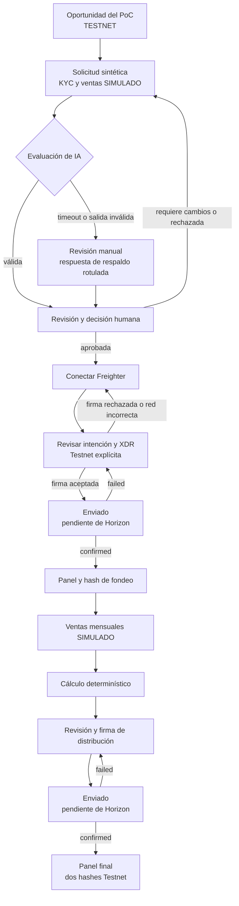
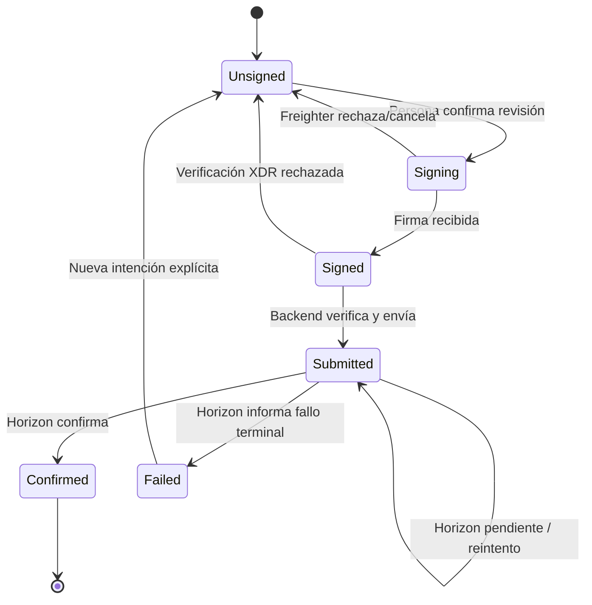

# Vaqcrow — Diseño de experiencia para el PoC en Stellar Testnet

Este documento convierte el plan del hackathon en un sistema visual y de interacción ejecutable para una única demostración de 5–7 minutos. Prioriza comprensión, trazabilidad y confianza: cada persona debe distinguir en todo momento qué es simulado, qué ocurre realmente en Stellar Testnet y qué decisión conserva control humano.

> **Fuente de alcance:** [Plan del hackathon](../planning/hackathon.md). Esta especificación desarrolla su historia vertical, sus límites de confianza y su alcance de seis pantallas.

> **Estado de Google Stitch MCP — pendiente.** El runtime actual no expone recursos, plantillas ni herramientas de Google Stitch. No se creó ningún proyecto, pantalla, imagen, archivo Figma ni HTML. La ejecución queda pendiente de conexión/configuración externa. Este documento no instala ni configura MCP y conserva marcadores explícitos para completar cuando el servidor esté disponible.

## Ruta rápida de uso

1. Validar las decisiones y preguntas abiertas de las secciones 14 y 15.
2. Conectar un servidor Stitch MCP que exponga las herramientas indicadas en la sección 11.
3. Crear un único proyecto, registrar su ID y generar **una pantalla por vez**, comenzando por escritorio.
4. Revisar cada pantalla contra sus criterios de aceptación antes de continuar.
5. Aprobar variantes móviles y traducir el resultado al sistema de componentes de Next.js.
6. Validar el recorrido completo con accesibilidad, estados reales y evidencia Playwright.

## Resumen de decisiones

| Tema | Decisión |
|---|---|
| Alcance | Seis pantallas reutilizables para una sola historia vertical; no se diseña un marketplace completo. |
| Idioma de interfaz | Español neutral, apropiado para personas usuarias de Argentina y sin coloquialismos. |
| Estilo | Minimalista, tipografía sans serif en negrita, espacio en blanco estratégico y esquinas redondeadas. |
| Color | Morado `#8A05BE` como acento intencional; paletas clara y oscura exactas, sin reemplazos. |
| Confianza | Estado `TESTNET` persistente, `SIMULADO` junto a cada dato sintético, IA consultiva y confirmación asíncrona explícita. |
| Wallet | Freighter conecta y firma de forma no custodial; Vaqcrow nunca solicita ni almacena seeds. |
| Diseño responsivo | Escritorio primero para la demo; móvil se deriva únicamente después de aprobar cada pantalla de escritorio. |
| Stitch | Fuente visual y de prototipado; el HTML generado es referencia, no implementación autoritativa. |

---

## 1. Objetivo de diseño y promesa de la demo

### Objetivo

Servir a jueces, potenciales inversores y al equipo operador con una experiencia que demuestre, sin ambigüedad, un financiamiento de revenue share para una PyME argentina sintética. La interfaz debe permitir recorrer solicitud, evaluación explicable, aprobación humana, firma no custodial, fondeo Testnet, cálculo determinístico, distribución Testnet y evidencia final.

### Comprensión obligatoria en 30 segundos

Al abrir la experiencia, una persona debe entender:

1. Vaqcrow presenta un **PoC**, no una oferta financiera habilitada.
2. La empresa, el KYC/KYB, las ventas y la conversión ARS/activo Stellar son **datos simulados**.
3. La evaluación de IA es real y explicable, pero **no aprueba ni mueve fondos**.
4. Las firmas se realizan con Freighter de forma **no custodial**.
5. Los movimientos visibles usan activos sin valor económico en **Stellar Testnet**.

### Promesa observable

> Una sola historia demuestra cómo evidencia sintética puede convertirse en una recomendación auditable, una decisión humana y dos transacciones reales en Testnet —fondeo y distribución— con estados asíncronos, hashes y enlaces al explorador.

### Fuera de alcance

- Marketplace con múltiples oportunidades, búsqueda o filtros avanzados.
- Onboarding, autenticación y perfiles de producción.
- Operación con dinero real o Stellar Public Network.
- Afirmaciones regulatorias, legales, de solvencia o rentabilidad.
- Aprobación autónoma por IA.
- Soroban, salvo que exista como extensión posterior independiente del diseño base.

## 2. Reglas de confianza no negociables

Estas reglas prevalecen sobre cualquier preferencia visual o simplificación de demo.

| Regla | Aplicación en interfaz | Criterio de rechazo |
|---|---|---|
| Testnet persistente | Badge `TESTNET` en encabezado fijo y contexto de red en cada revisión/transacción. | Una pantalla transaccional no indica la red o parece operar con dinero real. |
| Simulación explícita | Badge `SIMULADO` contiguo al origen sintético; banner en solicitud y panel. | La etiqueta depende de tooltip, color, pie de página o explicación oral. |
| IA consultiva | Copia visible: “La IA recomienda; una persona decide”. Acción humana separada y atribuida. | Un botón, estado o frase implica aprobación automática. |
| Custodia | Antes de conectar y firmar: “Freighter firma; Vaqcrow nunca recibe tu seed”. | Se pide una seed, clave privada o permiso ambiguo. |
| Pendiente no es confirmado | `Enviado`/`Pendiente de confirmación` nunca usa iconografía o tono de éxito. | La respuesta de envío se muestra como liquidación final. |
| Sin garantías | Usar “estimado”, “simulado” y “riesgo”; nunca “ganancia segura” o equivalentes. | Se promete retorno, aprobación, solvencia o disponibilidad productiva. |
| Real versus simulado | Cada evidencia y movimiento declara su naturaleza en el punto de decisión. | La persona debe inferir qué parte es real. |
| Trazabilidad | Actor, fecha, regla/modelo, correlation ID, hash y fuente visibles cuando correspondan. | Una decisión o transacción crítica carece de referencia verificable. |

**Disclosures canónicos, sin abreviación en puntos críticos:**

> **Demostración con datos simulados.** La identidad, el KYC/KYB, las ventas y la conversión ARS/activo Stellar de este caso son sintéticos. No representan verificaciones ni movimientos de dinero real.

> **Stellar Testnet.** Las transacciones mostradas usan activos sin valor económico en Stellar Testnet. Un hash de Testnet demuestra ejecución técnica, no una inversión real ni disponibilidad en producción.

> **Firma no custodial.** Freighter es la wallet e interfaz de firma. La persona usuaria conserva sus claves; Vaqcrow construye y verifica la transacción y nunca recibe su seed.

> **IA con supervisión humana.** La IA organiza evidencia, identifica anomalías y propone una evaluación explicable. No inventa datos, no toma la decisión final, no calcula obligaciones financieras y no transfiere fondos.

> **No apto para producción.** Este PoC no constituye una oferta de inversión, recomendación financiera, aprobación regulatoria ni prueba de legalidad, rentabilidad, solvencia, custodia, calidad de proveedores u operación en Argentina.

## 3. Personas y trabajos por realizar

Las personas describen roles de la demo, no segmentos validados de producción.

| Persona | Objetivo durante la demo | Preguntas que debe resolver | Riesgo de UX |
|---|---|---|---|
| Inversor de demostración | Evaluar la oportunidad sintética, conectar Freighter, revisar y firmar el fondeo Testnet. | ¿Qué evidencia respalda el riesgo? ¿Qué firmo? ¿La red y el monto son correctos? | Confundir estimaciones con garantías o `submitted` con `confirmed`. |
| PyME sintética: Panadería Horizonte SRL | Presentar evidencia simulada y firmar la distribución Testnet derivada de ventas mensuales simuladas. | ¿Qué dato falta? ¿Cómo se calculó la obligación? ¿Qué distribución firmo? | Creer que KYC, ventas o aprobación son reales. |
| Operador | Revisar la recomendación de IA, anomalías y faltantes; registrar la decisión humana. | ¿Qué afirmó la IA? ¿Qué evidencia cita? ¿Qué debo justificar? | Aprobar por inercia o no diferenciar evidencia de inferencia. |
| Juez/observador | Comprender la arquitectura de confianza y verificar evidencia sin completar tareas secundarias. | ¿Qué es real? ¿Qué es simulado? ¿Dónde está el control humano? | Perder el hilo por navegación extensa o detalles prematuros. |

### Jobs-to-be-done acotados

- **Cuando** observo la oportunidad, **quiero** conocer sus límites y evidencia, **para** decidir si continúo con la demo sin interpretar que es una oferta real.
- **Cuando** reviso la evaluación, **quiero** rastrear cada afirmación a datos concretos, **para** tomar una decisión humana informada.
- **Cuando** firmo, **quiero** comprobar red, cuenta, activo, monto, destino y memo, **para** mantener control no custodial.
- **Cuando** una transacción fue enviada, **quiero** ver su avance y resultado de Horizon, **para** no confundir aceptación con confirmación.
- **Cuando** observo la distribución, **quiero** ver entradas, regla, redondeo y hash, **para** comprobar que el LLM no calculó ni movió fondos.

## 4. Arquitectura de información y mapa de pantallas

### Mapa mínimo

| # | Ruta Next.js propuesta | Pantalla | Actor principal | Resultado de la etapa |
|---:|---|---|---|---|
| 1 | `/demo` | Oportunidad y límites del PoC | Inversor / juez | Comprende propuesta, progreso y límites; abre el caso. |
| 2 | `/demo/solicitud` | Solicitud y evidencia de la PyME | PyME / juez | Revisa KYC y ventas simulados, faltante y anomalía. |
| 3 | `/demo/evaluacion` | Evaluación de IA y revisión humana | Operador | Obtiene evaluación estructurada y registra aprobación humana. |
| 4 | `/demo/invertir` | Fondeo, Freighter y revisión XDR | Inversor | Conecta wallet, valida intención y firma sin custodia. |
| 5 | `/demo/transacciones/[intentId]` | Estado de transacción | Inversor / PyME / juez | Distingue envío de confirmación y accede al explorador. |
| 6 | `/demo/panel` | Panel, ventas y revenue share | PyME / inversor / juez | Audita cálculo, firma distribución y verifica ambos hashes. |

No se agrega una ruta por cada estado. Wallet, XDR, aprobación y distribución usan paneles, diálogos o drawers dentro de estas seis pantallas, con URL/estado recuperable cuando sea necesario.

### Navegación global

- Encabezado fijo: marca Vaqcrow, badge `POC`, badge `TESTNET`, nombre del caso y progreso `Paso n de 6`.
- Navegación primaria: `Caso`, `Evaluación`, `Fondeo`, `Evidencia`.
- Acceso secundario: selector de tema si se habilita, estado de Freighter y `ID de demo`.
- Pie de página: disclosure “No apto para producción” y enlace interno a límites de la demo.
- En móvil, navegación primaria colapsada; `TESTNET` y el paso actual permanecen visibles.

### Flujo de usuario



## 5. Sistema de identidad visual

### 5.1 Personalidad de marca

**Atributos:** clara, rigurosa, contemporánea, humana, verificable y serena. El diseño transmite control y transparencia, no euforia financiera.

**Principios visuales:**

- Jerarquía fuerte mediante escala tipográfica, peso y espacio, no mediante exceso de color.
- El morado destaca una decisión o foco por vista, no decora toda la interfaz.
- Los datos críticos se presentan con etiqueta, valor, origen y estado.
- Las superficies redondeadas agrupan información; no convierten cada texto en una tarjeta.

**Antipatrones:**

- Estética de casino, criptomoneda especulativa, neón, gradientes intensos o confeti.
- Fotos estereotípicas de riqueza, billetes, flechas siempre ascendentes o monedas flotantes.
- Glassmorphism que reduzca contraste, sombras pesadas o animación ornamental.
- Morado aplicado a estados positivos/negativos que deberían tener semántica propia.
- Ocultar disclaimers en tooltips, modales iniciales o texto de baja legibilidad.

### 5.2 Paleta central exacta

#### Tema claro

| Token | Valor | Uso |
|---|---:|---|
| `--color-brand-accent` | `#8A05BE` | CTA, progreso y foco intencional. |
| `--color-bg-canvas` | `#FFFFFF` | Fondo principal Snow White. |
| `--color-bg-surface` | `#F5F5F5` | Tarjetas Soft Gray. |
| `--color-text-primary` | `#111111` | Texto Matte Black. |
| `--color-text-secondary` | `#666666` | Texto secundario Gray. |

#### Tema oscuro

| Token | Valor | Uso |
|---|---:|---|
| `--color-brand-accent` | `#8A05BE` | CTA, progreso y foco intencional; validar contraste por contexto. |
| `--color-bg-canvas` | `#111111` | Fondo Black. |
| `--color-bg-surface` | `#1F1F1F` | Tarjeta Charcoal principal. |
| `--color-bg-surface-raised` | `#272727` | Superficie elevada Charcoal. |
| `--color-text-primary` | `#FFFFFF` | Texto White. |
| `--color-text-secondary` | `#A0A0A0` | Texto Light Gray. |

Los valores centrales son autoritativos. No se ajustan silenciosamente para cumplir contraste: se cambia la combinación, peso, tamaño o rol del color y se documenta el resultado.

### 5.3 Tokens semánticos

Nombres compatibles con variables CSS y extensiones de Tailwind:

```css
:root {
  --color-brand-accent: #8A05BE;
  --color-bg-canvas: #FFFFFF;
  --color-bg-surface: #F5F5F5;
  --color-text-primary: #111111;
  --color-text-secondary: #666666;
  --color-border-default: color-mix(in srgb, #111111 16%, transparent);
  --color-focus-ring: #8A05BE;
  --color-status-success: var(--support-success-tbd);
  --color-status-warning: var(--support-warning-tbd);
  --color-status-error: var(--support-error-tbd);
  --color-status-info: var(--support-info-tbd);
}

[data-theme="dark"] {
  --color-bg-canvas: #111111;
  --color-bg-surface: #1F1F1F;
  --color-bg-surface-raised: #272727;
  --color-text-primary: #FFFFFF;
  --color-text-secondary: #A0A0A0;
  --color-border-default: color-mix(in srgb, #FFFFFF 18%, transparent);
}
```

Los tokens `--support-success-tbd`, `--support-warning-tbd`, `--support-error-tbd` y `--support-info-tbd` son **colores de apoyo propuestos, aún no aprobados**. Deben seleccionarse mediante prueba de contraste WCAG AA en ambos temas. Ningún estado puede depender solo del color.

Tokens funcionales adicionales:

| Categoría | Tokens |
|---|---|
| Interacción | `--color-action-primary`, `--color-action-primary-hover`, `--color-action-disabled`, `--color-focus-ring` |
| Estado | `--color-status-success`, `--color-status-warning`, `--color-status-error`, `--color-status-info`, cada uno con `-surface`, `-text` e `-icon` |
| Riesgo | `--color-risk-low`, `--color-risk-medium`, `--color-risk-high`, siempre acompañados por texto e icono |
| Red/demo | `--color-env-testnet`, `--color-data-simulated`; pueden usar el acento si la densidad se mantiene baja |
| Datos | `--color-chart-primary`, `--color-chart-anomaly`, `--color-chart-missing`, `--color-chart-grid` |

### 5.4 Tipografía

**Decisión recomendada:** una sola familia, **Inter**, mediante entrega web compatible con Next.js, sujeta a confirmar disponibilidad y condiciones aplicables antes de implementar. Una familia reduce carga, latencia y discrepancias entre Stitch y código.

| Rol | Escritorio | Móvil | Peso / interlineado |
|---|---:|---:|---|
| Display | 56 px | 40 px | 700 / 1.05 |
| H1 | 40 px | 32 px | 700 / 1.15 |
| H2 | 30 px | 26 px | 700 / 1.2 |
| H3 | 22 px | 20 px | 650–700 / 1.3 |
| Body large | 18 px | 18 px | 400 / 1.55 |
| Body | 16 px | 16 px | 400 / 1.5 |
| Label | 14 px | 14 px | 600 / 1.35 |
| Caption | 12 px | 12 px | 500 / 1.4 |
| Dato monetario | 28–36 px | 24–30 px | 700, números tabulares |

- Máximo recomendado: 68–76 caracteres por línea de lectura.
- Usar números tabulares para montos, porcentajes, fechas parciales y hashes abreviados.
- No usar mayúsculas sostenidas salvo badges cortos como `SIMULADO` y `TESTNET`.

### 5.5 Espaciado, grilla y geometría

- Escala base de 4 px: `4, 8, 12, 16, 24, 32, 48, 64, 96`.
- Contenedor de escritorio: máximo 1200 px; 12 columnas; gutter 24 px; margen mínimo 32 px.
- Tablet: 8 columnas; gutter 20 px; margen 24 px.
- Móvil: 4 columnas; gutter 16 px; margen 16 px.
- Radios: control 10 px, tarjeta 16 px, panel destacado 24 px, badge tipo píldora 999 px.
- Bordes: 1 px para límites y estados; 2 px para foco o selección.
- Sombras: una sombra sutil solo en diálogo/drawer o superficie elevada; las tarjetas normales usan borde o diferencia de fondo.
- Áreas táctiles: mínimo 44 × 44 px.

### 5.6 Iconografía, datos, imágenes y movimiento

**Iconografía:** trazo simple, 20/24 px, geometría consistente. Icono más texto para wallet, red, advertencia, pendiente, confirmado y error. No usar logos de activos como sustitutos de etiquetas.

**Visualización de datos:**

- Único gráfico necesario: ventas mensuales, línea o barras, con anomalía y período faltante marcados.
- Mostrar tabla accesible equivalente con período, venta, procedencia y estado.
- Riesgo se expresa como banda textual (`Bajo`, `Medio`, `Alto`) y confianza numérica, nunca como medidor decorativo aislado.
- Progreso de financiamiento muestra monto y porcentaje, sin sugerir probabilidad de retorno.

**Imágenes:** preferir fotografía documental sobria o ilustración geométrica simple de una panadería, siempre identificada como representativa/sintética. Evitar personas identificables, documentos reales y material que parezca evidencia KYC.

**Movimiento:** 150–220 ms para hover, expansión y cambio de estado; easing suave. El polling puede usar un indicador discreto con texto. No usar confeti. Respetar `prefers-reduced-motion` y eliminar desplazamiento/loop no esencial.

### 5.7 Estrategia responsiva y de tema

- Diseñar primero a 1440 × 1024 y validar a 1280 × 800.
- Tablet reorganiza columnas, pero conserva resumen de decisión antes del detalle.
- Móvil apila contenido, fija la acción primaria al borde inferior solo si no oculta disclosures y convierte tablas en listas etiquetadas.
- XDR y hashes usan bloques con salto seguro, abreviación visual y acción `Copiar`; el valor completo permanece accesible.
- El tema claro es candidato predeterminado para la demo por legibilidad ambiental.
- El tema oscuro se documenta con tokens y variantes, pero su inclusión en vivo permanece abierta; no mantener dos recorridos si compromete el camino crítico.
- El tema respeta preferencia del sistema solo si ambos temas superan QA; de lo contrario se fija el tema aprobado sin selector engañoso.

## 6. Requisitos de accesibilidad

**Objetivo:** WCAG 2.2 nivel AA para el recorrido crítico.

- Contraste de texto normal mínimo 4.5:1; texto grande mínimo 3:1; componentes, bordes significativos e indicadores de foco mínimo 3:1.
- Validar todas las combinaciones de `#8A05BE` con `#FFFFFF`, `#F5F5F5`, `#111111`, `#1F1F1F`, `#272727` y textos secundarios `#666666` / `#A0A0A0`; no asumir cumplimiento por inspección.
- Orden de tabulación coincide con orden visual y permite completar revisión, wallet, firma y recuperación sin mouse.
- Foco visible de 2 px con separación suficiente; no retirar `outline` sin reemplazo equivalente.
- Cada campo tiene label persistente. Ayuda y errores se asocian programáticamente; resumen de errores recibe foco al enviar.
- Estados incluyen icono, título y texto; nunca dependen solo de color, posición o animación.
- Cambios `submitted`, `confirmed` y `failed` se anuncian con una región viva moderada, sin repetir en cada polling.
- Skeletons tienen nombre accesible y no exponen contenido falso a lectores de pantalla.
- Gráfico de ventas incluye tabla o descripción equivalente y explicación textual de anomalía/faltante.
- Diálogos de Freighter/XDR: foco inicial predecible, trampa de foco mientras están abiertos, cierre con `Escape` cuando sea seguro y retorno del foco al disparador.
- Una ventana externa de Freighter no debe dejar la aplicación bloqueada; al recuperar foco, mostrar resultado o instrucciones claras.
- No cerrar automáticamente un error o confirmación importante. Toasts críticos se duplican en contenido persistente.
- Respetar zoom al 200 %, reflow a 320 CSS px y preferencias `prefers-reduced-motion` y `prefers-contrast` cuando estén disponibles.
- Botones deshabilitados deben conservar explicación visible del requisito pendiente; no usar solo tooltip.
- Enlaces al explorador indican que abren una nueva pestaña y exponen el hash completo en nombre o descripción accesible.

## 7. Inventario de componentes

### 7.1 Fundamentos

| Componente/token | Variantes | Estados críticos |
|---|---|---|
| Color y tema | claro, oscuro documentado | contraste aprobado/no aprobado |
| Tipografía | display, headings, body, label, caption, dato | normal, truncado, error de carga con fallback |
| Espaciado/grilla | 12/8/4 columnas | escritorio, tablet, móvil, zoom 200 % |
| Iconos | 16, 20, 24 px | decorativo, informativo con label |
| Motion | estándar, reducido | idle, transición, polling |

### 7.2 Primitivas

| Componente | Variantes | Estados críticos |
|---|---|---|
| Botón | primario, secundario, ghost, destructivo, enlace | default, hover, focus, pressed, loading, disabled |
| Input | texto, monto, porcentaje, textarea | vacío, completo, focus, inválido, disabled, readonly |
| Badge | `SIMULADO`, `TESTNET`, PoC, riesgo, transacción, evidencia | neutral, info, warning, success, error |
| Card | estándar, seleccionable, destacada, estado | hover, focus, selected, disabled, loading |
| Link | interno, externo/explorador, copiar | hover, focus, visited, broken/error |
| Tooltip | ayuda no crítica | abierto por hover y teclado; nunca contiene disclosures esenciales |
| Divider / border | horizontal, vertical | alto contraste cuando separa grupos semánticos |
| Spinner / skeleton | inline, bloque | etiqueta accesible, reduced motion |

### 7.3 Compuestos

| Componente | Contenido | Variantes/estados |
|---|---|---|
| Encabezado de entorno | marca, `POC`, `TESTNET`, caso, paso | wallet desconectada/conectada, móvil |
| Banner de confianza | icono, título, disclosure, enlace | simulación, Testnet, respaldo, error |
| Progreso del proyecto | monto objetivo, fondeado, porcentaje | vacío, parcial, completo; nunca retorno estimado |
| Stepper | seis pasos y estado | actual, completo, pendiente, error, bloqueado |
| Timeline | evento, actor, timestamp, referencia | processing, submitted, confirmed, failed |
| Panel de evidencia | fuente, referencia, extracto, procedencia | disponible, faltante, anómala, inválida, simulada |
| Evaluación de IA | banda, confianza, razones, anomalías, faltantes, preguntas | procesando, válida, inválida, timeout, respaldo, revisión manual |
| Decisión humana | actor, razón, límite, timestamp | pendiente, aprobada, requiere cambios, rechazada |
| Wallet connect | estado Freighter, cuenta y red | ausente, desconectada, conectando, conectada, rechazada, red incorrecta |
| Revisión de transacción | intención, XDR decodificado, red, fuente, destino, activo, monto, memo, timeout | unsigned, firmando, firmado, verificación rechazada |
| Estado de transacción | hash, Horizon, reintento, explorador | unsigned, submitted, confirmed, failed, unknown |
| Toast/banner | info, warning, success, error | persistente para errores críticos, anunciable |
| Amount input | activo, precisión, ayuda | vacío, inválido, excede límite, readonly |
| Tabla accesible | encabezados, caption, acciones | loading, vacía, error, responsive list |
| Gráfico de ventas | serie, anomalía, faltante | loading, parcial, vacío, con tabla alternativa |

### 7.4 Patrones de experiencia

- **Resumen → evidencia → acción:** toda decisión crítica comienza por una síntesis y permite abrir detalle.
- **Trust strip:** franja persistente con `TESTNET`, `SIMULADO` cuando aplica e identidad del actor.
- **Revisión antes de firma:** ninguna acción abre Freighter sin una intención legible y confirmación explícita.
- **Proceso asíncrono recuperable:** URL estable, correlation ID y acción segura de reintento/actualización.
- **Comparación IA/persona:** recomendación y decisión humana en tarjetas separadas, con autor y timestamp.
- **Cálculo auditable:** entradas + regla versionada + redondeo + resultado; sin texto generativo en el cálculo.

## 8. Especificaciones de pantallas

### Pantalla 1 — Oportunidad y límites del PoC

**Ruta:** `/demo`  
**Propósito:** explicar la tesis, fijar límites de confianza y abrir el único caso.  
**Actor principal:** inversor; juez como observador.

**Contenido clave**

- Hero: “Financiamiento trazable para una PyME argentina”.
- Subtítulo: “PoC de revenue share con evaluación asistida por IA, decisión humana y liquidación en Stellar Testnet”.
- Badges `POC`, `TESTNET` y `DATOS SIMULADOS` visibles antes del primer scroll.
- Tarjeta de Panadería Horizonte SRL con sector, ubicación sintética, objetivo Testnet y progreso.
- Resumen “Qué es real / Qué es simulado” en dos columnas.
- Timeline compacta de seis etapas y duración objetivo de demo.

**Componentes:** encabezado de entorno, hero, badges, opportunity card, project progress, stepper, trust banner, botones.  
**Acción primaria:** `Abrir caso de demostración`.  
**Acción secundaria:** `Ver límites del PoC`.

**Estados**

| Estado | Comportamiento |
|---|---|
| Vacío | No corresponde para el fixture congelado; si falta, mostrar “El caso de demostración no está disponible” y bloquear avance. |
| Carga | Skeleton de hero/tarjeta; badges de entorno permanecen visibles. |
| Error | Banner persistente con correlation ID y opción `Reintentar`; no inventar datos. |
| Deshabilitado | CTA deshabilitada con razón “El caso de demostración aún no está listo”. |
| Éxito | Caso cargado; CTA disponible. No usar éxito financiero. |
| Pendiente | Si se recupera estado previo, indicar “Hay una demo en curso” y permitir reanudar. |

**Responsive:** hero y oportunidad en dos columnas desde 1024 px; en móvil se apilan con badges y CTA antes del resumen detallado. El progreso muestra monto y porcentaje textual además de la barra.

**Disclosures exactos:** mostrar completos “Demostración con datos simulados”, “Stellar Testnet” y “No apto para producción” de la sección 2. No ocultarlos detrás de un modal.

**Criterios de aceptación**

- [ ] `TESTNET` y datos simulados se entienden antes de hacer scroll a 1280 × 800.
- [ ] La CTA abre únicamente Panadería Horizonte SRL; no existe catálogo paralelo.
- [ ] El progreso expresa fondeo del caso, no retorno esperado.
- [ ] La pantalla no afirma aprobación, inversión real, rentabilidad ni disponibilidad productiva.
- [ ] Los disclosures son legibles por teclado y lector de pantalla.

### Pantalla 2 — Solicitud y evidencia de la PyME

**Ruta:** `/demo/solicitud`  
**Propósito:** presentar identidad, KYC/KYB y ventas sintéticas con procedencia, faltante y anomalía intencional.  
**Actor principal:** PyME sintética; operador/juez como observador.

**Contenido clave**

- Resumen del negocio: Panadería Horizonte SRL, rubro, antigüedad y objetivo de financiamiento.
- Estado KYC/KYB `Aprobado · SIMULADO`, proveedor/adaptador, timestamp y referencia.
- Ventas enero–agosto de 2026 con falta de abril y anomalía en junio.
- Documentos/fixtures con referencias estables y badge `SIMULADO` por fila.
- Checklist de evidencia: disponible, faltante, contradicción/anomalía.
- Acción visible para enviar exactamente esos datos a evaluación.

**Componentes:** form summary readonly, evidence panel, badge, accessible chart, table, checklist, banner, stepper.  
**Acción primaria:** `Evaluar evidencia con IA`.  
**Acción secundaria:** `Ver dataset completo`.

**Estados**

| Estado | Comportamiento |
|---|---|
| Vacío | “No hay evidencia cargada”; no habilitar evaluación. |
| Carga | Skeleton por bloque con origen y badges persistentes. |
| Error | Identificar la fuente fallida; permitir reintento sin borrar datos visibles. |
| Deshabilitado | CTA bloqueada si el esquema mínimo no puede enviarse; explicar campos requeridos. |
| Éxito | Dataset validado para análisis, sin convertir KYC simulado en validación real. |
| Pendiente | “Preparando referencias de evidencia”; no navegar hasta obtener assessment ID o fallback. |

**Responsive:** en escritorio, resumen a la izquierda y evidencia a la derecha; gráfico sobre tabla. En móvil, resumen, alertas, tabla como lista y CTA final. No depender de hover para procedencia.

**Disclosures exactos:** mostrar completo “Demostración con datos simulados”. Junto a KYC: “Resultado simulado para este PoC; no constituye una verificación de identidad”. Junto a ventas: “Serie sintética y reproducible; abril está ausente y junio contiene una anomalía intencional”.

**Criterios de aceptación**

- [ ] Cada elemento sintético tiene `SIMULADO` contiguo y accesible.
- [ ] Abril se presenta como faltante, no como venta cero.
- [ ] Junio se marca como anomalía sin afirmar una causa.
- [ ] El gráfico tiene tabla o descripción equivalente.
- [ ] La evaluación recibe referencias identificables, no capturas opacas.
- [ ] Ningún documento parece pertenecer a una persona real.

### Pantalla 3 — Evaluación de IA y revisión humana

**Ruta:** `/demo/evaluacion`  
**Propósito:** demostrar una evaluación real, estructurada y explicable, y registrar una decisión separada de operador.  
**Actor principal:** operador.

**Contenido clave**

- Estado de procesamiento con assessment ID `asm_demo_001` y correlation ID.
- Banda `Riesgo medio`, confianza `72 %`, recomendación `Revisión humana`.
- Razones con links a evidencia, anomalía de junio, período faltante de abril y pregunta pendiente.
- Metadatos: versión de modelo/prompt, timestamp y validación de esquema.
- Panel separado “Decisión humana” con actor, límite, razón obligatoria y timestamp.
- Comparación visible entre recomendación de IA y decisión humana.

**Componentes:** AI assessment, evidence panel/drawer, risk badge, confidence value, alerts, human decision form, banner, toast persistente, stepper.  
**Acción primaria:** `Registrar aprobación humana`.  
**Acciones alternativas:** `Solicitar información` y `Rechazar caso`.

**Estados**

| Estado | Comportamiento |
|---|---|
| Vacío | “La evaluación todavía no fue iniciada”; enlace de retorno a evidencia. |
| Carga | Progreso “Analizando evidencia”; no mostrar puntuaciones provisionales. |
| Error | Salida inválida, referencias inexistentes o error del proveedor llevan a `Revisión manual`; mostrar causa sanitizada. |
| Deshabilitado | Decisión bloqueada hasta cargar evidencia disponible y escribir una razón; nunca se habilita por confianza alta. |
| Éxito | Evaluación válida con evidencia citada; luego decisión humana registrada con actor y timestamp. |
| Pendiente | `Procesando IA` o `Revisión humana pendiente`; son estados distintos. |
| Respaldo | Badge `RESPUESTA DE RESPALDO`; fecha/versión visibles y texto “No corresponde a una llamada en vivo”. |

**Responsive:** escritorio usa dos columnas: evaluación 7/12 y decisión 5/12 con panel de evidencia lateral. Móvil presenta recomendación, evidencia, límites y al final el formulario humano; la acción no precede a las alertas.

**Disclosures exactos:** mostrar completo “IA con supervisión humana”. Cerca de la acción: “Esta decisión la registra una persona. La recomendación de IA no aprueba ni transfiere fondos”. Para respaldo: “Respuesta de respaldo previamente generada; no corresponde a una llamada en vivo”.

**Criterios de aceptación**

- [ ] Toda razón de IA enlaza a una referencia existente.
- [ ] Banda de riesgo y confianza son conceptos visualmente separados.
- [ ] Se muestran anomalía, faltante, incertidumbre y pregunta pendiente.
- [ ] La decisión humana exige actor, razón y timestamp.
- [ ] Timeout o esquema inválido nunca producen aprobación automática.
- [ ] Recomendación y decisión humana no comparten el mismo badge ni bloque.
- [ ] El LLM no calcula montos ni inicia acciones de wallet.

### Pantalla 4 — Fondeo, Freighter y revisión de transacción

**Ruta:** `/demo/invertir`  
**Propósito:** permitir que el inversor defina un monto de prueba, conecte Freighter, revise la intención/XDR y firme en Testnet.  
**Actor principal:** inversor.

**Contenido clave**

- Resumen del caso aprobado por una persona y límite permitido.
- Input de monto con activo de prueba **TBD**, precisión y saldo Testnet.
- Estado de Freighter, cuenta pública abreviada/copiar y red detectada.
- Revisión decodificada: red Testnet, fuente, destino, activo, monto, memo, secuencia, timeout y operaciones.
- Confirmación explícita antes de abrir Freighter.
- Nota de que Vaqcrow verificará el XDR firmado antes de enviarlo.

**Componentes:** amount input, wallet connect, network badge, transaction review, disclosure panel, checkbox de reconocimiento, dialog/drawer, buttons.  
**Acción primaria por etapa:** `Conectar Freighter` → `Revisar transacción` → `Firmar en Freighter`.  
**Acción secundaria:** `Cancelar y volver al caso`.

**Estados**

| Estado | Comportamiento |
|---|---|
| Vacío | Monto vacío y wallet desconectada; mostrar requisitos sin error prematuro. |
| Carga | Detectando extensión/cuenta o construyendo XDR; preservar monto. |
| Error | Freighter no instalado, conexión rechazada, red incorrecta, saldo insuficiente, XDR alterado o expirado; mensaje específico y recuperación. |
| Deshabilitado | Firma bloqueada sin monto válido, aprobación humana, cuenta conectada, Testnet correcta y reconocimiento de detalles. |
| Éxito | Firma recibida y XDR verificado; aún no mostrar “Confirmado”. |
| Pendiente | “Esperando confirmación en Freighter” o “Verificando firma”; permitir cancelar solo cuando sea seguro. |

**Responsive:** en escritorio, formulario/resumen 5/12 y revisión 7/12; drawer de XDR detallado. En móvil, flujo escalonado y resumen fijo antes de firmar; no mostrar XDR completo como una línea horizontal.

**Disclosures exactos:** mostrar completos “Firma no custodial” y “Stellar Testnet”. Cerca del monto: “Activo de prueba sin valor económico”. Antes de firmar: “Verifica cuenta, red, destino, activo, monto y memo en Freighter”.

**Criterios de aceptación**

- [ ] Nunca se solicita seed ni clave privada.
- [ ] `TESTNET` aparece en encabezado, wallet y resumen de firma.
- [ ] Cuenta, destino, activo, monto, memo y timeout son legibles antes de abrir Freighter.
- [ ] Red incorrecta bloquea la firma y explica cómo cambiar a Testnet.
- [ ] Rechazar la conexión o firma conserva la intención y ofrece reintento.
- [ ] Recibir una firma conduce a verificación y `submitted`, no directamente a `confirmed`.
- [ ] El activo de prueba permanece como TBD hasta decisión explícita.

### Pantalla 5 — Procesamiento y estado de transacción

**Ruta:** `/demo/transacciones/[intentId]`  
**Propósito:** representar con precisión el ciclo asíncrono de fondeo o distribución y ofrecer evidencia recuperable.  
**Actor principal:** inversor o PyME; juez como observador.

**Contenido clave**

- Tipo de intención: `Fondeo` o `Distribución de revenue share`.
- Estado principal: `Sin firmar`, `Enviada`, `Pendiente de confirmación`, `Confirmada` o `Fallida`.
- Timeline con construcción, firma, verificación, envío y consulta Horizon.
- Hash, correlation ID, timestamps, monto, activo, cuentas y red.
- Enlace al explorador Testnet solo si existe hash; indicador de nueva pestaña.
- Mensajes de polling, reintento/reanudación y error sanitizado.

**Componentes:** status hero, timeline, transaction details, hash field/copy, explorer link, banner, retry button, stepper.  
**Acción primaria:** durante pendiente, `Actualizar estado`; al confirmar, `Continuar al panel`; al fallar, `Revisar y reintentar`.  
**Acción secundaria:** `Copiar hash`.

**Estados**

| Estado | Comportamiento |
|---|---|
| Vacío/unknown | Intención no encontrada; no inferir éxito; mostrar ID y recuperación. |
| Carga | “Consultando Horizon”; timeline previa permanece visible. |
| Error | Diferenciar error temporal de red de estado `failed` confirmado; no cambiar terminal manualmente. |
| Deshabilitado | Enlace explorer inactivo sin hash; explicar “Disponible después del envío”. |
| Éxito | `Confirmada en Stellar Testnet`, con timestamp, hash y explorador. |
| Pendiente | `Enviada · esperando confirmación de Horizon`; iconografía neutral, sin check verde. |
| Fallida | Motivo sanitizado, etapa y acción segura; conservar trazabilidad. |

**Responsive:** timeline vertical en todas las vistas; detalles en dos columnas de definición en escritorio y lista en móvil. Hash abreviado visualmente, completo al copiar y para tecnología asistiva.

**Disclosures exactos:** mostrar completo “Stellar Testnet”. Durante envío: “La transacción fue enviada, pero todavía no está confirmada”. En confirmación: “El hash demuestra ejecución técnica en Testnet; no representa una inversión ni dinero real”.

**Criterios de aceptación**

- [ ] Toda transacción pasa visualmente por `submitted`/`Enviada` antes de `confirmed`/`Confirmada`.
- [ ] Error de red no se presenta como fallo terminal de Stellar sin evidencia.
- [ ] Un refresh recupera intención, timeline y estado sin duplicar el envío.
- [ ] El hash completo puede copiarse y el enlace apunta al explorador configurado para Testnet.
- [ ] Los cambios de estado se anuncian sin saturar al lector de pantalla.
- [ ] La misma pantalla funciona para fondeo y distribución sin mezclar sus etiquetas.

### Pantalla 6 — Panel, cálculo y distribución

**Ruta:** `/demo/panel`  
**Propósito:** cerrar la historia con trazabilidad completa: fondeo confirmado, ventas mensuales simuladas, cálculo determinístico, distribución firmada y ambos hashes Testnet.  
**Actor principal:** PyME para distribución; inversor/juez para evidencia.

**Contenido clave**

- Resumen del proyecto, aprobación humana y progreso Testnet.
- Timeline integral: solicitud, IA, aprobación, fondeo, ventas, cálculo y distribución.
- Feed mensual con nuevo período de ventas `SIMULADO`.
- Cálculo: ventas elegibles, porcentaje de revenue share, regla versionada, unidades mínimas, política de redondeo, obligación resultante y asignaciones.
- Acción PyME para revisar y firmar la distribución reutilizando Freighter y transaction review.
- Tarjetas de evidencia para fondeo y distribución con estado, hash y enlace explorer.
- Estado vacío previo a ventas y estados submitted/confirmed/failed de distribución.

**Componentes:** dashboard summary, project progress, chart/table, calculation breakdown, timeline, wallet status, transaction review drawer, transaction evidence cards, banners.  
**Acción primaria por etapa:** `Cargar ventas simuladas` → `Revisar cálculo` → `Firmar distribución en Freighter` → `Ver evidencia en Testnet`.  
**Acción secundaria:** `Copiar paquete de evidencia` si se implementa sin secretos.

**Estados**

| Estado | Comportamiento |
|---|---|
| Vacío | “Todavía no hay ventas del período”; cálculo y distribución bloqueados con explicación. |
| Carga | Carga de feed, cálculo o Horizon se muestra por bloque; no congela el resto del panel. |
| Error | Feed fallido, regla no disponible, cálculo inválido, wallet/red incorrecta o distribución fallida; ninguna ruta usa LLM para reemplazar cálculo. |
| Deshabilitado | Distribución bloqueada hasta ventas válidas, cálculo balanceado, cuenta PyME conectada y red Testnet. |
| Éxito | Dos movimientos confirmados con hashes distintos, timestamps y enlaces Testnet. |
| Pendiente | Distribución enviada pero no confirmada; mantener cálculo e intención visibles. |
| Respaldo | Si Horizon cae, mostrar intento pendiente y hashes confirmados de ensayo claramente rotulados como evidencia previa. |

**Responsive:** escritorio combina resumen y evidencia en 4/8 columnas; cálculo ocupa ancho completo antes de firma. Móvil ordena: estado, ventas, cálculo, firma, hashes. Tablas pasan a listas sin perder etiquetas ni totales.

**Disclosures exactos:** mostrar completos “Demostración con datos simulados”, “Firma no custodial”, “Stellar Testnet” y “No apto para producción”. Junto al cálculo: “Cálculo determinístico; la IA no calcula esta obligación”. Para evidencia previa: “Hash de ensayo previo; no corresponde a la ejecución actual”.

**Criterios de aceptación**

- [ ] Ventas y documentos mantienen `SIMULADO` en gráfico, tabla y detalle.
- [ ] El cálculo expone entradas, porcentaje, versión de regla, unidades, redondeo y total balanceado.
- [ ] La distribución requiere revisión y firma independiente con Freighter.
- [ ] El estado enviado no se confunde con confirmado.
- [ ] Fondeo y distribución muestran hashes, operaciones y enlaces Testnet independientes.
- [ ] No se presenta revenue share como rendimiento garantizado.
- [ ] El recorrido final permite explicar qué fue real y qué fue simulado sin apoyo oral.

## 9. Modelo de interacción y estados

### 9.1 Matriz de estados críticos

| Dominio | Estado | UI y acción permitida | Siguiente estado válido |
|---|---|---|---|
| IA | `idle` | Evidencia disponible; `Evaluar evidencia con IA`. | `processing` |
| IA | `processing` | Indicador y assessment ID; sin resultado provisional. | `valid`, `invalid`, `timeout` |
| IA | `valid` | Estructura, evidencia y confianza visibles. | `human_review` |
| IA | `invalid` / `timeout` | Error sanitizado; badge revisión manual; opción de respaldo rotulado. | `human_review` |
| Revisión | `human_review` | Exige actor y razón. | `approved`, `changes_requested`, `rejected` |
| Revisión | `approved` | Habilita fondeo dentro del límite. | wallet `disconnected` |
| Freighter | `unavailable` | Instrucciones o contingencia; nunca seed manual. | `disconnected` tras instalación/detección |
| Freighter | `disconnected` | `Conectar Freighter`. | `connecting` |
| Freighter | `connecting` | Espera recuperable. | `connected`, `rejected`, `wrong_network` |
| Freighter | `rejected` | Mensaje neutral; preservar intención. | `connecting` |
| Freighter | `wrong_network` | Bloquear firma y solicitar Testnet. | `connected` |
| Transacción | `unsigned` | Mostrar intención/XDR decodificado. | `signing` |
| Transacción | `signing` | Esperando Freighter. | `signed`, `rejected` |
| Transacción | `signed` | Verificación backend; no éxito final. | `submitted`, `verification_failed` |
| Transacción | `submitted` | Hash si existe, polling Horizon, texto pendiente. | `confirmed`, `failed`, permanece `submitted` |
| Transacción | `confirmed` | Estado terminal, hash y explorer. | Ninguno |
| Transacción | `failed` | Estado terminal y nueva intención explícita; no reenviar en silencio. | Nueva `unsigned` |
| Red/Horizon | `unavailable` | Conservar estado conocido y timestamp; hashes de respaldo rotulados. | Reanudar consulta |
| LLM | `unavailable` | `manual_review`; respaldo previamente generado y rotulado si existe. | Decisión humana |

### 9.2 Transición transaccional



### 9.3 Reglas de recuperación

- Persistir y mostrar `intentId`/correlation ID para reanudar después de refresh.
- Reintentar consultas idempotentes; no repetir automáticamente firma o envío.
- Si la red está indisponible, conservar el último estado y su timestamp.
- Si el LLM falla, continuar a revisión manual; nunca sustituirlo por una aprobación implícita.
- Si se usa una respuesta de respaldo, rotularla en encabezado, evaluación y timeline.
- La etiqueta `SIMULADO` viaja con el dato al resumirlo, graficarlo o citarlo; no vive solo en la pantalla de origen.

## 10. Diseño de contenido

### 10.1 Voz y tono

- Español neutral, directo, preciso y sobrio.
- Verbos concretos: `Revisar`, `Conectar`, `Firmar`, `Actualizar`, `Copiar`.
- Separar hecho, estimación y recomendación.
- Explicar el siguiente paso y la consecuencia antes de una acción irreversible.
- Evitar tecnicismos donde no agregan control; mantener XDR, Horizon y Testnet con ayuda contextual breve.

### 10.2 Labels y microcopy de referencia

| Contexto | Copy recomendada |
|---|---|
| Entorno | `TESTNET · Activos sin valor económico` |
| Dato sintético | `SIMULADO` / `Dato sintético para demostración` |
| IA | `La IA recomienda; una persona decide` |
| Riesgo | `Riesgo medio` y `Confianza de la evaluación: 72 %` |
| Faltante | `Falta la declaración de abril de 2026` |
| Anomalía | `Junio requiere revisión; no se determinó la causa` |
| Wallet | `Conectar Freighter` / `Cuenta conectada en Testnet` |
| Custodia | `Vaqcrow nunca recibe tu seed` |
| Firma | `Revisar y firmar en Freighter` |
| Submitted | `Transacción enviada. Esperando confirmación de Horizon.` |
| Confirmed | `Confirmada en Stellar Testnet` |
| Failed | `La transacción no fue confirmada` |
| Respaldo IA | `RESPUESTA DE RESPALDO · No corresponde a una llamada en vivo` |
| Cálculo | `Cálculo determinístico según regla RS-2026-01` |

### 10.3 Formato de datos

- Pesos argentinos: `$ 1.250.000,00 ARS` cuando sea necesario distinguir moneda; espacio no separable entre símbolo/unidad según componente.
- Activo Testnet: `1.250,0000000 [ACTIVO_TBD]` o precisión definida por el activo; no usar `$` si no corresponde.
- Porcentaje: `4,50 %`; aclarar si es tasa contractual de revenue share, no retorno.
- Riesgo: palabra completa + explicación; no representar como calificación crediticia oficial.
- Fecha/hora: `26 sep 2026, 14:32 ART`; almacenar y exponer zona horaria.
- Hash/cuenta: abreviación visual `GB6Q…K4TZ`, acción `Copiar` y valor completo accesible.
- Confianza: `72 %` con label “Confianza de la evaluación”, no “probabilidad de pago”.

### 10.4 Errores

Estructura: **qué ocurrió + qué se conservó + qué puede hacer la persona**.

- `Freighter rechazó la conexión. El monto se conservó. Puedes intentarlo nuevamente.`
- `La wallet está en otra red. Cambia a Stellar Testnet para continuar.`
- `No pudimos validar el XDR firmado. No se envió ninguna transacción. Revisa los detalles y crea una nueva intención.`
- `Horizon no respondió. La transacción continúa con el último estado conocido: Enviada. Actualiza el estado en unos segundos.`
- `La respuesta de IA no cumplió el esquema. El caso pasó a revisión manual; no se registró una aprobación.`

### 10.5 Términos prohibidos o condicionados

| Evitar | Usar |
|---|---|
| `Inversión segura`, `rentabilidad garantizada` | `Demostración`, `estimación`, `revenue share sujeto a riesgo` |
| `Aprobado por IA` | `Recomendado por IA; aprobado por [actor]` |
| `Dinero depositado` al enviar | `Transacción enviada; pendiente de confirmación` |
| `KYC verificado` sin contexto | `KYC aprobado · SIMULADO` |
| `Wallet de Vaqcrow` | `Freighter conectada de forma no custodial` |
| `Pago real` | `Transacción real en Testnet con activo sin valor económico` |
| `Retorno` como certeza | `Distribución calculada para este período simulado` |

## 11. Plan de ejecución con Google Stitch MCP

### 11.1 Estado y prerrequisitos

**Estado actual:** ejecución pendiente de conexión/configuración. IDs sin asignar:

- Project ID: `<STITCH_PROJECT_ID>`
- Screen IDs: `<SCREEN_ID_01>` a `<SCREEN_ID_06>`

**Prerrequisitos externos a esta tarea:**

- Servidor Stitch MCP conectado y visible para el runtime.
- Acceso autorizado a Google Stitch y cuota disponible.
- Herramientas equivalentes a creación de proyecto, `generate_screen_from_text`, `edit_screens`, `generate_variants` y recuperación de URLs de imagen/HTML.
- Carpeta segura de evidencias definida fuera del repositorio o en una ruta posteriormente autorizada.
- Resolución de activo Testnet y, si Stitch requiere nombre de proyecto único, convención aprobada.

**Secretos:** usar autenticación y variables del runtime MCP. No copiar tokens, cookies, credenciales, seeds, claves privadas, PII ni XDR sensible en prompts, Markdown, capturas, HTML o logs. Utilizar exclusivamente cuentas públicas y fixtures sintéticos. Este runbook no instala ni configura MCP.

### 11.2 Secuencia controlada

1. **Comprobar herramientas:** listar recursos/herramientas del servidor y confirmar nombres/parámetros reales. Si difieren, adaptar solo la envoltura, no los prompts ni reglas de confianza.
2. **Crear un proyecto:** invocar `create_project` o equivalente con nombre `Vaqcrow PoC — Argentina Builder Challenge`.
3. **Registrar el ID:** reemplazar `<STITCH_PROJECT_ID>` en el ledger de esta sección o en una copia operativa autorizada. No continuar sin persistirlo.
4. **Preparar el prompt:** concatenar el prompt maestro completo con el prompt de la pantalla 1.
5. **Generar escritorio:** invocar `generate_screen_from_text` con `projectId`, `deviceType: DESKTOP` y el prompt concatenado.
6. **Registrar pantalla:** guardar screen ID y URLs devueltas. No afirmar que existe una salida que la herramienta no devolvió.
7. **Gate de revisión:** revisar la pantalla contra sección 8, confianza, accesibilidad y consistencia. Si falla, corregir con `edit_screens` sobre el mismo screen ID.
8. **Comparación acotada:** usar `generate_variants` solo si existe una decisión visual concreta —por ejemplo, densidad de evidencia o layout 7/5—, con máximo tres variantes y criterios previos.
9. **Aprobar escritorio:** registrar variante elegida y desviaciones. Solo entonces repetir los pasos 4–8 para la pantalla siguiente.
10. **Derivar móvil:** después de aprobar cada escritorio, usar `edit_screens` con el prompt móvil y `deviceType: MOBILE` si la herramienta lo admite; si crea otro screen ID, registrarlo.
11. **Capturar outputs:** recuperar URL de imagen/captura y URL HTML si la herramienta las expone. HTML es referencia visual.
12. **Mapear a Next.js:** implementar componentes y rutas en el stack existente, revisar accesibilidad/estados y verificar con Playwright. No copiar output Astro ni tratar `build_site` como fuente autoritativa.

### 11.3 Formas de invocación de referencia

La firma exacta depende del servidor conectado. Verificar su esquema antes de ejecutar.

```text
create_project({
  "name": "Vaqcrow PoC — Argentina Builder Challenge"
})

generate_screen_from_text({
  "projectId": "<STITCH_PROJECT_ID>",
  "deviceType": "DESKTOP",
  "prompt": "<MASTER_PROMPT>\n\n<SCREEN_01_PROMPT>"
})

edit_screens({
  "projectId": "<STITCH_PROJECT_ID>",
  "screenIds": ["<SCREEN_ID_01>"],
  "prompt": "<BOUNDED_CORRECTION_OR_MOBILE_PROMPT>"
})

generate_variants({
  "projectId": "<STITCH_PROJECT_ID>",
  "screenIds": ["<SCREEN_ID_01>"],
  "prompt": "<ONE_SPECIFIC_COMPARISON>",
  "variantCount": 2
})
```

Si el MCP separa “project generation” de `generate_screen_from_text`, conservar siempre el mismo project ID. Un flujo de terceros `build_site` puede mapear screen IDs a rutas, pero no debe generar la implementación autoritativa: Vaqcrow usa Next.js y componentes revisados del proyecto.

### 11.4 Gate de revisión por pantalla

No generar la siguiente pantalla hasta que la actual cumpla:

- [ ] Jerarquía, layout y acción primaria coinciden con la especificación.
- [ ] `TESTNET`, `SIMULADO` y disclosure contextual son visibles sin interacción oculta.
- [ ] No existe copy de dinero real, aprobación autónoma o retorno garantizado.
- [ ] Estados vacío, carga, error, deshabilitado, éxito y pendiente están definidos, aunque la imagen muestre solo el estado principal.
- [ ] Componentes reutilizan tokens, radios, tipografía y patrones aprobados.
- [ ] Contraste probable y orden de lectura son revisables; cualquier duda se registra para validación en código.
- [ ] La pantalla anterior y la siguiente tienen una transición clara.
- [ ] Screen ID, output, decisión y desviaciones fueron registrados.

### 11.5 Ledger de proyecto y pantallas

| Orden | Pantalla/ruta | Device | Project ID | Screen ID | Variante elegida | Estado de revisión |
|---:|---|---|---|---|---|---|
| 1 | Oportunidad `/demo` | DESKTOP | `<STITCH_PROJECT_ID>` | `<SCREEN_ID_01_DESKTOP>` | `<VARIANT_ID_OR_BASE>` | Pendiente |
| 1M | Oportunidad `/demo` | MOBILE | `<STITCH_PROJECT_ID>` | `<SCREEN_ID_01_MOBILE>` | `<VARIANT_ID_OR_BASE>` | Pendiente |
| 2 | Solicitud `/demo/solicitud` | DESKTOP | `<STITCH_PROJECT_ID>` | `<SCREEN_ID_02_DESKTOP>` | `<VARIANT_ID_OR_BASE>` | Pendiente |
| 2M | Solicitud `/demo/solicitud` | MOBILE | `<STITCH_PROJECT_ID>` | `<SCREEN_ID_02_MOBILE>` | `<VARIANT_ID_OR_BASE>` | Pendiente |
| 3 | Evaluación `/demo/evaluacion` | DESKTOP | `<STITCH_PROJECT_ID>` | `<SCREEN_ID_03_DESKTOP>` | `<VARIANT_ID_OR_BASE>` | Pendiente |
| 3M | Evaluación `/demo/evaluacion` | MOBILE | `<STITCH_PROJECT_ID>` | `<SCREEN_ID_03_MOBILE>` | `<VARIANT_ID_OR_BASE>` | Pendiente |
| 4 | Inversión `/demo/invertir` | DESKTOP | `<STITCH_PROJECT_ID>` | `<SCREEN_ID_04_DESKTOP>` | `<VARIANT_ID_OR_BASE>` | Pendiente |
| 4M | Inversión `/demo/invertir` | MOBILE | `<STITCH_PROJECT_ID>` | `<SCREEN_ID_04_MOBILE>` | `<VARIANT_ID_OR_BASE>` | Pendiente |
| 5 | Transacción `/demo/transacciones/[intentId]` | DESKTOP | `<STITCH_PROJECT_ID>` | `<SCREEN_ID_05_DESKTOP>` | `<VARIANT_ID_OR_BASE>` | Pendiente |
| 5M | Transacción `/demo/transacciones/[intentId]` | MOBILE | `<STITCH_PROJECT_ID>` | `<SCREEN_ID_05_MOBILE>` | `<VARIANT_ID_OR_BASE>` | Pendiente |
| 6 | Panel `/demo/panel` | DESKTOP | `<STITCH_PROJECT_ID>` | `<SCREEN_ID_06_DESKTOP>` | `<VARIANT_ID_OR_BASE>` | Pendiente |
| 6M | Panel `/demo/panel` | MOBILE | `<STITCH_PROJECT_ID>` | `<SCREEN_ID_06_MOBILE>` | `<VARIANT_ID_OR_BASE>` | Pendiente |

### 11.6 Checklist de captura de outputs

Por cada generación o edición:

- [ ] Project ID y screen ID.
- [ ] Nombre/versión del prompt aplicado.
- [ ] Device type (`DESKTOP` o `MOBILE`).
- [ ] URL de imagen o screenshot devuelto y fecha de captura.
- [ ] URL/referencia HTML, si fue devuelta; rotulada `reference-only`.
- [ ] Variante elegida y razón; variantes descartadas.
- [ ] Criterios de aceptación cumplidos/no cumplidos.
- [ ] Desviaciones respecto de este documento.
- [ ] Riesgos de contraste, contenido, responsive o accesibilidad pendientes de validar en código.
- [ ] Confirmación de que no aparecen secretos, PII ni fondos reales.

### 11.7 Mapeo a Next.js

| Stitch | Next.js | Regla de traducción |
|---|---|---|
| Pantalla generada | `app/demo/.../page.tsx` o estructura equivalente existente | Respetar rutas propuestas solo después de validar la estructura real del proyecto. |
| Elemento repetido | Componente compartido en el límite ya adoptado por el repositorio | Extraer solo cuando existe reutilización real. |
| Colores/tipografía | Tokens CSS/Tailwind | Usar tokens semánticos; no copiar valores dispersos. |
| Estado visual | Estado de dominio/API | No simular `confirmed`; conectar a estados persistidos/Horizon. |
| HTML Stitch | Referencia de layout y contenido | Reimplementar, revisar semántica y eliminar dependencias generadas no aprobadas. |
| Imagen Stitch | Evidencia de diseño | No usar como UI funcional ni como sustituto de accesibilidad. |

## 12. Prompts listos para copiar y pegar

**Uso:** para cada pantalla de escritorio, concatenar el prompt maestro completo con **un** prompt de pantalla. No resumir el maestro entre generaciones. Toda copy visible debe quedar en español neutral aunque los prompts estén escritos en inglés.

### Prompt 0 — Maestro reutilizable

```text
Design a coherent high-fidelity product experience for “Vaqcrow”, a two-week proof of concept for an Argentina builder challenge. This is not a production financial product. Create a minimalist interface with bold sans-serif typography, strategic whitespace, rounded corners, calm confidence, rigorous hierarchy, and no speculative-crypto visual clichés.

All visible UI copy must be professional neutral Spanish suitable for users in Argentina, without slang or regional colloquialisms. Use Inter as the proposed single sans-serif family, with bold display and headings, highly legible body text, and tabular numerals for money, percentages, dates, accounts, and hashes.

Use these exact core colors and do not substitute them:
- Brand/accent: Vibrant Purple #8A05BE for primary buttons, CTAs, progress, focus rings, and rare intentional emphasis.
- Light theme: Snow White #FFFFFF canvas; Soft Gray #F5F5F5 cards; Matte Black #111111 primary text; Gray #666666 secondary text.
- Dark theme: Black #111111 canvas; Charcoal #1F1F1F and #272727 cards; White #FFFFFF primary text; Light Gray #A0A0A0 secondary text.
Supporting success, warning, error, and info colors may be proposed, but label them as supporting tokens and ensure the design calls for WCAG AA contrast validation. Never communicate status by color alone.

Use a 1200 px maximum desktop container, 12-column grid, 24 px gutters, 32 px minimum page margins, a 4 px spacing base, 10 px control radius, 16 px card radius, and 24 px highlighted-panel radius. Use subtle borders and almost no shadows. Icons must be simple outline icons paired with text for all critical status meanings.

Persistent trust rules:
1. Show “POC” and “TESTNET” in the fixed header. Testnet uses assets without economic value.
2. Place a visible “SIMULADO” badge immediately beside every synthetic identity, KYC/KYB result, sales figure, document, ARS conversion, and fallback artifact. Never hide simulated status in a tooltip or footer.
3. AI is advisory: use the explicit message “La IA recomienda; una persona decide”. AI never approves, calculates financial obligations, signs, or transfers funds.
4. Freighter is non-custodial: the user keeps their keys and Vaqcrow never receives a seed or private key.
5. “Enviada” or “Pendiente” is never shown as confirmed. Only Horizon confirmation may produce “Confirmada”.
6. Never imply real money, a production approval, legal/regulatory approval, guaranteed returns, solvency, or autonomous AI approval.
7. At each decision point, clearly separate what is real from what is simulated.

Required canonical disclosures, shown in full where the screen prompt requests them:
“Demostración con datos simulados. La identidad, el KYC/KYB, las ventas y la conversión ARS/activo Stellar de este caso son sintéticos. No representan verificaciones ni movimientos de dinero real.”
“Stellar Testnet. Las transacciones mostradas usan activos sin valor económico en Stellar Testnet. Un hash de Testnet demuestra ejecución técnica, no una inversión real ni disponibilidad en producción.”
“Firma no custodial. Freighter es la wallet e interfaz de firma. La persona usuaria conserva sus claves; Vaqcrow construye y verifica la transacción y nunca recibe su seed.”
“IA con supervisión humana. La IA organiza evidencia, identifica anomalías y propone una evaluación explicable. No inventa datos, no toma la decisión final, no calcula obligaciones financieras y no transfiere fondos.”
“No apto para producción. Este PoC no constituye una oferta de inversión, recomendación financiera, aprobación regulatoria ni prueba de legalidad, rentabilidad, solvencia, custodia, calidad de proveedores u operación en Argentina.”

Design desktop first at 1440x1024 and ensure the composition can reflow to 1280x800, tablet, and 320 px mobile without hiding trust disclosures. Include visible focus styles, keyboard-reachable controls, 44x44 px minimum targets, labels that do not rely on placeholders, text-plus-icon statuses, reduced-motion-safe behavior, and accessible alternatives for any chart. Do not use glassmorphism, neon, strong gradients, confetti, gambling imagery, floating coins, money photography, green-only success, decorative gauges, dense dashboards, or a marketplace catalogue.

Treat this as one six-screen vertical demo for the synthetic business “Panadería Horizonte SRL”. Keep a consistent fixed header with Vaqcrow, POC, TESTNET, current case, “Paso n de 6”, and wallet state where relevant. Use the approved component language across every screen: trust banners, badges, rounded cards, evidence panels, human decision panels, transaction review, vertical timelines, and clear primary/secondary actions.
```

### Prompt 1 — Oportunidad y límites

```text
Create desktop screen 1 of 6 for route /demo: the Vaqcrow demo landing and single project opportunity.

Above the fold, use a two-column hero. Left: headline “Financiamiento trazable para una PyME argentina”; supporting line “PoC de revenue share con evaluación asistida por IA, decisión humana y liquidación en Stellar Testnet”; prominent but calm badges “POC”, “TESTNET”, and “DATOS SIMULADOS”; primary button “Abrir caso de demostración”; secondary text link “Ver límites del PoC”. Right: one and only one opportunity card for “Panadería Horizonte SRL”, marked “EMPRESA SINTÉTICA · SIMULADO”, sector “Panadería y alimentos”, location “Buenos Aires, Argentina · SIMULADO”, a Testnet funding objective using “[ACTIVO_TBD]”, and progress with amount plus percentage. Do not show expected return or marketplace metrics.

Below the fold, provide a concise six-step journey and a side-by-side “Qué es real” / “Qué es simulado” explanation. Real: structured AI assessment, human decision, Freighter signatures, Testnet funding and distribution, Horizon confirmations, deterministic calculation. Simulated: company identity, KYC/KYB, sales, evidence documents, and ARS-to-Stellar rail. Show the full canonical disclosures for simulated data, Stellar Testnet, and not production in readable panels, not a modal.

Use the light theme as the primary output. Include a small dark-theme reference swatch or annotation only if it does not compete with the screen. Show enough design detail to infer loading, unavailable-case, disabled CTA, and resumable-demo states. The screen must communicate Testnet, simulation, advisory AI, and non-production status within 30 seconds. Prohibit extra opportunities, sign-up flows, return promises, price tickers, and speculative crypto imagery.
```

### Prompt 2 — Solicitud y evidencia

```text
Create desktop screen 2 of 6 for route /demo/solicitud: the synthetic SME application and evidence review for “Panadería Horizonte SRL”.

Use the fixed trust header with “Paso 2 de 6”. Build a 5/7 desktop layout. Left column: read-only business profile, requested Testnet amount “[MONTO_TBD] [ACTIVO_TBD]”, and KYC/KYB result “Aprobado · SIMULADO” with provider adapter, timestamp, and synthetic reference. Add the exact nearby warning “Resultado simulado para este PoC; no constituye una verificación de identidad”. Right column: sales from January through August 2026 with a clearly missing April period and an intentional June anomaly. Every sales datum, source, and fixture document must carry a contiguous “SIMULADO” badge.

Show a compact accessible line or bar chart plus an equivalent table with columns Período, Ventas, Procedencia, Estado. Render April as “Dato faltante”, never zero. Render June as “Requiere revisión”, without inventing a cause. Add evidence cards with stable references such as sales:2026-01..08, sales:2026-06, and missing:2026-04. Include a checklist for available evidence, missing data, and anomalies.

Primary action: “Evaluar evidencia con IA”. Secondary action: “Ver dataset completo”. Include the full canonical simulated-data disclosure. Show representative loading, source-error, empty evidence, and disabled-analysis treatments in a small state annotation area. Use the light theme and preserve a responsive order of business summary, warnings, chart/table, evidence, and CTA. Prohibit real identity documents, realistic PII, claims of actual KYC verification, inferred values for April, and explanations for June that are not in evidence.
```

### Prompt 3 — IA y decisión humana

```text
Create desktop screen 3 of 6 for route /demo/evaluacion: a real structured AI risk assessment beside a clearly separate human operator decision.

Use the fixed trust header with “Paso 3 de 6” and a 7/5 layout. Main area: assessment ID “asm_demo_001”, status “Evaluación validada”, risk band “Riesgo medio”, and separate metric “Confianza de la evaluación: 72 %”. Show the advisory statement “La IA recomienda; una persona decide”. Present structured sections: reasons with clickable evidence references; anomaly “El período junio de 2026 requiere revisión”; missing data “Falta la declaración de abril de 2026”; uncertainty; recommended action “Revisión humana”; and question “¿Qué explica el incremento de junio?”. Show model/prompt version, timestamp, schema validation, and correlation ID.

Evidence links open a side panel showing the cited synthetic source and “SIMULADO” badge. Never let AI claims appear without evidence. The right column is a distinct “Decisión humana” card with operator identity, editable funding limit, mandatory rationale, and three actions: primary “Registrar aprobación humana”, secondary “Solicitar información”, and restrained destructive “Rechazar caso”. Add the exact note “Esta decisión la registra una persona. La recomendación de IA no aprueba ni transfiere fondos”.

Include the full canonical AI-supervision disclosure. Represent processing without provisional scores; invalid-schema and timeout states that route to manual review; and a fallback state carrying a prominent “RESPUESTA DE RESPALDO” badge plus “No corresponde a una llamada en vivo”. Use light theme first and ensure mobile order puts evidence and warnings before the human action. Prohibit an “Aprobado por IA” badge, automatic approval, AI-generated transfer amounts, unexplained scoring, celebratory effects, and hidden uncertainty.
```

### Prompt 4 — Freighter y revisión XDR

```text
Create desktop screen 4 of 6 for route /demo/invertir: Testnet funding checkout, Freighter connection, and human-readable transaction/XDR review.

Use the fixed header with “Paso 4 de 6”, “TESTNET”, and wallet state. Create a 5/7 layout. Left: approved synthetic case summary, human approver and timestamp, funding limit, an amount input with “[ACTIVO_TBD]”, Testnet balance, precision guidance, and project progress. Show staged primary actions: “Conectar Freighter”, then “Revisar transacción”, then “Firmar en Freighter”. Keep one primary action visible for the current state.

Right: a transaction review panel that decodes and labels Network “Stellar Testnet”, source account, destination account, asset “[ACTIVO_TBD]”, amount, memo, sequence, timeout, and allowed operation. Include copy controls for full public account values and a collapsible raw XDR reference, but prioritize readable fields. Add an acknowledgement checkbox: “Revisé la red, las cuentas, el activo, el monto y el memo”. Explain that Vaqcrow verifies the signed XDR before submitting it.

Show full canonical non-custodial Freighter and Stellar Testnet disclosures. Add “Activo de prueba sin valor económico” beside the amount. Include visual treatments for Freighter missing, connecting, rejected, wrong network, connected, signing, signature rejected, expired XDR, and backend verification failure. Wrong network must block signing and say “Cambia a Stellar Testnet para continuar”. Signing success must lead to verification/submission, never directly to confirmation. Use light theme and a mobile step flow that keeps the transaction summary visible immediately before signing. Never request a seed or private key, never imply custody, and never use a generic success state for a mere signature.
```

### Prompt 5 — Estado asíncrono

```text
Create desktop screen 5 of 6 for route /demo/transacciones/[intentId]: an asynchronous Stellar Testnet transaction status page reusable for funding and revenue-share distribution.

Use the fixed header with “Paso 5 de 6”. The main state shown must be pending, not confirmed: title “Transacción enviada”; status badge “Pendiente de confirmación”; message “La transacción fue enviada, pero todavía no está confirmada”; and subtle text “Consultando Horizon”. Do not use a success checkmark, green celebration, or language that implies settlement.

Build a vertical timeline with Constructed, Reviewed, Signed in Freighter, Backend verified, Submitted, and Horizon confirmation pending. Beside it, show transaction type “Fondeo”, Testnet network, amount “[MONTO_TBD] [ACTIVO_TBD]”, public source/destination, memo, intent ID, correlation ID, timestamps, and hash if submission returned one. Provide “Copiar hash”, an external-link label “Ver en explorador Testnet”, primary button “Actualizar estado”, and a path to “Continuar al panel” only for the confirmed state.

Include a compact state comparison strip for Pending, Confirmed, Failed, Unknown intent, and Temporary network error. Confirmed copy: “Confirmada en Stellar Testnet”. Failed copy: “La transacción no fue confirmada”. Temporary Horizon outage must preserve the last known status and must not become failed. Include the full canonical Stellar Testnet disclosure. Use light theme, vertical timeline at all widths, responsive definition lists, and safe wrapping/abbreviation for hashes. Prohibit manual status overrides, auto-resubmission, a usable explorer link without a hash, and any suggestion that a Testnet hash represents money or production availability.
```

### Prompt 6 — Panel y distribución

```text
Create desktop screen 6 of 6 for route /demo/panel: the final evidence dashboard for the single synthetic SME, including simulated monthly sales, deterministic revenue-share calculation, Freighter distribution, and two independent Testnet transaction records.

Use the fixed header with “Paso 6 de 6”. At top, show Panadería Horizonte SRL, “EMPRESA SINTÉTICA · SIMULADO”, human approval summary, Testnet project progress, and a compact complete journey timeline. Do not create a broad analytics dashboard. Use a 4/8 layout for summary and evidence, then a full-width deterministic calculation section.

Sales block: add the next synthetic monthly period, label every value “SIMULADO”, and provide a small accessible chart plus table. Calculation block must explicitly show eligible sales, contractual revenue-share percentage, rule version “RS-2026-01”, integer/minimum-unit handling, rounding policy, recipient allocations, and balanced total. Put the sentence “Cálculo determinístico; la IA no calcula esta obligación” directly under the title.

Distribution block: staged actions “Cargar ventas simuladas”, “Revisar cálculo”, “Firmar distribución en Freighter”, and “Ver evidencia en Testnet”. Reuse the non-custodial wallet and transaction review pattern for the SME signer. Show submitted as pending before confirmed. Final evidence area contains two distinct cards, “Fondeo” and “Distribución de revenue share”, each with state, amount, timestamp, full-copy hash control, operations summary, and external Testnet explorer link.

Include full canonical disclosures for simulated data, Freighter non-custody, Stellar Testnet, and not production. Show empty-sales, feed-error, invalid-calculation, wallet-wrong-network, distribution-pending, distribution-failed, and confirmed states. If prior rehearsal evidence is used, label it “Hash de ensayo previo; no corresponde a la ejecución actual”. Use light theme; mobile order is status, sales, calculation, signature, hashes. Prohibit guaranteed-return language, AI calculations, merged funding/distribution hashes, real-money claims, or confirmation before Horizon.
```

### Prompt 7 — Edición móvil reutilizable después de aprobar escritorio

```text
Edit only the selected approved desktop screen into a MOBILE design at 390x844 while preserving its content, identifiers, trust rules, exact core colors, Spanish copy, and component semantics. Do not redesign the information architecture and do not omit disclosures.

Use a 4-column grid, 16 px margins and gutters, 44x44 px minimum targets, and one-column progressive disclosure. Keep Vaqcrow, POC, TESTNET, current step, and contextual SIMULADO labels visible. Order content as: environment and state, decision summary, warnings/evidence, details, primary action, canonical disclosure. Convert data tables to labeled cards or horizontally safe patterns while retaining an accessible table equivalent in implementation. Wrap hashes/XDR safely and retain copy actions. Use a sticky bottom action only if it does not obscure errors, wallet state, or disclosures. Preserve keyboard focus order, reduced motion, text-plus-icon statuses, and no-color-only meaning.

Return one mobile screen for the same route. Do not add a bottom navigation product shell, marketplace tabs, hidden disclaimers, abbreviated custody language, or new features. Flag any desktop content that cannot fit without progressive disclosure rather than deleting it.
```

### Prompt 8 — Corrección acotada con `edit_screens`

```text
Correct only these review failures in the selected screen: <PASTE_FAILED_ACCEPTANCE_CRITERIA>. Preserve all approved layout, copy, tokens, component choices, route, device type, and screen identity. Do not introduce new features or reinterpret the product. Make TESTNET and contextual SIMULADO labels visible without hover; separate advisory AI from human approval; distinguish submitted from confirmed; and preserve the full required disclosure for this screen. Return the corrected screen and a concise list of changed regions.
```

### Prompt 9 — Comparación visual limitada con `generate_variants`

```text
Generate exactly two variants of the selected screen to compare only this decision: <ONE_VISUAL_DECISION>. Variant A should optimize scan speed; Variant B should optimize evidence density. Preserve all copy, exact colors, trust disclosures, states, actions, route, and component semantics. Do not add features, remove evidence, hide SIMULADO or TESTNET, change the approved theme, or alter transaction meaning. The selection criterion is: <MEASURABLE_REVIEW_CRITERION>.
```

## 13. QA de diseño y handoff

### 13.1 Consistencia visual

- [ ] Las seis pantallas usan la misma jerarquía, contenedor, grilla, escala, radios y patrón de encabezado.
- [ ] Los colores centrales coinciden exactamente con `#8A05BE`, `#FFFFFF`, `#F5F5F5`, `#111111`, `#666666`, `#1F1F1F`, `#272727` y `#A0A0A0`.
- [ ] El acento morado se reserva para acción/foco/progreso y no sustituye semántica de estado.
- [ ] Tipografía y números tabulares son consistentes.
- [ ] No aparecen antipatrones especulativos, decoraciones excesivas ni dashboards no esenciales.

### 13.2 Corrección UX y confianza

- [ ] Se completa un solo recorrido en 5–7 minutos.
- [ ] `SIMULADO` acompaña identidad, KYC, ventas, documentos, conversión y evidencia de respaldo.
- [ ] `TESTNET` es persistente y aparece en toda revisión, firma, estado y enlace.
- [ ] IA, decisión humana, cálculo determinístico y movimiento de fondos están separados.
- [ ] Freighter se describe y comporta como interfaz no custodial.
- [ ] `submitted` siempre precede a `confirmed` y no usa tratamiento de éxito.
- [ ] No se prometen dinero real, aprobación productiva, cumplimiento, solvencia ni retornos.

### 13.3 Responsive y accesibilidad

- [ ] Validado a 1440 × 1024, 1280 × 800, tablet, 390 × 844 y 320 CSS px.
- [ ] Validado con teclado, zoom 200 %, lector de pantalla representativo y reducción de movimiento.
- [ ] Contraste WCAG AA medido en ambos temas aprobados y para todos los colores de apoyo.
- [ ] Foco de wallet/diálogo se gestiona y retorna correctamente.
- [ ] Errores se asocian a campos y reciben foco adecuado.
- [ ] Estado no depende de color y los gráficos tienen alternativa textual/tabular.

### 13.4 De Stitch a Next.js

- [ ] Project/screen IDs, imagen, HTML de referencia, variante y desviaciones están registrados.
- [ ] El HTML de Stitch se trata como referencia, no como fuente autoritativa ni artefacto de producción.
- [ ] El diseño se implementa en el sistema de componentes existente de Next.js.
- [ ] Tokens se centralizan; no se copian valores visuales dispersos.
- [ ] Los estados se conectan al dominio/API, Freighter y Horizon; no se falsifica confirmación.
- [ ] La semántica HTML, accesibilidad, seguridad y comportamiento se revisan en código.

### 13.5 Evidencia Playwright y de demo

- [ ] Playwright recorre solicitud → IA → aprobación humana → Freighter → fondeo → confirmación → ventas → cálculo → distribución → evidencia.
- [ ] Se capturan snapshots de los seis estados principales y estados críticos pending/failed.
- [ ] Se prueba rechazo de Freighter, red incorrecta, timeout/invalidación de IA y Horizon indisponible.
- [ ] Se comprueba que ningún `submitted` aparece como confirmado.
- [ ] Se verifican badges `SIMULADO`, `TESTNET`, disclosures y enlaces de explorador.
- [ ] El ensayo real de Testnet queda separado de CI determinística y conserva hashes de respaldo rotulados.

## 14. Registro de decisiones

| ID | Decisión | Motivo | Estado |
|---|---|---|---|
| D-01 | Seis pantallas con estados internos. | Cubre la historia completa sin construir un marketplace de producción. | Aceptada en este diseño |
| D-02 | Tema claro como candidato para la demo; oscuro como variante documentada. | Reduce riesgo del sprint y mantiene la identidad completa. | A validar con el equipo |
| D-03 | Inter como sistema de una familia. | Consistencia y jerarquía con menor complejidad; disponibilidad/condiciones deben verificarse. | Recomendación |
| D-04 | Un gráfico de ventas con tabla equivalente. | Es la única visualización necesaria para explicar faltante y anomalía. | Aceptada en este diseño |
| D-05 | Reutilizar la pantalla de estado para fondeo y distribución. | Ambos comparten la misma máquina asíncrona sin mezclar su identidad. | Aceptada en este diseño |
| D-06 | Stitch genera escritorio antes de móvil y avanza con gate por pantalla. | Evita inconsistencias y generación masiva difícil de revisar. | Aceptada en este diseño |
| D-07 | HTML de Stitch es referencia visual. | La implementación autoritativa pertenece a Next.js y al sistema de componentes revisado. | No negociable |
| D-08 | Los colores semánticos de apoyo quedan TBD hasta validar contraste. | No se deben inventar valores que comprometan WCAG o la identidad central. | Abierta |

## 15. Preguntas de diseño abiertas

No bloquean la primera generación salvo indicación de prioridad.

| Prioridad | Pregunta / TBD | Decisión necesaria antes de |
|---|---|---|
| P0 | ¿Cuál es el activo de prueba, precisión, cuentas públicas y monto del guion? | Generar contenido final de pantallas 4–6. |
| P0 | ¿Tema oscuro forma parte de la demo en vivo o solo de la documentación visual? | Aprobar variantes y estimar QA. |
| P1 | ¿Existe logotipo final o se usa wordmark tipográfico “Vaqcrow”? | Aprobar pantalla 1. |
| P1 | ¿Inter está disponible y aprobada en el canal de entrega elegido? ¿Cuál es el fallback? | Implementar tipografía en Next.js. |
| P1 | ¿Qué explorador Testnet y formato de URL se configurará? | Implementar enlaces de pantallas 5–6. |
| P1 | ¿Qué librería de gráficos ya existe o se elige para el único gráfico accesible? | Implementar pantalla 2/6. |
| P2 | ¿Se usa fotografía sintética, ilustración geométrica o ninguna imagen? | Refinar identidad de pantalla 1. |
| P2 | ¿El panel permite exportar un paquete de evidencia o solo copiar referencias? | Implementar acción secundaria final. |
| P2 | ¿Se crea un icon set propio o se adopta uno ya presente en el proyecto? | Handoff de componentes. |

### Supuestos explícitos

- Panadería Horizonte SRL y toda su evidencia son fixtures sintéticos congelados.
- La demo utiliza pagos clásicos en Stellar Testnet; Soroban no condiciona este diseño.
- El proveedor/modelo LLM, el activo Testnet y el hosting siguen siendo decisiones técnicas externas a este documento.
- El repositorio implementará una aplicación Next.js, pero las rutas propuestas deben confrontarse con la estructura real antes de escribir código.
- Stitch MCP, una vez conectado, puede crear proyecto, generar/editar pantallas, producir variantes y recuperar URLs de salida; el esquema exacto de cada herramienta se verifica en runtime.

## 16. Definición de terminado

Los estados siguientes son independientes. No usar “terminado” si solo se completó uno.

### A. Diseñado en Stitch

- [ ] Servidor Stitch MCP conectado y herramientas verificadas.
- [ ] Un proyecto creado con ID registrado.
- [ ] Seis pantallas de escritorio generadas una por vez y registradas.
- [ ] Correcciones aplicadas con `edit_screens`; comparaciones limitadas con `generate_variants` cuando estuvieron justificadas.
- [ ] Variantes móviles generadas/editadas después de aprobar escritorio.
- [ ] URLs de imagen/HTML disponibles fueron capturadas sin secretos.
- [ ] El ledger no contiene placeholders para salidas realmente generadas.

> Completar esta etapa **no** significa que el diseño esté aprobado ni implementado.

### B. Aprobado

- [ ] Cada pantalla supera su gate y criterios de aceptación.
- [ ] Producto valida historia, copy, alcance y claims.
- [ ] Ingeniería valida que estados, wallet, XDR, Horizon y fallbacks son implementables.
- [ ] Accesibilidad valida jerarquía, foco, contraste previsto, estados y alternativas de datos.
- [ ] Se resuelven los P0 y los P1 que bloqueen implementación.
- [ ] Variante elegida y desviaciones quedan documentadas.

> La aprobación visual **no** prueba funcionamiento en Testnet ni cumplimiento WCAG en código.

### C. Implementado en Next.js

- [ ] Las seis rutas/estados están implementados con componentes reutilizables y tokens centralizados.
- [ ] Datos sintéticos, IA, decisión humana, Freighter, XDR, Horizon y cálculo determinístico respetan los límites del plan.
- [ ] Fondeo y distribución pasan por `submitted` y llegan a estado terminal verificado.
- [ ] Hashes y enlaces del explorador Testnet son correctos.
- [ ] WCAG AA se valida sobre la implementación, no solo sobre capturas.
- [ ] Playwright produce evidencia del recorrido de 5–7 minutos y fallbacks esenciales.
- [ ] No hay secretos, seeds, PII, fondos reales ni claims de producción.
- [ ] El HTML generado por Stitch permanece como referencia y no reemplaza revisión de código.

**Estado actual de la definición de terminado:** documento de diseño creado; fases `Diseñado en Stitch`, `Aprobado` e `Implementado en Next.js` permanecen pendientes.

## 17. Referencias de Stitch

- Google Labs Stitch SDK: <https://github.com/google-labs-code/stitch-sdk>
- Stitch MCP y vocabulario documentado: <https://github.com/davideast/stitch-mcp>

Estas referencias sustentan el vocabulario del runbook. La disponibilidad real de herramientas debe comprobarse en el runtime conectado antes de ejecutar.
