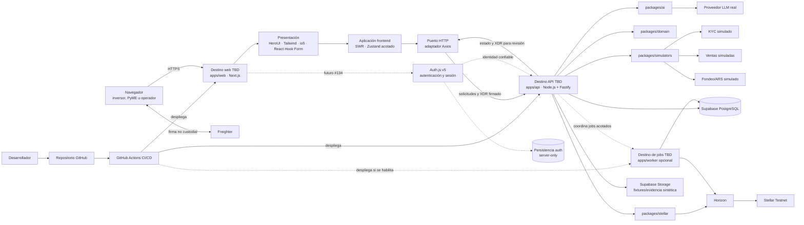

# Vaqcrow — Plan de la demo para el Trabajo Fin de Máster (TFM)

> **Objetivo inmediato:** demostrar en dos semanas una experiencia completa de financiamiento con revenue share sobre Stellar Testnet. Es la demo del TFM del Máster en Desarrollo con IA, para evaluación y aprendizaje; no es un producto financiero habilitado para operar con dinero real.

## 1. Tesis del producto y de la demostración

Vaqcrow permite que una PyME argentina presente evidencia de ventas, reciba una evaluación de riesgo explicable asistida por IA y, después de una aprobación humana, abra una campaña de financiamiento cuyo aporte queda **custodiado por un contrato** en Stellar Testnet: si se alcanza el objetivo, el contrato liquida a la PyME de inmediato; si vence la fecha sin alcanzarlo, reembolsa a los inversores. Cada persona firma con Freighter y Vaqcrow nunca custodia claves ni fondos. La demostración prueba una experiencia coherente de punta a punta: la IA transforma evidencia en una recomendación auditable, las personas conservan el control de sus claves y Stellar aporta custodia y liquidación verificables. KYC, ventas y el corredor ARS/activo Stellar se simulan detrás de interfaces reemplazables porque la prueba no pretende representar una operación regulada real.

## 2. Definición de éxito y posicionamiento

La propuesta se presenta como el proyecto final del **Trabajo Fin de Máster (TFM)** del **Máster en Desarrollo con IA**, construido en un sprint acotado de dos semanas. Su encaje temático está en **DeFi & Real-World Assets** y herramientas financieras locales, con la evaluación asistida por IA como capacidad diferencial del trabajo.

### Qué debe quedar probado ante el tribunal evaluador

- Una historia de usuario completa funciona en vivo en menos de siete minutos.
- La IA es una capacidad central y real, no una etiqueta: produce evaluación estructurada, evidencia, incertidumbre y alertas accionables.
- Freighter actúa como interfaz de wallet y firma; el usuario conserva sus claves y Vaqcrow nunca recibe su seed.
- Al menos un fondeo y una distribución de revenue share quedan confirmados en Stellar Testnet y vinculados a evidencia en el explorador.
- Cada simulación está identificada y tiene una interfaz que corresponde a una integración de producción creíble.
- Quien presenta el trabajo puede explicar con precisión qué se validó y qué sigue abierto para Argentina.

### Bloques Stellar utilizados

La demo usa como bloques de construcción Stellar Testnet, `@stellar/stellar-sdk`, Horizon, Freighter mediante `@stellar/freighter-api` y **contratos de Stellar (Rust + `soroban-sdk`) mediante Stellar RPC**, que son el camino de fondeo. También pueden describirse anchors, activos locales, SDKs, wallets del ecosistema y protocolos DeFi como alternativas evaluadas, sin afirmar que todos estén integrados.

### Posición de la IA

En Vaqcrow, la IA se presenta como **diferenciador estratégico propio** del trabajo, coherente con el eje del máster cursado.

## 3. Historia vertical única

La demostración debe seguir una sola PyME sintética y evitar journeys paralelos:

1. **Solicitud:** “Panadería Horizonte SRL”, PyME argentina sintética, inicia una solicitud con identidad, ventas históricas y comprobantes simulados.
2. **KYC y ventas simulados:** los adaptadores devuelven un caso KYC aprobado y una serie de ventas con faltantes y una anomalía intencional.
3. **Evaluación real de IA:** el modelo analiza únicamente los datos entregados, detecta faltantes/anomalías y devuelve riesgo, razones, evidencia citada, incertidumbre y preguntas pendientes bajo un esquema validado.
4. **Aprobación humana:** un operador revisa evidencia y alertas, ajusta límites si corresponde y registra una decisión explícita. La salida de IA no aprueba por sí sola.
5. **Fondeo no custodial:** el inversor conecta Freighter, revisa una transacción construida por Vaqcrow con passphrase de Testnet explícita y firma el XDR sin entregar su clave.
6. **Verificación y envío:** el backend verifica red, cuenta fuente, destino, activo, monto, memo, secuencia, timeout, operaciones permitidas y firmas antes de enviar la transacción clásica.
7. **Confirmación asíncrona:** la interfaz muestra `submitted`; un worker acotado o un job durable consulta Horizon hasta `confirmed` o `failed`. La respuesta inicial nunca se presenta como liquidación final.
8. **Ventas mensuales simuladas:** el feed registra el siguiente período de ventas y aporta evidencia sintética claramente rotulada.
9. **Cálculo determinístico:** código de dominio calcula la obligación de revenue share con enteros/unidades mínimas y reglas versionadas; el LLM no calcula ni mueve fondos.
10. **Distribución real en Testnet:** la PyME revisa y firma con Freighter una transacción clásica de distribución. El sistema la verifica, envía y confirma de forma asíncrona.
11. **Evidencia:** el dashboard muestra decisiones, estados, montos, hashes y enlaces del explorador para el fondeo y la distribución.

## 4. Matriz real versus simulado

| Capacidad | En la demo | Evidencia visible | Reemplazo de producción |
|---|---|---|---|
| Perfiles y PyME | Datos sintéticos; sin autenticación real en el camino crítico | Banner y fixtures versionados | Auth.js v5 planificado en [#134](https://github.com/reyduar/Vaqcrow/issues/134) como límite futuro de autenticación/sesión; autorización backend separada |
| KYC/KYB | **Simulado** por `KycProvider` | Resultado, timestamp y etiqueta `SIMULATED` | Proveedor KYC/KYB aprobado para Argentina; eventualmente SEP-12 con el anchor |
| Historial y feed mensual de ventas | **Simulado** por `SalesDataProvider` | Dataset reproducible, fuentes y anomalía conocida | APIs fiscales, bancarias, adquirentes o ERP con permiso y cobertura validados |
| Evaluación de riesgo | **Real** | JSON validado, evidencia citada, alertas, versión de prompt/modelo y aprobación humana | Servicio de underwriting gobernado, monitoreado y validado con datos autorizados |
| Decisión de financiamiento | **Real y humana** sobre caso sintético | Actor, timestamp, razones y límites | Workflow de operaciones/compliance con segregación de funciones |
| Cotización/entrada ARS a activo Stellar | **Simulada** por `FundingRailProvider` | Cotización, expiración y estado rotulados | Banco/anchor real para el corredor argentino; SEP-1, SEP-10, SEP-12, SEP-6/24 y SEP-38 según capacidades |
| Wallet y firma | **Real** con Freighter | Cuenta pública, consentimiento y XDR firmado | El mismo adaptador inicial, con evaluación de UX y soporte; siempre no custodial |
| Fondeo | **Real en Testnet**, custodiado por contrato | Hash, dirección de la bóveda y estado del contrato | Activo y corredor aprobados en Public Network después de gates legales/operativos |
| Confirmación | **Real y asíncrona** | Estados `submitted`, `confirmed` o `failed`, latencia y reintentos | Worker durable, cursor persistente, alertas y reconciliación |
| Cálculo de revenue share | **Real y determinístico** | Entradas, regla versionada, redondeo y salida | Motor contractual revisado por legal/contabilidad |
| Distribución | **Real en Testnet**, firmada con Freighter | Hash, receptores, montos y confirmación | Flujo no custodial y activo aprobados, con controles y conciliación |
| Custodia por contrato | **Real en Testnet** (Rust + `soroban-sdk`) | Bóveda por campaña, liquidación atómica al alcanzar el objetivo y reembolso, verificables en el explorador | Contrato auditado, con controles de emergencia y activo aprobado en Public Network |

**Regla de presentación:** una simulación demuestra UX, contratos de integración y control del flujo; no demuestra disponibilidad, legalidad, SLA, costos ni calidad de un proveedor real.

## 5. IA central, explicable y limitada

### Entrada mínima

- Perfil sintético de la PyME y sector.
- Serie mensual de ventas con procedencia por dato.
- Evidencia disponible, faltantes y contradicciones.
- Reglas determinísticas de elegibilidad y límites.

### Salida estructurada

```json
{
  "assessmentId": "asm_demo_001",
  "riskBand": "medium",
  "confidence": 0.72,
  "reasons": [
    { "claim": "Las ventas son estacionales", "evidenceRefs": ["sales:2026-01..08"] }
  ],
  "anomalies": [
    { "type": "outlier", "evidenceRef": "sales:2026-06", "severity": "review" }
  ],
  "missingData": ["Declaración del período 2026-04"],
  "recommendedAction": "human_review",
  "questions": ["¿Qué explica el incremento de junio?"]
}
```

La respuesta se valida contra un esquema estricto. Si contiene campos desconocidos, referencias inexistentes, tipos inválidos o no cita evidencia para una afirmación, se rechaza y pasa a revisión manual.

### Guardrails obligatorios

- La IA **no inventa datos**, no completa faltantes y no presenta inferencias como hechos.
- La IA **no aprueba**, no firma, no construye decisiones finales y no transfiere fondos.
- Los cálculos de monto, porcentaje, redondeo y distribución son determinísticos y se prueban fuera del LLM.
- Toda recomendación muestra evidencia, incertidumbre, modelo/prompt y aprobación o rechazo humano.
- Prompt injection en documentos se trata como contenido no confiable; las herramientas y salidas permitidas son cerradas.
- Ante timeout, salida inválida o proveedor caído, el caso continúa como `manual_review`, nunca como aprobación automática.

## 6. Arquitectura mínima para dos semanas

No se replica la arquitectura completa de producción. Se construyen dos aplicaciones desplegables —web y API—, un worker opcional y paquetes que preservan límites útiles. El proveedor de hosting permanece **TBD y reemplazable**: Next.js y el servicio Node.js con Fastify pueden tener destinos de despliegue distintos.

### Stack tecnológico recomendado

Esta es la selección planificada para implementación; la tabla no afirma que todas las dependencias ya estén instaladas o configuradas.

| Tecnología | Responsabilidad | Por qué es apropiada para esta demo de dos semanas |
|---|---|---|
| Next.js | Aplicación web, experiencia de demo y BFF solo para necesidades propias de la UI | Permite construir y desplegar rápidamente el journey sin trasladar comandos de dominio al navegador |
| [HeroUI](https://www.heroui.com/) | Primitivas accesibles de interfaz | Acelera composición sin reemplazar validación de accesibilidad ni reglas de dominio |
| [Tailwind CSS](https://tailwindcss.com/) | Tema y tokens de diseño centralizados | Evita constantes visuales locales por feature y mantiene coherencia con el sistema aprobado |
| [React Icons `io5`](https://react-icons.github.io/react-icons/icons/io5/) | Set único de iconos de producto | Mantiene consistencia; todo significado crítico se acompaña con texto y semántica accesible |
| [Axios](https://www.axios.com/) | Transporte HTTP detrás de puertos/adaptadores frontend | Aísla detalles de red; presentación no importa Axios ni `packages/contracts` directamente |
| [SWR](https://swr.vercel.app/) | Estado de servidor, caché y revalidación mediante fetchers de aplicación/adaptador | Evita lógica de fetching dispersa y conserva una fuente de verdad para datos remotos |
| [React Hook Form](https://react-hook-form.com/) | Estado y presentación de formularios en navegador | Reduce complejidad de interacción sin sustituir validación o decisiones autoritativas del backend |
| [Zustand](https://zustand.docs.pmnd.rs/learn/getting-started/introduction) | Estado de workflow cliente entre rutas | Conserva continuidad de UI sin duplicar estado de SWR ni estado autoritativo del backend |
| [`VaqcrowWebApp`](https://stitch.withgoogle.com/projects/5439082704079758723) · Stitch ID `5439082704079758723` | Referencia visual y del sistema de diseño | Orienta la implementación revisada en Next.js; el HTML generado nunca es fuente autoritativa de producción |
| Node.js + Fastify | Servidor HTTP/API de larga ejecución, desplegable por separado; orquesta dominio, verifica XDR y coordina solicitudes de IA | Mantiene un límite backend explícito con bajo costo de implementación y buen soporte TypeScript |
| GitHub Actions | CI/CD para pull requests, previews y ramas `main`/demo | Automatiza gates reproducibles sin fijar un proveedor de hosting |
| Vitest | Pruebas unitarias, de dominio y funcionales de la API | Ofrece feedback rápido y una configuración coherente con TypeScript |
| Testing Library | Pruebas de comportamiento de componentes de UI | Valida lo que observa y hace la persona usuaria, sin acoplarse a detalles internos |
| [Playwright](https://playwright.dev/) | Smoke tests y E2E determinísticos del journey crítico, con fixtures o dobles locales | Protege la secuencia de demo sin hacer que los checks de pull request dependan de proveedores vivos |
| Supabase | PostgreSQL gestionado y Storage acotado; no es autoridad paralela de identidad/sesión | Reduce trabajo operativo durante el sprint sin convertirlo en dueño del dominio |
| PostgreSQL | Persistencia de solicitudes, decisiones, intenciones, estados e idempotencia | Aporta consistencia transaccional y trazabilidad con un modelo conocido |
| [Auth.js v5 / NextAuth](https://authjs.dev/) | Límite futuro server-side de autenticación y sesión definido en [#134](https://github.com/reyduar/Vaqcrow/issues/134) | Separa identidad/sesión de autorización backend; no está implementado ni pertenece al camino crítico de esta demo |
| Stellar: Freighter, Horizon y Testnet | Firma no custodial, consulta/envío de transacciones y liquidación de prueba | Demuestra el núcleo técnico del challenge sin usar fondos reales |
| Proveedor LLM real, TBD | Evaluación estructurada de riesgo detrás de `packages/ai` | Hace real la capacidad diferencial y conserva un adaptador reemplazable |

```text
apps/
  web/                 # Next.js: presentación, aplicación frontend, estado y adaptadores HTTP/Freighter
  api/                 # Fastify: casos de uso backend, puertos, XDR y orquestación de proveedores
  worker/              # Opcional: confirmaciones asíncronas y jobs acotados
packages/
  contracts/           # Contratos web/API: esquemas validables, DTOs, eventos e identificadores
  domain/              # Reglas autoritativas puras y cálculos; uso backend y pruebas de dominio
  stellar/             # Solo backend: XDR, Horizon, envío y confirmación
  ai/                  # Solo backend: prompt, evidencia y adaptador de modelo
  simulators/          # Solo backend: KYC, cotización/depósito y feed de ventas
  db/                  # Solo backend: PostgreSQL, migraciones e idempotencia mínima
  ui/                  # Solo web: componentes con más de un uso real
  testing/             # Fixtures de contratos y utilidades de prueba sin reglas de aplicación
```

`apps/web` no sustituye al backend: contiene Next.js, la UI y un BFF únicamente cuando simplifica una necesidad propia de presentación. `apps/api` es un servicio Node.js con Fastify de larga ejecución y despliegue independiente; allí viven la autorización, los comandos de dominio, la verificación del XDR y la coordinación con IA y adaptadores externos. `apps/worker` se agrega únicamente si las confirmaciones o jobs acotados no caben de forma segura en el proceso de la API. No se crean `apps/admin`, microservicios, Kubernetes, un ledger de producción ni una jerarquía de paquetes por tabla durante el sprint.

Supabase aporta **PostgreSQL gestionado** y, si se requiere, Storage limitado a fixtures sintéticos o evidencia de la demostración. Supabase Auth deja de ser una autoridad opcional competidora para el alcance futuro de [#134](https://github.com/reyduar/Vaqcrow/issues/134): Auth.js v5 será el límite de autenticación y sesión, con persistencia server-only, mientras Fastify validará identidad confiable y seguirá siendo dueño de autorización, permisos, comandos y decisiones de dominio. Nada de esto se presenta como implementado ni se incorpora al camino crítico actual, que conserva identidad sintética.

> **Gate de instalación/configuración.** Antes de instalar o configurar cualquier dependencia nombrada, buscar skills disponibles —rutas inyectadas, luego registro o fallback— e inspeccionar servidores MCP conectados. Usar el soporte aplicable y registrar la skill/MCP utilizada o `none` antes de modificar manifest o lockfile. El descubrimiento no autoriza dependencias, configuración MCP ni crecimiento de alcance adicionales.

### Clean Architecture pragmática

`apps/web` y `apps/api` son proyectos independientes: cada uno aplica Clean Architecture según su propio comportamiento y runtime. La estructura del frontend no copia ni refleja las carpetas o capas del backend. El despliegue independiente tampoco obliga a duplicar código, pero cualquier código compartido debe evitar el acoplamiento entre runtimes y capas.

| Unidad | Límite requerido |
|---|---|
| `apps/api` | Es dueño del comportamiento de dominio autoritativo, los casos de uso de aplicación del backend, los puertos de persistencia y la orquestación de proveedores. Sus adaptadores conectan Fastify, PostgreSQL/Supabase, LLM y Stellar/Horizon; dominio y aplicación no importan frameworks ni SDKs de proveedores. |
| `apps/web` · presentación | Compone HeroUI, tokens Tailwind CSS e iconos `io5`; React Hook Form gestiona interacción de formularios. No importa Axios ni `packages/contracts`, no decide reglas de negocio y no usa SDKs de proveedores directamente. |
| `apps/web` · aplicación/estado | Los casos de uso y fetchers orquestan SWR para estado de servidor. Zustand guarda solo workflow cliente entre rutas; no duplica caché SWR, permisos, decisiones ni estado autoritativo del backend. |
| `apps/web` · puertos/adaptadores | Un puerto HTTP separa aplicación de transporte y su adaptador usa Axios; Freighter permanece detrás de su adaptador. Los contratos se traducen fuera de presentación y los detalles de proveedor no entran a las capas internas. |
| `packages/contracts` | Es el límite compartido entre aplicaciones y contiene solo esquemas de solicitudes, respuestas y eventos validables en runtime, sus DTOs, identificadores de correlación y primitivas inmutables realmente universales. Ningún contrato expone tipos de SDKs o detalles internos de una aplicación. |
| `packages/domain` | Conserva reglas y cálculos de negocio autoritativos, puros y sin frameworks, usados por la API y por pruebas de backend/dominio. `apps/web` consume contratos y proyecciones de la API en lugar de importar casos de uso del backend. Una primitiva universal solo pasa a `packages/contracts` cuando es inmutable, no depende de frameworks y su comportamiento compartido está justificado. |

No se comparten casos de uso del backend, interfaces de repositorio, modelos de persistencia, tipos de SDKs de proveedores, estado o view models de UI ni reglas de aplicación del frontend. Los paquetes de integración permanecen del lado que los opera; en particular, el adaptador de Freighter pertenece a `apps/web`, mientras que XDR, Horizon y el envío pertenecen al backend.

Se implementan únicamente las capas y los puertos que mejoran la testabilidad o permiten sustituir un proveedor dentro del alcance de dos semanas. Se rechazan la ceremonia arquitectónica, las abstracciones genéricas de repositorio, una carpeta por entidad y las carpetas o clases sin un límite de comportamiento verificable; esta decisión no amplía el alcance funcional ni operativo de la demo.



Las flechas continuas representan el camino ejecutable de la demo; las flechas punteadas, componentes opcionales o futuros. El bloque Auth.js v5 corresponde a #134, no a una capacidad ya implementada ni a una dependencia del sprint. Fastify es el framework/servidor HTTP de Node.js, **no** la plataforma de despliegue. Los destinos web, API y worker quedan desacoplados para elegir, sustituir o revertir cada hosting por separado.

### CI/CD con GitHub Actions

**En cada pull request:**

1. Instalar dependencias con lockfile congelado.
2. Ejecutar lint, typecheck y comprobaciones automatizadas de límites de importación.
3. Ejecutar Vitest para pruebas unitarias, funcionales y de componentes con Testing Library.
4. Construir las aplicaciones y ejecutar las pruebas determinísticas, incluidos los contratos de adaptadores con dobles locales.

**En la rama `main` o demo:**

1. Repetir todos los gates requeridos del pull request.
2. Preparar un candidato aislado en preview o demo y ejecutar un smoke/E2E acotado con Playwright sobre el journey crítico, usando fixtures o dobles locales para que la verificación de pull request no dependa de proveedores vivos.
3. Desplegar o promover Next.js y la API Fastify solo después de que los gates y Playwright pasen; desplegar el worker únicamente si forma parte del candidato habilitado.

Los secretos se inyectan mediante GitHub Environments y GitHub Secrets. Ninguna seed de Testnet ni token de Supabase, del proveedor LLM o del hosting se escribe en YAML o se imprime en logs. Los workflows permanecen independientes del proveedor; web y API tienen artefactos, despliegues y rollback separados.

### Patrón de adaptadores reemplazables

```ts
interface KycProvider {
  startCase(input: KycInput): Promise<KycCase>;
  getCase(caseId: string): Promise<KycCase>;
}

interface FundingRailProvider {
  createQuote(input: QuoteInput): Promise<ExpiringQuote>;
  getDeposit(depositId: string): Promise<DepositState>;
}

interface SalesDataProvider {
  getPeriods(businessId: string): Promise<SalesPeriod[]>;
  getEvidence(periodId: string): Promise<EvidenceRef[]>;
}
```

Los simuladores y proveedores reales implementan los mismos contratos normalizados. En producción, `KycProvider` apunta al proveedor KYC/KYB autorizado; `FundingRailProvider`, al banco/anchor y sus SEPs acordados; `SalesDataProvider`, a fuentes fiscales, bancarias, adquirentes o ERP autorizadas. La UI y el dominio no importan fixtures ni SDKs externos directamente.

## 7. Stellar Testnet y firma no custodial

### Camino obligatorio

- Usar `@stellar/stellar-sdk` para construir, decodificar, verificar y consultar transacciones.
- Integrar Freighter mediante `@stellar/freighter-api` detrás de un adaptador propio.
- Enviar a Freighter el XDR y la passphrase explícita de **Testnet** para cada solicitud de firma.
- Usar Horizon para cuentas, operaciones y confirmación de pagos clásicos.
- Persistir intención, hash, XDR pertinente, cuenta, sequence number, expiración y estado, sin secretos.
- Responder `202 Accepted` o equivalente al envío y mostrar `submitted`; confirmar después por polling.
- Antes de enviar un XDR firmado, verificar en backend red, fuente, destino, activo, monto, memo, secuencia, timeout, operaciones permitidas y firmas esperadas.

Freighter es una **wallet e interfaz de firma**, no un custodio. Cada participante controla su clave y acepta la transacción. Vaqcrow prepara y verifica transacciones, pero nunca solicita, recibe ni almacena seeds de usuarios.

### Entornos y secretos

| Entorno | Red/datos | Restricción |
|---|---|---|
| Local/CI | Dobles determinísticos; opcional red local | Ninguna dependencia de Testnet para pruebas rápidas |
| Preview | Testnet y datos sintéticos | Cuentas aisladas por despliegue; no reutilizar credenciales sensibles |
| Demo | Testnet y dataset congelado | Cuentas precargadas solo con activos de prueba; hashes preparados como respaldo |
| Producción futura | Public Network y proveedores aprobados | Fuera del alcance; requiere gates legales, operativos y de seguridad |

Variables mínimas: URL de Horizon Testnet, passphrase de red, identificadores de cuentas públicas, URL del explorador, proveedor/modelo LLM y credenciales del servidor. Ninguna seed, clave privada, token real, documento personal ni fondo real se incorpora a Git. Las cuentas de Testnet se provisionan mediante Friendbot o tooling oficial y se rotulan como descartables.

### Decisión: custodia por contrato de campaña

El fondeo **no se liquida como un pago directo**. Cada campaña abre una **bóveda en un contrato** de Stellar, y el aporte queda custodiado por código hasta que se cumpla una de estas condiciones. El contrato es **camino obligatorio y no recortable**: es la única forma conocida de expresar el requisito del producto.

| Situación | Qué hace el contrato |
|---|---|
| **Se alcanza el objetivo** | Liquida a la PyME **en la misma transacción** que cruza el umbral, sin importar la fecha. La campaña queda cerrada y el ledger rechaza cualquier aporte posterior |
| **Vence la fecha sin alcanzar el objetivo** | Pasa a reembolso: cada inversor retira su aporte, y un barrido permissionless cierra los que nadie reclamó |
| **El inversor se arrepiente antes del objetivo** | Puede retirar su aporte mientras la campaña siga abierta |

Por qué no alcanza el camino clásico: el "custodio" de un pago directo es la buena fe de la PyME más un cálculo off-chain, y nada impide a nivel de protocolo que se quede con el aporte. El contrato mueve esa garantía a la máquina de estados del ledger.

> [!danger] Claimable Balance quedó **descartado**
> Se evaluó antes de ir a contratos y no sirve: sus predicados tienen únicamente hojas de tiempo, así que **"el objetivo fue alcanzado" es inexpresable on-chain**. Registro completo del descarte en [[docs/planning/stellar-blockchain-requirements|Requisitos de blockchain Stellar]], sección "Alternativa evaluada y descartada".

> [!info] Detalle técnico, diagramas y riesgos
> La máquina de estados, la superficie del contrato, el patrón de fábrica (**una bóveda por campaña**), el modelo de cuentas, la provisión de la cuenta de la PyME y los riesgos operativos de Testnet —incluida la fecha del próximo reset— están en [[docs/planning/stellar-blockchain-requirements|Requisitos de blockchain Stellar]], sección "Detalle técnico: custodia por contrato de campaña". No se duplican acá.

La **distribución de revenue share** sigue por el camino clásico: `@stellar/stellar-sdk`, Horizon y firma con Freighter.

## 8. Plan de catorce días

| Día | Objetivo | Salida verificable | Dependencia |
|---|---|---|---|
| 1 | Congelar historia, claims y dataset | Guion, wireflow, matriz real/simulado y datos sintéticos | Ninguna |
| 2 | Shell de demo y estados | Navegación completa con fixtures y banners | Día 1 |
| 3 | Dominio y persistencia mínima | Estados, cálculo monetario, IDs correlacionados | Día 1 |
| 4 | Contrato de IA | Esquema, prompt, evidencia y casos golden | Dataset |
| 5 | IA integrada | Evaluación real, anomalías, faltantes y fallback manual | Día 4 |
| 6 | Toolchain y contrato de campaña | Rust, target `wasm32v1-none`, Stellar CLI y red local; contrato con custodia, objetivo y liquidación atómica, con tests verdes | Día 1 |
| 7 | Fábrica, cuentas y bóveda en Testnet | Una bóveda por campaña, cuenta de la PyME verificada al abrir y dirección desplegada | Día 6 |
| 8 | Aporte desde la web y confirmación | Firma con Freighter de la invocación, estados terminales y enlace al explorador | Día 7 |
| 9 | Ventas y obligación | Feed simulado + cálculo determinístico auditable | Dominio |
| 10 | Distribución Testnet | Transacción firmada, enviada y confirmada | Días 8–9 |
| 11 | Integración vertical | Journey completo con correlation ID único | Días 2–10 |
| 12 | Resiliencia y evidencias | Fallbacks, telemetría y dataset congelado | Día 11 |
| 13 | Ensayo con público interno | Demo ≤7 min, tres repeticiones y defectos críticos cerrados | Día 12 |
| 14 | Freeze y presentación final | Build etiquetado, video y hashes de respaldo | Día 13 |

> [!warning] Plan re-presupuestado — estimaciones provisionales
> Los días 6 a 8 cambiaron de "Freighter y pago clásico" a **toolchain y contrato de campaña**, porque la custodia pasó a ser camino obligatorio. El reparto de días es **provisional**: el contrato todavía no se probó en Testnet, así que los tiempos reales se ajustan después del primer spike.

### Frentes de trabajo

| Frente | Responsabilidad | Puede avanzar en paralelo desde |
|---|---|---|
| Producto/demo | Historia, UX, claims, guion y material visual | Día 1 |
| IA/datos | Dataset, esquema, prompt, evaluaciones y guardrails | Día 1 |
| Stellar | Contrato de campaña, fábrica, Freighter, Testnet, confirmación y explorador | Día 2 |
| Dominio/integración | Estados, cálculo, persistencia, adaptadores y E2E | Día 2 |

Dependencia crítica: `demo-shell -> AI assessment -> aprobación humana -> bóveda de campaña -> aporte y firma con Freighter -> liquidación o reembolso por el contrato -> distribución de revenue share -> integration/demo hardening`. La UI puede usar estados predefinidos mientras IA y Stellar se implementan, pero la integración final no puede falsificar esos dos caminos reales.

### Línea de corte

Se elimina trabajo en este orden:

1. Extensiones opcionales sobre contratos (llevar la distribución on-chain, ZK, cross-chain).
2. `apps/worker` separado si el polling durable cabe de forma segura en el servicio API.
3. Animaciones, visualizaciones avanzadas y pantallas secundarias.
4. Segundo caso de PyME, segundo activo o variantes del journey.
5. Persistencia avanzada, autenticación completa y backoffice separado.

Nunca se recortan la evaluación real de IA, la aprobación humana, la **custodia por contrato de campaña**, la firma real con Freighter, la liquidación en Testnet, la confirmación asíncrona, la distribución Testnet ni el rotulado de simulaciones.

## 9. Guion de demo de 5–7 minutos

| Tiempo | Acción | Mensaje clave |
|---|---|---|
| 0:00–0:40 | Presentar problema, tesis y límites | Capital flexible para PyMEs argentinas; demo en Testnet, no oferta real |
| 0:40–1:30 | Abrir la solicitud sintética | KYC y ventas están simulados y claramente identificados |
| 1:30–2:30 | Ejecutar evaluación de IA | La IA cita evidencia, detecta anomalía/faltante y expresa incertidumbre |
| 2:30–3:00 | Aprobar como operador | Una persona decide; el modelo no autoriza fondos |
| 3:00–4:15 | Conectar Freighter y aportar a la bóveda | La custodia es del contrato, no de una persona; la firma es de quien aporta |
| 4:15–4:45 | Alcanzar el objetivo y abrir la bóveda en el explorer | El contrato liquida a la PyME en la misma transacción y cierra la campaña |
| 4:45–5:45 | Cargar ventas y distribuir | Ventas simuladas, cálculo determinístico, firma y distribución real Testnet |
| 5:45–6:30 | Dashboard, límites y siguiente paso | Dos hashes, trazabilidad completa y reemplazos de producción claros |

## 10. Criterios de aceptación

- [ ] El journey único se completa desde un navegador limpio en siete minutos o menos.
- [ ] Toda pantalla que usa datos simulados muestra `SIMULADO` sin depender de explicación oral.
- [ ] La salida de IA cumple el esquema, cita referencias existentes y detecta el faltante/anomalía del fixture.
- [ ] No existe camino en el que la IA apruebe o calcule una transferencia.
- [ ] La aprobación humana registra actor, decisión, razones y timestamp.
- [ ] Freighter solicita cuenta y firma con passphrase de Testnet explícita; ninguna seed entra a Vaqcrow.
- [ ] El backend rechaza un XDR con red, destino, activo, monto u operaciones distintas de la intención.
- [ ] Fondeo y distribución pasan por `submitted` antes de un estado terminal confirmado por Horizon.
- [ ] Ambos movimientos muestran hash, operaciones y enlace de explorador Testnet.
- [ ] El cálculo de revenue share usa unidades mínimas, regla versionada y política explícita de redondeo.
- [ ] Las comprobaciones de arquitectura rechazan dependencias contrarias a los límites definidos, y las pruebas cubren casos de uso mediante puertos y adaptadores mediante sus contratos.
- [ ] LLM y red pueden fallar sin dejar la interfaz bloqueada ni afirmar éxito.
- [ ] No hay secretos, seeds, PII ni fondos reales en repositorio, logs o fixtures.

## 11. Pruebas y evidencia operativa

| Herramienta/nivel | Cobertura mínima del sprint |
|---|---|
| Vitest — unidad y dominio | Cálculo y redondeo de revenue share, transiciones de estado, esquema de IA y verificación XDR |
| Vitest — funcional de API | Rutas Fastify y secuencia construcción -> verificación -> envío -> confirmación, con éxito, rechazo, autorización e idempotencia |
| Vitest — golden/IA | Caso esperado, faltante, anomalía, alucinación/referencia inválida y respuesta mal formada |
| Testing Library + Vitest — componentes | Comportamiento visible de formularios, revisión humana, estados pendientes/terminales, errores y rótulos `SIMULADO` |
| Contrato de adaptadores | KYC, ventas, funding rail, LLM, Freighter y Horizon contra fixtures versionados y dobles determinísticos |
| Arquitectura y límites de importación | Dirección de dependencias de web, API, dominio, aplicación e infraestructura; ausencia de imports directos desde UI/dominio hacia frameworks o SDKs de proveedores no autorizados |
| Playwright — smoke/E2E | Journey crítico completo y determinístico en navegador: solicitud, evaluación, aprobación, Freighter, fondeo, confirmación y distribución; fixtures/dobles locales y fallbacks esenciales de LLM/red |
| Testnet — comprobación operativa | Fondeo y distribución con cuentas aisladas y passphrase explícita, ejecutados fuera de la suite CI determinística |

Las pruebas de pull request no dependen de Testnet, Horizon ni del proveedor LLM: usan dobles y fixtures reproducibles. Las comprobaciones reales de Testnet se ejecutan de manera separada y acotada en preview/demo o manualmente antes del ensayo; un fallo externo no se confunde con una regresión determinística. Playwright protege el journey de demostración, no una matriz exhaustiva de navegadores.

Cada ejecución usa un `correlationId` visible. Se registran latencia del LLM, validación/reintento, decisión humana, hash, estado de transacción, latencia de confirmación y error sanitizado. El panel de demo expone una línea temporal; los logs no contienen XDR innecesario, tokens, secretos ni PII.

### Plan de contingencia

- **LLM caído o lento:** mostrar una evaluación previamente generada y firmada como `RESPUESTA DE RESPALDO`, conservar entradas y versión, y continuar mediante revisión humana. No presentarla como llamada en vivo.
- **Testnet/Horizon caído:** mostrar el intento pendiente, explicar el diseño asíncrono y abrir hashes confirmados durante el ensayo. No cambiar un estado a confirmado manualmente.
- **Freighter no disponible:** usar un video corto del flujo real y los XDR/hashes del ensayo; no usar una seed incrustada como atajo.
- **Aplicación caída:** mantener video completo, capturas, JSON de IA, XDR decodificados y enlaces del explorador en un paquete de evidencia offline.

## 12. Claims y disclaimers exactos

Estos textos deben aparecer en la aplicación y en la presentación, sin eufemismos:

> **Demostración con datos simulados.** La identidad, el KYC/KYB, las ventas y la conversión ARS/activo Stellar de este caso son sintéticos. No representan verificaciones ni movimientos de dinero real.

> **Stellar Testnet.** Las transacciones mostradas usan activos sin valor económico en Stellar Testnet. Un hash de Testnet demuestra ejecución técnica, no una inversión real ni disponibilidad en producción.

> **Firma no custodial.** Freighter es la wallet e interfaz de firma. La persona usuaria conserva sus claves; Vaqcrow construye y verifica la transacción y nunca recibe su seed.

> **IA con supervisión humana.** La IA organiza evidencia, identifica anomalías y propone una evaluación explicable. No inventa datos, no toma la decisión final, no calcula obligaciones financieras y no transfiere fondos.

> **No apto para producción.** Esta demo no constituye una oferta de inversión, recomendación financiera, aprobación regulatoria ni prueba de legalidad, rentabilidad, solvencia, custodia, calidad de proveedores u operación en Argentina.

## 13. SDD-lite por capacidad

Cada slice conserva una ficha breve con: objetivo, escenarios observables, límites, tareas, pruebas y evidencia. No se crea una especificación global de la startup ni se bloquea el sprint con ceremonia documental.

| Orden | Cambio acotado | Escenarios imprescindibles | Evidencia de cierre |
|---|---|---|---|
| 1 | `demo-shell` | Caso sintético, estados y rotulado de simulaciones | Journey navegable y fixture congelado |
| 2 | `ai-assessment` | Éxito, faltante, anomalía, salida inválida y timeout | JSON validado, golden tests y revisión humana |
| 3 | `campaign-vault` | Custodia, objetivo, liquidación atómica, retiro antes del objetivo y reembolso con barrido | Contrato desplegado, tests verdes y hash Testnet |
| 4 | `stellar-confirmation` | Pendiente, éxito, fallo y reanudación | Timeline y estado terminal consultado |
| 5 | `revenue-share-distribution` | Cálculo, redondeo, firma y reparto | Asignaciones balanceadas y hash Testnet |
| 6 | `integration-demo-hardening` | Journey completo, caída de LLM/red y respaldo | Ensayo ≤7 minutos y paquete de evidencia |

Flujo reducido: `proposal breve -> scenarios/design notes -> tasks -> implementation/tests -> evidence`. Cada ficha debe caber en una revisión corta y puede detenerse si amenaza el camino crítico.

## 14. Decisiones abiertas reales

| Prioridad | Decisión | Fecha límite | No bloquea |
|---|---|---|---|
| P0 | Elegir el activo de prueba y cuentas Testnet para el guion | Día 2 | Validación futura del corredor real |
| P0 | Elegir proveedor/modelo LLM y presupuesto/timeout de demo | Día 2 | Modelo de underwriting de producción |
| P1 | Resolver si el hosting exige `apps/worker` separado | Día 6 | Diseño del worker de producción |
| P1 | Definir la ubicación del workspace Rust del contrato y si `dependency-cruiser` lo cubre | Día 6 | Ninguna: el contrato es camino obligatorio |
| P1 | Decidir si el contrato es actualizable y si lleva control de pausa | Día 7 | Demo en Testnet; no bloquea el guion |
| P2 | Definir cómo se notifica al inversor que le corresponde un reembolso | Día 10 | El barrido permissionless garantiza el resultado aunque el aviso falle |

Argentina y el modelo no custodial con Freighter están resueltos y **no se reabren** durante el sprint. El corredor ARS/activo Stellar, el anchor y la clasificación legal continúan como decisiones de producción, no como bloqueantes de Testnet.

## 15. Fuentes

### Stellar

- Guía frontend y firma con Freighter: <https://developers.stellar.org/docs/build/guides/dapps/frontend-guide>
- SDKs cliente: <https://developers.stellar.org/docs/tools/sdks/client-sdks>
- Horizon: <https://developers.stellar.org/docs/data/apis/horizon>
- Stellar RPC: <https://developers.stellar.org/docs/data/apis/rpc>
- Stellar CLI: <https://developers.stellar.org/docs/tools/developer-tools/cli/stellar-cli>
- Wallets y anchors: <https://developers.stellar.org/docs/build/apps/wallet/intro>
