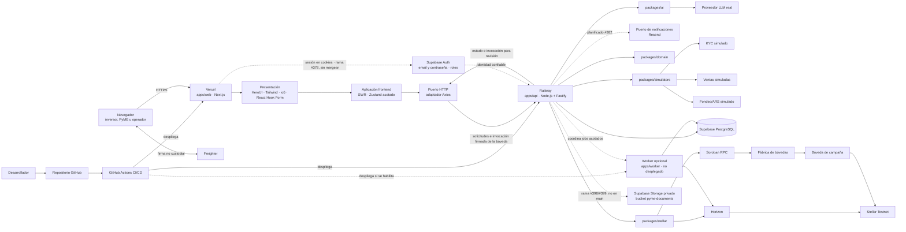

# Vaqcrow — Plan de la demo para el Trabajo Fin de Máster (TFM)

> **Objetivo inmediato:** demostrar una experiencia completa de financiamiento con revenue share sobre Stellar Testnet, con la forma de un producto por roles (PyME, inversor y administrador). Es la demo del TFM del Máster en Desarrollo con IA, para evaluación y aprendizaje; no es un producto financiero habilitado para operar con dinero real.

> [!info] Dirección de producto vigente (decisión del owner, 2026-10-01)
> La app deja de ser un único recorrido guiado y pasa a ser un **producto con roles con la forma exacta del template de Claude Design**, cuyo handoff vive en `docs/design/design_handoff_vaqcrow/` (`README.md`, `brief/`, `screens/`) y es la fuente visual y de comportamiento: lo que el template no diseña no se inventa, se registra como pregunta abierta en su issue. El plan ejecutable está en [[docs/planning/demo-tasks-list|la hoja de ruta]] (Epics [#368](https://github.com/reyduar/Vaqcrow/issues/368), [#373](https://github.com/reyduar/Vaqcrow/issues/373), [#374](https://github.com/reyduar/Vaqcrow/issues/374), [#375](https://github.com/reyduar/Vaqcrow/issues/375), [#376](https://github.com/reyduar/Vaqcrow/issues/376) y [#377](https://github.com/reyduar/Vaqcrow/issues/377)). El recorrido guiado de seis pasos y el motor que lo sostiene existen hoy en `main`; las Features nuevas reutilizan el motor y retiran las rutas del recorrido ([#438](https://github.com/reyduar/Vaqcrow/issues/438)). Donde este documento describe el estado de hoy lo dice; donde describe la dirección, lo marca como planificado.

## 1. Tesis del producto y de la demostración

Vaqcrow permite que una PyME argentina se registre, suba su documentación y fotos, reciba un chequeo de completitud y una evaluación de riesgo explicable asistida por IA y, después de una aprobación humana de un administrador, abra una campaña de financiamiento cuyo aporte queda **custodiado por un contrato** en Stellar Testnet: si se alcanza el objetivo, el contrato liquida a la PyME de inmediato; si vence la fecha sin alcanzarlo, reembolsa a los inversores. Cada persona firma con Freighter y **Vaqcrow nunca custodia claves ni recibe ni mueve dinero de terceros** (ARS o cripto). La demostración prueba un producto coherente por roles: la IA transforma evidencia en una recomendación auditable, las personas conservan el control de sus claves y Stellar aporta custodia y liquidación verificables. Las cuentas, los roles y los documentos son reales (Supabase Auth y Storage); el KYC/KYB, las ventas históricas y el corredor ARS/activo Stellar se simulan detrás de interfaces reemplazables porque la prueba no pretende representar una operación regulada real.

## 2. Definición de éxito y posicionamiento

La propuesta se presenta como el proyecto final del **Trabajo Fin de Máster (TFM)** del **Máster en Desarrollo con IA**, construido en un sprint acotado de dos semanas. Su encaje temático está en **DeFi & Real-World Assets** y herramientas financieras locales, con la evaluación asistida por IA como capacidad diferencial del trabajo.

### Qué debe quedar probado ante el tribunal evaluador

- Los tres workflows por rol (PyME, inversor y administrador) funcionan de punta a punta sobre las pantallas del template, con cuentas reales y sin ocultar qué es simulado. No hay un objetivo de duración: el que existía se eliminó el 2026-10-01 porque el owner nunca lo propuso.
- La IA es una capacidad central y real, no una etiqueta: produce evaluación estructurada, evidencia, incertidumbre y alertas accionables.
- Freighter actúa como interfaz de wallet y firma; el usuario conserva sus claves y Vaqcrow nunca recibe su seed.
- Al menos un fondeo y una distribución de revenue share quedan confirmados en Stellar Testnet y vinculados a evidencia en el explorador.
- Cada simulación está identificada y tiene una interfaz que corresponde a una integración de producción creíble.
- Quien presenta el trabajo puede explicar con precisión qué se validó y qué sigue abierto para Argentina.

### Bloques Stellar utilizados

La demo usa como bloques de construcción Stellar Testnet, `@stellar/stellar-sdk`, Horizon, Freighter mediante `@stellar/freighter-api` y **contratos de Stellar (Rust + `soroban-sdk`) mediante Stellar RPC**, que son el camino de fondeo. También pueden describirse anchors, activos locales, SDKs, wallets del ecosistema y protocolos DeFi como alternativas evaluadas, sin afirmar que todos estén integrados.

### Posición de la IA

En Vaqcrow, la IA se presenta como **diferenciador estratégico propio** del trabajo, coherente con el eje del máster cursado.

## 3. Workflows por rol

> [!info] Estado frente a dirección
> Hoy `main` entrega el motor (solicitud, evaluación de IA, aprobación humana, bóveda, ventas, distribución, evidencia) detrás de un recorrido guiado de seis pasos con sesión de demostración. Lo que sigue describe la **dirección planificada** (Epics #368–#377): los tres workflows por rol reutilizan ese motor. La identidad ya está implementada en ramas apiladas que todavía no llegaron a `main`: Supabase Auth, roles y autorización de la API en la de [#369](https://github.com/reyduar/Vaqcrow/issues/369), y alta, ingreso, header por rol y rutas protegidas de la web en la de [#378](https://github.com/reyduar/Vaqcrow/issues/378) (Task [#379](https://github.com/reyduar/Vaqcrow/issues/379)). Sobre esa pila, la rama de [#398](https://github.com/reyduar/Vaqcrow/issues/398)/[#399](https://github.com/reyduar/Vaqcrow/issues/399) implementa el wizard de alta de la PyME y la carga real de documentos y fotos a un bucket privado, y **tampoco está en `main`**. El recorrido guiado se retira en [#438](https://github.com/reyduar/Vaqcrow/issues/438) cuando sus rutas ya están alojadas en las Features por rol.

La app tiene tres roles —`PYME`, `INVERSOR` y `ADMIN`— con autenticación real (§6). `PYME` e `INVERSOR` se eligen al crear la cuenta; `ADMIN` nunca se autoasigna. Módulos del template: Landing, Ingresar / Crear cuenta, Explorar PyMEs (marketplace), Detalle PyME, área de la PyME («Mi campaña»), área del inversor («Mi portafolio», «Informes»), consola de administración (`/admin`, sin alta pública), Acerca de, Ayuda (el asistente RAG es futuro: «Próximamente»), Guía de inversión y Guía para emprendedores. Explorar PyMEs, las guías y la ayuda son públicas sin onboarding; el detalle de una PyME exige cuenta.

**Rutas, siempre en inglés:** `/` (landing), `/signup` y `/login` (Crear cuenta / Ingresar), `/portfolio` (Mi portafolio, sólo `INVERSOR`), `/company` (Mi campaña, sólo `PYME`), `/explore`, `/about`, `/investor-guide`, `/entrepreneur-guide`, `/reports` y `/admin`. El ingreso redirige según el rol del perfil verificado (`INVERSOR` → `/portfolio`, `PYME` → `/company`), nunca según el selector del formulario; pero el selector «Soy inversor / Soy PyME» tiene que coincidir con ese rol: si no, el ingreso se rechaza y no queda sesión, y un `ADMIN` no ingresa por `/login` (decisión del owner D14, 2026-10-03, implementada en la rama de seguimientos de #378). En la rama de #378 existen `/signup`, `/login`, `/portfolio` y `/company` (estas dos como esqueletos protegidos por sesión y rol en el servidor) y `/` como esqueleto de la landing; el resto lo construyen sus issues (tabla en [[docs/design/demo-ui|Diseño UI/UX]] §4). El flujo de la PyME es un panel más un único wizard, sin una ruta por paso: la decisión completa está en `CLAUDE.md` («The PyME flow is a dashboard plus one wizard»).

### Workflow de la PyME

1. **Cuenta y alta:** Landing → Crear cuenta (`/signup`) → «Mi campaña» (`/company`) → «Registrar mi PyME», visible sólo mientras la PyME no registró su empresa, abre un único wizard, implementado en la rama de [#399](https://github.com/reyduar/Vaqcrow/issues/399) (apilada y **todavía no en `main`**): 1 KYC simulado → 2 Registro PyME → 3 Evaluación AI simulada → 4 Revisión humana.
2. **Datos y documentos:** en la rama de #399 la PyME sube de verdad tres documentos obligatorios (declaraciones de ventas, constancia de CUIT, estatuto) y hasta cuatro fotos opcionales a un bucket privado `pyme-documents` de Supabase Storage (10 MB, PDF/JPG/PNG), con RLS de lectura por propietario; la subida es **mediada por la API** (`POST`/`DELETE /storage/uploads`), que valida los bytes y escribe con `service_role`. El contenido subido es **no confiable**.
3. **IA en dos pasos:** primero un chequeo de completitud; después una evaluación de riesgo. La IA es solo asesora: no aprueba ni calcula obligaciones ni mueve fondos. En el paso 3 del wizard la evaluación corre hoy **simulada detrás de un puerto** (`AiEvaluationPort`); el chequeo real de [#402](https://github.com/reyduar/Vaqcrow/issues/402) entra por ese mismo puerto.
4. **Wallet en la revisión:** en el paso 4 del wizard (Revisión humana) la PyME conecta o crea su cuenta Freighter y entrega su **clave pública**, obligatoria porque esa cuenta es el destino de la bóveda. La conexión corre detrás del `WalletPort`; el Freighter real llega con [#406](https://github.com/reyduar/Vaqcrow/issues/406). No hay un popup de wallet al entrar a `/company` y Vaqcrow nunca recibe su seed.
5. **Envío a revisión (owner, 2026-10-03):** en el paso 4 la propia PyME aprieta «Enviar a revisión». Sin wallet conectada, el ítem «Conectar Freighter» pasa a rojo («Obligatorio») y el envío se bloquea con el aviso «Conectá tu wallet Freighter para poder enviar la solicitud a revisión.»; una vez enviada, «Revisión humana» pasa a amarillo («En proceso»). El envío lleva al administrador la clave pública de la PyME (destino inmutable de la bóveda) y lo notifica por email y con una notificación entrante en su dashboard. La PyME no firma nada en este paso.
6. **Aprobación y bóveda:** al aprobar, la plataforma firma el despliegue de la bóveda (el `POST /campaigns` existente) con la **cuenta de la PyME como destino inmutable** y publica la PyME en el marketplace.
7. **Mi campaña:** muestra bóvedas vigentes e históricas, saldo en XLM, clave pública, distribuciones, ventas declaradas y aportantes. El dinero se muestra en ARS con su equivalente en XLM. La PyME puede cargar fondos en su propia wallet.
8. **Cada mes:** la PyME declara sus ventas; la plataforma calcula la obligación de forma determinística y arma la transacción de distribución; **la PyME la firma en Freighter**.

### Workflow del inversor

1. Landing, Explorar PyMEs, guías y ayuda son públicos y no exigen onboarding.
2. El detalle de una PyME exige una cuenta. «Aportar» sin wallet redirige a **Mi portafolio** para conectar Freighter.
3. Con la wallet conectada: modal «Revisión antes de firmar» y firma de la invocación de la bóveda en Freighter.
4. El **KYC del inversor es simulado y se aprueba automáticamente en el primer aporte**; no hay aprobación manual de inversores por parte del administrador.
5. Mi portafolio muestra posiciones, retiro mientras la campaña siga abierta y distribuciones recibidas; Informes agrega períodos, KPIs y ventas declaradas.

### Workflow del administrador

Login en `/admin` → cola de PyMEs → Revisión (chequeos por documento, recomendación de IA y decisión humana registrada con actor, razones y timestamp) → Usuarios y registro de auditoría → notificaciones. El super admin («Admin Vaqcrow», `vaqcrow.admin`) se siembra directamente: su email y contraseña vienen de variables de entorno y **nunca se versionan** (el repositorio es público). Los demás administradores se crean por invitación de otro administrador.

### Motor reutilizado

Los pasos que ejecuta el motor no cambian de naturaleza al pasar a roles: evaluación real de IA con esquema validado, aprobación humana, bóveda de contrato con custodia y liquidación atómica, confirmación asíncrona (`submitted` → `confirmed`/`failed`), ventas mensuales simuladas, cálculo determinístico de revenue share con enteros y reglas versionadas (el LLM no calcula ni mueve fondos), distribución real en Testnet firmada con Freighter y evidencia con hashes y enlaces del explorador.

## 4. Matriz real versus simulado

| Capacidad | En la demo | Evidencia visible | Reemplazo de producción |
|---|---|---|---|
| Cuentas, sesión y roles | **Real (implementada en la rama de la Feature [#369](https://github.com/reyduar/Vaqcrow/issues/369), apilada con [#378](https://github.com/reyduar/Vaqcrow/issues/378) (login y shell por rol) y **todavía no en `main`**):** Supabase Auth con email y contraseña y confirmación de email, roles `PYME` / `INVERSOR` / `ADMIN`, RLS por rol y superadmin sembrado con un script manual por perfil. La recuperación de contraseña está diferida (owner). En la web, la Task [#379](https://github.com/reyduar/Vaqcrow/issues/379) implementa en la rama de #378 el alta y el ingreso reales (`/signup`, `/login`), la sesión en cookies, el header por rol, el cierre de sesión y `/portfolio` / `/company` protegidas en el servidor; hoy `main` conserva una sesión de demostración | Cuenta real, rol verificado en el servidor y registro de auditoría | Mismo límite; la recuperación de contraseña se decide en un issue posterior; autorización backend siempre separada. Reemplaza el Auth.js v5 de [#134](https://github.com/reyduar/Vaqcrow/issues/134) |
| Datos de la PyME | Reales en cuanto a la carga; el contenido es sintético o de prueba | Formularios y banner de demostración | Datos reales sujetos a KYC/KYB aprobado |
| Documentos y fotos de la PyME | **Real (implementada en la rama de [#399](https://github.com/reyduar/Vaqcrow/issues/399), apilada y todavía no en `main`):** subida mediada por la API a un bucket privado `pyme-documents` (10 MB, PDF/JPG/PNG), RLS de lectura por propietario; contenido no confiable | Archivos listados por tipo y tamaño en la revisión | Antivirus, retención y políticas de datos personales |
| KYC/KYB de la PyME | **Simulado** por `KycProvider` | Resultado, timestamp y etiqueta `SIMULATED` | Proveedor KYC/KYB aprobado para Argentina; eventualmente SEP-12 con el anchor |
| KYC del inversor | **Simulado y aprobado automáticamente en el primer aporte**; sin aprobación manual del administrador | Estado y etiqueta `SIMULADO` | Proveedor KYC aprobado para Argentina |
| Historial y feed mensual de ventas | **Simulado** por `SalesDataProvider` | Dataset reproducible, fuentes y anomalía conocida | APIs fiscales, bancarias, adquirentes o ERP con permiso y cobertura validados |
| Chequeo de completitud y evaluación de riesgo | **Real** en el motor, en dos pasos (completitud y luego riesgo); en el paso 3 del wizard (#399) hoy es **simulado** detrás de `AiEvaluationPort` hasta [#402](https://github.com/reyduar/Vaqcrow/issues/402) | JSON validado, evidencia citada, alertas, versión de prompt/modelo y aprobación humana | Servicio de underwriting gobernado, monitoreado y validado con datos autorizados |
| Decisión de financiamiento | **Real y humana** sobre caso sintético | Actor, timestamp, razones y límites | Workflow de operaciones/compliance con segregación de funciones |
| Cotización/entrada ARS a activo Stellar | **Simulada** por `FundingRailProvider` | Cotización, expiración y estado rotulados | Banco/anchor real para el corredor argentino; SEP-1, SEP-10, SEP-12, SEP-6/24 y SEP-38 según capacidades |
| Wallet y firma | **Real** con Freighter, para PyME e inversor; en el paso 4 del wizard (#399) la conexión corre detrás de `WalletPort` hasta [#406](https://github.com/reyduar/Vaqcrow/issues/406) | Cuenta pública, consentimiento y XDR firmado | El mismo adaptador inicial, con evaluación de UX y soporte; siempre no custodial |
| Despliegue de la bóveda | **Real en Testnet**: la aprobación del administrador dispara el `POST /campaigns` firmado por la plataforma, con la cuenta de la PyME como destino inmutable | Dirección de la bóveda y hash del despliegue | Fábrica y contrato auditados |
| Notificaciones | **Real (planificado, [#382](https://github.com/reyduar/Vaqcrow/issues/382)):** campana in-app para los tres roles y email por Resend detrás de un puerto; las pruebas del PR usan un doble | Campana y correos | El mismo puerto con dominio y remitente verificados |
| Fondeo | **Real en Testnet**, custodiado por contrato | Hash, dirección de la bóveda y estado del contrato | Activo y corredor aprobados en Public Network después de gates legales/operativos |
| Confirmación | **Real y asíncrona** | Estados `submitted`, `confirmed` o `failed`, latencia y reintentos | Worker durable, cursor persistente, alertas y reconciliación |
| Cálculo de revenue share | **Real y determinístico** | Entradas, regla versionada, redondeo y salida | Motor contractual revisado por legal/contabilidad |
| Distribución | **Real en Testnet**: la plataforma calcula y arma la transacción, y la PyME la firma en Freighter | Hash, receptores, montos y confirmación | Flujo no custodial y activo aprobados, con controles y conciliación |
| Custodia por contrato | **Real en Testnet** (Rust + `soroban-sdk`) | Bóveda por campaña, liquidación atómica al alcanzar el objetivo y reembolso, verificables en el explorador | Contrato auditado, con controles de emergencia y activo aprobado en Public Network |

**Regla de presentación:** el dinero en ARS y su conversión a activo Stellar siguen **simulados** (no hay corredor real: Vaqcrow no mueve ARS ni cripto de terceros). Una simulación demuestra UX, contratos de integración y control del flujo; no demuestra disponibilidad, legalidad, SLA, costos ni calidad de un proveedor real.

## 5. IA central, explicable y limitada

### Entrada mínima

- Perfil sintético de la PyME y sector.
- Serie mensual de ventas con procedencia por dato.
- Evidencia disponible, faltantes y contradicciones.
- Reglas determinísticas de elegibilidad y límites.

### Salida estructurada

```json
{
  "assessmentId": "asm_demo_001",
  "riskBand": "medium",
  "confidence": 0.72,
  "reasons": [
    { "claim": "Las ventas son estacionales", "evidenceRefs": ["sales:2026-01..08"] }
  ],
  "anomalies": [
    { "type": "outlier", "evidenceRef": "sales:2026-06", "severity": "review" }
  ],
  "missingData": ["Declaración del período 2026-04"],
  "recommendedAction": "human_review",
  "questions": ["¿Qué explica el incremento de junio?"]
}
```

La respuesta se valida contra un esquema estricto. Si contiene campos desconocidos, referencias inexistentes, tipos inválidos o no cita evidencia para una afirmación, se rechaza y pasa a revisión manual.

### Guardrails obligatorios

- La IA **no inventa datos**, no completa faltantes y no presenta inferencias como hechos.
- La IA **no aprueba**, no firma, no construye decisiones finales y no transfiere fondos.
- Los cálculos de monto, porcentaje, redondeo y distribución son determinísticos y se prueban fuera del LLM.
- Toda recomendación muestra evidencia, incertidumbre, modelo/prompt y aprobación o rechazo humano.
- Prompt injection en documentos se trata como contenido no confiable; las herramientas y salidas permitidas son cerradas.
- Ante timeout, salida inválida o proveedor caído, el caso continúa como `manual_review`, nunca como aprobación automática.

## 6. Arquitectura mínima para dos semanas

No se replica la arquitectura completa de producción. Se construyen dos aplicaciones desplegables —web y API—, un worker opcional y paquetes que preservan límites útiles. El hosting quedó **decidido y desplegado** —Vercel para la web, Railway para la API— y ambos destinos siguen siendo reemplazables: Next.js y el servicio Node.js con Fastify se despliegan por separado.

### Stack tecnológico recomendado

Esta es la selección planificada para implementación; la tabla no afirma que todas las dependencias ya estén instaladas o configuradas.

| Tecnología | Responsabilidad | Por qué es apropiada para esta demo de dos semanas |
|---|---|---|
| Next.js | Aplicación web, experiencia de demo y BFF solo para necesidades propias de la UI | Permite construir y desplegar rápidamente las pantallas por rol sin trasladar comandos de dominio al navegador |
| [HeroUI](https://www.heroui.com/) | Primitivas accesibles de interfaz | Acelera composición sin reemplazar validación de accesibilidad ni reglas de dominio |
| [Tailwind CSS](https://tailwindcss.com/) | Tema y tokens de diseño centralizados | Evita constantes visuales locales por feature y mantiene coherencia con el sistema aprobado |
| [React Icons `io5`](https://react-icons.github.io/react-icons/icons/io5/) | Set único de iconos de producto | Mantiene consistencia; todo significado crítico se acompaña con texto y semántica accesible |
| [Axios](https://www.axios.com/) | Transporte HTTP detrás de puertos/adaptadores frontend | Aísla detalles de red; presentación no importa Axios ni `packages/contracts` directamente |
| [SWR](https://swr.vercel.app/) | Estado de servidor, caché y revalidación mediante fetchers de aplicación/adaptador | Evita lógica de fetching dispersa y conserva una fuente de verdad para datos remotos |
| [React Hook Form](https://react-hook-form.com/) | Estado y presentación de formularios en navegador | Reduce complejidad de interacción sin sustituir validación o decisiones autoritativas del backend |
| [Zustand](https://zustand.docs.pmnd.rs/learn/getting-started/introduction) | Estado de workflow cliente entre rutas | Conserva continuidad de UI sin duplicar estado de SWR ni estado autoritativo del backend |
| Template de Claude Design (`docs/design/template/`) | Referencia visual y del sistema de diseño | Orienta la implementación revisada en Next.js; el HTML generado nunca es fuente autoritativa de producción |
| Node.js + Fastify | Servidor HTTP/API de larga ejecución, desplegable por separado; orquesta dominio, verifica XDR y coordina solicitudes de IA | Mantiene un límite backend explícito con bajo costo de implementación y buen soporte TypeScript |
| GitHub Actions | CI/CD para pull requests, previews y ramas `main`/demo | Automatiza gates reproducibles sin fijar un proveedor de hosting |
| Vitest | Pruebas unitarias, de dominio y funcionales de la API | Ofrece feedback rápido y una configuración coherente con TypeScript |
| Testing Library | Pruebas de comportamiento de componentes de UI | Valida lo que observa y hace la persona usuaria, sin acoplarse a detalles internos |
| [Playwright](https://playwright.dev/) | Smoke tests y E2E determinísticos de los workflows por rol, con fixtures o dobles locales | Protege la secuencia de demo sin hacer que los checks de pull request dependan de proveedores vivos |
| Supabase | PostgreSQL gestionado, **Auth** (email y contraseña) y **Storage** privado para documentos y fotos de la PyME | Reduce trabajo operativo; la autorización del dominio sigue siendo del backend y de RLS |
| PostgreSQL | Persistencia de solicitudes, decisiones, intenciones, estados e idempotencia | Aporta consistencia transaccional y trazabilidad con un modelo conocido |
| [Resend](https://resend.com/) | Email transaccional detrás de un puerto y adaptador ([#382](https://github.com/reyduar/Vaqcrow/issues/382)); las pruebas del PR usan un doble | Aísla al proveedor y evita que un fallo externo rompa pruebas determinísticas |
| Stellar: Freighter, Horizon y Testnet | Firma no custodial, consulta/envío de transacciones y liquidación de prueba | Demuestra el núcleo técnico del challenge sin usar fondos reales |
| Proveedor LLM real (`opencode-go`) | Evaluación estructurada de riesgo detrás de `packages/ai` | Hace real la capacidad diferencial y conserva un adaptador reemplazable |

```text
apps/
  web/                 # Next.js: presentación, aplicación frontend, estado y adaptadores HTTP/Freighter
  api/                 # Fastify: casos de uso backend, puertos, XDR y orquestación de proveedores
  worker/              # Opcional: confirmaciones asíncronas y jobs acotados
packages/
  contracts/           # Contratos web/API: esquemas validables, DTOs, eventos e identificadores
  domain/              # Reglas autoritativas puras y cálculos; uso backend y pruebas de dominio
  stellar/             # Solo backend: XDR, Horizon, envío y confirmación
  ai/                  # Solo backend: prompt, evidencia y adaptador de modelo
  simulators/          # Solo backend: KYC, cotización/depósito y feed de ventas
  db/                  # Solo backend: PostgreSQL, migraciones e idempotencia mínima
  ui/                  # Solo web: componentes con más de un uso real
  testing/             # Fixtures de contratos y utilidades de prueba sin reglas de aplicación
```

`apps/web` no sustituye al backend: contiene Next.js, la UI y un BFF únicamente cuando simplifica una necesidad propia de presentación. `apps/api` es un servicio Node.js con Fastify de larga ejecución y despliegue independiente; allí viven la autorización, los comandos de dominio, la verificación del XDR y la coordinación con IA y adaptadores externos. `apps/worker` se agrega únicamente si las confirmaciones o jobs acotados no caben de forma segura en el proceso de la API. La consola de administración es un grupo de rutas `/admin` dentro de `apps/web`, no una aplicación aparte: no se crea `apps/admin`. Tampoco se crean microservicios, Kubernetes, un ledger de producción ni una jerarquía de paquetes por tabla.

Supabase aporta **PostgreSQL gestionado**, **Auth** (email y contraseña) y **Storage** privado. La autenticación real con Supabase Auth ([#369](https://github.com/reyduar/Vaqcrow/issues/369)) **reemplaza el límite de Auth.js v5** planificado en [#134](https://github.com/reyduar/Vaqcrow/issues/134) (decisión del owner, 2026-10-01): los roles `PYME`, `INVERSOR` y `ADMIN` se guardan del lado del servidor y se confían solo desde el token/perfil verificado, nunca desde el estado del cliente; RLS aplica por rol; Fastify valida la identidad y sigue siendo dueño de autorización, permisos, comandos y decisiones de dominio, con denegación por defecto en cada endpoint. La clave `service_role` es solo del servidor. Los documentos y fotos de la PyME van a un bucket privado `pyme-documents` con RLS de lectura por propietario, 10 MB y PDF/JPG/PNG, y la subida es mediada por la API (`POST`/`DELETE /storage/uploads`), que valida los bytes y escribe con `service_role`; el contenido subido es no confiable. El bucket y su RLS se implementan en la rama de [#398](https://github.com/reyduar/Vaqcrow/issues/398)/[#399](https://github.com/reyduar/Vaqcrow/issues/399) (apilada, no en `main`). La autenticación está implementada en la rama de la Feature [#369](https://github.com/reyduar/Vaqcrow/issues/369), apilada con [#378](https://github.com/reyduar/Vaqcrow/issues/378) (alta, ingreso y shell por rol, implementados por la Task [#379](https://github.com/reyduar/Vaqcrow/issues/379)) y **todavía no en `main`**; hoy `main` conserva la sesión de demostración. La confirmación de email usa Resend como SMTP en el proyecto remoto (el owner activó el SMTP propio el 2026-10-03 —no el 2026-10-02, como decía antes: el primer alta real salió por el mailer por defecto de Supabase— y la entrega real por Resend se observó ese mismo día en un preview de Vercel) y Mailpit en local; el superadmin se siembra con `seed:superadmin:docker|cloud`, nunca al arrancar la API. Brecha conocida: las rutas `PYME` verifican el rol pero no la propiedad por fila hasta [#398](https://github.com/reyduar/Vaqcrow/issues/398). Detalle en [[docs/architecture/identity-and-rls-boundaries|Límites de identidad y RLS]] §9.

> **Gate de instalación/configuración.** Antes de instalar o configurar cualquier dependencia nombrada, buscar skills disponibles —rutas inyectadas, luego registro o fallback— e inspeccionar servidores MCP conectados. Usar el soporte aplicable y registrar la skill/MCP utilizada o `none` antes de modificar manifest o lockfile. El descubrimiento no autoriza dependencias, configuración MCP ni crecimiento de alcance adicionales.

### Clean Architecture pragmática

`apps/web` y `apps/api` son proyectos independientes: cada uno aplica Clean Architecture según su propio comportamiento y runtime. La estructura del frontend no copia ni refleja las carpetas o capas del backend. El despliegue independiente tampoco obliga a duplicar código, pero cualquier código compartido debe evitar el acoplamiento entre runtimes y capas.

| Unidad | Límite requerido |
|---|---|
| `apps/api` | Es dueño del comportamiento de dominio autoritativo, los casos de uso de aplicación del backend, los puertos de persistencia y la orquestación de proveedores. Sus adaptadores conectan Fastify, PostgreSQL/Supabase, LLM y Stellar/Horizon; dominio y aplicación no importan frameworks ni SDKs de proveedores. |
| `apps/web` · presentación | Compone HeroUI, tokens Tailwind CSS e iconos `io5`; React Hook Form gestiona interacción de formularios. No importa Axios ni `packages/contracts`, no decide reglas de negocio y no usa SDKs de proveedores directamente. |
| `apps/web` · aplicación/estado | Los casos de uso y fetchers orquestan SWR para estado de servidor. Zustand guarda solo workflow cliente entre rutas; no duplica caché SWR, permisos, decisiones ni estado autoritativo del backend. |
| `apps/web` · puertos/adaptadores | Un puerto HTTP separa aplicación de transporte y su adaptador usa Axios; Freighter permanece detrás de su adaptador. Los contratos se traducen fuera de presentación y los detalles de proveedor no entran a las capas internas. |
| `packages/contracts` | Es el límite compartido entre aplicaciones y contiene solo esquemas de solicitudes, respuestas y eventos validables en runtime, sus DTOs, identificadores de correlación y primitivas inmutables realmente universales. Ningún contrato expone tipos de SDKs o detalles internos de una aplicación. |
| `packages/domain` | Conserva reglas y cálculos de negocio autoritativos, puros y sin frameworks, usados por la API y por pruebas de backend/dominio. `apps/web` consume contratos y proyecciones de la API en lugar de importar casos de uso del backend. Una primitiva universal solo pasa a `packages/contracts` cuando es inmutable, no depende de frameworks y su comportamiento compartido está justificado. |

No se comparten casos de uso del backend, interfaces de repositorio, modelos de persistencia, tipos de SDKs de proveedores, estado o view models de UI ni reglas de aplicación del frontend. Los paquetes de integración permanecen del lado que los opera; en particular, el adaptador de Freighter pertenece a `apps/web`, mientras que XDR, Horizon y el envío pertenecen al backend.

Se implementan únicamente las capas y los puertos que mejoran la testabilidad o permiten sustituir un proveedor dentro del alcance de dos semanas. Se rechazan la ceremonia arquitectónica, las abstracciones genéricas de repositorio, una carpeta por entidad y las carpetas o clases sin un límite de comportamiento verificable; esta decisión no amplía el alcance funcional ni operativo de la demo.


```mermaid
flowchart LR
    DEV[Desarrollador] --> REPO[Repositorio GitHub]
    REPO --> CI[GitHub Actions CI/CD]

    CI -->|despliega| WEB[Vercel<br/>apps/web · Next.js]
    CI -->|despliega| API[Railway<br/>apps/api · Node.js + Fastify]
    CI -.->|despliega si se habilita| WORKER[Worker opcional<br/>apps/worker · no desplegado]

    BROWSER[Navegador<br/>inversor, PyME u operador] -->|HTTPS| WEB
    BROWSER <-->|firma no custodial| FREIGHTER[Freighter]
    WEB --> WEBUI[Presentación<br/>HeroUI · Tailwind · io5 · React Hook Form]
    WEBUI --> WEBAPP[Aplicación frontend<br/>SWR · Zustand acotado]
    WEBAPP --> HTTP[Puerto HTTP<br/>adaptador Axios]
    HTTP -->|solicitudes e invocación firmada de la bóveda| API
    API -->|estado e invocación para revisión| HTTP

    WEB -.->|sesión en cookies · rama #378, sin mergear| SBAUTH[Supabase Auth<br/>email y contraseña · roles]
    SBAUTH -.->|identidad confiable| API
    API -.->|planificado #382| NOTIF[Puerto de notificaciones<br/>Resend]

    API --> DOMAIN[packages/domain]
    API --> AIPKG[packages/ai]
    API --> STELLARPKG[packages/stellar]
    API --> SIM[packages/simulators]
    API -.->|coordina jobs acotados| WORKER

    AIPKG --> LLM[Proveedor LLM real]
    SIM --> KYC[KYC simulado]
    SIM --> SALES[Ventas simuladas]
    SIM --> FUNDING[Fondeo/ARS simulado]

    API --> DB[(Supabase PostgreSQL)]
    API -.->|rama #398/#399, no en main| STORAGE[Supabase Storage privado<br/>bucket pyme-documents]
    WORKER --> DB

    STELLARPKG --> RPC[Soroban RPC]
    STELLARPKG --> HORIZON[Horizon]
    WORKER --> HORIZON
    RPC --> FACTORY[Fábrica de bóvedas]
    FACTORY --> VAULT[Bóveda de campaña]
    HORIZON --> TESTNET[Stellar Testnet]
    VAULT --> TESTNET
```

Las flechas continuas representan el camino ejecutable de la demo; las flechas punteadas, componentes opcionales o futuros. Los bloques Supabase Auth, Storage y notificaciones corresponden a los Epics #368, #374 y #377; **Storage ya está implementado en la rama de #398/#399** (apilada, no en `main`), mientras Auth y notificaciones todavía no son capacidades desplegadas. Fastify es el framework/servidor HTTP de Node.js, **no** la plataforma de despliegue. Los destinos web, API y worker quedan desacoplados para elegir, sustituir o revertir cada hosting por separado.

### CI/CD con GitHub Actions

**En cada pull request:**

1. Instalar dependencias con lockfile congelado.
2. Ejecutar lint, typecheck y comprobaciones automatizadas de límites de importación.
3. Ejecutar Vitest para pruebas unitarias, funcionales y de componentes con Testing Library.
4. Construir las aplicaciones y ejecutar las pruebas determinísticas, incluidos los contratos de adaptadores con dobles locales.

**En la rama `main` o demo:**

1. Repetir todos los gates requeridos del pull request.
2. Preparar un candidato aislado en preview o demo y ejecutar un smoke/E2E acotado con Playwright sobre los workflows por rol, usando fixtures o dobles locales para que la verificación de pull request no dependa de proveedores vivos.
3. Desplegar o promover Next.js y la API Fastify solo después de que los gates y Playwright pasen; desplegar el worker únicamente si forma parte del candidato habilitado.

Los secretos se inyectan mediante GitHub Environments y GitHub Secrets. Ninguna seed de Testnet ni token de Supabase, del proveedor LLM o del hosting se escribe en YAML o se imprime en logs. Los workflows permanecen independientes del proveedor; web y API tienen artefactos, despliegues y rollback separados.

### Patrón de adaptadores reemplazables

```ts
interface KycProvider {
  startCase(input: KycInput): Promise<KycCase>;
  getCase(caseId: string): Promise<KycCase>;
}

interface FundingRailProvider {
  createQuote(input: QuoteInput): Promise<ExpiringQuote>;
  getDeposit(depositId: string): Promise<DepositState>;
}

interface SalesDataProvider {
  getPeriods(businessId: string): Promise<SalesPeriod[]>;
  getEvidence(periodId: string): Promise<EvidenceRef[]>;
}
```

Los simuladores y proveedores reales implementan los mismos contratos normalizados. En producción, `KycProvider` apunta al proveedor KYC/KYB autorizado; `FundingRailProvider`, al banco/anchor y sus SEPs acordados; `SalesDataProvider`, a fuentes fiscales, bancarias, adquirentes o ERP autorizadas. La UI y el dominio no importan fixtures ni SDKs externos directamente.

## 7. Stellar Testnet y firma no custodial

### Camino obligatorio

- Usar `@stellar/stellar-sdk` para construir, decodificar, verificar y consultar transacciones.
- Integrar Freighter mediante `@stellar/freighter-api` detrás de un adaptador propio.
- Enviar a Freighter el XDR y la passphrase explícita de **Testnet** para cada solicitud de firma.
- Usar Horizon para cuentas, operaciones y confirmación del **camino clásico**, que es la **distribución** de revenue share. El **fondeo** no usa un pago clásico: invoca la bóveda del contrato por Soroban RPC y su confirmación se lee del ledger.
- Persistir intención, hash, XDR pertinente, cuenta, sequence number, expiración y estado, sin secretos.
- Responder `202 Accepted` o equivalente al envío y mostrar `submitted`; confirmar después por polling.
- Antes de enviar una transacción o invocación firmada, verificar en backend red, cuenta fuente, destino (o el contrato de la bóveda), activo, monto y firmas esperadas; en un pago clásico, además memo, secuencia, timeout y operaciones permitidas.

Freighter es una **wallet e interfaz de firma**, no un custodio. Cada participante controla su clave y acepta la transacción. Vaqcrow prepara y verifica transacciones, pero nunca solicita, recibe ni almacena seeds de usuarios.

### Entornos y secretos

| Entorno | Red/datos | Restricción |
|---|---|---|
| Local/CI | Dobles determinísticos; opcional red local | Ninguna dependencia de Testnet para pruebas rápidas |
| Preview | Testnet y datos sintéticos | Cuentas aisladas por despliegue; no reutilizar credenciales sensibles |
| Demo | Testnet y dataset congelado | Cuentas precargadas solo con activos de prueba; hashes preparados como respaldo |
| Producción futura | Public Network y proveedores aprobados | Fuera del alcance; requiere gates legales, operativos y de seguridad |

Variables mínimas: URL de Horizon Testnet, passphrase de red, identificadores de cuentas públicas, URL del explorador, proveedor/modelo LLM y credenciales del servidor. Ninguna seed, clave privada, token real, documento personal ni fondo real se incorpora a Git. Las cuentas de Testnet se provisionan mediante Friendbot o tooling oficial y se rotulan como descartables.

### Decisión: custodia por contrato de campaña

El fondeo **no se liquida como un pago directo**. Cada campaña abre una **bóveda en un contrato** de Stellar, y el aporte queda custodiado por código hasta que se cumpla una de estas condiciones. El contrato es **camino obligatorio y no recortable**: es la única forma conocida de expresar el requisito del producto.

| Situación | Qué hace el contrato |
|---|---|
| **Se alcanza el objetivo** | Liquida a la PyME **en la misma transacción** que cruza el umbral, sin importar la fecha. La campaña queda cerrada y el ledger rechaza cualquier aporte posterior |
| **Vence la fecha sin alcanzar el objetivo** | Pasa a reembolso: cada inversor retira su aporte, y un barrido permissionless cierra los que nadie reclamó |
| **El inversor se arrepiente antes del objetivo** | Puede retirar su aporte mientras la campaña siga abierta |

Por qué no alcanza el camino clásico: el "custodio" de un pago directo es la buena fe de la PyME más un cálculo off-chain, y nada impide a nivel de protocolo que se quede con el aporte. El contrato mueve esa garantía a la máquina de estados del ledger.

> [!danger] Claimable Balance quedó **descartado**
> Se evaluó antes de ir a contratos y no sirve: sus predicados tienen únicamente hojas de tiempo, así que **"el objetivo fue alcanzado" es inexpresable on-chain**. Registro completo del descarte en [[docs/planning/stellar-blockchain-requirements|Requisitos de blockchain Stellar]], sección "Alternativa evaluada y descartada".

> [!info] Detalle técnico, diagramas y riesgos
> La máquina de estados, la superficie del contrato, el patrón de fábrica (**una bóveda por campaña**), el modelo de cuentas, la provisión de la cuenta de la PyME y los riesgos operativos de Testnet —incluida la fecha del próximo reset— están en [[docs/planning/stellar-blockchain-requirements|Requisitos de blockchain Stellar]], sección "Detalle técnico: custodia por contrato de campaña". No se duplican acá.

La **distribución de revenue share** sigue por el camino clásico: `@stellar/stellar-sdk`, Horizon y firma con Freighter.

## 8. Plan de catorce días

| Día | Objetivo | Salida verificable | Dependencia |
|---|---|---|---|
| 1 | Congelar historia, claims y dataset | Guion, wireflow, matriz real/simulado y datos sintéticos | Ninguna |
| 2 | Shell de demo y estados | Navegación completa con fixtures y banners | Día 1 |
| 3 | Dominio y persistencia mínima | Estados, cálculo monetario, IDs correlacionados | Día 1 |
| 4 | Contrato de IA | Esquema, prompt, evidencia y casos golden | Dataset |
| 5 | IA integrada | Evaluación real, anomalías, faltantes y fallback manual | Día 4 |
| 6 | Toolchain y contrato de campaña | Rust, target `wasm32v1-none`, Stellar CLI y red local; contrato con custodia, objetivo y liquidación atómica, con tests verdes | Día 1 |
| 7 | Fábrica, cuentas y bóveda en Testnet | Una bóveda por campaña, cuenta de la PyME verificada al abrir y dirección desplegada | Día 6 |
| 8 | Aporte desde la web y confirmación | Firma con Freighter de la invocación, estados terminales y enlace al explorador | Día 7 |
| 9 | Ventas y obligación | Feed simulado + cálculo determinístico auditable | Dominio |
| 10 | Distribución Testnet | Transacción firmada, enviada y confirmada | Días 8–9 |
| 11 | Integración vertical | Motor completo con correlation ID único | Días 2–10 |
| 12 | Resiliencia y evidencias | Fallbacks, telemetría y dataset congelado | Día 11 |
| 13 | Ensayo con público interno | Tres repeticiones de los workflows por rol y defectos críticos cerrados | Día 12 |
| 14 | Freeze y presentación final | Build etiquetado, video y hashes de respaldo | Día 13 |

> [!info] Alcance posterior al plan de catorce días
> Este plan describe el motor y el recorrido guiado que ya están en `main`. Los workflows por rol, la autenticación real, la carga de documentos y las notificaciones se planifican como Epics #368–#377 en [[docs/planning/demo-tasks-list|la hoja de ruta]], con su propio orden por dependencias; no se reparten en estos catorce días.

> [!warning] Plan re-presupuestado — estimaciones provisionales
> Los días 6 a 8 cambiaron de "Freighter y pago clásico" a **toolchain y contrato de campaña**, porque la custodia pasó a ser camino obligatorio. El reparto de días es **provisional**: el contrato todavía no se probó en Testnet, así que los tiempos reales se ajustan después del primer spike.

### Frentes de trabajo

| Frente | Responsabilidad | Puede avanzar en paralelo desde |
|---|---|---|
| Producto/demo | Historia, UX, claims, guion y material visual | Día 1 |
| IA/datos | Dataset, esquema, prompt, evaluaciones y guardrails | Día 1 |
| Stellar | Contrato de campaña, fábrica, Freighter, Testnet, confirmación y explorador | Día 2 |
| Dominio/integración | Estados, cálculo, persistencia, adaptadores y E2E | Día 2 |

Dependencia crítica del motor: `demo-shell -> AI assessment -> aprobación humana -> bóveda de campaña -> aporte y firma con Freighter -> liquidación o reembolso por el contrato -> distribución de revenue share -> integration/demo hardening`. Para los roles, el orden sugerido es `#369 -> (#378, #382, #386, #394) -> #398 -> (#402, #406) -> #410 -> (#414, #390) -> (#418, #422, #434) -> #426 -> #430 -> #438 -> #33 -> #34`. La UI puede usar estados predefinidos mientras IA y Stellar se implementan, pero la integración final no puede falsificar esos dos caminos reales.

### Línea de corte

Se elimina trabajo en este orden:

1. Extensiones opcionales sobre contratos (llevar la distribución on-chain, ZK, cross-chain).
2. `apps/worker` separado si el polling durable cabe de forma segura en el servicio API.
3. Animaciones, visualizaciones avanzadas y pantallas secundarias.
4. Segundo activo o variantes del flujo de la bóveda.
5. Pulido de pantallas secundarias que el template no diseña (se registran como preguntas abiertas, no se inventan).

Nunca se recortan la autenticación real con roles, la evaluación real de IA, la aprobación humana, la **custodia por contrato de campaña**, la firma real con Freighter, la liquidación en Testnet, la confirmación asíncrona, la distribución Testnet ni el rotulado de simulaciones.

## 9. Guion de presentación por roles

Guion sin presupuesto de tiempo: cada bloque dura lo que necesite mostrar su mensaje.

| Bloque | Acción | Mensaje clave |
|---|---|---|
| 1. Contexto | Landing: problema, tesis y límites | Capital flexible para PyMEs argentinas; demo en Testnet, no oferta real |
| 2. PyME | Crear cuenta → registrar la PyME → subir documentos y fotos → chequeo de completitud con IA → conectar Freighter → enviar a revisión | Cuentas y archivos reales; KYC y ventas simulados y rotulados; la IA solo asesora |
| 3. Administrador | Login en `/admin` → cola → Revisión con la recomendación de IA → aprobar | Una persona decide; la aprobación dispara el despliegue de la bóveda firmado por la plataforma, con la cuenta de la PyME como destino inmutable |
| 4. Inversor | Explorar PyMEs (sin cuenta) → crear cuenta → Detalle → «Aportar» → Mi portafolio para conectar Freighter → modal de revisión → firma | La custodia es del contrato, no de una persona; la firma es de quien aporta; el KYC simulado se aprueba solo en el primer aporte |
| 5. Meta y liquidación | Alcanzar el objetivo y abrir la bóveda en el explorador | El contrato liquida a la PyME en la misma transacción y cierra la campaña |
| 6. Distribución | Mi campaña: declarar ventas → cálculo determinístico → la PyME firma la distribución en Freighter | Ventas simuladas, cálculo fuera del LLM, distribución real en Testnet |
| 7. Cierre | Mi portafolio, Informes, evidencia y notificaciones; límites y siguiente paso | Dos hashes, trazabilidad completa y reemplazos de producción claros |

## 10. Criterios de aceptación

- [ ] Los tres workflows por rol (PyME, administrador e inversor) se completan desde un navegador limpio, con cuentas reales y sin depender de explicación oral para distinguir lo simulado.
- [ ] Ningún endpoint de `apps/api` es accesible sin su política de autorización: denegación por defecto, rol tomado solo del token/perfil verificado, y un usuario inactivo no puede ingresar.
- [ ] Los documentos y fotos de la PyME se suben a un bucket privado con RLS por propietario, y su contenido se trata como no confiable en el chequeo de IA.
- [ ] Vaqcrow nunca custodia claves ni recibe ni mueve dinero de terceros: la PyME entrega su clave pública, la plataforma firma solo el despliegue de la bóveda y cada persona firma sus propias transacciones en Freighter.
- [ ] Toda pantalla que usa datos simulados muestra `SIMULADO` sin depender de explicación oral.
- [ ] La salida de IA cumple el esquema, cita referencias existentes y detecta el faltante/anomalía del fixture.
- [ ] No existe camino en el que la IA apruebe o calcule una transferencia.
- [ ] La aprobación humana registra actor, decisión, razones y timestamp.
- [ ] Freighter solicita cuenta y firma con passphrase de Testnet explícita; ninguna seed entra a Vaqcrow.
- [ ] El backend rechaza un XDR con red, destino, activo, monto u operaciones distintas de la intención.
- [ ] Fondeo y distribución pasan por `submitted` antes de un estado terminal confirmado por Horizon.
- [ ] Ambos movimientos muestran hash, operaciones y enlace de explorador Testnet.
- [ ] El cálculo de revenue share usa unidades mínimas, regla versionada y política explícita de redondeo.
- [ ] Las comprobaciones de arquitectura rechazan dependencias contrarias a los límites definidos, y las pruebas cubren casos de uso mediante puertos y adaptadores mediante sus contratos.
- [ ] LLM y red pueden fallar sin dejar la interfaz bloqueada ni afirmar éxito.
- [ ] No hay secretos, seeds, PII ni fondos reales en repositorio, logs o fixtures.

## 11. Pruebas y evidencia operativa

| Herramienta/nivel | Cobertura mínima del sprint |
|---|---|
| Vitest — unidad y dominio | Cálculo y redondeo de revenue share, transiciones de estado, esquema de IA y verificación XDR |
| Vitest — funcional de API | Rutas Fastify y secuencia construcción -> verificación -> envío -> confirmación, con éxito, rechazo, autorización e idempotencia |
| Vitest — golden/IA | Caso esperado, faltante, anomalía, alucinación/referencia inválida y respuesta mal formada |
| Testing Library + Vitest — componentes | Comportamiento visible de formularios, revisión humana, estados pendientes/terminales, errores y rótulos `SIMULADO` |
| Contrato de adaptadores | KYC, ventas, funding rail, LLM, Freighter y Horizon contra fixtures versionados y dobles determinísticos |
| Arquitectura y límites de importación | Dirección de dependencias de web, API, dominio, aplicación e infraestructura; ausencia de imports directos desde UI/dominio hacia frameworks o SDKs de proveedores no autorizados |
| Playwright — smoke/E2E | Workflows por rol completos y determinísticos en navegador: alta de la PyME, evaluación, aprobación del administrador, Freighter, fondeo, confirmación y distribución; fixtures/dobles locales y fallbacks esenciales de LLM/red |
| Testnet — comprobación operativa | Fondeo y distribución con cuentas aisladas y passphrase explícita, ejecutados fuera de la suite CI determinística |

Las pruebas de pull request no dependen de Testnet, Horizon ni del proveedor LLM: usan dobles y fixtures reproducibles. Las comprobaciones reales de Testnet se ejecutan de manera separada y acotada en preview/demo o manualmente antes del ensayo; un fallo externo no se confunde con una regresión determinística. Playwright protege los workflows de demostración, no una matriz exhaustiva de navegadores. Las pruebas de PR usan dobles de Supabase Auth, Storage y Resend; nunca llaman a los servicios vivos.

Cada ejecución usa un `correlationId` visible. Se registran latencia del LLM, validación/reintento, decisión humana, hash, estado de transacción, latencia de confirmación y error sanitizado. El panel de demo expone una línea temporal; los logs no contienen XDR innecesario, tokens, secretos ni PII.

### Plan de contingencia

- **LLM caído o lento:** mostrar una evaluación previamente generada y firmada como `RESPUESTA DE RESPALDO`, conservar entradas y versión, y continuar mediante revisión humana. No presentarla como llamada en vivo.
- **Testnet/Horizon caído:** mostrar el intento pendiente, explicar el diseño asíncrono y abrir hashes confirmados durante el ensayo. No cambiar un estado a confirmado manualmente.
- **Freighter no disponible:** usar un video corto del flujo real y los XDR/hashes del ensayo; no usar una seed incrustada como atajo.
- **Aplicación caída:** mantener video completo, capturas, JSON de IA, XDR decodificados y enlaces del explorador en un paquete de evidencia offline.

## 12. Claims y disclaimers exactos

Estos textos deben aparecer en la aplicación y en la presentación, sin eufemismos:

> **Demostración con datos simulados.** El KYC/KYB, el historial de ventas y la conversión ARS/activo Stellar son simulados. Las cuentas son reales, pero no representan una verificación de identidad ni movimientos de dinero real.

> **Stellar Testnet.** Las transacciones mostradas usan activos sin valor económico en Stellar Testnet. Un hash de Testnet demuestra ejecución técnica, no una inversión real ni disponibilidad en producción.

> **Firma no custodial.** Freighter es la wallet e interfaz de firma. La persona usuaria conserva sus claves; Vaqcrow construye y verifica la transacción y nunca recibe su seed.

> **Custodia por contrato.** Durante la campaña, los aportes los custodia el contrato, no una persona: nadie tiene una clave para moverlos. El contrato sólo puede pagar al destino fijo definido al abrir la bóveda, y ese destino es inmutable. La meta la evalúa el contrato sobre el ledger y, al alcanzarla, liquida a la PyME en la misma transacción. No hay recuperación ni clawback: no existe forma de revertir un pago ya liquidado, y los fondos que nadie reclame sólo pueden salir por el barrido; si no, pueden quedarse en el contrato. El reembolso por vencimiento no se dispara solo: exige que alguien envíe la transacción, y es permissionless porque el destino ya está fijado.

> **IA con supervisión humana.** La IA organiza evidencia, identifica anomalías y propone una evaluación explicable. No inventa datos, no toma la decisión final, no calcula obligaciones financieras y no transfiere fondos.

> **No apto para producción.** Esta demo no constituye una oferta de inversión, recomendación financiera, aprobación regulatoria ni prueba de legalidad, rentabilidad, solvencia, custodia, calidad de proveedores u operación en Argentina.

> [!info] Primer aviso reescrito (owner, 2026-10-03, #379)
> Con autenticación real, las cuentas son reales y lo simulado es la verificación KYC/KYB, el historial de ventas y la conversión ARS/activo. El texto de «Demostración con datos simulados» se reescribió a la vez en sus cuatro superficies canónicas (`disclosures.ts`, este §12, `demo-ui.md` §2 y §11 y el brief §6.2); la guarda `tests/trust-disclosures-canonical-consistency.test.ts` exige que coincidan palabra por palabra. El documento de evidencia de #240 conserva el texto anterior como registro histórico.

## 13. SDD-lite por capacidad

Cada slice conserva una ficha breve con: objetivo, escenarios observables, límites, tareas, pruebas y evidencia. No se crea una especificación global de la startup ni se bloquea el sprint con ceremonia documental.

| Orden | Cambio acotado | Escenarios imprescindibles | Evidencia de cierre |
|---|---|---|---|
| 1 | `demo-shell` | Caso sintético, estados y rotulado de simulaciones | Recorrido navegable y fixture congelado |
| 2 | `ai-assessment` | Éxito, faltante, anomalía, salida inválida y timeout | JSON validado, golden tests y revisión humana |
| 3 | `campaign-vault` | Custodia, objetivo, liquidación atómica, retiro antes del objetivo y reembolso con barrido | Contrato desplegado, tests verdes y hash Testnet |
| 4 | `stellar-confirmation` | Pendiente, éxito, fallo y reanudación | Timeline y estado terminal consultado |
| 5 | `revenue-share-distribution` | Cálculo, redondeo, firma y reparto | Asignaciones balanceadas y hash Testnet |
| 6 | `integration-demo-hardening` | Flujo completo, caída de LLM/red y respaldo | Ensayo de los workflows por rol y paquete de evidencia |

Los Epics #368–#377 se ordenan en la hoja de ruta, no en esta tabla. Flujo reducido: `proposal breve -> scenarios/design notes -> tasks -> implementation/tests -> evidence`. Cada ficha debe caber en una revisión corta y puede detenerse si amenaza el camino crítico.

## 14. Decisiones abiertas reales

| Prioridad | Decisión | Fecha límite | No bloquea |
|---|---|---|---|
| P0 | Elegir el activo de prueba y cuentas Testnet para el guion | Día 2 | Validación futura del corredor real |
| P0 | Elegir proveedor/modelo LLM y presupuesto/timeout de demo | Día 2 | Modelo de underwriting de producción |
| P1 | Resolver si el hosting exige `apps/worker` separado | Día 6 | Diseño del worker de producción |
| P1 | Definir la ubicación del workspace Rust del contrato y si `dependency-cruiser` lo cubre | Día 6 | Ninguna: el contrato es camino obligatorio |
| P1 | Decidir si el contrato es actualizable y si lleva control de pausa | Día 7 | Demo en Testnet; no bloquea el guion |
| P2 | Definir cómo se notifica al inversor que le corresponde un reembolso | Día 10 | El barrido permissionless garantiza el resultado aunque el aviso falle |
| P1 | Preguntas abiertas por Feature (#369–#438): lo que el template no diseña —ingreso, recuperación de contraseña, visor de documentos, estados de error, copy en conflicto con la aprobación que despliega la bóveda— | Antes de implementar cada Feature | Las demás Features; no se inventa |

> [!important] Decisión cerrada: no custodial siempre
> La plataforma nunca custodia claves ni recibe o mueve dinero de terceros (ARS o cripto). Se evaluó una **cuenta «administrada» custodial** y el owner la **rechazó** (2026-10-01): no se reabre sin evidencia nueva. La PyME conecta o crea su Freighter y entrega su clave pública antes de la revisión; al aprobar el administrador, la plataforma firma el despliegue de la bóveda con esa cuenta como destino inmutable. La conversión ARS ↔ activo sigue simulada.

Argentina y el modelo no custodial con Freighter están resueltos y **no se reabren** durante el sprint. El corredor ARS/activo Stellar, el anchor y la clasificación legal continúan como decisiones de producción, no como bloqueantes de Testnet.

## 15. Fuentes

### Stellar

- Guía frontend y firma con Freighter: <https://developers.stellar.org/docs/build/guides/dapps/frontend-guide>
- SDKs cliente: <https://developers.stellar.org/docs/tools/sdks/client-sdks>
- Horizon: <https://developers.stellar.org/docs/data/apis/horizon>
- Stellar RPC: <https://developers.stellar.org/docs/data/apis/rpc>
- Stellar CLI: <https://developers.stellar.org/docs/tools/developer-tools/cli/stellar-cli>
- Wallets y anchors: <https://developers.stellar.org/docs/build/apps/wallet/intro>
