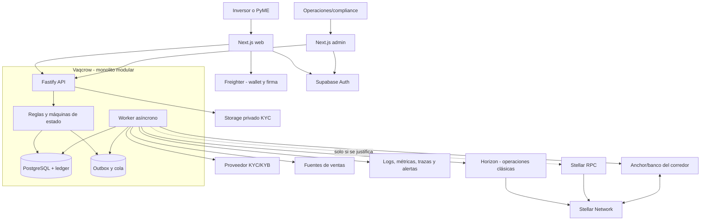
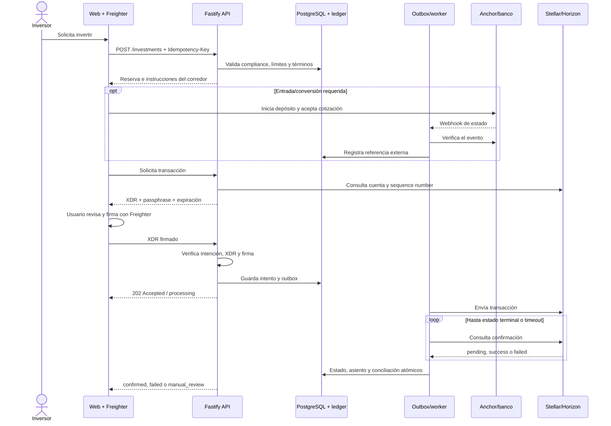

# Vaqcrow — Plan de producto para Argentina

> **Estado:** plan de validación y construcción para una futura operación en Argentina. No implica autorización regulatoria, alianza con un banco o anchor, ni aprobación para captar o intermediar fondos.

## 1. Veredicto ejecutivo

Vaqcrow es técnicamente viable como plataforma argentina de financiamiento con revenue share, pero no está lista para operar con dinero real. **Argentina es la única jurisdicción de producto** y el modelo de wallet es **no custodial**: las personas conservan sus claves y firman con Freighter; Vaqcrow construye y verifica transacciones y nunca recibe seeds. Antes de un lanzamiento siguen siendo bloqueantes la clasificación jurídica local del instrumento y de cada rol, KYC/AML, privacidad, cobranza, verificación de ventas y la validación de un corredor real entre ARS y un activo Stellar aprobado.

La tesis conecta PyMEs formales con ventas verificables que necesitan capital flexible e inversores legalmente habilitados que aceptan riesgo a cambio de una participación contractual en ingresos. Stellar puede aportar liquidación programable y evidencia auditable, pero no prueba ventas fuera de cadena, no reemplaza contratos/cobranza y no demuestra cumplimiento regulatorio.

### Decisiones vigentes

| Tema | Decisión | Condición para revisarla |
|---|---|---|
| Jurisdicción | **Argentina únicamente** | Nueva estrategia aprobada con análisis legal independiente; fuera del plan actual |
| Instrumento | No asumir que el revenue share queda fuera de valores, crowdfunding, crédito, pagos o intermediación | Clasificación escrita de asesoría argentina |
| Wallet/custodia | **No custodial**; Freighter es el primer adaptador de wallet y firma | Puede cambiar el adaptador, no el principio de que el usuario conserva las claves |
| Corredor | ARS <-> activo Stellar aprobado; partner y activo aún no validados | Due diligence legal, técnica, comercial y operativa |
| Riesgo | Reglas explicables, asistencia de IA gobernada y decisión humana | Automatización solo con datos, validación y controles suficientes |
| Liquidación | Activos/pagos clásicos de Stellar antes que contratos | Necesidad funcional y threat model que justifiquen Soroban |
| Token propio | No emitirlo en el MVP | Obligación funcional y regulatoria validada |
| Backend | Monolito modular Node.js/TypeScript con Fastify y worker asíncrono | Límites operativos medidos |
| Registro | PostgreSQL para producto, workflows y contabilidad; Stellar como evidencia de liquidación | No aplica durante el MVP |

### Condición de avance

Se puede construir y probar con datos sintéticos, sandboxes y Testnet. No se habilita un marketplace con dinero real hasta contar con dictámenes específicos para Argentina, roles y entidades responsables, corredor/activo aprobados, KYC/AML, contratos, contabilidad, seguridad y operación conciliada. Este documento orienta producto y tecnología; **no es asesoramiento legal, contable ni financiero**.

## 2. Relación con el plan de hackathon

El [plan del hackathon](./hackathon.md) define el PoC de dos semanas para Argentina Builder Challenge. Ese trabajo valida la experiencia, la evaluación de IA, la firma no custodial, pagos clásicos en Testnet, confirmación asíncrona y distribución demostrativa.

El PoC **no prueba**:

- legalidad del instrumento o autorización para ofrecerlo en Argentina;
- cumplimiento regulatorio o de custodia por el solo uso de Freighter;
- disponibilidad, cobertura, SLA o costos de un corredor ARS/activo Stellar;
- economía unitaria, calidad real de ventas, mora, cobranza o recupero;
- controles, seguridad, conciliación y soporte suficientes para producción.

Los hallazgos del hackathon alimentan decisiones de producto y slices técnicos. Los mocks no se aceptan como evidencia de proveedores ni sustituyen due diligence, sandbox contractual, pruebas de recuperación o aprobación legal.

## 3. Modelo de negocio

### 3.1 Segmentos y propuesta de valor

| Segmento | Problema | Señal de encaje |
|---|---|---|
| PyMEs argentinas formales con ventas recurrentes | Crédito caro, lento o rígido frente a estacionalidad | Disposición a compartir datos verificables y pagar por capital flexible |
| Inversores habilitados en Argentina | Acceso limitado a inversión productiva diversificada y trazable | Comprensión de riesgo, horizonte e iliquidez |
| Operaciones/compliance | Casos que requieren decisión, evidencia y auditoría | Tiempo de revisión y tasa de excepciones sostenibles |
| Partners financieros | Entrada/salida, conversión y liquidación | Cobertura, costos, SLA y responsabilidades contractuales claras |

El nicho inicial debe ser estrecho: PyMEs formalizadas, con historial verificable y ventas digitales o bancarizadas. Para la PyME, la promesa es capital con pagos variables vinculados a ventas y reglas comprensibles. Para el inversor, información normalizada, términos explícitos y trazabilidad. Un movimiento en Stellar prueba liquidación técnica; no garantiza ventas completas, rentabilidad, recuperación ni liquidez.

### 3.2 Ingresos y economía unitaria

No fijar tasas, retornos ni spreads hasta validar regulación y corredor.

| Variable | Hipótesis a medir | Unidad mínima |
|---|---|---|
| Comisión de originación/éxito | La PyME la acepta sin perder ventaja frente a alternativas | Ingreso neto por operación financiada |
| Comisión de administración | Sostiene seguimiento, reportes y conciliación | Ingreso mensual por proyecto activo |
| Margen de conversión/retiro | Es permitido, transparente y competitivo | Margen neto después del partner |
| CAC de PyME | Se recupera con operaciones aprobadas y desembolsadas | CAC por PyME financiada |
| CAC de inversor | Se recupera según capital invertido y recurrencia | CAC por inversor activado |
| Mora/pérdida | El rendimiento neto compensa defaults y recupero | Cohorte por fecha, sector y banda de riesgo |
| Operación/compliance | KYC, soporte, revisión y cobranza son sostenibles | Costo por caso y proyecto/mes |
| Corredor | On/off-ramp, red y FX no consumen el margen | Puntos básicos por ciclo completo |

Una cohorte es viable solo si su margen de contribución, después de adquisición, partners, compliance, soporte, fraude, mora y cobranza, es positivo o tiene una ruta medida para serlo.

### 3.3 Hipótesis críticas

1. Existe en Argentina una estructura legal permitida para el instrumento y los inversores objetivo.
2. Un banco/anchor opera el corredor ARS/activo, usuarios y volumen requeridos con SLA aceptable.
3. Las PyMEs comparten datos verificables y aceptan controles y cobranza.
4. Los inversores comprenden pérdidas, iliquidez y variabilidad.
5. Originación y compliance no consumen el margen de operaciones pequeñas.
6. Cada unidad monetaria puede conciliarse entre partner, libro interno y Stellar.
7. La firma con wallet no custodial alcanza conversión y comprensión suficientes.

### 3.4 Riesgos principales

| Prioridad | Riesgo | Tratamiento |
|---|---|---|
| Crítica | Instrumento, captación o intermediación no autorizados | Opinión legal argentina y diseño de roles/contratos |
| Crítica | Banco/anchor o activo no aptos para el corredor | Due diligence antes de integrar producción |
| Alta | KYC/AML, sanciones y privacidad | Proveedor, políticas, revisión y retención definidas |
| Alta | Ventas falsas o incompletas | Fuentes externas, muestreo, auditoría y consecuencias contractuales |
| Alta | Mora, default y recupero | Underwriting, límites, reservas y cobranza |
| Alta | Descuadre financiero | Libro de doble partida y conciliación diaria |
| Media | Abandono o error con wallet | UX, soporte, simulaciones de firma y educación de riesgo |
| Media | Volatilidad/liquidez del activo | Activo/corredor aprobados y divulgaciones |
| Media | Dependencia de proveedores | Contratos, exportación, observabilidad y procedimientos manuales |

## 4. Puertas legales, regulatorias y de compliance

Cada puerta produce evidencia revisable. Argentina y el modelo no custodial están decididos, pero ambos requieren validación de sus consecuencias legales y operativas antes del lanzamiento.

| Puerta | Evidencia de salida | Responsable sugerido |
|---|---|---|
| Alcance argentino | Usuarios permitidos, restricciones provinciales/nacionales y distribución documentados | Dirección + legal |
| Clasificación del instrumento | Memorando sobre valores, crowdfunding, crédito, pagos e impuestos | Asesoría argentina especializada |
| Licencias y roles | Actividades propias/delegadas y entidad responsable por flujo | Legal/compliance |
| Modelo no custodial | Análisis de control efectivo, firma, front-end, responsabilidades y divulgaciones | Legal + seguridad + producto |
| KYC/AML | Política, proveedor, sanciones, PEP, monitoreo y escalamiento | Compliance |
| Privacidad | Base legal, consentimiento, residencia, retención y eliminación | Legal + seguridad |
| Corredor | Banco/anchor, activo, límites, costos, SLA y reversos | Operaciones |
| Contratos | Acuerdos PyME/inversor, riesgos, mora y cobranza | Legal + producto |
| Contabilidad/impuestos | Principal, comisiones, distribuciones, segregación y comprobantes | Finanzas |

**Regla:** no describir como aprobado, seguro, garantizado o descentralizado aquello que dependa de una licencia, contraparte o control todavía no validado.

## 5. MVP de producción y no objetivos

### Resultado esperado

Demostrar en Argentina que una PyME aprobada publica una oportunidad, un inversor habilitado la fondea mediante el corredor seleccionado y Vaqcrow registra, liquida, concilia y reporta el ciclo completo con intervención operativa controlada.

### Alcance

- Registro, autenticación reforzada y perfiles de inversor, PyME y operador.
- KYC/KYB y revisión manual con historial de decisiones.
- Proyectos, términos y divulgaciones versionados.
- Marketplace simple con filtros objetivos y sin promesas de retorno.
- Intención idempotente, conexión de Freighter y firma no custodial.
- Un corredor ARS/activo Stellar previamente validado.
- Pagos clásicos de Stellar cuando alcancen para el contrato.
- Reporte mensual de ventas, evidencia y revisión operativa.
- Cálculo determinístico de obligación, cobro y distribución controlada.
- Libro de doble partida, conciliación y panel de excepciones.
- Backoffice mínimo y exportes de auditoría.

### No objetivos iniciales

- Garantizar retorno, liquidez, exactitud automática de ventas o ausencia de defaults.
- Operar fuera de Argentina o con más de un corredor.
- Wallet interna, cuenta custodial o recepción de seeds de usuarios.
- Token propio por proyecto o mercado secundario.
- Smart contracts antes de justificar escrow/distribución no resolubles con pagos clásicos.
- Decisiones crediticias o transferencias autónomas por IA.
- Aplicación móvil nativa, microservicios, Kubernetes o infraestructura multirregión.

## 6. Arquitectura de producción

### 6.1 Principios

1. PostgreSQL registra identidades, contratos, workflows y contabilidad interna.
2. Stellar es liquidación y evidencia externa; no reemplaza el ledger.
3. Toda acción financiera es durable, idempotente y auditable.
4. El navegador no recibe secretos de plataforma; las seeds de usuarios permanecen en sus wallets.
5. Vaqcrow construye y verifica XDR; Freighter presenta y firma por decisión del usuario.
6. Las integraciones externas registran intención, envío, confirmación y conciliación.
7. Los módulos de dominio preceden cualquier separación en microservicios.

### 6.2 Monorepo

Usar **pnpm + Turborepo**:

```text
apps/
  web/                 # Next.js: inversor y PyME
  admin/               # Next.js: operaciones y compliance
  api/                 # Fastify: API y orquestación de dominio
  worker/              # Jobs, webhooks, confirmaciones y conciliación
packages/
  domain/              # Entidades, estados, reglas y eventos
  contracts/           # Esquemas de API/eventos y validación
  db/                  # Migraciones, consultas y adaptadores PostgreSQL
  stellar/             # Wallet adapters, XDR, envío, verificación e indexación
  integrations/        # Anchor, KYC, ventas, correo y observabilidad
  config/              # Configuración tipada por entorno
  testing/             # Fixtures, factories y utilidades
  ui/                  # Componentes visuales compartidos
```

No crear un paquete por tabla ni compartir lógica mediante importaciones directas entre aplicaciones.

### 6.3 Backend, Supabase y worker

El backend recomendado es un **monolito modular Node.js/TypeScript con Fastify**: el trabajo es principalmente I/O y Fastify ofrece API explícita, validación por esquemas y una superficie acotada. Go u otro runtime solo se incorporan por mediciones o restricciones concretas, no como sustituto de consistencia financiera.

Supabase aporta PostgreSQL, Auth y Storage privado. Auth resuelve identidad/sesión, no autorización de negocio. Storage usa buckets privados, objetos cifrados y URLs firmadas breves. Edge Functions pueden cubrir endpoints acotados, pero no son el único motor de operaciones financieras prolongadas.

El `worker` procesa outbox, colas, webhooks, polling de confirmaciones, reintentos, conciliación y recuperación en un entorno durable con timeouts y cursores persistentes.

| Componente | Responsabilidad | No debe hacer |
|---|---|---|
| `web` | UX, sesión, intención y solicitud de firma a Freighter | Guardar seeds o interpretar envío como confirmación |
| `admin` | Revisión, conciliación, incidentes y maker-checker | Editar saldos/estados libremente |
| `api` | Autorización, idempotencia, reglas, transacciones DB y XDR | Esperar indefinidamente redes externas |
| `worker` | Outbox, webhooks, polling, reintentos y recuperación | Inventar transiciones fuera del dominio |
| PostgreSQL | Workflows, ledger, auditoría y metadatos | Guardar seeds o PII sin protección |
| Freighter | Presentar cuenta/transacción y firmar con la clave del usuario | Actuar como custodio o entregar la seed a Vaqcrow |
| Anchor/banco | Fiat, cotización, conversión y estado del corredor | Tratarse como API genérica intercambiable sin contrato |
| Stellar | Transferencia y evidencia de liquidación | Ser verdad única de contratos o ventas |

### 6.4 Diagrama de componentes



## 7. Integración Stellar, wallet y corredor

### 7.1 Wallet no custodial

Freighter es el primer adaptador de wallet, no un custodio. La interfaz propia en `packages/stellar` evita acoplar dominio y UX a un proveedor. Vaqcrow solicita la cuenta pública, construye el XDR y entrega la passphrase de red explícita mediante `@stellar/freighter-api`; el usuario revisa y firma. Vaqcrow recibe únicamente el XDR firmado y nunca una seed.

Antes de enviar, el backend verifica red, fuente, destino, activo, monto, memo, secuencia, timeout, operaciones permitidas y firmas. La firma del usuario no elimina obligaciones de autorización, compliance, divulgación ni monitoreo.

### 7.2 Camino técnico

| Área | Decisión/herramienta | Uso |
|---|---|---|
| SDK | `@stellar/stellar-sdk` | Construir, validar y consultar transacciones |
| Wallet | `@stellar/freighter-api` | Cuenta y firma XDR con passphrase explícita |
| Operaciones clásicas | `Horizon.Server` | Cuentas, pagos, operaciones, efectos y confirmación |
| Soroban | `rpc.Server`, Rust y Stellar CLI | Solo para capacidad aprobada; envío asíncrono y polling terminal |
| Desarrollo | Red local, sandbox y Testnet | Pruebas reproducibles sin fondos reales |
| Confirmación | Worker + polling/streams + cursor | Separar envío de éxito de negocio |
| Observabilidad | Trazas, métricas, errores y alertas | Pendientes, fallos, descuadres y latencia |

Primero se usan activos clásicos y pagos. Compromisos, obligaciones y libro detallado permanecen en PostgreSQL. Un token por proyecto agrega emisión, trustlines, UX, liquidez, contabilidad y regulación sin demostrar valor inicial.

### 7.3 Corredor y anchor: P0 abierto

El corredor **ARS <-> activo Stellar aprobado** todavía no tiene banco/anchor ni activo confirmados. Un anchor es una contraparte regulada con cobertura bancaria, comercial y de compliance; no una conversión abstracta. Se deben validar contrato, sandbox, usuarios, límites, costos, SLA, reversos y responsabilidades.

SEPs relevantes según las capacidades reales del partner:

- **SEP-1:** descubrimiento y metadatos.
- **SEP-10:** autenticación basada en cuenta Stellar.
- **SEP-12:** intercambio KYC con el anchor.
- **SEP-6 o SEP-24:** depósito/retiro programático o interactivo.
- **SEP-38:** cotización y expiración.
- **SEP-31:** pagos transfronterizos, solo si el caso lo requiere.

No es obligatorio implementar todos. La due diligence y el contrato determinan el subconjunto.

### 7.4 Inversión no custodial y confirmación



- Persistir red y `networkPassphrase`; nunca inferirlas de la interfaz.
- Controlar concurrencia del sequence number por cuenta fuente.
- Guardar intención, hash, XDR pertinente y timestamps sin secretos.
- No reintentar ciegamente la misma secuencia; consultar estado primero.
- Para Soroban: simular/preparar, aplicar recursos, firmar, enviar y consultar por Stellar RPC hasta estado terminal.

## 8. Consistencia financiera y recuperación

### 8.1 Estados e idempotencia

```text
draft -> awaiting_compliance -> awaiting_funds -> reserved
      -> awaiting_signature -> signed -> submitted -> confirmed

Transiciones excepcionales:
expired | failed | cancelled | manual_review
```

Cada transición registra actor, causa, versión esperada y evento de auditoría. Se usa bloqueo optimista o de fila para impedir avances incompatibles.

- Requerir `Idempotency-Key` en comandos financieros.
- Vincular clave a usuario, operación y hash de payload; rechazar reutilización con datos distintos.
- Guardar respuesta/estado dentro de la misma transacción que crea la intención.
- Aplicar unicidad a referencias de partner, hashes Stellar y eventos externos.
- Mantener inbox idempotente para consumidores y webhooks duplicados o fuera de orden.

### 8.2 Ledger inmutable de doble partida

El ledger interno es la fuente de verdad contable. Todo asiento balancea débitos y créditos con activo, escala y referencia al evento.

- No editar ni borrar asientos publicados; corregir mediante reversos.
- Separar fondos de clientes, fondos en tránsito, obligaciones, comisiones e incidencias.
- No calcular saldos sumando inversiones ni leyendo solo la cadena.
- Vincular liquidaciones Stellar con asientos sin fusionar ambos modelos.
- Representar dinero en unidades mínimas enteras o decimales con escala explícita; nunca `float`.

### 8.3 Outbox, webhooks y conciliación

El cambio de estado y el evento de outbox se escriben en una transacción PostgreSQL. El worker procesa con reintentos limitados, backoff, jitter y cola de fallos. Los webhooks se autentican, almacenan primero, responden rápido y se verifican contra la API del proveedor antes de alterar dinero o estados críticos.

La conciliación automática diaria y bajo demanda compara:

1. intenciones y ledger interno;
2. banco/anchor;
3. operaciones confirmadas en Stellar;
4. comisiones, redondeos, reversos y tránsito.

Cada diferencia genera un caso con propietario, severidad, evidencia y resolución. Nunca se “corrige” un saldo sin regla aprobada y asiento explícito.

### 8.4 Recuperación

| Falla | Respuesta |
|---|---|
| Timeout al enviar | Consultar por hash/intención antes de reconstruir |
| Sequence number inválido | Releer cuenta, serializar fuente y decidir nuevo intento |
| Webhook duplicado/desordenado | Inbox idempotente y transición condicionada |
| Partner excede SLA | Alerta, consulta activa y revisión manual |
| Stellar confirmado, DB pendiente | Reprocesar indexador/outbox y contabilizar una vez |
| DB actualizada, envío ausente | Retomar outbox sin crear otra intención |
| Diferencia de monto/activo | Pausar distribución y abrir incidente |
| Proveedor caído | Circuit breaker, reintentos acotados y runbook manual |

## 9. Modelo conceptual de datos

| Contexto | Tablas conceptuales | Responsabilidad |
|---|---|---|
| Identidad | `users`, `roles`, `user_roles`, `auth_factors`, `consents` | Perfil, RBAC, MFA y consentimientos |
| Compliance | `parties`, `kyc_cases`, `kyc_checks`, `screening_hits`, `compliance_decisions`, `document_refs` | Verificaciones y evidencia |
| Originación | `businesses`, `applications`, `underwriting_rules`, `underwriting_reviews` | Solicitud y decisión explicable |
| Ofertas | `projects`, `offer_versions`, `disclosures`, `project_documents` | Términos inmutables |
| Inversiones | `investment_intents`, `reservations`, `investment_states`, `signing_requests` | Intención, reserva y firma |
| Corredor | `anchor_customers`, `quotes`, `fiat_transfers`, `anchor_transactions`, `provider_events` | Estado normalizado del partner |
| Stellar | `stellar_accounts`, `stellar_transactions`, `stellar_operations`, `stellar_cursors` | Envío, confirmación e indexación; sin seeds |
| Contabilidad | `ledger_accounts`, `journal_entries`, `journal_lines`, `balance_snapshots` | Doble partida y vistas derivadas |
| Revenue share | `sales_periods`, `sales_reports`, `sales_evidence`, `payment_obligations`, `distributions` | Ventas, obligación, cobro y reparto |
| Confiabilidad | `idempotency_keys`, `outbox_events`, `inbox_events`, `jobs`, `reconciliation_runs`, `reconciliation_items` | Deduplicación, recuperación y descuadres |
| Auditoría | `audit_events`, `admin_actions`, `incidents`, `notifications` | Acciones sensibles e incidentes |

Identificadores internos son opacos; referencias externas quedan separadas y únicas. Timestamps usan UTC. RLS es defensa adicional, no reemplazo de autorización de API. Ledger y auditoría tienen retención inmutable; otros datos se eliminan conforme a obligaciones legales.

## 10. Seguridad y privacidad

### KYC/KYB y datos

- Minimizar recolección y preferir referencias del proveedor.
- Buckets privados, cifrado, URLs firmadas breves y mínimo privilegio.
- Evitar PII en nombres de archivo, logs y eventos; auditar cada acceso.
- Definir residencia, retención, eliminación y derechos antes de datos reales.
- Enmascarar PII fuera de producción y prohibir copias no aprobadas.

### Acciones financieras

- MFA resistente a phishing para operadores y step-up authentication en alto riesgo.
- Segregación de roles y maker-checker para destinos, reversos, ajustes y distribuciones.
- Límites por usuario, proyecto, cuenta y período; pausas globales y por corredor.
- Verificación backend del XDR firmado y allowlist de operaciones.
- Protección CSRF, rate limiting, validación, sesiones seguras y controles IDOR.
- Auditoría append-only con correlación usuario/request/job/partner/transacción.

### Claves y secretos

- Vaqcrow nunca solicita ni recibe seeds de usuarios; permanecen en Freighter.
- Ninguna seed o clave privada en navegador de la aplicación, repositorio, logs o PostgreSQL.
- Claves operativas de plataforma, si una capacidad aprobada las requiere, se alojan en KMS/HSM o servicio especializado con políticas y rotación.
- Credenciales por entorno en gestor de secretos.
- Threat modeling para onboarding, cambio de cuenta, firma, retiro, webhooks y backoffice.

## 11. De simuladores a proveedores de producción

El hackathon establece contratos para `KycProvider`, `FundingRailProvider` y `SalesDataProvider`. Migrarlos no consiste en cambiar una URL: cada proveedor debe demostrar contrato semántico, seguridad, regulación, SLA y recuperación.

| Interfaz | Simulación | Reemplazo requerido | Evidencia de aceptación |
|---|---|---|---|
| `KycProvider` | Fixtures con estados | Proveedor KYC/KYB aprobado para Argentina | Sandbox, matriz de estados, webhooks, privacidad y escalamiento |
| `FundingRailProvider` | Cotización/depósito sintéticos | Banco/anchor del corredor ARS/activo | Contrato, SEPs, límites, costos, reversos, SLA y conciliación |
| `SalesDataProvider` | Períodos/evidencia sintéticos | Fuente fiscal, bancaria, adquirente o ERP autorizada | Consentimiento, cobertura, calidad, procedencia y correcciones |

Proceso de sustitución:

1. Congelar el contrato normalizado y sus invariantes.
2. Implementar un adaptador sandbox sin filtrar modelos del proveedor al dominio.
3. Ejecutar contract tests para éxito, pendientes, duplicados, expiración, errores y reordenamiento.
4. Completar threat model, privacidad, due diligence y runbook.
5. Probar conciliación y recuperación con evidencia.
6. Habilitar mediante feature flag y límites; mantener procedimiento manual y rollback.

Los fixtures solo son evidencia de comportamiento interno. No acreditan cobertura real, exactitud, cumplimiento ni disponibilidad.

## 12. Estrategia de IA y riesgo

La IA puede normalizar evidencia, detectar anomalías/faltantes, resumir razones y proponer preguntas. Sus salidas son estructuradas, validadas contra esquema, versionadas y trazables a evidencia. La decisión final es humana hasta contar con dataset representativo, validación independiente, monitoreo de sesgo/drift y un marco regulatorio que permita otro nivel de automatización.

Reglas determinísticas controlan elegibilidad dura, límites, montos, redondeos, asientos y transferencias. El LLM no inventa hechos, no calcula obligaciones contractuales, no firma ni mueve fondos. Salidas inválidas o indisponibilidad producen `manual_review`.

## 13. SDD por capacidad acotada

Una especificación única de toda la startup ocultaría supuestos. Cada capacidad sigue:

```text
proposal -> spec/design -> tasks -> apply -> verify -> archive
```

| Etapa | Resultado verificable |
|---|---|
| Proposal | Problema, alcance, no objetivos, riesgos y éxito |
| Spec | Requisitos y escenarios observables, incluidos fallos |
| Design | Límites, invariantes, seguridad y alternativas |
| Tasks | Unidades implementables con dependencias |
| Apply | Código, migraciones, pruebas y documentación |
| Verify | Evidencia contra requisitos y diseño |
| Archive | Decisiones y especificaciones vigentes sincronizadas |

### Secuencia inicial de producción

1. `validate-argentina-instrument-and-roles` — dictamen argentino, usuarios y entidades permitidas.
2. `validate-ars-stellar-corridor` — banco/anchor, activo, SEPs, costos, límites y SLA.
3. `bootstrap-monorepo-and-quality-gates` — pnpm/Turborepo, apps mínimas, CI y convenciones.
4. `establish-identity-and-compliance-case` — roles, consentimientos y KYC/KYB.
5. `establish-ledger-and-idempotent-command` — doble partida, idempotencia, outbox y auditoría.
6. `integrate-anchor-sandbox-thin-slice` — depósito/retiro con estados, cotizaciones y webhooks.
7. `settle-noncustodial-stellar-payment` — Freighter, verificación, envío, confirmación e indexación.
8. `complete-investment-vertical-slice` — proyecto aprobado a inversión conciliada.
9. `record-sales-and-distribute-revenue-share` — evidencia, obligación, cobro y reparto controlado.

Cada cambio puede detenerse si invalida una hipótesis. Archivar evidencia técnica no universaliza una decisión legal.

## 14. Roadmap

Las fechas se estiman después de cerrar dependencias externas; prevalecen los criterios de salida.

| Fase | Trabajo | Criterio medible de salida |
|---|---|---|
| 0. Descubrimiento | Entrevistas, alternativas y economía | ≥15 entrevistas por lado; 5 PyMEs aportan ventas anonimizadas; supuestos registrados |
| 1. Legal y corredor | Instrumento/roles argentinos, KYC/AML, banco/anchor y activo | Memorando; matriz de roles; partner candidato con sandbox, costos, límites y SLA; go/no-go |
| 2. UX no custodial | Journey Freighter, divulgaciones y soporte | ≥80% completa tareas críticas; errores y comprensión medidos |
| 3. Fundaciones | Monorepo, Auth, API, worker, DB y observabilidad | CI verde; despliegue reproducible; RBAC, secretos, SLO y runbooks probados |
| 4. Slice testnet/sandbox | Intención, anchor, firma, pago, confirmación, ledger y conciliación | 100 ciclos sin asiento desbalanceado; duplicados seguros; cinco recuperaciones críticas |
| 5. Piloto controlado | KYC/KYB, un proyecto, ventas y distribución con límites bajos | 100% conciliado; cero acceso KYC no autorizado; excepciones dentro del SLA |
| 6. Preparación | Seguridad, privacidad, soporte, cobranza y aprobación | Pentest sin críticos; simulacro; aprobaciones escritas; monitoreo y soporte activos |

Construir siempre un slice vertical antes de ampliar: una PyME, un inversor de prueba, un activo, un corredor, una inversión, una confirmación y una conciliación.

## 15. Estrategia de pruebas

| Nivel | Cobertura prioritaria |
|---|---|
| Unidad | Elegibilidad, cálculos monetarios, estados, expiraciones y asientos |
| Propiedades | Conservación de dinero, idempotencia y reversos |
| Integración DB | Constraints, concurrencia, RLS, outbox/inbox y rollback |
| Contrato | Anchor, KYC, ventas, Horizon/RPC y webhooks |
| Testnet/sandbox | Freighter, passphrase, secuencia, timeout, envío y confirmación |
| E2E | Journeys de PyME, inversor y operador; éxito, pendiente y fallo |
| Resiliencia | Timeouts, duplicados, desorden, rate limits y reanudación |
| Seguridad | Autorización, IDOR, XDR/firma, secretos, PII y sesiones |
| Conciliación | Faltantes, extras, duplicados, parciales, comisiones y reversos |

La suite normal usa dobles determinísticos. Una suite separada valida sandbox/Testnet con cuentas aisladas y datos no sensibles.

### Definition of Done financiera

- [ ] Requisitos/escenarios SDD y trazabilidad aprobados.
- [ ] Invariantes, amenazas y observabilidad documentadas.
- [ ] Código, migraciones y contratos revisados.
- [ ] Pruebas unitarias, integración, contrato y E2E relevantes verdes.
- [ ] Éxito, pendiente, duplicado, timeout, fallo terminal y recuperación cubiertos.
- [ ] Idempotencia y balance de asientos con evidencia automatizada.
- [ ] Logs sin secretos/PII y correlation IDs de punta a punta.
- [ ] Conciliación, pausa, rollback y runbook probados.
- [ ] Seguridad/compliance aprobaron lo correspondiente.
- [ ] Verificación SDD archivada sin asuntos críticos abiertos.

## 16. Registro de decisiones

| ID | Decisión | Razón |
|---|---|---|
| D-001 | Argentina es la única jurisdicción | Permite validación legal, comercial y operativa concreta |
| D-002 | Wallet no custodial; Freighter primero | El usuario conserva claves y firma; Vaqcrow no recibe seeds |
| D-003 | Validar corredor ARS/activo antes de dinero real | El riesgo principal es legal/operativo, no throughput |
| D-004 | pnpm/Turborepo y módulos por dominio | Optimiza un equipo temprano sin microservicios prematuros |
| D-005 | Fastify + TypeScript y worker separado | API explícita, stack compartido y trabajo I/O durable |
| D-006 | Supabase para PostgreSQL/Auth/Storage privado | Acelera capacidades comunes sin delegar orquestación al cliente |
| D-007 | PostgreSQL + doble partida como verdad contable | La cadena solo representa parte de los eventos |
| D-008 | Pagos clásicos antes que Soroban | Menos complejidad hasta justificar contratos |
| D-009 | IA explicable con revisión humana | No hay base para decisiones autónomas ni transferencias por LLM |
| D-010 | SDD por capacidad acotada | Mantiene cambios revisables y reemplazables |
| D-011 | PoC separado del plan de producto | La demo valida slices, no preparación productiva |

## 17. Preguntas abiertas priorizadas

| Prioridad | Pregunta | Bloquea |
|---|---|---|
| P0 | ¿Cómo clasifica Argentina el revenue share y qué estructura/roles están permitidos? | Producto y lanzamiento |
| P0 | ¿Qué entidades pueden captar, convertir, liquidar y distribuir dentro del modelo no custodial? | Flujo financiero y contratos |
| P0 | ¿Qué banco/anchor soporta el corredor ARS/activo, usuarios, volumen y SEPs necesarios? | Integración y economía |
| P0 | ¿Cómo se verifican ventas y se ejecutan cobranza/default? | Riesgo y promesa central |
| P1 | ¿Quiénes pueden invertir y qué límites/divulgaciones aplican en Argentina? | Onboarding y marketplace |
| P1 | ¿Cuál es el tratamiento contable, fiscal y de segregación? | Ledger y reportes |
| P1 | ¿Qué datos KYC se conservan y durante cuánto tiempo? | Privacidad y Storage |
| P1 | ¿Qué comisión soporta una cohorte después de costos y pérdidas? | Modelo de ingresos |
| P2 | ¿Escrow o distribución justifican Soroban? | Contratos y Rust |
| P2 | ¿Qué fuentes de ventas tienen calidad, permiso y cobertura? | Underwriting y automatización |

No son preguntas abiertas la jurisdicción ni el modelo de wallet: Argentina y no custodial con Freighter permanecen fijados. Sí se deben validar sus consecuencias jurídicas, operativas y de UX.

## 18. Referencias oficiales de Stellar

Estas referencias respaldan decisiones técnicas; no resuelven regulación, contratos, impuestos ni licencias en Argentina.

- Guía frontend y firma con Freighter: <https://developers.stellar.org/docs/build/guides/dapps/frontend-guide>
- SDKs cliente, incluido JavaScript: <https://developers.stellar.org/docs/tools/sdks/client-sdks>
- Horizon API para Stellar clásico: <https://developers.stellar.org/docs/data/apis/horizon>
- Stellar RPC para Soroban: <https://developers.stellar.org/docs/data/apis/rpc>
- Simulación de transacciones Soroban: <https://developers.stellar.org/docs/build/guides/transactions/simulateTransaction-Deep-Dive>
- Stellar CLI: <https://developers.stellar.org/docs/tools/developer-tools/cli/stellar-cli>
- Introducción a wallets y anchors: <https://developers.stellar.org/docs/build/apps/wallet/intro>
- Stellar Anchor Platform y SEPs soportados: <https://developers.stellar.org/docs/platforms/anchor-platform>
- Protocolos SEP: <https://github.com/stellar/stellar-protocol/tree/master/ecosystem>

## 19. Próxima decisión P0

La próxima revisión debe obtener evidencia argentina sobre la clasificación del instrumento y, en paralelo, validar candidatos reales para el corredor ARS/activo Stellar. Si no existe una estructura permitida o un partner viable, se redefine el producto antes de operar con dinero real. La decisión no reabre Argentina ni el modelo no custodial; determina si el producto puede lanzarse bajo esos límites.
