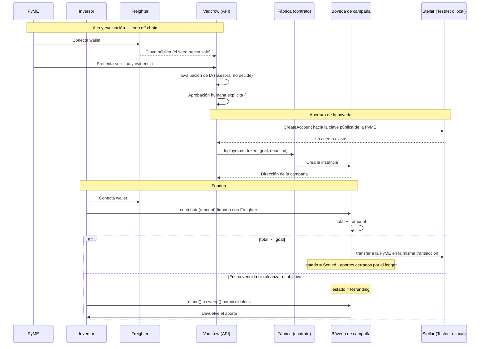

# Requisitos de blockchain Stellar para Vaqcrow

> **Documento completo — 2026-09-14.** Las 4 partes están completas y verificadas.

## Índice

- [Parte 1 — Decisión, alcance y fundamentos](#^parte-1)
  - [1. Resumen de la decisión](#^resumen-de-la-decision)
  - [2. Mapa canónico de issues](#^mapa-canonico-de-issues)
  - [3. Ruta conceptual de aprendizaje recomendada](#^ruta-conceptual-de-aprendizaje)
  - [4. Referencias oficiales](#^referencias-oficiales)
  - [Detalle técnico: custodia por contrato de campaña](#^detalle-custodia-por-contrato)
  - [Alternativa evaluada y descartada: Claimable Balance (CAP-23)](#^claimable-balance-descartado)
- [Parte 2 — Preparación del equipo y herramientas](#^parte-2)
  - [1. Alcance obligatorio y opcional](#^alcance-de-preparacion)
  - [2. Comprobaciones obligatorias sin instalación](#^comprobaciones-obligatorias)
  - [3. Dependencias del proyecto](#^dependencias-del-proyecto)
  - [4. Preparación segura de Freighter](#^preparacion-de-freighter)
  - [5. Prerrequisitos obligatorios para el contrato de campaña](#^prerrequisitos-contrato)
  - [6. Decisión de lenguajes y herramientas](#^decision-de-herramientas)
  - [7. Distinción arquitectónica de `packages/contracts`](#^distincion-de-packages-contracts)
  - [8. Lista de seguridad](#^lista-de-seguridad)
  - [9. Referencias oficiales de preparación](#^referencias-oficiales-de-preparacion)
- [Parte 3 — Plan de pruebas y gates de decisión](#^parte-3)
  - [1. Plan de pruebas obligatorio de transferencias Testnet](#^pruebas-obligatorias-testnet)
    - [a. Unit tests determinísticos sin red](#^unit-tests-sin-red)
    - [b. Preflight manual acotado en Testnet](#^preflight-testnet)
    - [c. Pruebas negativas](#^pruebas-negativas)
    - [d. Checklist de evidencia y limpieza](#^checklist-evidencia)
  - [2. Plan de pruebas obligatorio del contrato de campaña](#^pruebas-contrato)
  - [3. Gates de decisión](#^gates-de-decision)
    - [a. Definition of ready antes de #74](#^dor-antes-de-74)
    - [b. Gate antes de extender contratos a caminos opcionales](#^gate-extensiones)
- [Parte 4 — Cierre, skills, seguridad y verificación](#^parte-4)
  - [1. Tabla de skills recomendadas](#^skills-recomendadas)
  - [2. Convenios de seguridad y arquitectura](#^convenios-seguridad)
  - [3. Fuentes oficiales consolidadas](#^fuentes-oficiales-consolidadas)
  - [4. Definition of ready consolidada](#^dor-consolidada)
  - [5. Checklist de verificación final](#^checklist-verificacion-final)

## Parte 1 — Decisión, alcance y fundamentos

^parte-1

### 1. Resumen de la decisión

^resumen-de-la-decision

| Alcance | Decisión |
|---|---|
| **Obligatorio — contrato de campaña** | El **fondeo se custodia en un contrato Soroban** escrito en Rust con `soroban-sdk`. El contrato recibe los aportes, detecta el objetivo, liquida a la PyME y reembolsa a los inversores. **No es opcional ni recortable**: es la única forma conocida de expresar el requisito del producto (ver [Alternativa evaluada y descartada](#^claimable-balance-descartado)). |
| **Obligatorio — camino clásico** | La **distribución de revenue share** (Feature #28) sigue el camino clásico: `@stellar/stellar-sdk`, Horizon y firma con **Freighter**. Queda sujeta a re-evaluación posterior; no se modifica en esta decisión. |
| **Opcional** | Otro trabajo de extensión sobre contratos (llevar la distribución de revenue share on-chain, ZK, cross-chain) sigue siendo **opcional** y no puede condicionar ni retrasar los dos caminos obligatorios. |

> [!danger] Claimable Balance (CAP-23) fue evaluado y **descartado**
> Se evaluó usar `CreateClaimableBalanceOp` —operación clásica, sin contrato— para dar custodia con reembolso garantizado. **No sirve para el requisito del producto.** El lenguaje de predicados de CAP-23 tiene exactamente seis tipos y sus únicas hojas son **tiempo o "siempre"**: no hay predicado sobre saldos, banderas, estado de cuenta, otro balance ni oráculo, así que **"el objetivo fue alcanzado" es inexpresable on-chain**. Con hojas solo temporales, quien reciba la ventana temprana tiene una oportunidad incondicional de tomar los fondos, y ninguna partición de fechas cierra las dos puntas. Fundamento completo en [Alternativa evaluada y descartada](#^claimable-balance-descartado).

> [!warning] Esta decisión reemplaza la de las 4 partes verificadas
> Las 4 partes verificadas el **2026-09-14** declaraban los contratos inteligentes como **trabajo puramente opcional**. Esta sección invierte esa decisión para el camino de fondeo y se toma el **2026-09-22**. El resto de las 4 partes sigue vigente salvo donde esta sección y la Parte 2, sección 5 lo contradigan.

#### Detalle técnico: custodia por contrato de campaña

^detalle-custodia-por-contrato

**Qué resuelve.** Hoy el "custodio" del fondeo es la buena fe de la PyME más un cálculo determinístico off-chain: nada impide, a nivel de protocolo, que la PyME se quede con el aporte sin distribuir después. El contrato mueve esa garantía del código de aplicación a la máquina de estados del ledger:

| Requisito del producto | Cómo lo cumple el contrato |
|---|---|
| Custodia de los aportes por código, sin humano con la clave | El contrato es el único tenedor de los fondos durante la campaña |
| Pago a la PyME **apenas** se alcanza el objetivo, sin importar la fecha | Ocurre **dentro de la misma transacción** que cruza el umbral |
| Cierre total al alcanzar el objetivo | `contribute` revierte si el estado ya no es `Funding` — lo impone el ledger, no la interfaz |
| Retiro voluntario del inversor antes del objetivo | `withdraw` habilitado mientras el estado sea `Funding` |
| Reembolso si vence la fecha sin alcanzar el objetivo | Estado `Refunding`; reembolso **permissionless** |
| Reembolso de quien nunca lo reclama | Barrido **permissionless** por lotes (ver **Cierre de la campaña y reembolsos**) |

**Máquina de estados.**

| Estado | Significado | Operaciones habilitadas |
|---|---|---|
| `Funding` | Campaña abierta, por debajo del objetivo | `contribute`, `withdraw` |
| `Settled` | Objetivo alcanzado; los fondos ya se pagaron a la PyME | Ninguna de aporte o retiro |
| `Refunding` | Vencida la fecha sin alcanzar el objetivo | `refund` y `sweep`, permissionless |

**Superficie del contrato de campaña.**

| Función | Autorización | Regla |
|---|---|---|
| `__constructor(sme, token, goal, deadline)` | Ninguna (corre al desplegar) | Fija destino, activo, objetivo y fecha. **No vuelve a ejecutarse** |
| `contribute(investor, amount)` | `investor.require_auth()` | Solo en `Funding` y antes de `deadline`. Suma el aporte y, si `total >= goal`, pasa a `Settled` y transfiere a la PyME en la misma transacción |
| `withdraw(investor)` | `investor.require_auth()` | Solo en `Funding`. Devuelve el aporte a la dirección registrada |
| `refund(investor)` | **Permissionless** | Solo en `Refunding`. El destino está fijado en el contrato, así que cualquiera puede dispararlo y los fondos van al inversor igual |
| `sweep(investors)` | **Permissionless** | Solo en `Refunding`. `refund` por lotes, para cerrar los reembolsos que nadie pidió. **Lote acotado** |
| Lecturas | Ninguna | `state`, `total`, `goal`, `deadline`, `sme`, `contribution_of(investor)` |

**El estado del objetivo se evalúa dentro de `contribute`.** Ese detalle es el que vuelve el pago automático y determinístico: el ordenamiento del ledger decide frente a un `withdraw` concurrente, y no hay ventana en la que el objetivo esté alcanzado y los fondos sigan disponibles.

**Cierre de la campaña y reembolsos.** Si vence la fecha sin alcanzar el objetivo, el contrato pasa a `Refunding` y cada inversor puede retirar su aporte. Hay **dos caminos, y el segundo existe justamente para el que nunca lo pide**:

| Camino | Quién lo dispara | Para qué |
|---|---|---|
| `refund(investor)` | Cualquiera | El inversor retira lo suyo, o alguien lo hace por él |
| `sweep(investors)` | Cualquiera | Cierra por lotes los reembolsos que nadie reclamó |

Los dos son **permissionless** porque el destino está fijado en el contrato: quien dispara no puede redirigir los fondos, solo completar el reembolso hacia la dirección registrada. Eso es lo que permite que la plataforma cierre el ciclo **sin discreción** y **sin que el inversor esté online**.

> [!important] El barrido necesita saber a quién reembolsar
> El contrato mantiene un **índice de aportantes** para poder enumerarlos, y `sweep` recibe un **lote acotado** — recorrer una lista arbitraria es superficie de ataque por consumo de recursos. La plataforma arma los lotes a partir de ese índice y del espejo off-chain.

**Avisar, además de barrer.** El barrido es la **garantía**; el aviso es **UX**. El espejo off-chain asocia cada aporte con su inversor, así que Vaqcrow puede **notificarle que le corresponde un reembolso** en lugar de esperar que lo descubra solo. Las dos cosas van juntas y no se sustituyen: la notificación mejora la experiencia, el barrido garantiza el resultado **aunque la notificación falle**. En la demo la identidad del inversor es simulada, igual que el resto del alta.

**Fábrica: una instancia de contrato por campaña.** La fábrica se despliega **una sola vez**, no custodia fondos, y expone una función que crea la bóveda de cada campaña:

```rust
pub fn deploy(env: Env, owner: Address, wasm_hash: BytesN<32>,
              salt: BytesN<32>, constructor_args: Vec<Val>) -> Address {
    owner.require_auth();
    env.deployer()
        .with_address(env.current_contract_address(), salt)
        .deploy_v2(wasm_hash, constructor_args)
}
```

- **La dirección es determinística** por `(deployer, salt)`, y `deployed_address()` la calcula **sin desplegar** — se puede mostrar la dirección de la campaña antes de que exista.
- Se emite **un evento por deployment**, que es lo que permite indexar las instancias.
- La lógica de la fábrica queda **separada** de la de las instancias.

**Por qué una instancia por campaña y no un contrato único compartido.** En Soroban cada instancia tiene storage aislado y **su propia dirección con su propio balance**. Con un contrato único, los fondos de todas las campañas viven en una sola dirección y "el dinero de la campaña X" es un asiento dentro de un mapa: un defecto de contabilidad en una campaña alcanza a las demás. Con una instancia por campaña, la **segregación de fondos es a nivel ledger**. Además, las campañas nuevas usan el wasm nuevo mientras las en curso conservan el suyo, sin migración de datos bajo campañas vivas.

**Modelo de cuentas — una dirección de contrato no es una cuenta.**

| Quién | ¿Cuenta `G...`? | Por qué |
|---|---|---|
| Fábrica | ❌ dirección de contrato `C...` | Se despliega una vez |
| Bóveda de campaña | ❌ dirección de contrato `C...` | La crea la fábrica; no necesita cuenta |
| **PyME** | ✅ **sí** | Es el **destino del pago**: la SAC transfiere a su cuenta |
| **Inversores** | ✅ sí | Sus wallets, firmadas con Freighter |
| **Plataforma** | ✅ sí | Firma los deployments y paga fee y reserva |

No hay una cuenta por campaña. Hay **una cuenta de plataforma** que paga fee y reserva de todos los deployments.

**Provisión de la cuenta de la PyME.** Se hace **al aprobar**, no al registrar: al registrar habría que fondear cuentas de PyMEs que nunca se aprueban. La dapp **fondea una clave pública que la PyME ya posee**; nunca genera ni custodia su seed (ver `DEMO.md`, "Firma no custodial").

1. La PyME conecta **Freighter** y la dapp **lee su clave pública**; el seed nunca sale de la extensión.
2. Presenta la solicitud; la clave pública se guarda con ella (off-chain).
3. Evaluación de IA y **aprobación humana explícita** (Feature #19).
4. La dapp crea y fondea la cuenta con un `CreateAccount` desde la cuenta de la plataforma. En Testnet o red local alcanza con Friendbot, que crea y fondea en una sola llamada. **`CreateAccount` no requiere firma del destino** — la PyME no tiene que hacer nada en este paso.
5. La dapp **verifica que la cuenta existe** y recién entonces llama a `deploy()` en la fábrica.

> [!important] La verificación en el paso 5 no es opcional
> Para el activo nativo, transferir a una cuenta que **no existe** falla. Si la cuenta de la PyME no existe, la transacción que cruza el objetivo **revienta entera** —y nadie más puede aportar— con aportes de inversores ya dentro del contrato. Por eso la cuenta se verifica **al abrir la campaña** y no al liquidar.

**Ciclo completo.**



**Límites honestos.**
- **El contrato no se dispara solo.** No hay cron ni scheduler: el pago a la PyME sí es atómico dentro de la transacción que cruza el objetivo, pero el reembolso por vencimiento necesita que **alguien envíe una transacción**. Es permissionless, así que nadie puede bloquearlo y la plataforma puede cerrar todos los reembolsos por lotes — pero no se ejecuta por sí mismo.
- **`sweep` con lote acotado.** Recorrer una lista arbitraria es superficie de ataque por consumo de recursos; el lote tiene un tope explícito.
- **Sin recuperación y sin clawback.** No existe operación para sacar fondos de una bóveda salvo `contribute`/`withdraw`/`refund`/`sweep`. Para el activo nativo no hay clawback. Los fondos que nadie reclama se recuperan **solo** por `sweep`; si los reembolsos se vuelven irrecuperables, quedan en el contrato.
- **Custodia durante la campaña.** Los aportes los tiene el contrato, no la wallet del inversor. Sigue siendo no custodial en el sentido de que **ninguna persona** tiene la clave de esos fondos, pero no es "cada uno custodia lo suyo" mientras la campaña está abierta. Debe decirse así en las divulgaciones.
- **La dirección de la PyME es inmutable** tras el constructor. No hay corrección de destino: si se fija mal, se fija mal. Es la contracara de que nadie —tampoco la plataforma— pueda desviar el pago después.
- **TTL y archival.** Cada entrada tiene TTL y puede archivarse; ampliarlo es posible y el TTL **no es un mecanismo de seguridad** — la fecha se guarda en el valor y se compara contra el tiempo del ledger.
- **Sin auditar.** Un contrato que custodia fondos y va a producción exige auditoría y controles de emergencia. Esta es una demo en Testnet y **no** los tiene; declararlo es parte del alcance.

**Riesgos operativos de Testnet.**

| Riesgo | Dato verificado | Mitigación |
|---|---|---|
| **Reset de Testnet** | Borra *"accounts, trustlines, offers, **smart contract data**, etc."*. 2-4 veces por año, avisados con ≥2 semanas. Próxima fecha agendada: **2026-12-16** | Red local para desarrollo y CI; guion de redeploy y resiembra; el ciclo de campaña de la demo cabe en una sesión |
| **Versión del SDK** | Protocolo **28** en Testnet y Mainnet; `soroban-sdk` **28.0.0**. Un upgrade de protocolo obliga a reconstruir | Fijar el major que matchea la red; verificar con `getVersionInfo` antes de desplegar |
| **Alcance del cambio** | Promueve los contratos de *stretch goal* a **camino crítico**, contra la decisión del 2026-09-14 | Está decidido y documentado acá; el plan de 14 días necesita re-presupuestarse |

#### Alternativa evaluada y descartada: Claimable Balance (CAP-23)

^claimable-balance-descartado

> [!warning] Registro de descarte — no es alcance vigente
> Se documenta para que la decisión no se re-litigue sin el fundamento a mano. **No forma parte del alcance.**

**Qué se evaluó.** Reemplazar el pago directo por `CreateClaimableBalanceOp`, una operación **clásica** (sin contrato) con dos reclamantes con predicado de tiempo, para obtener un reembolso garantizado por el ledger sin desplegar nada.

| Reclamante | Predicado propuesto | Efecto |
|---|---|---|
| PyME | `beforeAbsoluteTime(fecha de cierre)` | Podía reclamar **antes** de la fecha límite |
| Inversor | `not(beforeAbsoluteTime(fecha de cierre))` | Podía reclamar **después** de esa fecha |

**Por qué se descartó.** Los predicados de CAP-23 (`ClaimPredicateType`) tienen **seis tipos** —`UNCONDITIONAL`, `AND`, `OR`, `NOT`, `BEFORE_ABSOLUTE_TIME`, `BEFORE_RELATIVE_TIME`— y sus **únicas hojas son tiempo o "siempre"**. No existe predicado sobre saldos, banderas, estado de cuenta, otro balance ni oráculo. Por lo tanto:

- **"El objetivo fue alcanzado" es inexpresable on-chain.** El ledger no lo sabe.
- **El agujero es estructural, no de calibración.** Como las ventanas deben partirse por reloj, quien tenga la ventana temprana puede tomar los fondos de forma incondicional: con la PyME temprana puede reclamar antes del objetivo; con el inversor temprano puede reembolsarse aunque el objetivo se haya alcanzado. Garantizar el reembolso del inversor exige que la ventana de la PyME cierre antes de la del inversor, lo que obliga a la PyME a tener ventana previa. **Ninguna partición de fechas cierra las dos puntas.**

**Lo que el protocolo sí garantizaba** (y conviene no perder de vista, porque el contrato debe dar al menos esto):
- **Exclusión mutua estructural:** al reclamarse, el spec **borra** la entrada; el segundo reclamante recibe `CLAIM_CLAIMABLE_BALANCE_DOES_NOT_EXIST`. No hay doble reclamo posible.
- **Techo temporal real**, evaluado por el ledger contra el `closeTime`.
- `claimants` es una lista **finita e inmutable**: no se puede agregar un reclamante después.

**Limitaciones que se habían documentado mal** (corregidas acá para que no se arrastren):
- La reserva **no** es una subentrada de 0.5 XLM: es `claimants.size() * baseReserve`, o sea **1 XLM con dos reclamantes**. La nota anterior la subestimaba por dos.
- **No hay mecanismo de recuperación.** Documentación oficial: *"there is no recovery mechanism for a claimable balance in general — if none of the predicates can be fulfilled, the balance cannot be recovered."* Si las cuentas reclamantes se fusionan o se pierden las claves, los fondos quedan varados para siempre.
- Clawback descartado: `ClawbackClaimableBalance` exige un activo emitido con `AUTH_CLAWBACK_ENABLED` y lo ejecuta el **emisor**, no el creador. Para el activo nativo no existe emisor, y emitir un activo propio convertiría a Vaqcrow en custodio de facto.

**Consecuencia sobre los issues existentes.** La custodia por contrato toma el lugar del camino de fondeo que entregó la Feature **#24** (cerrada, con su motor XDR que verifica *exactamente un pago*). **No se reabre ni se reescribe historia**: se crean issues nuevos y esta sección deja registrado que lo supersede. La distribución de revenue share (**#28**, abierta) mantiene su camino clásico y queda sujeta a re-evaluación.

### 2. Mapa canónico de issues

^mapa-canonico-de-issues

Los siguientes enlaces y títulos se verificaron contra GitHub en modo de solo lectura el **2026-09-14**. Los títulos canónicos se conservan en su idioma original y todos los issues enumerados están abiertos.

#### Epics principales

| Issue canónico | Función en el alcance |
|---|---|
| [#7 — `Epic: Stellar funding and confirmation`](https://github.com/reyduar/Vaqcrow/issues/7) | Agrupa el fondeo clásico y su confirmación en Stellar. |
| [#8 — `Epic: Revenue-share calculation and distribution`](https://github.com/reyduar/Vaqcrow/issues/8) | Agrupa los prerrequisitos de ventas y cálculo, y la distribución clásica en Testnet. |

#### Features y tareas del núcleo

| Feature canónica | Tareas canónicas | Clasificación |
|---|---|---|
| [#23 — `Feature: Encapsulate Stellar and Freighter integration`](https://github.com/reyduar/Vaqcrow/issues/23) | [#74 — `Task: Implement Stellar and Freighter integration`](https://github.com/reyduar/Vaqcrow/issues/74)<br>[#75 — `Task: Test Stellar and Freighter integration`](https://github.com/reyduar/Vaqcrow/issues/75)<br>[#76 — `Task: Document evidence for Stellar and Freighter integration`](https://github.com/reyduar/Vaqcrow/issues/76) | Integración blockchain. |
| [#24 — `Feature: Build, verify and submit funding intent`](https://github.com/reyduar/Vaqcrow/issues/24) | [#77 — `Task: Implement funding intent submission and XDR verification`](https://github.com/reyduar/Vaqcrow/issues/77)<br>[#78 — `Task: Test funding intent submission and XDR verification`](https://github.com/reyduar/Vaqcrow/issues/78)<br>[#79 — `Task: Document evidence for funding intent submission and XDR verification`](https://github.com/reyduar/Vaqcrow/issues/79) | Integración blockchain. |
| [#25 — `Feature: Confirm Stellar transactions asynchronously`](https://github.com/reyduar/Vaqcrow/issues/25) | [#80 — `Task: Implement asynchronous Stellar confirmation`](https://github.com/reyduar/Vaqcrow/issues/80)<br>[#81 — `Task: Test asynchronous Stellar confirmation`](https://github.com/reyduar/Vaqcrow/issues/81)<br>[#82 — `Task: Document evidence for asynchronous Stellar confirmation`](https://github.com/reyduar/Vaqcrow/issues/82) | Integración blockchain. |
| [#26 — `Feature: Implement monthly sales feed`](https://github.com/reyduar/Vaqcrow/issues/26) | [#83 — `Task: Implement monthly sales feed`](https://github.com/reyduar/Vaqcrow/issues/83)<br>[#84 — `Task: Test monthly sales feed`](https://github.com/reyduar/Vaqcrow/issues/84)<br>[#85 — `Task: Document evidence for monthly sales feed`](https://github.com/reyduar/Vaqcrow/issues/85) | **Prerrequisito de ventas y dominio; no es una integración blockchain.** |
| [#27 — `Feature: Calculate versioned revenue share deterministically`](https://github.com/reyduar/Vaqcrow/issues/27) | [#86 — `Task: Implement deterministic revenue-share calculation`](https://github.com/reyduar/Vaqcrow/issues/86)<br>[#87 — `Task: Test deterministic revenue-share calculation`](https://github.com/reyduar/Vaqcrow/issues/87)<br>[#88 — `Task: Document evidence for deterministic revenue-share calculation`](https://github.com/reyduar/Vaqcrow/issues/88) | **Prerrequisito de dominio; no es una integración blockchain.** |
| [#28 — `Feature: Sign and distribute revenue share on Testnet`](https://github.com/reyduar/Vaqcrow/issues/28) | [#89 — `Task: Implement Testnet revenue-share distribution`](https://github.com/reyduar/Vaqcrow/issues/89)<br>[#90 — `Task: Test Testnet revenue-share distribution`](https://github.com/reyduar/Vaqcrow/issues/90)<br>[#91 — `Task: Document evidence for Testnet revenue-share distribution`](https://github.com/reyduar/Vaqcrow/issues/91) | Integración blockchain. |

#### Trabajo transversal

| Feature canónica | Tareas canónicas | Relación con el camino Stellar |
|---|---|---|
| [#14 — `Feature: Establish typed configuration and secret boundaries`](https://github.com/reyduar/Vaqcrow/issues/14) | [#44 — `Task: Implement typed configuration and secret boundaries`](https://github.com/reyduar/Vaqcrow/issues/44)<br>[#45 — `Task: Test establish typed configuration and secret boundaries`](https://github.com/reyduar/Vaqcrow/issues/45)<br>[#46 — `Task: Document evidence establish typed configuration and secret boundaries`](https://github.com/reyduar/Vaqcrow/issues/46) | Configuración de red y límites de secretos. |
| [#15 — `Feature: Set up deterministic testing and CI gates`](https://github.com/reyduar/Vaqcrow/issues/15) | [#47 — `Task: Implement set up deterministic testing and ci gates`](https://github.com/reyduar/Vaqcrow/issues/47)<br>[#48 — `Task: Test set up deterministic testing and ci gates`](https://github.com/reyduar/Vaqcrow/issues/48)<br>[#49 — `Task: Document evidence set up deterministic testing and ci gates`](https://github.com/reyduar/Vaqcrow/issues/49) | Pruebas reproducibles sin dependencia de Testnet. |
| [#29 — `Feature: Expose decision and transaction evidence dashboard`](https://github.com/reyduar/Vaqcrow/issues/29) | [#92 — `Task: Implement evidence dashboard`](https://github.com/reyduar/Vaqcrow/issues/92)<br>[#93 — `Task: Test evidence dashboard`](https://github.com/reyduar/Vaqcrow/issues/93)<br>[#94 — `Task: Document evidence for evidence dashboard`](https://github.com/reyduar/Vaqcrow/issues/94) | Evidencia de transacciones y estados. |
| [#30 — `Feature: Integrate the complete vertical demo journey`](https://github.com/reyduar/Vaqcrow/issues/30) | [#95 — `Task: Implement complete vertical demo journey`](https://github.com/reyduar/Vaqcrow/issues/95)<br>[#96 — `Task: Test complete vertical demo journey`](https://github.com/reyduar/Vaqcrow/issues/96)<br>[#97 — `Task: Document evidence for complete vertical demo journey`](https://github.com/reyduar/Vaqcrow/issues/97) | Integración del recorrido completo. |
| [#31 — `Feature: Add resilience telemetry and truthful fallbacks`](https://github.com/reyduar/Vaqcrow/issues/31) | [#98 — `Task: Implement resilience telemetry and fallbacks`](https://github.com/reyduar/Vaqcrow/issues/98)<br>[#99 — `Task: Test resilience telemetry and fallbacks`](https://github.com/reyduar/Vaqcrow/issues/99)<br>[#100 — `Task: Document evidence for resilience telemetry and fallbacks`](https://github.com/reyduar/Vaqcrow/issues/100) | Reintentos, observabilidad y estados veraces. |
| [#33 — `Feature: Rehearse the demo and package evidence`](https://github.com/reyduar/Vaqcrow/issues/33) | [#104 — `Task: Implement demo rehearsal and evidence packaging`](https://github.com/reyduar/Vaqcrow/issues/104)<br>[#105 — `Task: Test demo rehearsal and evidence packaging`](https://github.com/reyduar/Vaqcrow/issues/105)<br>[#106 — `Task: Document evidence for demo rehearsal and evidence packaging`](https://github.com/reyduar/Vaqcrow/issues/106) | Validación operativa y evidencia final. |

**Ausencia explícita:** actualmente no existe un issue canónico dedicado a implementar un contrato inteligente o una integración Soroban. Ese trabajo no forma parte del camino obligatorio y requeriría una decisión y un issue independientes si se autorizara como extensión.

### 3. Ruta conceptual de aprendizaje recomendada

^ruta-conceptual-de-aprendizaje

El aprendizaje debe seguir este orden; cada etapa presupone el dominio de la anterior:

1. **Cuentas, claves y no custodia:** distinguir dirección pública, clave secreta, firmantes y umbrales; comprender que Vaqcrow prepara y verifica transacciones, mientras la persona usuaria conserva sus claves.
2. **Redes y passphrases:** diferenciar Testnet de Public Network, reconocer sus datos y activos independientes, y entender que la passphrase participa en el hash que se firma.
3. **XLM, activos y trustlines:** separar el activo nativo de los activos emitidos, identificar código y emisor, y comprender el consentimiento explícito que representa una trustline.
4. **Transacciones clásicas:** estudiar operaciones, XDR, cuenta fuente, sequence number, fees, timebounds, memos y firmas antes de construir un flujo de pago.
5. **Freighter:** comprender la solicitud de acceso, la revisión por la persona usuaria y la firma de un XDR para una red explícita, sin exponer la clave secreta a Vaqcrow.
6. **Horizon y confirmación asíncrona:** usar Horizon para consultar cuentas y operaciones, enviar transacciones clásicas y separar la recepción inicial del resultado confirmado o fallido.
7. **Idempotencia y reintentos:** correlacionar cada intención interna con su hash y estado, consultar antes de repetir, reutilizar de forma segura la misma transacción firmada cuando corresponda y evitar crear pagos nuevos ante resultados inciertos.
8. **Solo después, Soroban:** estudiar autorización, almacenamiento `Persistent`/`Temporary`/`Instance` y TTL, eventos, recursos y fees, aritmética determinística, y riesgos de actualización y administración. Estos conceptos pertenecen únicamente a una posible extensión, no al requisito base.

### 4. Referencias oficiales

^referencias-oficiales

Fuentes oficiales consultadas y verificadas el **2026-09-14**:

- [SDKs cliente de Stellar](https://developers.stellar.org/docs/tools/sdks/client-sdks): alcance de `@stellar/stellar-sdk`, construcción de transacciones y acceso a Horizon.
- [Cuentas](https://developers.stellar.org/docs/learn/fundamentals/stellar-data-structures/accounts) y [redes](https://developers.stellar.org/docs/networks): cuentas, firmantes, sequence numbers, Testnet, Public Network y passphrases.
- [Activos](https://developers.stellar.org/docs/learn/fundamentals/stellar-data-structures/assets): XLM, activos emitidos, precisión y relación con trustlines.
- [Operaciones y transacciones](https://developers.stellar.org/docs/learn/fundamentals/transactions/operations-and-transactions): operaciones, XDR, fees, secuencias, timebounds, memos y firmas.
- [Firma con Freighter](https://docs.freighter.app/extension-freighter-api/signing.md): revisión y firma de XDR con red o passphrase explícita.
- [Horizon](https://developers.stellar.org/docs/data/apis/horizon) y [envío de transacciones](https://developers.stellar.org/docs/data/apis/horizon/api-reference/submit-a-transaction): consulta, envío y reenvío seguro de una transacción ya incluida.
- [Autorización](https://developers.stellar.org/docs/learn/fundamentals/contract-development/authorization), [almacenamiento y TTL](https://developers.stellar.org/docs/learn/fundamentals/contract-development/storage/state-archival), [eventos](https://developers.stellar.org/docs/learn/fundamentals/stellar-data-structures/events), [recursos y fees](https://developers.stellar.org/docs/learn/fundamentals/fees-resource-limits-metering), [tipos numéricos](https://developers.stellar.org/docs/learn/fundamentals/contract-development/types/built-in-types) y [actualización de contratos](https://developers.stellar.org/docs/build/guides/conventions/upgrading-contracts): fundamentos y riesgos que solo aplican a una eventual extensión Soroban.

## Parte 2 — Preparación del equipo y herramientas

^parte-2

Esta parte define qué debe comprobarse y prepararse en un equipo de desarrollo. No afirma que Git, Node.js, pnpm, Freighter, Rust o Stellar CLI ya estén instalados, y no registra ninguna instalación realizada de ese toolchain.

### 1. Alcance obligatorio y opcional

^alcance-de-preparacion

| Camino | Preparación del equipo | Regla de entrada |
|---|---|---|
| **Obligatorio: contrato de campaña** | Rust `1.84.0` o superior, `rustup`, `cargo`, el target `wasm32v1-none`, Stellar CLI y `soroban-sdk`. Docker (para la red local). | Es el camino obligatorio del **fondeo**. Bloquea la custodia: sin este toolchain no hay campaña. |
| **Obligatorio: pagos clásicos** | Git, Node.js, pnpm, un navegador compatible con Freighter, una cuenta descartable en Stellar Testnet y acceso a Horizon. El código utiliza TypeScript, `@stellar/stellar-sdk` y `@stellar/freighter-api`. | Necesario para la **distribución de revenue share** y para toda la firma con Freighter, incluidos los aportes al contrato. |
| **Opcional: extensiones** | Tooling para llevar la distribución on-chain, ZK o cross-chain. | No puede condicionar ni retrasar los caminos obligatorios. |

> [!warning] Estado real de este equipo al 2026-09-22
> Comprobado: **`rustup`, `rustc`, `cargo` y `stellar version` no están instalados**, y el target `wasm32v1-none` no existe. **Docker 29.1.3 sí está**, y es lo único que hoy habilita la red local. Node `v26.8.1` y pnpm `11.27.0` están OK. El bloque de la [sección 5](#^prerrequisitos-contrato) es, por lo tanto, trabajo pendiente y no una nota futura.

### 2. Comprobaciones obligatorias sin instalación

^comprobaciones-obligatorias

Estas órdenes son de solo lectura. Deben ejecutarse antes de implementar para registrar las versiones disponibles; si alguna falla, el equipo no está listo y debe resolver el requisito por separado, sin improvisar una instalación dentro de la comprobación.

```bash
command -v git
git --version

command -v node
node --version

command -v pnpm
pnpm --version
```

La preparación del navegador se verifica en el propio navegador, porque una orden de terminal no demuestra de forma fiable que una extensión esté instalada, habilitada y autorizada. La comprobación obligatoria consiste en confirmar que:

- se utiliza **Chrome, Firefox o Brave**, navegadores presentados por el sitio oficial de Freighter para la extensión;
- la extensión oficial se abre y aparece habilitada;
- Freighter muestra una dirección pública y la red **Testnet** antes de cualquier firma;
- el navegador puede acceder a la aplicación local mediante el origen seguro que exija Freighter durante la implementación.

### 3. Dependencias del proyecto

^dependencias-del-proyecto

| Dependencia | Lado propietario | Regla de instalación durante la implementación |
|---|---|---|
| `@stellar/stellar-sdk` | **Backend**: construcción y verificación de XDR, Horizon, envío y consulta de transacciones clásicas. | Debe declararse en el `package.json` del workspace backend que la utiliza y quedar registrada en el lockfile del workspace. |
| `@stellar/freighter-api` | **Frontend**: detección de Freighter, autorización, lectura de dirección/red y solicitud de firma. | Debe declararse en el `package.json` del workspace frontend que la utiliza y quedar registrada en el lockfile del workspace. |

Ambas dependencias se incorporarán mediante los manifiestos del workspace cuando se ejecuten las tareas de implementación correspondientes. **No deben instalarse globalmente** ni agregarse durante esta fase de comprobación del equipo.

### 4. Preparación segura de Freighter

^preparacion-de-freighter

1. Seguir la [guía oficial de instalación](https://docs.freighter.app/extension-freighter-api/installation.md) e instalar la extensión únicamente desde sus enlaces oficiales: [Chrome Web Store](https://chromewebstore.google.com/detail/freighter/bcacfldlkkdogcmkkibnjlakofdplcbk) para Chrome o Brave, o [Firefox Add-ons](https://addons.mozilla.org/en-US/firefox/addon/freighter/) para Firefox.
2. Crear en Freighter una wallet o cuenta **descartable y exclusiva para Testnet**; no importar una cuenta que custodie fondos reales.
3. Seleccionar **Testnet** y verificar visualmente tanto la red como la dirección pública activa antes de fondear o firmar.
4. Fondear solamente con XLM de prueba mediante [Stellar Lab/Friendbot oficial](https://lab.stellar.org/account/fund) o tooling oficial equivalente. Friendbot requiere la **dirección pública**, nunca la seed o clave privada.
5. Cuando resulte práctico, usar cuentas descartables separadas para los roles de inversor, PyME y distribución. Esta separación reduce errores de guion y hace visible quién autoriza cada operación.
6. Verificar desde la integración, cuando exista, que `getAddress()` coincide con la dirección esperada y que `getNetwork()` devuelve `TESTNET` con su passphrase correspondiente antes de solicitar una firma.

Vaqcrow nunca debe solicitar, recibir, copiar ni mostrar la seed, frase de recuperación o clave privada. La persona usuaria revisa y firma el XDR dentro de Freighter; la aplicación solo recibe la dirección pública y el resultado de la firma autorizada.

### 5. Prerrequisitos obligatorios para el contrato de campaña

^prerrequisitos-contrato

> [!important] Bloque obligatorio, todavía no ejecutado
> Instala el toolchain del contrato de campaña, que es el camino de fondeo. **Al 2026-09-22 nada de esto está instalado en el equipo** (ver la advertencia de la [sección 1](#^alcance-de-preparacion)). Las órdenes de abajo son las que hay que ejecutar para habilitar el trabajo.

Primero se instala el toolchain de Rust. La vía oficial es `rustup`, que trae `rustc` y `cargo` y permite fijar la versión:

```bash
curl --proto '=https' --tlsv1.2 -sSf https://sh.rustup.rs | sh
```

Después se comprueba que `rustc` es **`1.84.0` o superior**:

```bash
command -v rustup && rustup --version
command -v rustc  && rustc --version
command -v cargo  && cargo --version
```

Con el toolchain instalado se agrega el target requerido y se verifica:

```bash
rustup target add wasm32v1-none
rustup target list
```

El target debe aparecer como `wasm32v1-none (installed)`. Como su instalación es específica de cada toolchain, hay que volver a comprobarlo después de actualizar Rust.

**Stellar CLI por Homebrew es la vía preferida**, porque evita compilar desde fuente y la fórmula oficial ya publica la versión que matchea el protocolo:

```bash
brew install stellar-cli
stellar version
```

> [!tip] Por qué Homebrew y no `cargo install`
> `cargo install --locked stellar-cli` **compila desde fuente** y tarda bastante. La fórmula está en **`homebrew-core`** —el repositorio oficial de Homebrew, no un tap de terceros— y publica `stable 28.0.0`, que es exactamente el major del protocolo 28 verificado en las dos redes. Si se prefiere compilar desde fuente, la orden es `cargo install --locked stellar-cli`.

`soroban-sdk` no es una herramienta global: se declara como dependencia del `Cargo.toml` del workspace Rust del contrato y cada contrato la referencia desde su propio manifiesto. **Versión a fijar: `28`, que es el major que matchea el protocolo 28** —verificado en Testnet y Mainnet el 2026-09-22—. El major del SDK sigue a la versión del protocolo, así que un upgrade de red puede obligar a re-fijarlo y reconstruir.

La red local se levanta con Docker —que ya está instalado— y es el carril de desarrollo y CI. **Quickstart no se instala**: es una imagen Docker que se descarga sola la primera vez que se levanta.

```bash
stellar container start local
stellar network add local \
  --rpc-url "http://localhost:8000/rpc" \
  --network-passphrase "Standalone Network ; February 2017"
```

> [!tip] Por qué conviene la red local
> No se resetea, despliega instantáneo y es determinista. Con `stellar/quickstart:testing` **emula los límites de Testnet**, así que lo que se aprueba en local predice Testnet sin sorpresas de recursos ni fees. La imagen `stellar/stellar-cli` es una alternativa para compilar sin instalar Rust, porque ya trae el target `wasm32v1-none`.

> [!warning] La red local no reemplaza a Testnet para la evidencia
> No es pública: nadie más la ve. La demo exige un fondeo confirmado en **Testnet**, verificable por un tercero en el explorador. La red local sirve para desarrollo y CI; Testnet, para la evidencia.

### 6. Decisión de lenguajes y herramientas

^decision-de-herramientas

| Camino | Stack decidido | Exclusiones |
|---|---|---|
| **Pagos clásicos obligatorios** | TypeScript + `@stellar/stellar-sdk` + Horizon + Freighter mediante `@stellar/freighter-api`. | No necesita framework de contratos ni Stellar RPC para cumplir el alcance base. |
| **Contrato de campaña obligatorio** | Rust + `soroban-sdk` + Stellar CLI + Docker para la red local, con Stellar RPC para Testnet. | No se utilizarán Solidity, Hardhat, Foundry ni Truffle: son herramientas del ecosistema EVM y no forman parte del stack de contratos Stellar decidido. |

### 7. Distinción arquitectónica de `packages/contracts`

^distincion-de-packages-contracts

`packages/contracts` pertenece al monorepo TypeScript y contiene **esquemas, tipos públicos y contratos de comunicación entre web y API**. El nombre `contracts` se refiere a contratos de software, no a programas on-chain: ese paquete no contiene Rust, `soroban-sdk`, artefactos Wasm ni lógica desplegable en Stellar.

El contrato de campaña vive en un **workspace o directorio Rust independiente**, con sus propios `Cargo.toml` y fuentes `.rs`. Su ubicación y nombre exactos los fija el issue canónico del contrato; no se reutiliza `packages/contracts` para no mezclar límites de API con código on-chain.

> [!warning] `dependency-cruiser` no cubre Rust
> Las reglas de frontera del repo se aplican sobre `apps/*/src` y `packages/*/src`, así que **el código Rust queda fuera de esa verificación automática**. La frontera del contrato se sostiene por convención y por CI propio (build, tests y tamaño del Wasm), no por `pnpm run boundaries`. Extender las reglas al directorio Rust es una decisión abierta del issue canónico.

### 8. Lista de seguridad

^lista-de-seguridad

- [ ] Todas las cuentas y wallets usadas por la demo son descartables y exclusivas de Testnet.
- [ ] Ninguna cuenta de demo contiene fondos reales y ninguna operación apunta a Public Network.
- [ ] Ninguna seed, frase de recuperación o clave privada aparece en el repositorio, archivos `.env`, logs, fixtures, historial de terminal o entradas de la aplicación.
- [ ] Vaqcrow y sus formularios solicitan únicamente direcciones públicas; nunca solicitan secretos de wallet.
- [ ] La red y la passphrase se declaran de forma explícita al construir, decodificar, verificar y solicitar la firma de una transacción.
- [ ] La dirección pública y la red activa se vuelven a verificar antes de cada firma de demostración.
- [ ] Cuando sea práctico, inversor, PyME y distribución utilizan cuentas descartables separadas.

### 9. Referencias oficiales de preparación

^referencias-oficiales-de-preparacion

Fuentes oficiales consultadas y verificadas el **2026-09-14**:

- [Git: `git version`](https://git-scm.com/docs/git-version), [Node.js: `--version`](https://nodejs.org/api/cli.html#-v---version) y [pnpm CLI](https://pnpm.io/pnpm-cli): órdenes de comprobación de disponibilidad y versión.
- [Workspaces de pnpm](https://pnpm.io/workspaces) y [`pnpm add`](https://pnpm.io/cli/add): dependencias declaradas por proyecto, manifiestos del workspace y diferencia respecto de una instalación global.
- [SDKs cliente de Stellar](https://developers.stellar.org/docs/tools/sdks/client-sdks): `@stellar/stellar-sdk` para construir transacciones y comunicarse con Horizon.
- [Instalación de Freighter](https://docs.freighter.app/extension-freighter-api/installation.md), [sitio oficial de Freighter](https://www.freighter.app) y [guía frontend de Stellar](https://developers.stellar.org/docs/build/guides/dapps/frontend-guide): tiendas oficiales, navegadores presentados para la extensión y requisito de origen seguro.
- [Conexión](https://docs.freighter.app/extension-freighter-api/connecting.md), [lectura de dirección y red](https://docs.freighter.app/extension-freighter-api/reading-data.md) y [firma](https://docs.freighter.app/extension-freighter-api/signing.md): detección, autorización, dirección pública, red, passphrase y firma mediante Freighter.
- [Redes y Friendbot](https://developers.stellar.org/docs/networks) y [fondeo de cuentas en Stellar Lab](https://developers.stellar.org/docs/tools/lab/account): Testnet, passphrase, XLM sin valor real y fondeo oficial mediante dirección pública.
- [Preparación para contratos inteligentes](https://developers.stellar.org/docs/build/smart-contracts/getting-started/setup): Rust `1.84.0` o superior, `rustup`, `cargo` y target `wasm32v1-none` por toolchain.
- [Uso básico de rustup](https://rust-lang.github.io/rustup/basics.html), [targets con rustup](https://rust-lang.github.io/rustup/cross-compilation.html), [versión de rustc](https://doc.rust-lang.org/rustc/command-line-arguments.html#-v--version-print-a-version) y [versión de Cargo](https://doc.rust-lang.org/cargo/commands/cargo-version.html): comprobación del toolchain y de los targets instalados.
- [Instalación de Stellar CLI](https://developers.stellar.org/docs/tools/cli/install-cli) y [manual de Stellar CLI](https://developers.stellar.org/docs/tools/cli/stellar-cli): órdenes `cargo install --locked stellar-cli` y `stellar version`.
- [Estructura de un contrato Stellar](https://developers.stellar.org/docs/build/smart-contracts/getting-started/hello-world): workspace Rust, manifiestos Cargo y dependencia `soroban-sdk`.

## Parte 3 — Plan de pruebas y gates de decisión

^parte-3

Esta parte define las pruebas obligatorias del **contrato de campaña** y del camino clásico, las pruebas de las **extensiones opcionales**, y los gates de decisión que controlan el avance.

### 1. Plan de pruebas obligatorio de transferencias Testnet

^pruebas-obligatorias-testnet

Todas las pruebas de esta sección son **obligatorias**. Deben ejecutarse y documentarse antes de considerar completa la integración clásica. El orden entre los bloques es secuencial: los unit tests sin red se verifican primero, luego el preflight en Testnet, luego las pruebas negativas y finalmente la evidencia se archiva.

#### a. Unit tests determinísticos sin red

^unit-tests-sin-red

Estas pruebas no dependen de Testnet, Horizon ni Freighter. Verifican la lógica de construcción y validación de transacciones de forma aislada y repetible.

| Categoría | Qué se verifica | Criterio de aceptación |
|---|---|---|
| **Construcción de XDR** | La función que construye la transacción clásica (operaciones, fees, secuencia, memos, timebounds) genera un XDR válido. | El XDR decodifica sin errores y contiene los campos exactos esperados. |
| **Firma y verificación** | La verificación de firma admite una transacción correctamente firmada y rechaza una transacción con firma alterada o ausente. | Se prueban al menos dos casos positivos (firmas distintas) y dos negativos (firma alterada, firma ausente). |
| **Validación de memo** | Se verifican los distintos tipos de memo soportados (`none`, `text`, `id`, `hash`, `return`) y sus límites de longitud. | Un memo que excede el límite o contiene caracteres inválidos produce un error controlado. |
| **Validación de dirección** | La validación de direcciones Stellar acepta direcciones válidas de Testnet y rechaza cadenas malformadas, direcciones de otras redes y cadenas vacías. | Se prueban al menos 3 direcciones válidas y 4 inválidas con motivos distintos. |
| **Validación de activo** | Se verifican las funciones que construyen `Asset` a partir de código y emisor, incluyendo el caso del activo nativo (XLM). | Se prueban activos nativos, emitidos y un caso con código inválido. |
| **Idempotencia de construcción** | Dados los mismos parámetros de entrada, la función de construcción produce la misma transacción base (mismo XDR decodificable). | Se ejecutan al menos 3 construcciones idénticas y se compara el XDR decodificado. |

Estas pruebas deben ejecutarse en el pipeline de CI sin conexión de red y sin mocks externos. La infraestructura de pruebas del monorepo (issue [#47 — `Task: Implement set up deterministic testing and ci gates`](https://github.com/reyduar/Vaqcrow/issues/47)) es la base que las sustenta.

#### b. Preflight manual acotado en Testnet

^preflight-testnet

Este flujo se ejecuta una vez por cada escenario de demostración (fondeo de inversor, distribución a PyME, distribución de revenue share). Es manual, observado y documentado con capturas de cada paso.

| Paso | Acción | Verificación explícita |
|---|---|---|
| 1 | Abrir Freighter en el navegador y seleccionar **Testnet**. | Freighter muestra `TESTNET` y la dirección pública activa. |
| 2 | Verificar que la dirección en Freighter coincide con la dirección esperada para el rol (inversor, PyME o distribución). | `getAddress()` retorna la dirección registrada en los fixtures. |
| 3 | El backend construye la transacción (operación, fees, secuencia, memo, timebounds) sin tocar la clave privada. | La transacción construida se puede decodificar y contiene los campos correctos. |
| 4 | El frontend solicita a Freighter la revisión y firma del XDR. La persona usuaria revisa la transacción en el popup de Freighter. | Freighter muestra los detalles de la operación y la persona usuaria confirma. |
| 5 | El backend recibe el XDR firmado y revalida los invariantes: misma red, misma secuencia, mismo destino, mismo monto, mismo memo, mismo activo, timebounds vigentes. | Si algún invariante falla, la transacción no se envía y se registra el motivo. |
| 6 | El backend envía la transacción firmada a Horizon mediante `POST /transactions`. | Horizon responde con `hash` y estado `submitted` o `pending`. |
| 7 | El backend polla Horizon mediante `GET /transactions/:hash` hasta obtener estado `completed` o `failed`. | Se documenta el número de intentos de polling y el estado final. |
| 8 | Se registra el hash de la transacción y se construye el enlace al explorador de Stellar Lab. | El enlace abre la transacción en el explorador y muestra el resultado correcto. |

**Reintentos:** si Horizon responde con un error de red o timeout, el backend debe reintentar el polling con backoff exponencial, con un máximo de 5 intentos. Si todos fallan, se registra el estado como `timeout` y se documenta el último error.

**Seguridad:** en ningún paso la clave privada abandona Freighter. El backend solo manipula XDR construidos y firmados; nunca recibe ni almacena secretos.

#### c. Pruebas negativas

^pruebas-negativas

Las pruebas negativas verifican que el sistema rechaza correctamente condiciones inválidas o adversas. Cada caso debe producir un error controlado, no una falla no manejada.

| Categoría | Casos requeridos | Comportamiento esperado |
|---|---|---|
| **Rechazo de firma** | La persona usuaria rechaza la firma en Freighter. | El frontend recibe el rechazo, el backend no intenta enviar, el estado queda `rejected`. |
| **Red incorrecta** | Freighter está configurado en Mainnet o en una red distinta a Testnet. | El backend rechaza la transacción antes de solicitar firma; o rechaza el XDR firmado después de la revalidación. |
| **XDR alterado** | Se modifica un byte del XDR construido antes de enviarlo a Horizon. | Horizon rechaza la transacción; el backend registra el error y no reintenta. |
| **Cuenta fuente incorrecta** | La transacción construida usa una cuenta fuente distinta a la que Freighter firma. | La revalidación posterior a la firma detecta la discrepancia y aborta. |
| **Destino incorrecto** | Se cambia la dirección destino de la operación. | La revalidación detecta el cambio y aborta. |
| **Activo incorrecto** | Se usa un activo distinto al esperado. | La revalidación detecta el cambio y aborta. |
| **Monto incorrecto** | Se modifica el monto de la operación. | La revalidación detecta el cambio y aborta. |
| **Memo incorrecto** | Se modifica el contenido o tipo del memo. | La revalidación detecta el cambio y aborta. |
| **Timebound expirado** | La transacción tiene un `timeBounds.maxTime` en el pasado. | Horizon rechaza la transacción; el backend registra el error `expired`. |
| **Secuencia obsoleta** | La secuencia de la transacción no coincide con la secuencia actual de la cuenta en Horizon. | Horizon rechaza la transacción con error de secuencia; el backend reconstruye o rechaza. |
| **Duplicación / idempotencia** | Se intenta enviar la misma transacción firmada dos veces. | La segunda recepción retorna la misma respuesta que la primera (idempotencia de Horizon). No se crea una nueva transacción. |
| **Saldo insuficiente** | La cuenta fuente no tiene suficientes XLM para cubrir la operación y los fees. | Horizon rechaza la transacción con error de fondos; el backend registra y no reintenta. |
| **Trustline faltante** | Se intenta enviar un activo emitido para el que la cuenta destino no tiene trustline. | Horizon rechaza la transacción; el backend registra el error específico. |
| **Horizon caído / timeout** | Horizon no responde o tarda más de 10 segundos. | El backend aplica backoff exponencial (máximo 5 intentos), registra cada intento y retorna estado `timeout`. |

Cada caso negativo debe tener al menos una prueba automatizada para las categorías verificables sin red (rechazo de firma, XDR alterado, secuencia obsoleta, idempotencia) y una prueba manual documentada para las categorías que requieren interacción con Freighter (red incorrecta, rechazo de firma por la persona usuaria).

#### d. Checklist de evidencia y limpieza

^checklist-evidencia

Al finalizar cada ejecución del preflight manual, se completa la siguiente evidencia:

| Evidencia | Formato | Ubicación |
|---|---|---|
| Hash de cada transacción enviada | Texto con enlace al explorador de Stellar Lab | Archivo de evidencia de la demo o dashboard de evidencia (issue [#92 — `Task: Implement evidence dashboard`](https://github.com/reyduar/Vaqcrow/issues/92)). |
| Estado final de cada transacción | `completed` o `failed` con código de error si aplica | Mismo archivo de evidencia. |
| Captura de pantalla de Freighter en cada firma | Imagen | Directorio de evidencia de la demo. |
| Log de cada intento de polling de Horizon | Texto con timestamps | Logs de la aplicación o archivo de evidencia. |
| Dirección pública y rol de cada cuenta usada | Tabla | Registro visible en el dashboard de evidencia. |

**Limpieza y rotación de cuentas descartables:**

- Las cuentas de Testnet usadas en cada demo son descartables y no se reutilizan entre demos sin un reinicio explícito.
- Después de cada demo, se fondean nuevas cuentas con Friendbot para la siguiente ejecución.
- Las cuentas anteriores no se borran (Testnet no lo requiere), pero se registran como inactivas en el registro de evidencia.
- Si se detecta que una cuenta descartable acumuló fondos reales por error, se documenta el incidente y se descarta la cuenta.

### 2. Plan de pruebas obligatorio del contrato de campaña

^pruebas-contrato

> [!important] Sección obligatoria, no un extra
> El contrato de campaña **es** el camino de fondeo: no hay versión de la demo que pueda recortarlo. Estas pruebas entran en el gate de PR igual que las del camino clásico. Y rige la misma regla que hace determinista al resto del repo: **ningún test gateado por PR depende de Testnet ni de la red** — corren contra la red local o con el entorno de prueba del SDK.

#### a. Unit tests Rust locales

Las pruebas unitarias del contrato se ejecutan con `cargo test` dentro del workspace Rust del contrato. El entorno de prueba de Soroban (`Env::default()`) simula la blockchain localmente sin necesidad de una red.

| Qué se verifica | Criterio |
|---|---|
| Funciones públicas del contrato con entradas válidas. | Retornan el valor esperado. |
| Funciones públicas con entradas inválidas o fuera de rango. | Retoran error controlado o panic esperado. |
| Autorizaciones: el contrato solicita autorización de la cuenta correcta. | Las pruebas usan `env.mock_all_auths()` o auths explícitas y verifican que se solicitaron a las cuentas correctas. |
| Almacenamiento: los valores escritos en `PersistentStorage`, `TemporaryStorage` o `InstanceStorage` se leen correctamente después de la escritura. | Round-trip de lectura-escritura verificado. |
| TTL: las entradas temporales expiran después del TTL configurado. | Se avanza el tiempo del `Env` y se verifica que la entrada ya no existe. |
| Eventos: el contrato emite los eventos esperados con los datos correctos. | Se capturan los eventos del `Env` y se comparan con los esperados. |

#### b. Build WASM

El contrato se compila a Wasm con `stellar contract build`. El artefacto resultante se verifica:

| Verificación | Criterio |
|---|---|
| El archivo `.wasm` existe en `target/wasm32v1-none/release/`. | La compilación termina sin errores. |
| El tamaño del `.wasm` no excede el límite de la red (128 KB en Mainnet, valor que puede cambiar). | Se registra el tamaño; si excede el límite, se optimiza o se reduce. |
| El `.wasm` contiene la especificación / interfaz del contrato. | Se verifica con `stellar contract inspect` o herramienta equivalente. |

#### c. Deploy local/sandbox o Testnet aislado

| Opción | Cuándo usarla | Riesgo |
|---|---|---|
| **Red local** (`stellar container start local`, luego `stellar contract deploy --network local`) | Desarrollo iterativo y **CI**: la Action `stellar/quickstart@main` levanta la red y espera el health-check. | No valida comportamiento real de red y no es visible para terceros. |
| **Testnet** (`stellar contract deploy --network testnet`) | Validación final y evidencia de la demo. | Consume XLM de prueba; requiere cuentas descartables por rol. **Se borra en cada reset de Testnet.** |

En ambos casos se registra el `contract ID` asignado y la transacción de deploy.

#### d. Invocación y pruebas del contrato

| Categoría | Qué se verifica | Herramienta |
|---|---|---|
| **Invocación básica** | La función del contrato se invoca con parámetros válidos y retorna el resultado esperado. | `stellar contract invoke` o tests Rust con el cliente generado. |
| **Autorización** | Las funciones que requieren autorización la solicitan a la cuenta correcta; la persona usuaria o el test la aprueban. | `env.mock_all_auths()` en tests; invocación manual con Freighter en Testnet. |
| **Storage y TTL** | Los valores persistidos se leen después de la escritura; las entradas temporales expiran según el TTL. | Tests Rust con avance de tiempo; invocación manual y re-lectura. |
| **Eventos** | Los eventos emitidos por el contrato contienen los datos correctos y se pueden consultar. | Tests Rust con `env.events().all()`; consulta vía Horizon o RPC en Testnet. |
| **Recursos y fees** | La invocación no excede los límites de recursos de la red; los fees son razonables. | `--cost` o inspección de la transacción resultante. |
| **Upgrades** | El contrato puede actualizarse sin perder estado. | Deploy de una segunda versión con el mismo contract ID y verificación de estado. |

#### e. Captura de contract ID y evidencia

| Evidencia | Formato |
|---|---|
| Contract ID | Texto con enlace al explorador. |
| Transacción de deploy | Hash con enlace al explorador. |
| Transacciones de invocación | Hashes con enlaces al explorador. |
| Logs de pruebas Rust | Salida de `cargo test` archivada. |

#### f. Definition of ready del contrato de campaña

Antes de escribir el contrato, se verifica:

- [ ] El toolchain está instalado y verificado (Parte 2, sección 5): Rust ≥1.84, target `wasm32v1-none`, Stellar CLI.
- [ ] La red local levanta y acepta un deploy de prueba.
- [ ] El major de `soroban-sdk` matchea el protocolo vivo de la red destino (`getVersionInfo`).
- [ ] Existe el issue canónico del contrato, con la máquina de estados y la superficie acordadas.
- [ ] El plan de 14 días fue re-presupuestado para incluir el trabajo de contrato.

Si alguno no se cumple, el contrato no arranca. A diferencia de la versión anterior de esta sección, **esto no posterga un extra: bloquea la demo**, porque no hay camino de fondeo alternativo.

### 3. Gates de decisión

^gates-de-decision

Los gates de decisión controlan el avance entre fases. Son binarios: se cumple o no se cumple. No hay excepciones parciales.

#### a. Definition of ready antes de #74

^dor-antes-de-74

El issue [#74 — `Task: Implement Stellar and Freighter integration`](https://github.com/reyduar/Vaqcrow/issues/74) no puede iniciarse hasta que se cumplan **todos** los siguientes condiciones:

| # | Condición | Fuente de verificación |
|---|---|---|
| 1 | El equipo tiene Git, Node.js y pnpm instalados y verificados (Parte 2, sección 2). | Registro de comprobación del equipo. |
| 2 | Freighter está instalado, habilitado y configurado en Testnet con una cuenta descartable fondeada (Parte 2, sección 4). | Captura de pantalla o registro de la preparación. |
| 3 | Las dependencias `@stellar/stellar-sdk` y `@stellar/freighter-api` están declaradas en los manifiestos del workspace correspondiente (Parte 2, sección 3). | Inspección de los archivos `package.json`. |
| 4 | Los unit tests determinísticos sin red están escritos y pasan (Parte 3, sección 1.a). | Salida de la suite de pruebas en CI. |
| 5 | El issue [#23 — `Feature: Encapsulate Stellar and Freighter integration`](https://github.com/reyduar/Vaqcrow/issues/23) está abierto y asignado. | Estado del issue en GitHub. |
| 6 | La lista de seguridad de Parte 2, sección 8 está completa y verificada. | Checklist firmado por al menos una persona del equipo. |

Si alguna condición no se cumple, el issue #74 permanece bloqueado y se resuelve la dependencia antes de continuar.

#### b. Gate antes de extender contratos a caminos opcionales

^gate-extensiones

> [!warning] Este gate **ya no** protege el contrato de campaña
> Hasta el 2026-09-14 esta sección bloqueaba todo trabajo sobre contratos detrás de la estabilización del camino clásico. **Eso quedó invertido**: el contrato de campaña *es* el camino de fondeo y no espera a nada. Lo que sigue gateado es únicamente llevar contratos a caminos **opcionales**, como la distribución de revenue share on-chain.

Ninguna extensión opcional sobre contratos puede crearse o iniciarse hasta que se cumplan **todas** estas condiciones:

| # | Condición | Fuente de verificación |
|---|---|---|
| 1 | El contrato de campaña está implementado, probado y desplegado, con su evidencia. | Issues del contrato cerrados con evidencia documentada. |
| 2 | La demo completa se ejecutó al menos una vez sin errores en Testnet. | Registro de la ejecución de la demo. |
| 3 | El issue canónico de la extensión está aprobado y priorizado. | Estado del issue en GitHub. |
| 4 | El equipo tiene capacidad adicional confirmada sin riesgo para los caminos obligatorios. | Decisión explícita del equipo o responsable. |

Si alguna no se cumple, no se crea el issue de la extensión.

**Regla de emergencia, corregida:** si una **extensión opcional** degrada los caminos obligatorios o retrasa la demo, se detiene y se la quita. **El contrato de campaña no entra en esa regla** — es camino obligatorio y no se recorta. Si el contrato en sí no llega a funcionar, lo que se replantea es el **alcance del producto**, no la pieza.

## Parte 4 — Cierre, skills, seguridad y verificación

^parte-4

Esta parte consolida las skills recomendadas, los convenios de seguridad y arquitectura, las fuentes oficiales, la definition of ready y el checklist de verificación final del documento.

### 1. Tabla de skills recomendadas

^skills-recomendadas

Las skills se cargan en el agente de IA según la tarea en curso. Ninguna skill garantiza correctness ni reemplaza pruebas automatizadas o revisión humana. La selección se basa en la relevancia para Stellar, la reputación del maintainer y la cobertura de los escenarios de Vaqcrow.

| Skill | Repositorio | Foco | Evidencia (2026-09-14) | Evaluación de confianza | Instalación | Cuándo cargarla |
|---|---|---|---|---|---|---|
| **stellar-dev** | [stellar/stellar-dev-skill](https://github.com/stellar/stellar-dev-skill) | Dapp frontend, smart contracts, assets, data/APIs, agentic payments, standards (SEPs/CAPs). Incluye sub-skills: `dapp`, `smart-contracts`, `assets`, `data`, `agentic-payments`, `zk-proofs`, `standards`, `cross-chain`. | 51 estrellas, 50 forks, 284 commits, Apache-2.0, mantenida por Stellar Foundation. | **Alta** — oficial, activa, evals incluidos, documentación cita fuentes oficiales. | **Proyecto (recomendado):** `npx skills add stellar/stellar-dev-skill` → instala las 8 skills en `.agents/skills/` con symlinks en `.claude/skills/` y entradas en `skills-lock.json`. **Global:** `/plugin marketplace add stellar/stellar-dev-skill` → `/plugin install stellar-dev@stellar-dev`, que escribe en `~/.claude/plugins/` y por lo tanto es de alcance de usuario, no de proyecto. | Cualquier tarea de Stellar: frontend, contratos, assets, API, integración. |
| **setup-stellar-contracts** | [OpenZeppelin/openzeppelin-skills](https://github.com/OpenZeppelin/openzeppelin-skills) | Setup de proyecto Stellar/Soroban, dependencias OpenZeppelin, patrones de importación. | 210 estrellas, 32 forks, 42 commits, AGPL-3.0, mantenida por OpenZeppelin. | **Alta** — oficial, activa, cubre setup y dependencias de OpenZeppelin para Stellar. | `/plugin marketplace add OpenZeppelin/openzeppelin-skills` → `/plugin install openzeppelin-skills` | Solo si se autoriza Soroban: setup de proyecto, dependencias, patrones de contratos. |
| **develop-secure-contracts** | [OpenZeppelin/openzeppelin-skills](https://github.com/OpenZeppelin/openzeppelin-skills) | Desarrollo seguro de contratos: tokens, acceso, pausable, reentrancy, governance, upgrades. Soporta Stellar. | Misma reputación que setup-stellar-contracts. | **Alta** — oficial, cubre seguridad y patrones de contratos Stellar. | `/plugin marketplace add OpenZeppelin/openzeppelin-skills` → `/plugin install openzeppelin-skills` | Solo si se autoriza Soroban: desarrollo y revisión de seguridad de contratos. |

**Skills genéricas (opcionales, secundarias):**

| Skill | Repositorio | Foco | Cuándo cargarla |
|---|---|---|---|
| **find-skills** | (disponible localmente) | Descubrir e instalar skills nuevas. | Cuando se necesite una skill no listada. |
| **skill-creator** | (disponible localmente) | Crear skills nuevas. | Solo si se documenta un patrón repetible del proyecto. |

**Nota importante:** Las skills de Stellar Foundation y OpenZeppelin son complementarias, no contradictorias. `stellar-dev` es el nombre del plugin/paquete de Stellar Foundation, **no el de una skill**: `stellar/stellar-dev-skill` expone 8 skills — `dapp`, `data`, `assets`, `standards`, `smart-contracts`, `agentic-payments`, `cross-chain` y `zk-proofs` — que en conjunto cubren el espectro completo de Stellar (dapps, contratos, APIs, assets). Pedir "la skill `stellar-dev`" devuelve 8 unidades, no una. `setup-stellar-contracts` y `develop-secure-contracts` profundizan en el setup y la seguridad de contratos con las librerías de OpenZeppelin. Para Vaqcrow, el paquete primario es `stellar-dev` (camino clásico y general); dentro de él, el camino de la demo —pagos clásicos en Testnet vía `@stellar/stellar-sdk`, Horizon y Freighter— lo cubren `dapp`, `data` y `assets`, mientras que `smart-contracts` pasa a ser **camino obligatorio** —es la skill del contrato de campaña, que custodia fondos—, mientras que `zk-proofs` y `cross-chain` siguen siendo extensiones opcionales. Las skills de OpenZeppelin se cargan al trabajar en el contrato, porque su checklist de seguridad aplica de lleno a un contrato con valor.

**Estado de instalación (verificado el 2026-09-20):** las 8 skills de `stellar/stellar-dev-skill` están instaladas **a nivel de proyecto** — presentes en `.agents/skills/` con symlinks en `.claude/skills/`, registradas en `skills-lock.json` y con `scope=project` en `.atl/skill-registry.md`. Las raíces globales (`~/.claude/skills`, `~/.agents/skills`, `~/.config/opencode/skills`) no contienen ninguna skill de Stellar: la instalación no alcanzó alcance de usuario. Aplicado el gate compartido de `AGENTS.md`: `skill_resolution: skill-registry` (usada para reindexar), `mcp_support: none`.


### 2. Convenios de seguridad y arquitectura

^convenios-seguridad

Los siguientes convenios consolidan las reglas de seguridad y arquitectura que atraviesan las 4 partes del documento. Están alineados con Clean Architecture: los adaptadores interfieran con el mundo exterior, los dominios y aplicaciones permanecen puros.

#### Frontend

| Convenio | Regla | Referencia |
|---|---|---|
| **Freighter como único adaptador** | El frontend solo interactúa con Stellar a través de `@stellar/freighter-api`. No existe `@stellar/stellar-sdk` en el frontend. | Parte 2, sección 3; [SDKs cliente de Stellar](https://developers.stellar.org/docs/tools/sdks/client-sdks). |
| **No SDK en dominio/aplicación** | La capa de dominio y la capa de aplicación del frontend no importan ni usan `@stellar/stellar-sdk`. Solo los adaptadores de infraestructura la usan. | Clean Architecture: los adaptadores interfieran, el dominio no depende de frameworks. |
| **Solo direcciones públicas** | El frontend solicita y muestra únicamente direcciones públicas. Nunca solicita, recibe ni almacena seeds, claves privadas o frases de recuperación. | Parte 2, sección 4; [Firma con Freighter](https://docs.freighter.app/extension-freighter-api/signing.md). |
| **Red explícita** | El frontend verifica y muestra la red activa (`TESTNET`) antes de cada firma. La passphrase se declara de forma explícita. | Parte 2, sección 4; [Redes](https://developers.stellar.org/docs/networks). |

#### Backend

| Convenio | Regla | Referencia |
|---|---|---|
| **XDR/Horizon como único adaptador** | El backend solo interactúa con Stellar a través de `@stellar/stellar-sdk` para construir, verificar y enviar XDR, y para consultar Horizon. No existe `@stellar/freighter-api` en el backend. | Parte 2, sección 3. |
| **No SDK en dominio/aplicación** | La capa de dominio y la capa de aplicación del backend no importan ni usan `@stellar/stellar-sdk`. Solo los adaptadores de infraestructura la usan. | Clean Architecture. |
| **Enteros para montos** | Todos los montos se representan como enteros (stroops, no XLM). Nunca se usa punto flotante para cantidades monetarias. Un XLM = 10,000,000 stroops. | [Activos](https://developers.stellar.org/docs/learn/fundamentals/stellar-data-structures/assets): precisión de activos. |
| **Operaciones permitidas (allowlist)** | Solo se firman y envían las operaciones tipificadas en los adaptadores del proyecto. No se admiten operaciones genéricas ni arbitrarias. | Parte 3, sección 1.c: pruebas negativas. |
| **Red/passphrase explícitos** | La red y la passphrase se declaran de forma explícita al construir, decodificar, verificar y enviar transacciones. No se asume la red por defecto. | Parte 2, sección 8; [Redes](https://developers.stellar.org/docs/networks). |
| **Verificación server-side de XDR firmado** | Después de recibir el XDR firmado de Freighter, el backend revalida invariantes: misma red, misma secuencia, mismo destino, mismo monto, mismo memo, mismo activo, timebounds vigentes. | Parte 3, sección 1.b, paso 5. |
| **Sin estado confirmed manual** | El estado `confirmed` solo proviene de Horizon (`GET /transactions/:hash` con status `completed`). Nunca se marca manualmente. | Parte 3, sección 1.b, paso 7; [Retrieve a Transaction](https://developers.stellar.org/docs/data/apis/horizon/api-reference/retrieve-a-transaction). |
| **Observabilidad con errores sanitizados** | Los errores de Horizon y de la aplicación se registran con contexto (timestamp, intento, categoría). Los secretos, seeds y datos sensibles nunca aparecen en logs. | Parte 3, sección 1.c; Parte 1, issue [#31](https://github.com/reyduar/Vaqcrow/issues/31). |

#### Global

| Convenio | Regla | Referencia |
|---|---|---|
| **No seeds ni claves privadas en ningún lugar** | No aparecen en el repositorio, archivos `.env`, logs, fixtures, historial de terminal, entradas de la aplicación ni capturas de pantalla. | Parte 2, sección 8; [Firma con Freighter](https://docs.freighter.app/extension-freighter-api/signing.md). |
| **Cuentas descartables** | Todas las cuentas usadas en demo y pruebas son descartables y exclusivas de Testnet. No se reutilizan sin reinicio explícito. | Parte 2, sección 4; Parte 3, sección 1.d. |
| **No Ethereum/EVM** | No se utilizan Solidity, Hardhat, Foundry ni Truffle para contratos Stellar. Son herramientas del ecosistema EVM y no forman parte del stack decidido. | Parte 2, sección 6. |

### 3. Fuentes oficiales consolidadas

^fuentes-oficiales-consolidadas

Todas las fuentes oficiales fueron consultadas y verificadas el **2026-09-14**. Se presentan deduplicadas, agrupadas por categoría.

#### Stellar Foundation

| Fuente | URL |
|---|---|
| SDKs cliente de Stellar | https://developers.stellar.org/docs/tools/sdks/client-sdks |
| Cuentas | https://developers.stellar.org/docs/learn/fundamentals/stellar-data-structures/accounts |
| Redes | https://developers.stellar.org/docs/networks |
| Activos | https://developers.stellar.org/docs/learn/fundamentals/stellar-data-structures/assets |
| Operaciones y transacciones | https://developers.stellar.org/docs/learn/fundamentals/transactions/operations-and-transactions |
| Horizon | https://developers.stellar.org/docs/data/apis/horizon |
| Envío de transacciones (Horizon) | https://developers.stellar.org/docs/data/apis/horizon/api-reference/submit-a-transaction |
| Retrieve a Transaction (Horizon) | https://developers.stellar.org/docs/data/apis/horizon/api-reference/retrieve-a-transaction |
| Guía frontend de Stellar | https://developers.stellar.org/docs/build/guides/dapps/frontend-guide |
| Preparación para contratos inteligentes | https://developers.stellar.org/docs/build/smart-contracts/getting-started/setup |
| Hello World (contratos) | https://developers.stellar.org/docs/build/smart-contracts/getting-started/hello-world |
| Autorización (Soroban) | https://developers.stellar.org/docs/learn/fundamentals/contract-development/authorization |
| Almacenamiento y TTL (Soroban) | https://developers.stellar.org/docs/learn/fundamentals/contract-development/storage/state-archival |
| Eventos (Soroban) | https://developers.stellar.org/docs/learn/fundamentals/stellar-data-structures/events |
| Recursos y fees (Soroban) | https://developers.stellar.org/docs/learn/fundamentals/fees-resource-limits-metering |
| Tipos numéricos (Soroban) | https://developers.stellar.org/docs/learn/fundamentals/contract-development/types/built-in-types |
| Actualización de contratos (Soroban) | https://developers.stellar.org/docs/build/guides/conventions/upgrading-contracts |
| Instalación de Stellar CLI | https://developers.stellar.org/docs/tools/cli/install-cli |
| Manual de Stellar CLI | https://developers.stellar.org/docs/tools/cli/stellar-cli |

#### Stellar Foundation — Lab / Friendbot

| Fuente | URL |
|---|---|
| Stellar Lab — fondeo de cuentas | https://lab.stellar.org/account/fund |
| Stellar Lab — explorador de transacciones | https://lab.stellar.org |

#### Freighter

| Fuente | URL |
|---|---|
| Sitio oficial de Freighter | https://www.freighter.app |
| Instalación de Freighter | https://docs.freighter.app/extension-freighter-api/installation.md |
| Conexión (connecting) | https://docs.freighter.app/extension-freighter-api/connecting.md |
| Lectura de dirección y red | https://docs.freighter.app/extension-freighter-api/reading-data.md |
| Firma (signing) | https://docs.freighter.app/extension-freighter-api/signing.md |

#### Rust / Cargo

| Fuente | URL |
|---|---|
| Uso básico de rustup | https://rust-lang.github.io/rustup/basics.html |
| Cross-compilation con rustup | https://rust-lang.github.io/rustup/cross-compilation.html |
| Versión de rustc | https://doc.rust-lang.org/rustc/command-line-arguments.html#-v--version-print-a-version |
| Versión de Cargo | https://doc.rust-lang.org/cargo/commands/cargo-version.html |

#### Herramientas de desarrollo

| Fuente | URL |
|---|---|
| Git: `git version` | https://git-scm.com/docs/git-version |
| Node.js: `--version` | https://nodejs.org/api/cli.html#-v---version |
| pnpm CLI | https://pnpm.io/pnpm-cli |
| Workspaces de pnpm | https://pnpm.io/workspaces |
| `pnpm add` | https://pnpm.io/cli/add |

#### Skills de IA

| Fuente | URL |
|---|---|
| stellar-dev-skill (Stellar Foundation) | https://github.com/stellar/stellar-dev-skill |
| openzeppelin-skills (OpenZeppelin) | https://github.com/OpenZeppelin/openzeppelin-skills |
| setup-stellar-contracts (OpenZeppelin) | https://github.com/OpenZeppelin/openzeppelin-skills/blob/main/skills/setup-stellar-contracts/SKILL.md |
| develop-secure-contracts (OpenZeppelin) | https://github.com/OpenZeppelin/openzeppelin-skills/blob/main/skills/develop-secure-contracts/SKILL.md |
| Raven MCP Server (Stellar) | https://raven.stellar.buzz |
| skills.stellar.org | https://skills.stellar.org |

### 4. Definition of ready consolidada

^dor-consolidada

La siguiente checklist consolida todas las condiciones necesarias para iniciar el trabajo de integración Stellar. Se extrae de la [sección 3.a de la Parte 3](#^dor-antes-de-74) y se referencia el origen de cada condición.

| # | Condición | Origen | Verificación |
|---|---|---|---|
| 1 | Git, Node.js y pnpm están instalados y verificados. | Parte 2, sección 2 | Registro de comprobación del equipo. |
| 2 | Freighter está instalado, habilitado y configurado en Testnet con una cuenta descartable fondeada. | Parte 2, sección 4 | Captura de pantalla o registro de la preparación. |
| 3 | Las dependencias `@stellar/stellar-sdk` y `@stellar/freighter-api` están declaradas en los manifiestos del workspace correspondiente. | Parte 2, sección 3 | Inspección de los archivos `package.json`. |
| 4 | Los unit tests determinísticos sin red están escritos y pasan. | Parte 3, sección 1.a | Salida de la suite de pruebas en CI. |
| 5 | El issue [#23](https://github.com/reyduar/Vaqcrow/issues/23) está abierto y asignado. | Parte 1, sección 2 | Estado del issue en GitHub. |
| 6 | La lista de seguridad de Parte 2, sección 8 está completa y verificada. | Parte 2, sección 8 | Checklist firmado por al menos una persona del equipo. |
| 7 | No existen cuentas reales en los archivos de configuración ni en los fixtures de prueba. | Convenio global | Búsqueda de direcciones reales en el repositorio. |
| 8 | El pipeline de CI está operativo y ejecuta las pruebas sin conexión de red. | Parte 3, sección 1.a; issue [#47](https://github.com/reyduar/Vaqcrow/issues/47) | Ejecución exitosa en CI. |

Si alguna condición no se cumple, el issue [#74](https://github.com/reyduar/Vaqcrow/issues/74) permanece bloqueado. No hay excepciones.

### 5. Checklist de verificación final

^checklist-verificacion-final

Esta es la auto-verificación que el autor del documento ejecuta antes de considerarlo completo. Cada ítems se verifica con evidencia concreta.

| # | Verificación | Evidencia |
|---|---|---|
| 1 | Todos los enlaces internos del documento resuelven. | Verificación automatizada: 27 anchors verificados, 0 faltantes. |
| 2 | La separación obligatorio/opcional es consistente en las 4 partes. | Revisión de que cada mención de "obligatorio" y "opcional" sigue la definición de Parte 1, sección 1. |
| 3 | No hay direcciones de cuentas reales, credenciales, seeds ni datos sensibles de entorno en el documento. | Búsqueda de patrones de direcciones Stellar (`G...`), seeds (`S...`), frases de recuperación, tokens API. |
| 4 | Todos los comandos documentados coinciden con la documentación oficial. | Verificación contra las fuentes oficiales de Stellar, Freighter, Rustup y Cargo (2026-09-14). |
| 5 | No se recomienda ningún tooling Ethereum/EVM para contratos Stellar. | Búsqueda de menciones a Solidity, Hardhat, Foundry, Truffle en el documento. |
| 6 | El `git status` muestra solo las entradas esperadas. | Verificación: `M docs/planning/DEMO.md`, `?? docs/planning/demo-tasks-list.md`, `?? docs/planning/stellar-blockchain-requirements.md`. |
| 7 | El documento no contiene caracteres CJK o secuencias de codificación inválidas. | Verificación automatizada: 0 caracteres CJK encontrados. |
| 8 | La tabla de skills incluye solo repositorios verificados y activos. | Verificación de GitHub: stellar-dev-skill (51★, 284 commits), openzeppelin-skills (210★, 42 commits). |

**Resultado de la verificación (2026-09-14):** Los 8 ítems pasan. El documento se considera completo.
